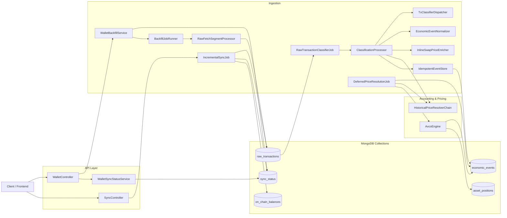

# WalletRadar

DeFi wallet analytics platform — cost basis tracking and portfolio statistics.

- **Stack:** Java 21, Spring Boot 3.x, MongoDB 7
- **Docs:** See [docs/](docs/) for context, domain, architecture, API, and tasks.

## Backend Schema (Mermaid)

