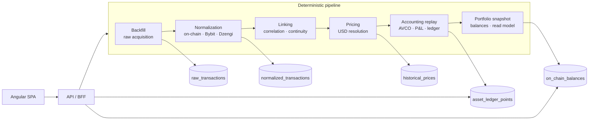

# WalletRadar

**DeFi wallet analytics for cost-basis tracking and portfolio statistics.** WalletRadar ingests raw
on-chain and exchange activity across many networks and venues, normalizes it into a canonical economic
ledger, prices every flow in USD, and replays it deterministically to compute **average cost (AVCO)**,
**realized/unrealized P&L**, and a break-even **effective cost** per asset family — with support for
liquidity pools, lending, staking derivatives, and manual overrides.

> Average-cost methodology (not FIFO/LIFO), multi-wallet, multi-network. Deep on-chain interpretation is
> the point: bridges, LP entry/exit, lending loops, staking/restaking form-changes, and reward income
> are modeled explicitly so the cost basis is economically faithful.

## What it does

- **Cost basis & break-even** — per-asset AVCO pools; **Balance AVCO** (accounting average) and
  **Effective cost** (break-even net of fees/gas/interest, crediting rewards as free). See
  [effective-cost examples](docs/examples/effective-cost-breakeven-examples.md).
- **Multi-network** — 13 EVM chains + **Solana** + **TON**
  ([matrix](docs/reference/supported-networks-and-protocols.md)).
- **Protocol coverage** — DEX/LP, lending, staking/LST/LRT, vaults, bridges (registry-driven).
- **Exchange integration** — Bybit (spot, funding history, earn, crypto loans, bot compartment) and Dzengi.
- **Liquidity-pool analytics** — entry → fee claim → exit, impermanent-gain attribution.
- **Portfolio dashboard & move-basis timeline** — live balances, per-family AVCO series, break-even line.

## Tech stack

| Layer | Tech |
|-------|------|
| Backend | Java 21, Spring Boot 3.x, Gradle (`./gradlew`) |
| Storage | MongoDB 7 |
| Frontend | Angular SPA (REST) — see [`frontend/`](frontend/) |
| Runtime | Docker Compose (prod profile) |

## Architecture at a glance

Layered backend (`canonical` → `platform` → `application.*` → `api`-BFF). Work flows through a staged
pipeline; every stage is deterministic and re-runnable.


```mermaid
flowchart LR
    UI[Angular SPA] --> API[API / BFF]

    subgraph PIPE[Deterministic pipeline]
      direction LR
      BF[Backfill<br/>raw acquisition] --> NORM[Normalization<br/>on-chain · Bybit · Dzengi]
      NORM --> LINK[Linking<br/>correlation · continuity]
      LINK --> PRICE[Pricing<br/>USD resolution]
      PRICE --> REPLAY[Accounting replay<br/>AVCO · P&L · ledger]
      REPLAY --> SNAP[Portfolio snapshot<br/>balances · read model]
    end

    API --> PIPE
    BF --> RAW[(raw_transactions)]
    NORM --> NT[(normalized_transactions)]
    REPLAY --> LP[(asset_ledger_points)]
    SNAP --> BAL[(on_chain_balances)]
    PRICE --> HP[(historical_prices)]
    API --> LP
    API --> BAL
```

Pipeline stage order (`UserSession.PipelineStage`):

```
BACKFILL → ON_CHAIN_NORMALIZATION → ON_CHAIN_CLARIFICATION → ON_CHAIN_RECLASSIFICATION
        → BYBIT_NORMALIZATION → DZENGI_NORMALIZATION → LINKING → PRICING
        → ACCOUNTING_REPLAY → PORTFOLIO_SNAPSHOT_REFRESH
```

## Repository layout (monorepo)

| Path | Contents |
|------|----------|
| [`backend/`](backend/) | Java/Spring Boot — `canonical`, `platform`, `core` (application), `domain`, `api` |
| [`frontend/`](frontend/) | Angular SPA |
| [`docs/`](docs/README.md) | Wiki: overview, pipeline, frontend, reference, examples; plus `adr/` and `tasks/` |
| [`scripts/`](scripts/) | Build / prod-rebuild / audit tooling |

## Getting started

```bash
# Backend (from repo root)
./gradlew :backend:core:test        # run tests
./gradlew :backend:build            # build

# Prod rebuild (Docker) — pick the mode that matches your change
./scripts/prod-reset-rebuild-backend.sh --backend-only     # API / read-model only (no pipeline reset)
./scripts/prod-reset-rebuild-backend.sh --skip-frontend    # full reset + renormalization
./scripts/prod-reset-rebuild-backend.sh --frontend-only    # frontend only
```

See [prod-rebuild workflow](.cursor/rules/prod-rebuild-workflow.mdc) for the full mode matrix.

## Documentation

Start at the **[docs wiki](docs/README.md)**. Quick links:

| Area | Entry |
|------|-------|
| Product context & goals | [overview/01-product-context.md](docs/overview/01-product-context.md) |
| Domain & glossary | [overview/02-domain-glossary.md](docs/overview/02-domain-glossary.md) |
| Architecture | [overview/03-architecture.md](docs/overview/03-architecture.md) |
| Data model (collections) | [overview/04-data-model.md](docs/overview/04-data-model.md) |
| Backend pipeline | [pipeline/README.md](docs/pipeline/README.md) |
| Cost basis (AVCO) | [pipeline/cost-basis/01-overview.md](docs/pipeline/cost-basis/01-overview.md) |
| Networks & protocols | [reference/supported-networks-and-protocols.md](docs/reference/supported-networks-and-protocols.md) |
| Transaction types | [reference/transaction-types.md](docs/reference/transaction-types.md) |
| API reference | [reference/api.md](docs/reference/api.md) |
| Worked examples | [examples/README.md](docs/examples/README.md) |
| Decisions (ADRs) | [adr/INDEX.md](docs/adr/INDEX.md) |

## License

Proprietary — see repository owner.
