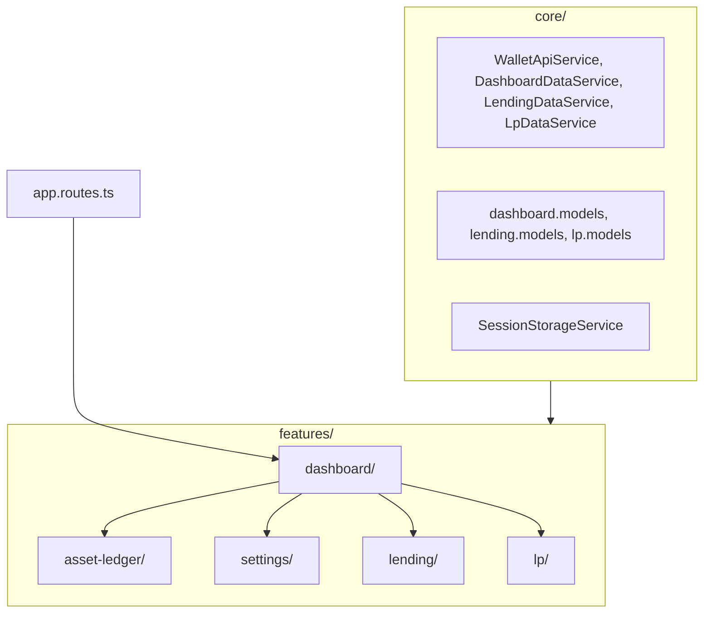

# Frontend

> **Last updated:** 2026-06-27  
> Angular standalone SPA under `frontend/src/app/`.

## Architecture

## Routing (`app.routes.ts`)

| Path | Component | Mode |
|------|-----------|------|
| `''` | `DashboardComponent` | Dashboard |
| `settings` | `DashboardComponent` | `data.mode: settings` |
| `lending` | `DashboardComponent` | `data.mode: lending` |
| `lp` | `DashboardComponent` | `data.mode: lp` → embeds `<wr-lp-page>` |
| `sessions/:sessionId/assets/:familyIdentity` | `DashboardComponent` | Asset ledger deep link |
| `**` | redirect → `''` | |

Single shell: `DashboardComponent` switches workspace by route `data.mode` and asset-ledger signals. The `/lp` route renders `DashboardComponent` which mounts `LpPageComponent` as a child (not a standalone route component).

## State management

- **Signals** + `computed` + `effect` / `toSignal` — no NgRx
- Session ID: `SessionStorageService` → `localStorage` key `wr.sessionId`
- API base: `/api/v1` from `environment.apiBaseUrl`

## Pages

| Doc | Route |
|-----|-------|
| [Dashboard](dashboard.md) | `/` |
| [Move basis](move-basis.md) | `/sessions/:id/assets/:familyIdentity` |
| [Settings](settings.md) | `/settings` |
| [Lending market](lending-market.md) | `/lending` |
| [Liquidity pools](liquidity-pools.md) | `/lp` |

## Related

- [API reference](../reference/api.md)
- [Architecture overview](../overview/03-architecture.md)
