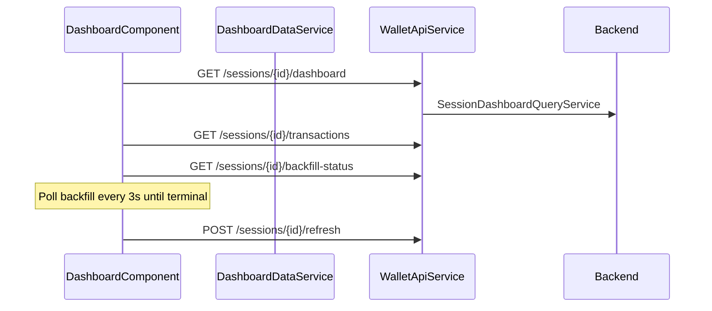

# Dashboard

> **Route:** `''`  
> **Shell:** `frontend/src/app/features/dashboard/dashboard.component.ts`

## Components

| Component | Path |
|-----------|------|
| `DashboardComponent` | `features/dashboard/dashboard.component.ts` |
| `DashboardTopbarComponent` | `features/dashboard/components/dashboard-topbar/` |
| `DashboardSectionNavComponent` | `features/dashboard/components/dashboard-section-nav/` |
| `DashboardTransactionsPaneComponent` | `features/dashboard/components/dashboard-transactions-pane/` |
| `DashboardAddWalletDialogComponent` | `features/dashboard/components/dashboard-add-wallet-dialog/` |

## Data flow

## Displays

- **Top bar:** Portfolio, Unrealised, Realised, Net Inflow; wallet/integration chips; pipeline progress; refresh button
- **Section nav:** Tokens, LP, Lending (→ `/lending`), Staking (soon), Settings
- **Filters:** wallet / integration / network multi-select
- **Tokens:** allocation breakdown, token table (symbol, qty, net USD, avg cost, price); row click → asset ledger
- **Transactions pane:** search, bridge filter, spam filter, paginated list (50/page)

## API endpoints

| Method | Path |
|--------|------|
| GET | `/api/v1/sessions/{id}/dashboard` |
| GET | `/api/v1/sessions/{id}/backfill-status` |
| POST | `/api/v1/sessions/{id}/refresh` |
| GET | `/api/v1/sessions/{id}/transactions` |
| GET | `/api/v1/sessions/{id}/settings` |
| POST | `/api/v1/sessions` |

## UI rules

- No session → redirect to `/settings`
- **Dust:** hide token when `quantity * priceUsd < 0.5` if `hideSmallAssets` from settings
- **Manual override:** read-only for real sessions (`isReadOnly=true`)
- **Backfill polling:** 3s until terminal; refresh dashboard + transactions
- **Reconciliation warnings:** when `showReconciliationWarnings` enabled

## Related

- [Portfolio snapshot read model](../pipeline/portfolio-snapshot/02-dashboard-read-model.md)
- [Move basis](move-basis.md)
