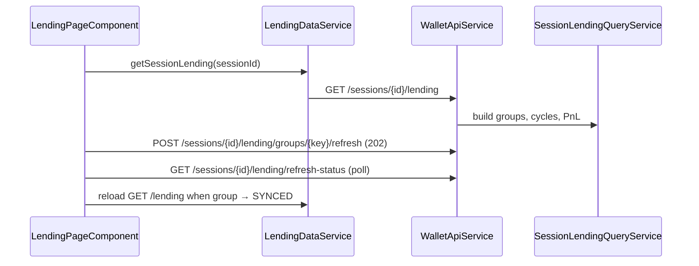

# Lending Market

> **Route:** `/lending`  
> **Component:** `frontend/src/app/features/lending/lending-page.component.ts`  
> **Data:** `LendingDataService` → `core/services/lending-data.service.ts`

## Data flow

## Displays

- **Filters:** wallet, protocol, market, cycle status (OPEN / CLOSED / AMBIGUOUS_NEEDS_REVIEW)
- **Summary:** total supplied/borrowed USD, **net exposure**, closed P&L, Active vs All cycles toggle
- **Protocol groups (collapsed head):** supply/borrow USD column, health-factor badge (always shown; "No debt" when no borrow; `stale` chip when estimate/stale), running/closed P&L
- **Protocol groups (expanded):** net-exposure strip `Supplied − Borrowed = Net exposure` plus **Net APY** (value-weighted across positions); position tables with column headers (Qty / Value / Earned|Debt / Current APY)
- **Cycles (head):** index, date range with `duration` badge, status tag, **Factual APY** (asset-denominated net strategy — USD exposure weights only, not principal price revaluation) and **Protocol Net APY**, accrued/interest, running/net P&L
- **Cycles (expanded):** mini-stats (peak supply / peak borrow / gas), per-asset P&L strip (quantity primary, USD secondary), history timeline, tx groups
- **Tx rows:** every transaction hash is a copy button (short hash + copy icon; turns green with a checkmark on copy; click does not toggle the row)
- **Loop groups:** collapsed 24h Borrow→Supply chains

## Cycle statuses

| Status | Meaning |
|--------|---------|
| `OPEN` | Active position with live qty > 0 |
| `CLOSED` | Flat supply/debt after closing event |
| `AMBIGUOUS_NEEDS_REVIEW` | Orphan close or unmatched leg |

## UI rules

- Empty filter set = show all
- `showClosed=false` → only OPEN cycles in group visibility
- Hide `AMBIGUOUS_NEEDS_REVIEW` exit-only orphans (principal out only)
- Auto-expand OPEN cycles on load
- Health labels: Safe / Moderate / At risk / Liquidation risk from thresholds
- Health badge shows `stale` chip when `healthStale` (source `ACCOUNTING_ESTIMATE` / `STALE`)
- On-demand refresh fetches live Aave V3 health factor for every configured `aave-v3` network with borrow (not only Base/Mantle)
- Net APY uses position value-weighting `(Σ supplyValue·apy − Σ borrowValue·apy) / netExposure`; `--` when net exposure ≤ 0 or no APY signal
- **Factual APY** headline uses asset-denominated per-asset factual rates blended by USD exposure (yield in asset units, not USD price P&L)
- Per-asset cycle P&L strip: **quantity first** (bold), USD second (`.cs-usd`); USD from `netIncomeUsdByAsset` when available. Backend derivation: `docs/tasks/lending-per-asset-usd-pnl-implementation-plan.md`
- `precision === 'UNAVAILABLE'` → PnL not shown

## Contrast with dashboard

Route `/` shows **simplified** inline lending summary from dashboard API (`lendingPositions` often empty). Full market UI is **only** on `/lending`.

## Refresh / sync UX

- **Per open group:** unified sync badge (Stale / Updating… / freshness age / Refresh failed) in protocol head; refresh icon sits outside the expand toggle.
- **Bulk:** "Update all" in summary bar refreshes all open groups asynchronously.
- **Status source:** `GET /lending/refresh-status` (Mongo `lending_group_refresh_state`), same adaptive polling as LP page.
- On `SYNCED`, page reloads `GET /lending`.

See [ADR-039](../adr/ADR-039-async-refresh-status.md).

## Backend rules (summary)

- Clean cycles open on first supply/deposit only
- Aave / Compound: collapsed market keys (`account-pool`, `comet-base-market`)
- Euler / Fluid / Morpho: per-vault contract keys via `LendingMarketKeyResolver` (see [ADR-036](../adr/ADR-036-contract-first-lending-market-key-and-live-debt.md))
- Cycle PnL = lending yield only (interest − gas), gated separately from total valuation

## Borrowed vs live debt

| UI signal | Meaning |
|-----------|---------|
| **Borrowed** (cycle deltas) | Principal borrowed from tx history (`borrowedByAsset`) — used for factual borrow APR math |
| **Debt** / borrow USD (positions) | Live outstanding from debt-token `on_chain_balances` when present (includes accrued interest); priced on **underlying** symbol |
| Synthetic borrow row | Fallback `borrowed − repaid` only when no live debt-token balance exists |
| Stale debt balance | Show position with `stale` chip; do not silently revert to unflagged synthetic |

Deploy: clear `lending_receipt_identity` cache on rollout so derived receipt mappings stay fresh (no Mongo migration / renormalization required for market keys).

## Yield and APR semantics

| Signal | Source | Precision |
|--------|--------|-----------|
| Supply income (closed) | Sum of `BUY` flows on `LENDING_WITHDRAW` only | `ESTIMATED` when present |
| Supply income (no BUY) | — | `UNAVAILABLE`, reason `NO_YIELD_FLOW_EVIDENCE` |
| Factual supply APR | `withdrawYield / openingDeposit / durationYears` | `ESTIMATED` or `UNAVAILABLE` |
| Internal receipt exit APR | `principalOutCash − openingDeposit` when share internal movement | `ESTIMATED` |
| Factual borrow APR (open) | `(currentDebt − borrowed) / borrowed / duration` | `ESTIMATED` |
| Factual borrow APR (closed) | `(repaid − borrowed) / borrowed / duration` | `ESTIMATED` |

Never display `$0` yield when evidence is absent — use `UNAVAILABLE`.

## Health factor

| Source | When |
|--------|------|
| `LIVE_PROTOCOL` | Fresh snapshot from Aave V3 `getUserAccountData` (Base/Mantle, background refresh) |
| `ACCOUNTING_ESTIMATE` | Fallback when snapshot missing or stale; `healthStale = true` |

See [Lending cycle example](../examples/lending-cycle-example.md) and backend `SessionLendingQueryService`.

## Related

- [Lending family rules](../pipeline/normalization/rules/families/lending.md)
- [API](../reference/api.md)
