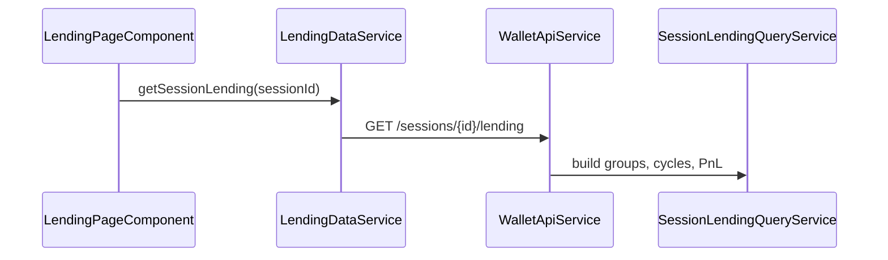

# Lending Market

> **Route:** `/lending`  
> **Component:** `frontend/src/app/features/lending/lending-page.component.ts`  
> **Data:** `LendingDataService` → `core/services/lending-data.service.ts`

## Data flow

## Displays

- **Filters:** wallet, protocol, market, cycle status (OPEN / CLOSED / AMBIGUOUS_NEEDS_REVIEW)
- **Summary:** total supplied/borrowed USD, closed P&L, Active vs All cycles toggle
- **Protocol groups:** health factor, supply/borrow USD, running/closed P&L
- **Cycles:** expandable cards — status, duration, asset deltas, P&L breakdown, factual APY, history timeline, tx groups
- **Loop groups:** collapsed 24h Borrow→Supply chains

## Cycle statuses

| Status | Meaning |
|--------|---------|
| `OPEN` | Active position with live qty > 0 |
| `CLOSED` | Flat supply/debt after closing event |
| `AMBIGUOUS_NEEDS_REVIEW` | Orphan close or unmatched leg |

## UI rules

- Empty filter set = show all
- `showClosed=false` → only OPEN cycles in group visibility
- Hide `AMBIGUOUS_NEEDS_REVIEW` exit-only orphans (principal out only)
- Auto-expand OPEN cycles on load
- Health labels: Safe / Moderate / At risk / Liquidation risk from thresholds
- `precision === 'UNAVAILABLE'` → PnL not shown

## Contrast with dashboard

Route `/` shows **simplified** inline lending summary from dashboard API (`lendingPositions` often empty). Full market UI is **only** on `/lending`.

## Backend rules (summary)

- Clean cycles open on first supply/deposit only
- Aave: concurrent cycles per market; Fluid/Morpho/Euler/Compound: vault/account keyed
- Euler EVK: per-vault market key `evk-vault-{address[2..10]}` (see ADR-025)
- Cycle PnL = lending yield only (interest − gas), gated separately from total valuation

## Yield and APR semantics

| Signal | Source | Precision |
|--------|--------|-----------|
| Supply income (closed) | Sum of `BUY` flows on `LENDING_WITHDRAW` only | `ESTIMATED` when present |
| Supply income (no BUY) | — | `UNAVAILABLE`, reason `NO_YIELD_FLOW_EVIDENCE` |
| Factual supply APR | `withdrawYield / openingDeposit / durationYears` | `ESTIMATED` or `UNAVAILABLE` |
| Internal receipt exit APR | `principalOutCash − openingDeposit` when share internal movement | `ESTIMATED` |
| Factual borrow APR (open) | `(currentDebt − borrowed) / borrowed / duration` | `ESTIMATED` |
| Factual borrow APR (closed) | `(repaid − borrowed) / borrowed / duration` | `ESTIMATED` |

Never display `$0` yield when evidence is absent — use `UNAVAILABLE`.

## Health factor

| Source | When |
|--------|------|
| `LIVE_PROTOCOL` | Fresh snapshot from Aave V3 `getUserAccountData` (Base/Mantle, background refresh) |
| `ACCOUNTING_ESTIMATE` | Fallback when snapshot missing or stale; `healthStale = true` |

See [Lending cycle example](../examples/lending-cycle-example.md) and backend `SessionLendingQueryService`.

## Related

- [Lending family rules](../pipeline/normalization/rules/families/lending.md)
- [API](../reference/api.md)
