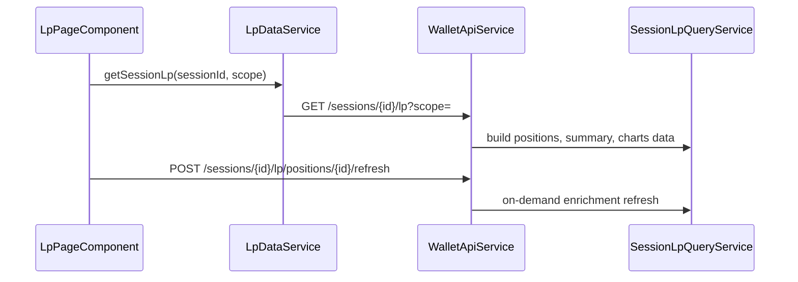

# Liquidity Pools Page

> **Route:** `/lp`  
> **Shell:** `DashboardComponent` (`data.mode: 'lp'`) embeds `<wr-lp-page>`  
> **Component:** `frontend/src/app/features/lp/lp-page.component.ts`  
> **Data:** `LpDataService` → `core/services/lp-data.service.ts`  
> **Models:** `core/models/lp.models.ts`

## Data flow

## Layout

Mirrors the Lending page: left filter rail + main content area.

### Position scope tabs

| Tab | API scope | Effect |
|-----|-----------|--------|
| Active | `active` | Open positions (default) |
| Closed | `closed` | Fully exited positions |
| All | `all` | Both |

Changing scope reloads positions from the API.

### Filters

| Filter | Values |
|--------|--------|
| Network | Multi-select; empty = all |
| Protocol | Multi-select; empty = all |
| Status | `in_range`, `out_of_range`, `closed`, `unknown` ("Tracking") |
| Wallet | Multi-select; empty = all |
| Hide dust | Toggle; positions below $0.50 USD threshold hidden |

### Summary bar

Active TVL, fees earned, unclaimed, in-range count, out-of-range count, realized P&L.

### Position rows (collapsed)

Columns: Position (pair, protocol, network, status chip, tokenId pill) / TVL / Fees·IL / Net P&L / APR.

- Status chip colors: green (in_range), red (out_of_range), gray (closed), amber (unknown/Tracking).
- Family label shown in TVL column.
- IL shown as sub-line under Fees column.

### Expanded view

Layout (top to bottom):

1. **Stat cards** (4): TVL, Net P&L, Fees earned, Current/Lifetime APR
2. **Charts row** (3 columns):
   - **Daily earnings · All time** — bar chart, full `earningsDaily` series (no 30-day cap)
   - **Historical APR · All time** — line chart, full `aprDaily` series
   - **Liquidity Distribution** — histogram from `range.liquidityBins` (CL pools); asset composition bar above chart; fallback to range band when bins empty
3. **Trio row** (3 columns):
   - **P&L Breakdown** — open: Fees + IL + Price appreciation (hidden when `priceAppreciationPrecision === 'UNAVAILABLE'`) → Net P&L; closed: Deposited / Withdrawn / Fees / Net realized
   - **Fees & Rewards** — per-token breakdown (read-only)
   - **Entry vs Current** — comparison table (open only; closed shows "Closed position")
4. **Transaction history** — all LP events for correlationId; tx hash as text + copy button

**No write actions:** Claim/Compound buttons are not shown (read-only analytics).

### Entry vs Current table

| Metric | At entry | Current | Δ |
|--------|----------|---------|---|
| Token amounts | Entry qty | Current qty | Qty delta |
| TVL (USD) | See rules below | Current TVL | Δ ≈ IL for open |

**TVL "At entry" rules:**

- **Open positions:** `entryToken0.valueUsd + entryToken1.valueUsd` (entry qty × current price = hodlNow). Fallback to `costBasisUsd` when entry tokens unavailable.
- **Closed positions:** `costBasisUsd` (AVCO).

Δ for open positions ≈ impermanent loss (not asset-level price appreciation vs purchase cost).

### Price appreciation visibility

Row hidden in P&L Breakdown when `priceAppreciationPrecision === 'UNAVAILABLE'` (typical for open CL positions where openBase = hodlNow). Field chain: `SessionLpPositionResponse.priceAppreciationPrecision` → `lp-data.service.ts` → `LpPosition.priceAppreciationPrecision` → template `@if` guard.

### Charts

Inline SVG (no chart library):

- **Daily earnings:** bars with hover tooltip (date + earning); x-axis labels use dynamic step via `earningsLabelStep()` based on series length
- **Historical APR:** line with avg reference; hover tooltip (date + APR)
- **Liquidity Distribution:** histogram bars from `range.liquidityBins`; position range highlighted

Tooltip: fixed-position `#chart-tip` overlay.

**Daily vs lifetime APR:** daily bars reflect partial-day earnings (lower for young positions); lifetime APR in stat card uses total-fees formula — see [earnings.md](../liquidity-pools/earnings.md).

### Transaction history UX

Tx hash displayed as truncated text (`txn-hash-text`) with copy button (`txn-copy-btn`). Copy state toggles to "Copied" for 2 seconds.

## Precision rendering

| Precision | UI treatment |
|-----------|--------------|
| EXACT | Plain number (basis, claimed fees, realized) |
| ESTIMATE / ESTIMATED | `Est.` prefix on APR values only |
| NOT_APPLICABLE | `N/A` (range/IL for GMX/Pendle/fungible) |
| UNAVAILABLE | Label; never `$0` or `0%`; price appreciation row hidden |

## Refresh

- Per open position: **Refresh snapshot** button
- Shows "updated Xm ago" from `snapshotAt`
- Disabled while in-flight; stale chip when `snapshotStale`
- On failure: keeps last values silently (no user-visible error toast)

## Styling

Uses `--wr-*` tokens from `styles.scss`; cyan/green accents; 13px base; mono for numbers; lending card/tag/grid patterns. Responsive: TVL/fees/P&L columns hidden below 1100px.

## Contrast with dashboard

Route `/` may show a simplified LP card stub using dashboard snapshot data (`data().lpPositions`), not `LpDataService`. Stub tabs: all/open/closed. Full LP workspace with filters, charts, and refresh is **only** on `/lp`.

## Backend reference

- [LP overview](../liquidity-pools/overview.md)
- [Enrichment](../liquidity-pools/enrichment.md)
- [Earnings & reconciliation](../liquidity-pools/earnings.md)
- [ADR-037](../adr/ADR-037-lp-enrichment-and-earnings-snapshots.md)
