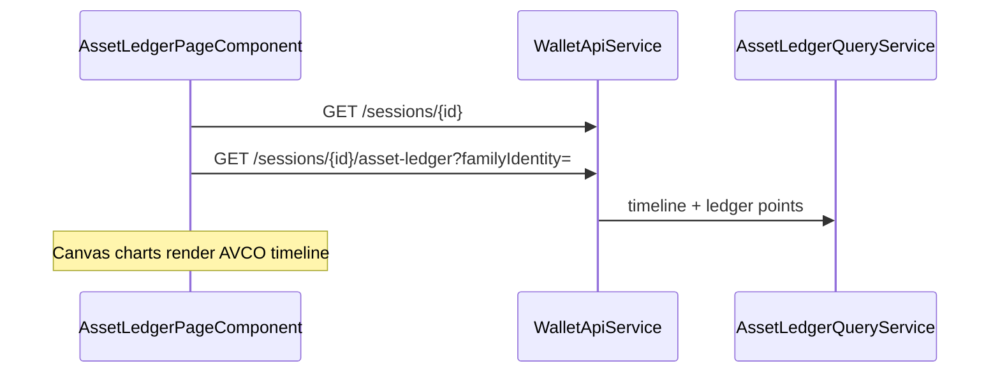

# Move Basis (Asset Ledger)

> **Route:** `/sessions/:sessionId/assets/:familyIdentity`  
> **Component:** `frontend/src/app/features/asset-ledger/asset-ledger-page.component.ts`  
> **UI title:** "Move basis"

There is **no** `/move-basis` route.

## Data flow

## Displays

- **Sidebar filters:** event families, type toggles, basis-effect toggles, date presets
- **Summary:** AVCO, qty held, covered/uncovered pills, realised PnL, gas paid
- **AVCO timeline chart** — markers per replay event; hover/pin tooltips
- **Range control** — dual slider; default last 21 days (min 16 points)
- **Position size chart** — quantity over time
- **Realised P&L chart** — disposal events + cumulative path
- **Event log table** — type, protocol, date, qty Δ, amount, unit price, from, to, realised PnL; expandable row with AVCO/basis/flows/gas
- **Matched transfers** — correlated bridge/transfer legs collapsed into one marker with expandable legs

## API

| Method | Path |
|--------|------|
| GET | `/api/v1/sessions/{id}/asset-ledger?familyIdentity=...` |
| GET | `/api/v1/sessions/{id}` — wallet labels/colors |

Read-only — no write APIs.

## UI rules

| Preset | Behavior |
|--------|----------|
| `economics` (default) | Hide WRAP, UNWRAP, GAS_ONLY types and GAS_ONLY basis effect |
| `all` | Show everything |
| `transfers` | Bridge + transfer types only |
| `basisMoves` | CARRY_*, REALLOCATE_* basis effects only |

**Basis move set:** `CARRY_IN`, `CARRY_OUT`, `REALLOCATE_IN`, `REALLOCATE_OUT`

Backend authority: [ADR-017 Timeline AVCO](../adr/ADR-017-timeline-avco-authority.md), `TimelineAvcoAuthority`.

## Related

- [Ledger points reference](../reference/ledger-points-and-basis-effects.md)
- [Move basis carry examples](../examples/move-basis-carry-examples.md)
