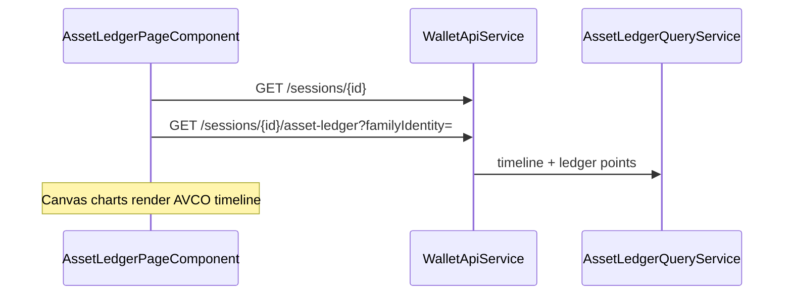

# Move Basis (Asset Ledger)

> **Route:** `/move-basis/:familyIdentity`  
> **Component:** `frontend/src/app/features/asset-ledger/asset-ledger-page.component.ts` (embedded in `DashboardComponent` shell)  
> **UI title:** "Move basis"

Session id is resolved from browser session storage (same as dashboard), not from the URL.

Legacy deep links `/sessions/:sessionId/assets/:familyIdentity` redirect to `/move-basis/:familyIdentity` and persist `sessionId` into storage.

## Data flow

## Displays

- **Sidebar filters:** event families, type toggles, basis-effect toggles, date presets
- **Summary header:** the three AVCO cards **Market AVCO**, **Balance AVCO**, **Blended AVCO** (see [AVCO terminology](#avco-terminology) below), followed by qty held, covered/uncovered pills, realised PnL, gas paid. The Blended header value is the terminal (last non-null) blended-net series value and matches the dashboard token card.
- **AVCO timeline chart** — three series, each **toggleable** from the legend (all ON by default) and distinguishable by line style (not colour only, a11y):
  - **Balance AVCO** — solid cyan. Net (real-capital) average cost of the asset that is **currently liquid in the balance** (not parked in LP/lending/bridge/derivative positions).
  - **Blended AVCO** — amber dotted. Net average cost across **total exposure** = liquid balance **plus** asset parked in positions ([ADR-061](../adr/ADR-061-blended-total-exposure-avco-series.md)). This line matches the dashboard card.
  - **Market AVCO** — white dashed. Tax/market average cost: non-purchase inflows (rewards, LP fees, cross-asset conversions) are valued at market on arrival.
  - Markers per replay event; hover/pin tooltips show all values regardless of which lines are toggled on. The base plotted line is the **family covered-weighted per-bucket AVCO** (`Σ coveredᵢ·avcoᵢ / Σ coveredᵢ`, [ADR-045](../adr/ADR-045-family-covered-weighted-move-basis-avco-series.md)). Behavior notes:
  - The Balance and Market lines **break** (gap) when family covered qty = 0 (undefined AVCO, ADR-031); they are never drawn at $0. The Blended line breaks only when total ETH-origin covered qty (liquid + parked) drains to ~0.
  - The Balance line shows **large, economically-real swings** when the bulk of an asset moves in/out of LP / bridge / receipt positions (which live in the excluded `FAMILY:LP_RECEIPT` view) — this is expected, not a bug. The Blended line stays smooth across these moves because it still counts the parked slice. Per-pool detail is in the event-log rows/tooltip and is a **distinct** surface from the family line.
  - A **pool≈0** marker is drawn where the liquid balance is ~0 but basis is still parked in positions; a fresh buy snaps the Balance line to spot — expected.
- **Range control** — dual slider; default last 21 days (min 16 points)
- **Position size chart** — quantity over time
- **Realised P&L chart** — disposal events + cumulative path
- **Event log table** — type, protocol, date, qty Δ, amount, unit price, from, to, realised PnL; expandable row with AVCO/basis/flows/gas
- **Matched transfers** — correlated bridge/transfer legs collapsed into one marker with expandable legs

## API

| Method | Path |
|--------|------|
| GET | `/api/v1/sessions/{id}/asset-ledger?familyIdentity=...` |
| GET | `/api/v1/sessions/{id}` — wallet labels/colors |

Read-only — no write APIs.

## UI rules

| Preset | Behavior |
|--------|----------|
| `economics` (default) | Hide WRAP, UNWRAP, GAS_ONLY types and GAS_ONLY basis effect |
| `all` | Show everything |
| `transfers` | Bridge + transfer types only |
| `basisMoves` | CARRY_*, REALLOCATE_* basis effects only |

**Basis move set:** `CARRY_IN`, `CARRY_OUT`, `REALLOCATE_IN`, `REALLOCATE_OUT`

Backend authority: [ADR-045 Family covered-weighted move-basis AVCO series](../adr/ADR-045-family-covered-weighted-move-basis-avco-series.md) (supersedes the ADR-017 per-identity chart source; `AssetLedgerQueryService` timeline loop). [ADR-017](../adr/ADR-017-timeline-avco-authority.md) still governs the spot-family filter and staked-ETH inclusion.

## AVCO terminology

The move-basis surface exposes **three** average-cost (AVCO) figures. They sit on two independent axes:

- **How value is measured** — *net* (real capital deployed) vs *market* (tax/market-reset).
- **What is counted** — *balance* (only liquid asset) vs *blended* (liquid + parked in positions).

| Term | Data field | How measured | What is counted | Line style |
|------|------------|--------------|-----------------|------------|
| **Market AVCO** | `avcoAfterUsd` | Market / tax (non-purchase inflows valued at market) | Family covered qty | White dashed |
| **Balance AVCO** | `netAvcoAfterUsd` | Net (real capital, carries entry basis) | **Liquid** asset only | Cyan solid |
| **Blended AVCO** | `blendedNetAvcoAfterUsd` | Net (real capital, carries entry basis) | **Total exposure** = liquid **+** parked in LP / lending / bridge / derivative positions | Amber dotted |

The dashboard token card shows **Blended AVCO** (the average across everything you hold), not Balance.

### How parked asset is priced (Blended)

When asset enters a position (LP add, lending deposit, lending-loop open, bridge out), its cost basis is **parked** (`REALLOCATE_OUT`) at its **entry cost basis** and stays at that value while parked — it is **not** re-marked to market. On exit the basis is restored (`REALLOCATE_IN`) at that carried value. If the position is exited in a **different asset** (e.g. deposit ETH, withdraw USDC), the parked slice is **closed/realised** rather than carried forward ([ADR-061](../adr/ADR-061-blended-total-exposure-avco-series.md)).

### Market vs Net — worked example

1. Buy **1 ETH for $2,000** with real cash → Net = $2,000, Market = $2,000 (identical).
2. Receive a **staking reward of 0.1 ETH** on a day ETH = $3,000:
   - **Market AVCO** counts the reward at its market value: `(2,000 + 0.1×3,000) / 1.1 = $2,090`.
   - **Net AVCO** treats the reward as free capital: `2,000 / 1.1 = $1,818`.

A small Market−Net gap means most of the holding was bought with real money; a large gap means a lot of it came from rewards/conversions valued at market.

### Balance vs Blended — worked example

Holding **4 ETH** at Net avg **$2,500**, then deposit **3 ETH** into a Uniswap pool:

| Series | Counts | Value after deposit |
|--------|--------|---------------------|
| **Balance AVCO** | the 1 ETH left liquid | avg of the 1 remaining ETH |
| **Blended AVCO** | all 4 ETH (1 liquid + 3 parked at entry basis) | still $2,500 |

On exit the 3 ETH return and Balance re-converges with Blended. The **pool≈0** marker highlights the moment when nothing is liquid but basis is still parked.

## Related

- [Ledger points reference](../reference/ledger-points-and-basis-effects.md)
- [Move basis carry examples](../examples/move-basis-carry-examples.md)
- [ADR-061 Blended total-exposure AVCO series](../adr/ADR-061-blended-total-exposure-avco-series.md)
- [ADR-045 Family covered-weighted move-basis AVCO series](../adr/ADR-045-family-covered-weighted-move-basis-avco-series.md)
