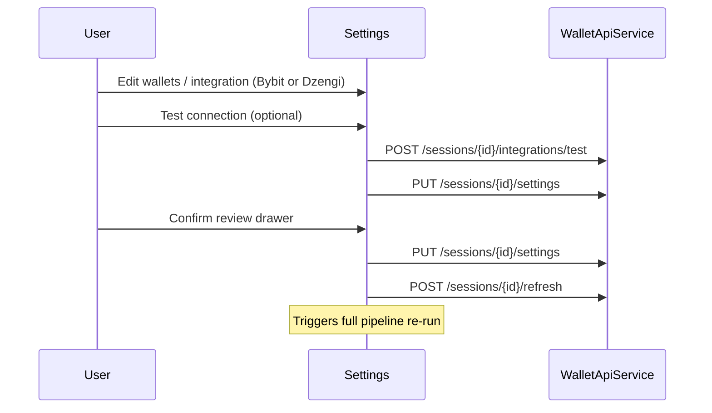

# Settings

> **Route:** `/settings`  
> **Page:** `frontend/src/app/features/settings/settings-page.component.ts`

## Modes

| Mode | When |
|------|------|
| **Wizard** | No session — multi-step: wallets → integrations → accounting → review |
| **Session** | Existing session — Data sources + General sections |

## Components

| Component | Path |
|-----------|------|
| `SettingsPageComponent` | `features/settings/settings-page.component.ts` |
| `SettingsWizardComponent` | `features/settings/wizard/settings-wizard.component.ts` |
| `WalletsSettingsSectionComponent` | `features/settings/sections/wallets-settings-section.component.ts` |
| `IntegrationsSettingsSectionComponent` | `features/settings/sections/integrations-settings-section.component.ts` |
| `AccountingSettingsSectionComponent` | `features/settings/sections/accounting-settings-section.component.ts` |
| `GeneralSettingsSectionComponent` | `features/settings/sections/general-settings-section.component.ts` |
| `AccountSettingsSectionComponent` | `features/settings/sections/account-settings-section.component.ts` |

## Flow

## Integrations UI

`IntegrationsSettingsSectionComponent` is **provider-agnostic**:

| Provider | Status in UI |
|----------|----------------|
| `BYBIT` | Enabled (`soon: false`) |
| `DZENGI` | Enabled (`soon: false`) |
| `BINANCE`, `OKX` | Shown as "soon" (disabled) |

### Connect / edit flows

- Shared `integrationForm` (display name, API key, secret).
- Provider picker sets active provider; parent loads masked key for existing integrations.
- **Test connection** validates credentials without save (`POST .../integrations/test`).
- **Connect** / **Update** emits provider id to `SettingsPageComponent.saveIntegration(provider)`.

### Multi-integration save

`PUT /sessions/{id}/settings` preserves all connected integrations. Only the active provider receives new credentials when both key and secret are filled.

## API

| Method | Path |
|--------|------|
| GET | `/api/v1/sessions/{id}/settings` |
| PUT | `/api/v1/sessions/{id}/settings` |
| POST | `/api/v1/sessions/{id}/integrations/test` |
| PUT | `/api/v1/sessions/{id}/integrations/bybit` — dedicated Bybit upsert (optional; settings overwrite also works) |
| PUT | `/api/v1/sessions/{id}/integrations/dzengi` — dedicated Dzengi upsert (optional; settings overwrite also works) |
| POST | `/api/v1/sessions` — create session |
| POST | `/api/v1/sessions/{id}/refresh` — after confirm |

## Validation rules

- EVM address: `0x` + 40 hex
- Max 10 wallets
- Duplicate addresses blocked
- Integration connect: both key + secret required
- Integration update: new key + secret (not masked placeholder alone)
- Test connection: both key + secret required (uses form values, not stored secrets)
- Save wallets: all networks from `EVM_NETWORKS_PRESENTATION` on each wallet
- Review drawer heuristic: `4–12 min per wallet` reindex estimate

## General settings

- `hideSmallAssets` — dust filter on dashboard
- `showReconciliationWarnings` — issue tooltips on token rows

## Account section (SSO — ADR-038)

Rendered below the General settings on the "General" sidebar tab.

- **Not authenticated**: shows "Sign in with Google" button → triggers `/oauth2/authorization/google` redirect.
- **Authenticated**: shows avatar, display name, email, and "Sign out" button → calls `POST /api/v1/auth/logout` (clears `wr_auth` cookie).

Auth state is resolved at app startup by `AuthService.checkAuth()` → `GET /api/v1/auth/me`. If authenticated, the canonical `sessionId` from the backend overrides any `localStorage` value.

## Related

- [Backfill planning](../pipeline/backfill/02-planning.md)
- [Add an integration](../reference/extensibility/add-an-integration.md)
- [Product context](../overview/01-product-context.md)
