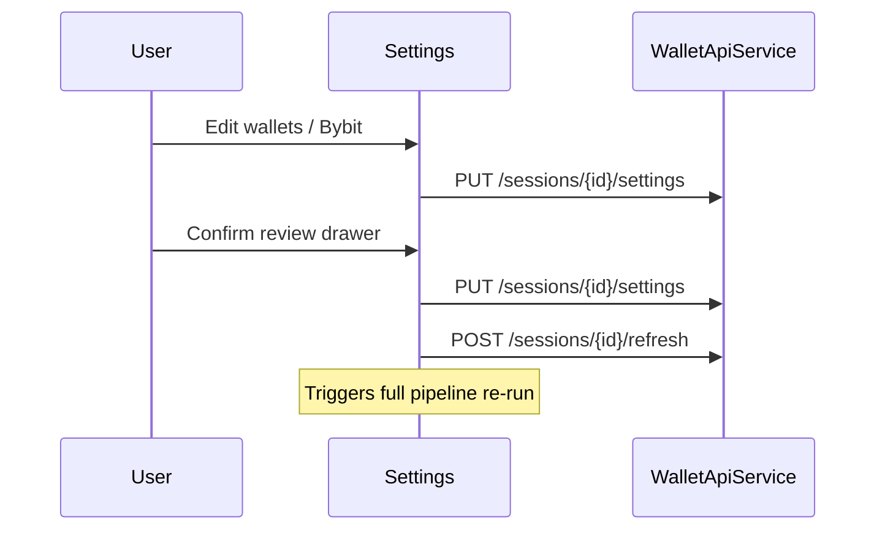

# Settings

> **Route:** `/settings`  
> **Page:** `frontend/src/app/features/settings/settings-page.component.ts`

## Modes

| Mode | When |
|------|------|
| **Wizard** | No session — multi-step: wallets → integrations → accounting → review |
| **Session** | Existing session — Data sources + General sections |

## Components

| Component | Path |
|-----------|------|
| `SettingsPageComponent` | `features/settings/settings-page.component.ts` |
| `SettingsWizardComponent` | `features/settings/wizard/settings-wizard.component.ts` |
| `WalletsSettingsSectionComponent` | `features/settings/sections/wallets-settings-section.component.ts` |
| `IntegrationsSettingsSectionComponent` | `features/settings/sections/integrations-settings-section.component.ts` |
| `AccountingSettingsSectionComponent` | `features/settings/sections/accounting-settings-section.component.ts` |
| `GeneralSettingsSectionComponent` | `features/settings/sections/general-settings-section.component.ts` |

## Flow

## API

| Method | Path |
|--------|------|
| GET | `/api/v1/sessions/{id}/settings` |
| PUT | `/api/v1/sessions/{id}/settings` |
| POST | `/api/v1/sessions` — create session |
| POST | `/api/v1/sessions/{id}/refresh` — after confirm |

## Validation rules

- EVM address: `0x` + 40 hex
- Max 10 wallets
- Duplicate addresses blocked
- Bybit connect: both key + secret required
- Bybit update: new key + secret (not masked placeholder alone)
- Save wallets: all networks from `EVM_NETWORKS_PRESENTATION` on each wallet
- Review drawer heuristic: `4–12 min per wallet` reindex estimate

## General settings

- `hideSmallAssets` — dust filter on dashboard
- `showReconciliationWarnings` — issue tooltips on token rows

## Related

- [Backfill planning](../pipeline/backfill/02-planning.md)
- [Product context](../overview/01-product-context.md)
