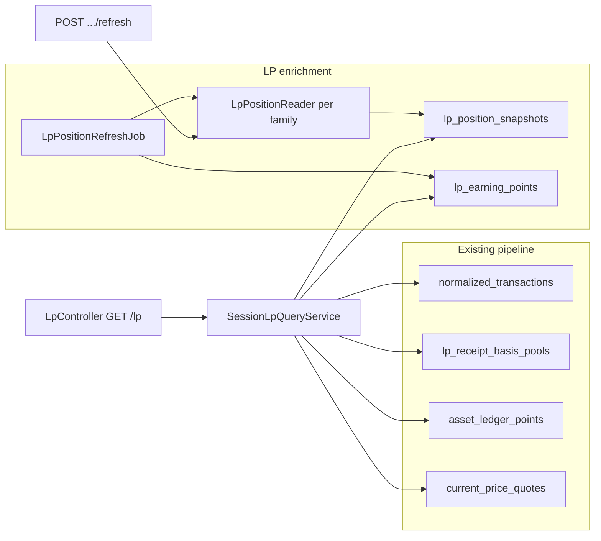

# Liquidity Pools — Overview

> **Scope:** read-model + on-chain enrichment + frontend. **Does not** modify classification/normalization (except consuming existing registry fields like `underlyingPositionManager` for vault correlation IDs).

WalletRadar tracks LP positions from existing normalized transactions (`LP_*` types) keyed by `correlationId`:

| Prefix | Example |
|--------|---------|
| `lp-position:` | `lp-position:unichain:0x4529…:42775` |
| `lp-position:…:vault` | `lp-position:optimism:0x416b…:vault` (stake-only vault positions) |
| `pendle-lp:` | `pendle-lp:mantle:<marketId>` |
| `gmx-lp:` | `gmx-lp:arbitrum:weth-usdc` |

Authoritative accounting (cost basis, claimed fees, realized P&L) comes from `lp_receipt_basis_pools` and `asset_ledger_points` (`LifecycleKind.LP`). Live metrics (TVL, range, unclaimed fees, IL, APR) come from an isolated enrichment layer refreshed hourly (plus after accounting replay) with per-position on-demand refresh.

## Architecture

## API

| Method | Path | Purpose |
|--------|------|---------|
| GET | `/api/v1/sessions/{sessionId}/lp` | Full LP workspace for session |
| POST | `/api/v1/sessions/{sessionId}/lp/positions/{correlationId}/refresh` | On-demand live snapshot refresh |

### Query parameters

| Param | Values | Default | Effect |
|-------|--------|---------|--------|
| `scope` | `active`, `closed`, `all` | `active` | Filter positions by lifecycle status |

POST refresh returns a single updated position (not full session). Closed positions are skipped silently during refresh (not in open-context discovery).

## Backend packages

| Package | Role |
|---------|------|
| `com.walletradar.liquiditypools.application` | Query service, refresh job, snapshot/earning services |
| `com.walletradar.liquiditypools.enrichment` | On-chain readers (CL, GMX, Pendle, fungible, depth, MasterChef) |
| `com.walletradar.liquiditypools.persistence` | `lp_position_snapshots`, `lp_earning_points` |
| `com.walletradar.liquiditypools.config` | `walletradar.liquidity-pools.*` properties |

## Derived collections

| Collection | Cleared on rebuild? | Notes |
|------------|---------------------|-------|
| `lp_position_snapshots` | Yes (`reset-derived.sh`) | Current live state per `correlationId`; self-healing. Includes `liquidityBins` for distribution chart. |
| `lp_earning_points` | **No** | Daily wall-clock history; irreplaceable after deploy |

## Filtering

- **Dust filter:** positions below `dust-threshold-usd` (default $10) are hidden from active scope unless they have recorded transactions or meaningful basis/deposits.
- **Bridge protocol stripping:** when resolving protocol for enrichment, bridge-prefixed protocol names are stripped to the underlying DEX name.

## Related docs

- [Enrichment](enrichment.md) — on-chain readers, refresh cadence, RPC batching
- [Earnings & reconciliation](earnings.md) — daily APR, P&L anchors, invariants
- [Frontend page](../frontend/liquidity-pools.md) — UI route and components
- [ADR-037](../adr/ADR-037-lp-enrichment-and-earnings-snapshots.md) — architecture decision
