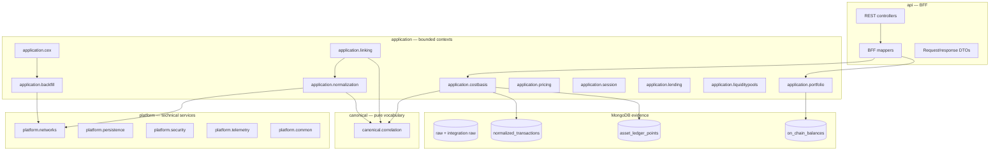

# Architecture

> **Last updated:** 2026-07-08  
> Modular monolith: Spring Boot backend + Angular SPA frontend.

For accepted design decisions (D-xx rationale), see [Architecture decisions (SAD)](architecture-decisions.md).  
Per-module detail: [Module index](modules/README.md) (or individual pages under `docs/overview/modules/`).

## Layered backend model

WalletRadar organizes the backend into four compile-time layers. Dependency flow is **inward**: `api` → `application` → `platform` / `canonical`; `canonical` has no upward deps.



| Layer | Package roots | Owns | Must not |
|-------|---------------|------|----------|
| **canonical** | `com.walletradar.canonical` | Cross-cutting correlation prefixes, shared accounting vocabulary, pure helpers | Spring, Mongo, HTTP, jobs |
| **platform** | `com.walletradar.platform.*` | RPC/explorer transport, persistence helpers, security, telemetry | Normalization rules, replay, BFF DTOs |
| **application** | `com.walletradar.application.*` | Pipeline stages, AVCO replay, pricing, portfolio/LP/lending read models, session orchestration, public `*.port` contracts | Direct cross-app `service`/`infrastructure` imports |
| **api (BFF)** | `com.walletradar.api` | REST surface, validation, view→DTO mapping | Live RPC on GET paths; pipeline write jobs |

ArchUnit guards live in `ModuleBoundaryTest` and `DocumentationCoverageTest` (Track A).

## Module map

| Module doc | Package / path | Role |
|------------|----------------|------|
| [canonical](modules/canonical.md) | `canonical/` | Pure shared contracts |
| [platform](modules/platform.md) | `platform.*` | Technical adapters |
| [application.backfill](modules/application-backfill.md) | `application.backfill` | Raw on-chain acquisition |
| [application.cex](modules/application-cex.md) | `application.cex` | CEX acquisition + Bybit normalization |
| [application.normalization](modules/application-normalization.md) | `application.normalization` | On-chain canonicalization |
| [application.linking](modules/application-linking.md) | `application.linking` | Correlation, continuity, repairs |
| [application.costbasis](modules/application-costbasis.md) | `application.costbasis` | AVCO replay, ledger, basis pools |
| [application.portfolio](modules/application-portfolio.md) | `application.portfolio` | Dashboard read model |
| [application.pricing](modules/application-pricing.md) | `application.pricing` | Price resolution and price gate |
| [application.lending](modules/application-lending.md) | `application.lending` | Lending position monitoring |
| [application.liquiditypools](modules/application-liquiditypools.md) | `application.liquiditypools` | LP snapshots and earnings |
| [api BFF](modules/api-bff.md) | `api/` | REST + mappers |

Legacy packages (`integration/`) remain during migration; new work lands in `application.*` and `platform.*`.

## Frontend structure

| Path | Role |
|------|------|
| `frontend/src/app/core/` | Services, models, constants |
| `frontend/src/app/features/dashboard/` | Shell, topbar, transactions |
| `frontend/src/app/features/asset-ledger/` | Move basis page |
| `frontend/src/app/features/settings/` | Settings wizard and sections |
| `frontend/src/app/features/lending/` | Lending market page |

See [Frontend index](../frontend/README.md).

## Core pipeline (summary)

```mermaid
sequenceDiagram
  participant User
  participant API
  participant Backfill
  participant Norm as Normalization
  participant Link as Linking
  participant Price as Pricing
  participant Replay as AccountingReplay
  participant Snap as PortfolioSnapshot

  User->>API: POST /sessions, add wallets
  API->>Backfill: plan sync_status, backfill_segments
  Backfill->>Backfill: fetch raw_transactions
  Backfill->>Norm: SessionBackfillCompletedEvent
  Norm->>Norm: normalized_transactions
  Norm->>Link: normalization complete events
  Link->>Price: LinkingCompletedEvent
  Price->>Replay: PricingCompletedEvent
  Replay->>Snap: AccountingReplayCompletedEvent
  Snap->>API: on_chain_balances, current_price_quotes
  User->>API: GET /dashboard
```

Full stage list and orchestration: [Pipeline orchestration](05-pipeline-orchestration.md). Per-stage docs: [Pipeline index](../pipeline/README.md).

## Extensibility seams

| Seam | Doc | Track |
|------|-----|-------|
| Add a network | [add-a-network](../reference/extensibility/add-a-network.md) | B2 `NetworkFamily` |
| Add a protocol | [add-a-protocol](../reference/extensibility/add-a-protocol.md) | B3 capability contract kit |
| Add a CEX integration | [add-an-integration](../reference/extensibility/add-an-integration.md) | B1 CEX ledger SPI |
| Protocol descriptor | [protocol-descriptor](../reference/protocol-descriptor.md) | A5 |
| Capability / behavior SPI | [capability-behavior-spi](../reference/capability-behavior-spi.md) | A5 / B3 |

## Terminology corrections

| Incorrect (legacy docs) | Correct (code) |
|-------------------------|----------------|
| Pipeline stage `INGESTION` | Stage is `BACKFILL`; ingestion = adapter subsystem inside `platform.networks` |
| Entity `EconomicEvent` | `NormalizedTransaction` in `normalized_transactions` |
| Persisted portfolio snapshot document | Stage + `on_chain_balances` + `current_price_quotes` + read-time join |
| Route `/move-basis` | `/sessions/:sessionId/assets/:familyIdentity` (asset ledger) |
| `transfer_links` collection required today | Planned (ADR-003); continuity via metadata + repair services |
| Package `integration.bybit` | Migrating to `application.cex` |

## Supported scope (summary)

- **Networks:** 15 values in `NetworkId` — see [Networks & protocols](../reference/supported-networks-and-protocols.md).
- **On-chain:** EVM (Etherscan, Blockscout, RPC) + Solana RPC; scam filter; 2-year backfill window.
- **CEX:** Bybit (`integration_raw_events`, `bybit_extracted_events`).
- **Protocols:** ~100 registry entries + dedicated semantic classifiers — see [Normalization rules](../pipeline/normalization/rules/README.md).

## Design rules (selected)

- GET endpoints are **datastore-only** (no live RPC on dashboard/lending GET).
- Raw collections are evidence; **accounting consumes `normalized_transactions` only** (status `CONFIRMED` for replay).
- `asset_ledger_points` is immutable replay truth; UI move-basis reads from it.
- `protocol-registry.json` is authoritative for address-level protocol discovery.
- WETH aliasing at **replay time** only.
- Basis continuity: wallet transfers, bridges, lending/vault custody, LP principal, Bybit↔on-chain.
- Cross-app calls use `application.*.port` / read ports only (`ModuleBoundaryTest`).

Details: [Cost basis](../pipeline/cost-basis/01-overview.md), [Replay](../pipeline/replay/01-overview.md), [ADR index](../adr/INDEX.md).

## Related documents

| Doc | Description |
|-----|-------------|
| [Data model](04-data-model.md) | Collections and entities |
| [Pipeline orchestration](05-pipeline-orchestration.md) | Events and schedulers |
| [Product context](01-product-context.md) | Goals and constraints |
| [Extensibility plan](../tasks/extensibility-refactor-implementation-plan.md) | Track A / B execution |
