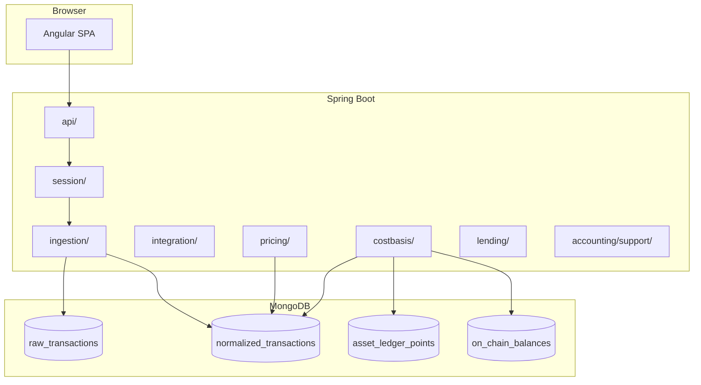

# Architecture

> **Last updated:** 2026-06-05  
> Modular monolith: Spring Boot backend + Angular SPA frontend.

For the detailed accepted design decisions (D-xx rationale), see [Architecture decisions (SAD)](architecture-decisions.md).

## High-level context



## Backend packages

| Package | Path | Role |
|---------|------|------|
| `api` | `backend/.../api/` | REST controllers, DTOs |
| `session` | `backend/.../session/` | `user_sessions`, pipeline state, settings |
| `ingestion` | `backend/.../ingestion/` | Backfill, normalization, linking jobs |
| `integration` | `backend/.../integration/` | Bybit connector, live balances |
| `pricing` | `backend/.../pricing/` | Historical and current USD quotes |
| `costbasis` | `backend/.../costbasis/` | AVCO replay, ledger, portfolio refresh |
| `accounting` | `backend/.../accounting/` | Shared asset identity / family support |
| `lending` | `backend/.../lending/` | Lending read model + market rates |
| `domain` | `backend/.../domain/` | Mongo entities and enums |

## Frontend structure

| Path | Role |
|------|------|
| `frontend/src/app/core/` | Services, models, constants |
| `frontend/src/app/features/dashboard/` | Shell, topbar, transactions |
| `frontend/src/app/features/asset-ledger/` | Move basis page |
| `frontend/src/app/features/settings/` | Settings wizard and sections |
| `frontend/src/app/features/lending/` | Lending market page |

See [Frontend index](../frontend/README.md).

## Core pipeline (summary)

```mermaid
sequenceDiagram
  participant User
  participant API
  participant Backfill
  participant Norm as Normalization
  participant Link as Linking
  participant Price as Pricing
  participant Replay as AccountingReplay
  participant Snap as PortfolioSnapshot

  User->>API: POST /sessions, add wallets
  API->>Backfill: plan sync_status, backfill_segments
  Backfill->>Backfill: fetch raw_transactions
  Backfill->>Norm: SessionBackfillCompletedEvent
  Norm->>Norm: normalized_transactions
  Norm->>Link: normalization complete events
  Link->>Price: LinkingCompletedEvent
  Price->>Replay: PricingCompletedEvent
  Replay->>Snap: AccountingReplayCompletedEvent
  Snap->>API: on_chain_balances, current_price_quotes
  User->>API: GET /dashboard
```

Full stage list and orchestration: [Pipeline orchestration](05-pipeline-orchestration.md). Per-stage docs: [Pipeline index](../pipeline/README.md).

## Terminology corrections

| Incorrect (legacy docs) | Correct (code) |
|-------------------------|----------------|
| Pipeline stage `INGESTION` | Stage is `BACKFILL`; ingestion = adapter subsystem |
| Entity `EconomicEvent` | `NormalizedTransaction` in `normalized_transactions` |
| Persisted portfolio snapshot document | Stage + `on_chain_balances` + `current_price_quotes` + read-time join |
| Route `/move-basis` | `/sessions/:sessionId/assets/:familyIdentity` (asset ledger) |
| `transfer_links` collection required today | Planned (ADR-003); continuity via metadata + repair services |

## Supported scope (summary)

- **Networks:** 15 values in `NetworkId` — see [Networks & protocols](../reference/supported-networks-and-protocols.md).
- **On-chain:** EVM (Etherscan, Blockscout, RPC) + Solana RPC; scam filter; 2-year backfill window.
- **CEX:** Bybit (`integration_raw_events`, `bybit_extracted_events`).
- **Protocols:** ~100 registry entries + dedicated semantic classifiers — see [Normalization rules](../pipeline/normalization/rules/README.md).

## Design rules (selected)

- GET endpoints are **datastore-only** (no live RPC on dashboard/lending GET).
- Raw collections are evidence; **accounting consumes `normalized_transactions` only** (status `CONFIRMED` for replay).
- `asset_ledger_points` is immutable replay truth; UI move-basis reads from it.
- `protocol-registry.json` is authoritative for address-level protocol discovery.
- WETH aliasing at **replay time** only.
- Basis continuity: wallet transfers, bridges, lending/vault custody, LP principal, Bybit↔on-chain.

Details: [Cost basis](../pipeline/cost-basis/01-overview.md), [Replay](../pipeline/replay/01-overview.md), [ADR index](../adr/INDEX.md).

## Related documents

| Doc | Description |
|-----|-------------|
| [Data model](04-data-model.md) | Collections and entities |
| [Pipeline orchestration](05-pipeline-orchestration.md) | Events and schedulers |
| [Product context](01-product-context.md) | Goals and constraints |
