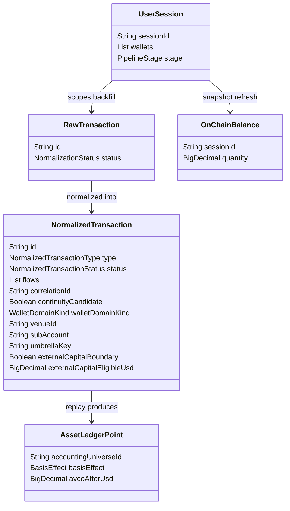
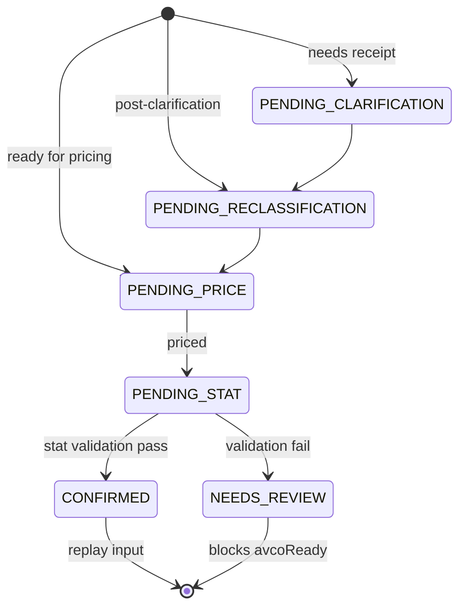

# Data Model

> **Last updated:** 2026-07-10  
> MongoDB collections and core domain entities. Canonical economic document: **`NormalizedTransaction`** (not `EconomicEvent`).

## Entity relationship (core)



## Collections catalog

| Collection | Entity class | Written by | Read by |
|------------|--------------|------------|---------|
| `user_sessions` | `UserSession` | Session API | All stages |
| `accounting_universes` | `AccountingUniverse` | Universe sync | Replay, dashboard |
| `tracked_wallets` | `TrackedWallet` | Universe projection | Normalization scope |
| `sync_status` | `SyncStatus` | Backfill planner | Backfill runner |
| `backfill_segments` | `BackfillSegment` | Backfill planner | Backfill executors |
| `raw_transactions` | `RawTransaction` | Backfill fetch | Normalization |
| `integration_raw_events` | `IntegrationRawEvent` | CEX backfill (Bybit, Dzengi, …) | CEX normalization |
| `bybit_extracted_events` | `BybitExtractedEvent` | Bybit extraction | Bybit normalization |
| `dzengi_extracted_events` | `DzengiExtractedEvent` | Dzengi extraction | Dzengi normalization |
| `external_ledger_raw` | `ExternalLedgerRaw` | Legacy Bybit import | Bybit normalization (if present) |
| `normalized_transactions` | `NormalizedTransaction` | Normalization, linking, pricing, replay | All downstream |
| `asset_ledger_points` | `AssetLedgerPoint` | Replay (replace per universe) | Dashboard, asset-ledger API |
| `counterparty_basis_pools` | `CounterpartyBasisPool` | Replay | Conservation gate, replay |
| `lp_receipt_basis_pools` | `LpReceiptBasisPool` | Replay | Replay |
| `borrow_liabilities` | `BorrowLiability` | Replay | Conservation gate |
| `accounting_shortfall_audit` | `AccountingShortfallAudit` | Replay | Audit |
| `historical_prices` | `HistoricalPriceDocument` | Pricing | Pricing, replay fallback |
| `current_price_quotes` | `CurrentPriceQuoteDocument` | Snapshot refresh | Dashboard |
| `on_chain_balances` | `OnChainBalance` | Snapshot refresh (replace per session) | Dashboard, lending |
| `lending_market_rate_snapshots` | `LendingMarketRateSnapshot` | Lending rate job | Lending API |

**Planned:** `transfer_links` (ADR-003 / FA-001) — not required for current continuity replay.

## NormalizedTransaction status lifecycle



Enum: `NormalizedTransactionStatus` — `backend/.../domain/transaction/normalized/NormalizedTransactionStatus.java`.

Rows with `excludedFromAccounting=true` never enter replay.

## NormalizedTransaction — venue-neutral boundary contract (ADR-052)

CEX normalization stamps the following venue-neutral fields so downstream packages never depend on `VenueRegistry` or concrete venue descriptors:

| Field | Type | Set by | Consumed by |
|-------|------|--------|-------------|
| `walletDomainKind` | `WalletDomainKind` enum (`EVM`, `SOLANA`, `TON`, `CEX`) | canonical builder via `WalletRef.parse()` | `AccountingUniverseService`, reconciliation |
| `venueId` | `String` (e.g. `BYBIT`, `DZENGI`) | canonical builder | dashboard label, API DTO |
| `subAccount` | `String` (e.g. `FUND`, `UTA`, `EARN`) | canonical builder | replay, conservation |
| `umbrellaKey` | `String` (`<venueId>:<uid>`) | canonical builder | umbrella aggregation in dashboard and AVCO |
| `externalCapitalBoundary` | `Boolean` | `VenueExternalCapitalPolicy` | `PortfolioConservationGate` NEC |
| `externalCapitalEligibleUsd` | `BigDecimal` | `VenueExternalCapitalPolicy` | NEC eligible basis |

## NormalizedTransactionType

Full catalog with per-stage behavior: [Transaction types reference](../reference/transaction-types.md).

Authoritative enum (59 values): `NormalizedTransactionType.java`.

## AssetLedgerPoint

Immutable replay trace row. Field semantics and `BasisEffect`: [Ledger points & basis effects](../reference/ledger-points-and-basis-effects.md).

Key enums on `AssetLedgerPoint`:
- `BasisEffect`: ACQUIRE, DISPOSE, CARRY_OUT, CARRY_IN, REALLOCATE_OUT, REALLOCATE_IN, GAS_ONLY, UNKNOWN
- `LifecycleKind`: SPOT, TRANSFER, BRIDGE, CUSTODY, LENDING, STAKING, VAULT, LP, ORDER, LOOP, WRAP, REWARD, DERIVATIVE, MANUAL, UNKNOWN
- `LifecycleStage`: SINGLE, REQUEST, SETTLEMENT, SOURCE, DESTINATION

## Pipeline stage enum

```java
// UserSession.PipelineStage
BACKFILL,
ON_CHAIN_NORMALIZATION,
ON_CHAIN_CLARIFICATION,
ON_CHAIN_RECLASSIFICATION,
BYBIT_NORMALIZATION,
DZENGI_NORMALIZATION,
LINKING,
PRICING,
ACCOUNTING_REPLAY,
PORTFOLIO_SNAPSHOT_REFRESH
```

## NetworkId

15 networks: ETHEREUM, ARBITRUM, OPTIMISM, POLYGON, BASE, BSC, AVALANCHE, MANTLE, LINEA, UNICHAIN, KATANA, PLASMA, ZKSYNC, SOLANA, TON.

Details: [Supported networks & protocols](../reference/supported-networks-and-protocols.md).

## Related documents

| Doc | Description |
|-----|-------------|
| [Domain glossary](02-domain-glossary.md) | Full entity definitions |
| [Pipeline index](../pipeline/README.md) | Stage read/write matrix |
| [API reference](../reference/api.md) | REST DTOs |
