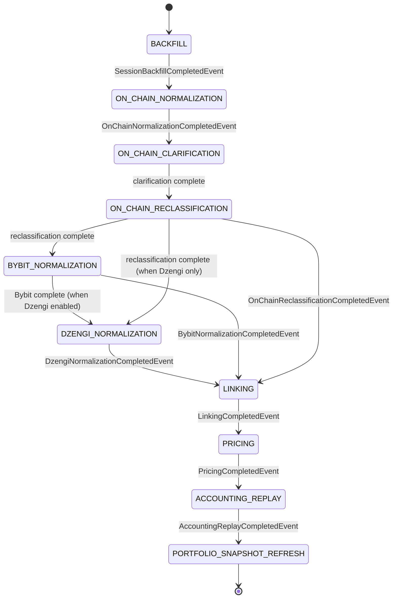

# Pipeline Orchestration

> **Last updated:** 2026-07-08  
> How live sessions move through pipeline stages: Spring events, schedulers, and recovery.

## Stage state machine

Each stage records `PipelineStatus`: RUNNING, BLOCKED, COMPLETE, FAILED on `UserSession`.

## Event chain (primary path)

| Event | Publisher | Listener(s) |
|-------|-----------|-------------|
| `SessionBackfillCompletedEvent` | `SessionBackfillCompletionPublisher` | `OnChainNormalizationJob`, `BybitNormalizationJob` |
| `OnChainNormalizationCompletedEvent` | `OnChainNormalizationService` | `OnChainClarificationJob` |
| Clarification complete | Clarification workflow | `OnChainReclassificationJob` |
| `OnChainReclassificationCompletedEvent` | Reclassification job | `LinkingJob` |
| `BybitNormalizationCompletedEvent` | `BybitNormalizationService` | `LinkingJob` |
| `DzengiNormalizationCompletedEvent` | `DzengiNormalizationService` | `LinkingJob` |
| `LinkingCompletedEvent` | `LinkingJob` | `PricingJob` |
| `PricingCompletedEvent` | `PricingJob` | `CostBasisReplayJob` |
| `AccountingReplayCompletedEvent` | `CostBasisReplayJob` | `PortfolioSnapshotRefreshJob` |

Orchestration is **event-driven** for normalization through replay. Stage schedulers are **not** used for live-session handoff (except backfill dispatch and watchdog).

## Schedulers (backfill & recovery)

| Job | Interval (default) | Class |
|-----|-------------------|-------|
| On-chain backfill dispatch | 5000 ms | `BackfillJobRunner.dispatchPendingOnChainBackfills` |
| Integration segments | 15000 ms | `BackfillJobRunner.processPendingIntegrationSegments` |
| Failed backfill retry | 120000 ms | `BackfillJobRunner.retryFailedBackfills` |
| RUNNING progress rollup | 2000 ms | `BackfillRunningProgressJob` |
| Pipeline resume watchdog | 60000 ms | `SessionPipelineResumeScheduler` |
| Lending market rates | configured | `LendingMarketRateRefreshJob` |

Config: `backend/src/main/resources/application.yml` under `walletradar.ingestion`, `walletradar.integration`, `walletradar.pipeline`.

## SessionPipelineResumeScheduler

Re-emits completion events when:
- Backfill durable-complete but normalization not started (raw still pending).
- Accounting replay complete but `on_chain_balances` missing for session.
- Snapshot stage stuck while ledger exists.

Class: `backend/.../session/application/SessionPipelineResumeScheduler.java`.

## Async execution

Normalization, linking, pricing, replay, and snapshot jobs run on `@Async` executors (e.g. `PIPELINE_STAGE_EXECUTOR`). Universe sync planning uses `UNIVERSE_SYNC_PLAN_EXECUTOR`.

## Accounting replay gate

`CostBasisReplayJob` runs replay only when:
- `PricingDataGateService.snapshot().avcoReady()` — zero `PENDING_PRICE`, blocking clarification/reclassification, blocking `NEEDS_REVIEW`.
- `PendingStatQueryService.countPending == 0`.
- Force replay, new stat promotions, or no existing ledger for universe.

Otherwise stage `ACCOUNTING_REPLAY` = BLOCKED.

## Manual triggers (ops / tests)

| Method | Class |
|--------|-------|
| `runNormalization()` | `OnChainNormalizationJob`, `BybitNormalizationJob`, `DzengiNormalizationJob` |
| `runLinking()` | `LinkingJob` |
| `runPricing()` | `PricingJob` |
| `runSnapshotRefresh()` | `PortfolioSnapshotRefreshJob` |

## Related documents

| Doc | Description |
|-----|-------------|
| [Architecture](03-architecture.md) | Module map |
| [Pipeline index](../pipeline/README.md) | Per-stage detail |
| [Backfill](../pipeline/backfill/01-overview.md) | Planning and execution |
