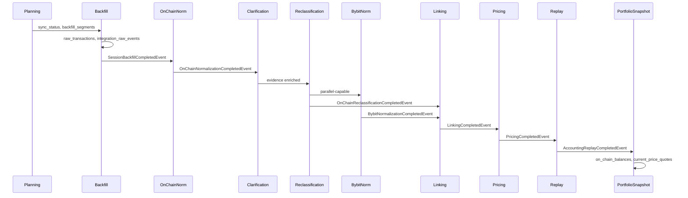

# Pipeline Index

> **Last updated:** 2026-06-05  
> Backend processing stages from raw acquisition through dashboard-ready portfolio evidence.

## End-to-end sequence

## Stage documents

| Stage | PipelineStage enum | Docs |
|-------|-------------------|------|
| Backfill | `BACKFILL` | [Overview](backfill/01-overview.md) · [Planning](backfill/02-planning.md) · [Execution](backfill/03-execution.md) · [Data sources](backfill/04-data-sources.md) |
| On-chain normalization | `ON_CHAIN_NORMALIZATION` | [Overview](normalization/01-overview.md) · [Classification](normalization/02-onchain-classification.md) |
| Clarification | `ON_CHAIN_CLARIFICATION` | [Clarification & reclassification](normalization/04-clarification-reclassification.md) |
| Reclassification | `ON_CHAIN_RECLASSIFICATION` | same |
| Bybit normalization | `BYBIT_NORMALIZATION` | [Bybit normalization](normalization/03-bybit-normalization.md) |
| Linking | `LINKING` | [Overview](linking/01-overview.md) · [Rules & repairs](linking/02-rules-and-repairs.md) |
| Pricing | `PRICING` | [Overview](pricing/01-overview.md) · [Resolver chain](pricing/02-resolver-chain.md) |
| Accounting replay | `ACCOUNTING_REPLAY` | [Cost basis](cost-basis/01-overview.md) · [Replay](replay/01-overview.md) |
| Portfolio snapshot | `PORTFOLIO_SNAPSHOT_REFRESH` | [Overview](portfolio-snapshot/01-overview.md) |

## Normalization rules (cross-cutting)

[Normalization rules index](normalization/rules/README.md) — families, protocols, three-layer contract.

## Reference indexes

| Doc | Purpose |
|-----|---------|
| [Transaction types](../reference/transaction-types.md) | Per-type behavior at each stage |
| [Ledger points](../reference/ledger-points-and-basis-effects.md) | Replay output semantics |
| [Examples](../examples/README.md) | Synthetic walkthroughs |

## Collection flow (summary)

| Stage | Primary writes |
|-------|----------------|
| Backfill | `sync_status`, `backfill_segments`, `raw_transactions`, `integration_raw_events`, `bybit_extracted_events` |
| Normalization | `normalized_transactions` |
| Linking | `normalized_transactions` (metadata) |
| Pricing | `normalized_transactions`, `historical_prices` |
| Replay | `asset_ledger_points`, pools, liabilities, `normalized_transactions` (flow updates) |
| Snapshot | `on_chain_balances`, `current_price_quotes` |

## Rules by transaction type (per stage)

Each stage doc includes a **Rules by transaction type** section scoped to that stage. The cross-stage index is [reference/transaction-types.md](../reference/transaction-types.md).
