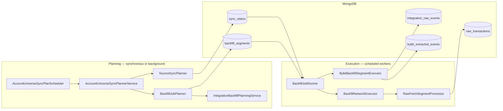
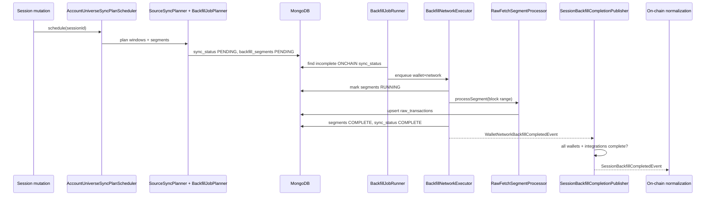
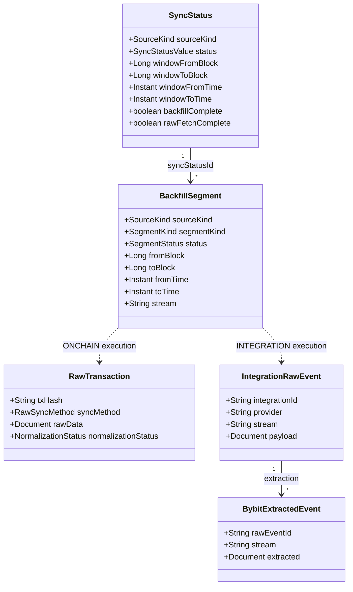

# Backfill — Overview

> **Last updated:** 2026-06-05  
> **Pipeline stage:** `BACKFILL` (`UserSession.PipelineStage.BACKFILL`)

Backfill is the first execution stage of the WalletRadar pipeline. It acquires **immutable raw evidence** from on-chain sources (EVM explorers/RPC, Solana RPC) and exchange integrations (Bybit API), persisting it in MongoDB for downstream normalization.

Backfill does **not** classify transactions, compute cost basis, or link flows. Its contract is: given a wallet/network or integration account, fetch everything in the planned window and upsert raw rows idempotently.

## Related docs

| Doc | Focus |
|-----|-------|
| [Pipeline index](../README.md) | End-to-end stage sequence |
| [Planning](02-planning.md) | `sync_status` windows and `backfill_segments` creation |
| [Execution](03-execution.md) | Runners, workers, retries, completion events |
| [Data sources](04-data-sources.md) | Provider matrix and adapter selection |
| [Supported networks & protocols](../../reference/supported-networks-and-protocols.md) | Network coverage reference |

## Inputs and outputs

| Direction | Artifact | Collection |
|-----------|----------|------------|
| In | Session universe (wallets × networks, integrations) | `user_sessions` |
| Plan | Source sync window | `sync_status` |
| Plan | Executable work units | `backfill_segments` |
| Out (on-chain) | Native chain payloads | `raw_transactions` |
| Out (Bybit) | API row snapshots | `integration_raw_events` |
| Out (Bybit) | Stream-specific extracted rows | `bybit_extracted_events` |
| Signal | Wallet×network raw complete | `WalletNetworkBackfillCompletedEvent` |
| Signal | Session raw complete | `SessionBackfillCompletedEvent` → triggers `ON_CHAIN_NORMALIZATION` |

## Control plane vs data plane

## Entry points (verified paths)

All paths are relative to `backend/src/main/java/com/walletradar/`.

### Session-owned flows (primary)

| Class | Package | Role |
|-------|---------|------|
| `AccountUniverseSyncPlanScheduler` | `session/application/` | Defers planning off HTTP threads; serializes per `sessionId` |
| `AccountUniverseSyncPlannerService` | `session/application/` | Universe reconcile → clear derived state → plan windows → plan segments |
| `SourceSyncPlanner` | `session/application/` | Sets block/time windows on `sync_status` |
| `BackfillJobPlanner` | `ingestion/job/backfill/` | Splits windows into `backfill_segments` |
| `SessionRefreshCommandService` | `session/application/` | Incremental refresh: new delta windows only |
| `BackfillJobRunner` | `ingestion/job/backfill/` | Dispatch queue, worker loops, integration segment poll |
| `BackfillNetworkExecutor` | `ingestion/job/backfill/` | One wallet×network run: parallel segment execution |
| `RawFetchSegmentProcessor` | `ingestion/job/backfill/` | Fetch + upsert into `raw_transactions` |
| `BybitBackfillSegmentExecutor` | `integration/bybit/` | Fetch Bybit streams → `integration_raw_events` + extraction |
| `SessionBackfillCompletionPublisher` | `ingestion/job/backfill/` | Promotes per-wallet completion to session-level event |

### Legacy / standalone wallet API

| Class | Package | Role |
|-------|---------|------|
| `WalletBackfillService` | `ingestion/wallet/command/` | Standalone add-wallet / incremental refresh without session scheduler |

## End-to-end sequence

Integration (Bybit) segments skip the on-chain queue: `BackfillJobRunner.processPendingIntegrationSegments()` polls `backfill_segments` with `sourceKind=INTEGRATION` and delegates to `BybitBackfillSegmentExecutor`.

## Key domain types

## Rules by transaction type

**N/A at the backfill stage.**

Raw acquisition happens **before** normalization. Rows in `raw_transactions`, `integration_raw_events`, and `bybit_extracted_events` carry no WalletRadar transaction type (swap, LP add, transfer, etc.). Classification begins at `ON_CHAIN_NORMALIZATION` / `BYBIT_NORMALIZATION`.

At backfill, the only type-agnostic rules are:

| Rule | Behavior |
|------|----------|
| Idempotent upsert | On-chain: skip insert if `(txHash, networkId, walletAddress)` already exists |
| Scam filter | `ScamFilter` may drop inbound spam before persist (`walletradar.scam-filter.*`) |
| Unsupported network | No adapter/resolver → enqueue skipped, sync may be marked complete without fetch |
| Disabled backfill | `AccountingUniverseService.isBackfillEnabled` → segment planning skipped |

See [reference/transaction-types.md](../../reference/transaction-types.md) for per-type behavior starting at normalization.

## Operational properties

| Property | Mechanism |
|----------|-----------|
| Idempotent writes | `setOnInsert` bulk upsert in `RawFetchSegmentProcessor`; integration rows keyed by deterministic ids |
| Retry-safe | Failed segments → `FAILED`; `BackfillJobRunner.retryFailedBackfills` re-enqueues with exponential backoff |
| Concurrency-safe | Per-session planning lock; in-flight dedup in runner; stale `RUNNING` segment recovery |
| Checkpointing | RPC networks use sub-range checkpoints inside a segment (`processSegmentWithBlockCheckpoints`) |

## Configuration (summary)

Primary prefix: `walletradar.ingestion.backfill.*` in `backend/src/main/resources/application.yml`. Integration poll: `walletradar.integration.backfill.poll-interval-ms` (default 15s). See [Execution](03-execution.md) for the full scheduler table.
