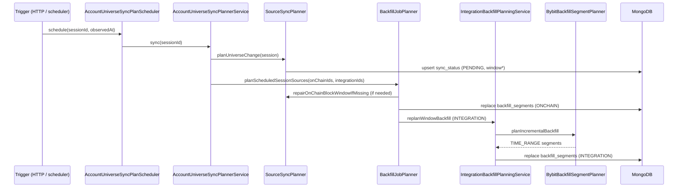
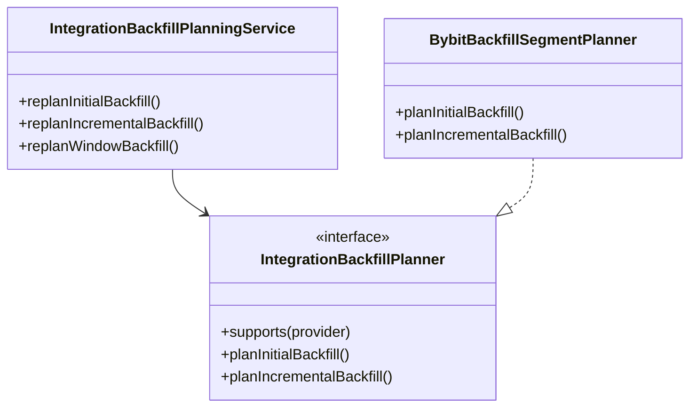

# Backfill — Planning

> **Last updated:** 2026-06-05

Planning transforms a session universe (or standalone wallet request) into persisted **`sync_status` windows** and **`backfill_segments`**. Execution workers never compute windows themselves; they consume what planning wrote.

See also: [Overview](01-overview.md) · [Execution](03-execution.md) · [Pipeline index](../README.md) · [Supported networks](../../reference/supported-networks-and-protocols.md)

## Planning vs execution boundary

| Concern | Planning | Execution |
|---------|----------|-----------|
| Resolve chain head / history window | ✓ (`SourceSyncPlanner`) | |
| Write `sync_status` PENDING + window fields | ✓ | reads |
| Split window into segments | ✓ (`BackfillJobPlanner`, integration planners) | reads |
| Call external APIs | head resolution only (RPC/explorer) | full raw fetch |
| Write `raw_transactions` / integration raw | | ✓ |



## Triggers

| Entry point | Path | When |
|-------------|------|------|
| `AccountUniverseSyncPlanScheduler.schedule` | `session/application/AccountUniverseSyncPlanScheduler.java` | Session create/update (wallets, integrations, settings) |
| `SessionRefreshCommandService.refresh` | `session/application/SessionRefreshCommandService.java` | User-initiated incremental refresh |
| `WalletBackfillService.addWallet` | `ingestion/wallet/command/WalletBackfillService.java` | Legacy standalone wallet API |
| `WalletBackfillService.scheduleIncrementalBackfill` | same | Legacy incremental |
| `BackfillJobRunner.repairMissingCurrentWindowSegments` | `ingestion/job/backfill/BackfillJobRunner.java` | Startup/dispatch recovery for PENDING sync without segments |

Session flows **must not** call planners from HTTP threads directly; `AccountUniverseSyncPlanScheduler` runs on `universeSyncPlanExecutor` with per-session locking.

## SourceSyncPlanner — window ownership

**Path:** `backend/src/main/java/com/walletradar/session/application/SourceSyncPlanner.java`

Owns **`sync_status` window fields only**. Segment documents are explicitly delegated to `BackfillJobPlanner`.

### On-chain windows (block-based)

| Method | Purpose |
|--------|---------|
| `planUniverseChange` | Initial backfill for all session wallets × networks |
| `planRefresh` | Delta from last checkpoint to current head |
| `planStandaloneInitialOnChain` | Legacy wallet add |
| `planStandaloneRefreshOnChain` | Legacy incremental |
| `repairOnChainBlockWindowIfMissing` | Fill missing `windowFromBlock`/`windowToBlock` on PENDING rows |

Initial window formula:

```
currentHead = BlockHeightResolver.resolve(network)
windowBlocks = network override or walletradar.ingestion.backfill.window-blocks
fromBlock = max(0, currentHead - windowBlocks + 1)
toBlock   = currentHead
```

Refresh window (requires `backfillComplete`):

```
fromBlock = lastBlockSynced + 1
toBlock   = currentHead
```

Skipped when `fromBlock > toBlock` (already up to date).

### Integration windows (time-based)

| Method | Purpose |
|--------|---------|
| `ensureInitialIntegrationWindow` | `[now - historyYears, now]` |
| `scheduleIntegrationRefresh` | `[checkpoint, now]` |

`historyYears` comes from `IntegrationBackfillProperties` (`walletradar.integration.backfill.history-years`, default **2**).

Integration `sync_status` uses `sourceKind=INTEGRATION`, stores `integrationId`, `provider`, and uses `accountRef` as stable `walletAddress` key.

## BackfillJobPlanner — segment creation

**Path:** `backend/src/main/java/com/walletradar/ingestion/job/backfill/BackfillJobPlanner.java`

Implements `WalletBackfillPlanner`.

### On-chain segments

 Preconditions on `sync_status`:

- `status == PENDING`
- Valid block window (`windowFromBlock` ≤ `windowToBlock`)
- `AccountingUniverseService.isBackfillEnabled(accountingUniverseId, wallet, network)` — otherwise `SKIPPED_BACKFILL_DISABLED`

Algorithm:

1. Load existing segments for `syncStatusId`.
2. If segment min/max blocks already match window → no-op.
3. Else delete old segments, build new `BLOCK_RANGE` segments.
4. Segment id: `{syncStatusId}:{segmentIndex}`.
5. Segment count derived from `windowBlocks / parallelSegments` profile (max **1000** segments).

Segment sizing uses `BackfillProperties.segments` (`defaults` vs `by-rpc` when `syncMethod=RPC` in network config). See `resolveSegmentPlanningProfile`.

### Integration segments

When `sync_status` has valid `windowFromTime` / `windowToTime`:

1. `IntegrationBackfillPlanningService.replanWindowBackfill(...)` replaces all segments for `integrationId`.
2. Provider-specific planner produces segments (today: Bybit only).
3. Session integration `syncState.totalSegments` updated; status → `BACKFILLING`.

## Integration planning stack



| Class | Path |
|-------|------|
| `IntegrationBackfillPlanningService` | `integration/IntegrationBackfillPlanningService.java` |
| `IntegrationBackfillPlanner` | `integration/IntegrationBackfillPlanner.java` |
| `BybitBackfillSegmentPlanner` | `integration/bybit/BybitBackfillSegmentPlanner.java` |
| `IntegrationSyncStatusService` | `session/application/IntegrationSyncStatusService.java` |

`BybitBackfillSegmentPlanner` emits one `TIME_RANGE` segment per API stream (transaction log, executions, funding, transfers, deposits, etc.), subdivided by configured window days in `BybitIntegrationProperties`.

## Mongo collections (planning writes)

### `sync_status`

**Model:** `domain/sync/SyncStatus.java`

| Field (planning) | On-chain | Integration |
|------------------|----------|-------------|
| `sourceKind` | `ONCHAIN` | `INTEGRATION` |
| `status` | `PENDING` | `PENDING` |
| `windowFromBlock` / `windowToBlock` | set | null |
| `windowFromTime` / `windowToTime` | anchor only on to-time | set |
| `backfillComplete` | `false` | `false` |
| `rawFetchComplete` | `false` | `false` |
| `syncBannerMessage` | e.g. "Backfill queued" | same |

Unique index: `(walletAddress, networkId)`.

### `backfill_segments`

**Model:** `domain/sync/BackfillSegment.java`

| Field | On-chain | Integration |
|-------|----------|-------------|
| `sourceKind` | `ONCHAIN` | `INTEGRATION` |
| `segmentKind` | `BLOCK_RANGE` | `TIME_RANGE` |
| `syncStatusId` | parent sync row | parent sync row |
| `fromBlock` / `toBlock` | set | null |
| `fromTime` / `toTime` | null | set |
| `stream` | null | e.g. `TRANSACTION_LOG` |
| `provider` | null | `BYBIT` |
| `status` | `PENDING` | `PENDING` |

Planning **replaces** segments when the window changes (`deleteBySyncStatusId` or `deleteByIntegrationId` before insert).

## AccountUniverseSyncPlannerService side effects

**Path:** `session/application/AccountUniverseSyncPlannerService.java`

Before planning:

1. `AccountingUniverseSyncService.sync` — reconcile session accounting universe.
2. `clearDerivedState` — removes stale ledger/balance snapshots for the session.

After planning:

- Marks session pipeline stage `BACKFILL` as running (if targets scheduled) or complete (empty / skipped).
- Persists integration status changes from planning.

## Rules by transaction type

**N/A — planning is type-agnostic.**

Planning operates on **sources** (wallet×network or integration account), not on transaction semantics. No normalized type exists yet; windows are sized by block count or calendar history, not by swap/LP/transfer categories.

The only planning gates tied to “what we fetch” are:

| Gate | Effect |
|------|--------|
| Network not in `NetworkId` / no resolver | Window may be skipped at dispatch |
| `isBackfillEnabled == false` | No segments created |
| Integration `DISABLED` | Excluded from `planUniverseChange` |
| Already complete + no delta | Refresh returns `UP_TO_DATE` |

Per-type rules begin at [normalization](../normalization/01-overview.md).
