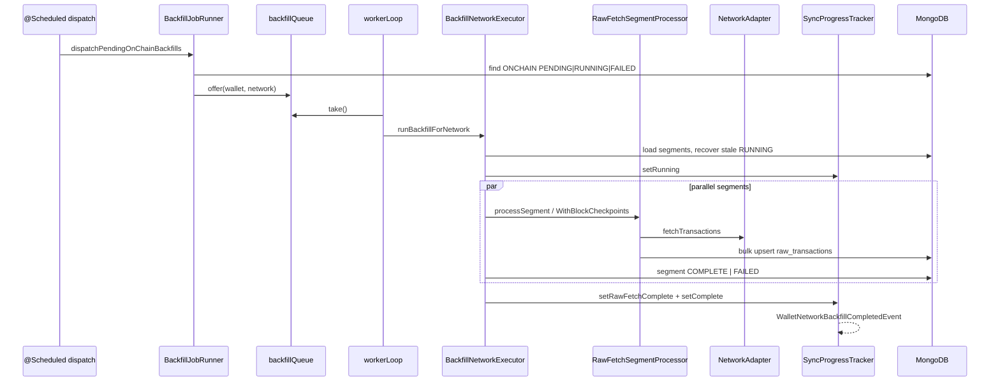
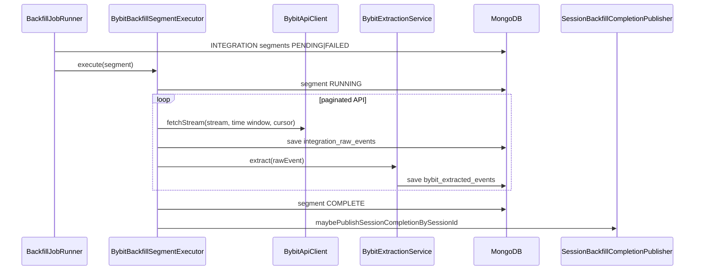
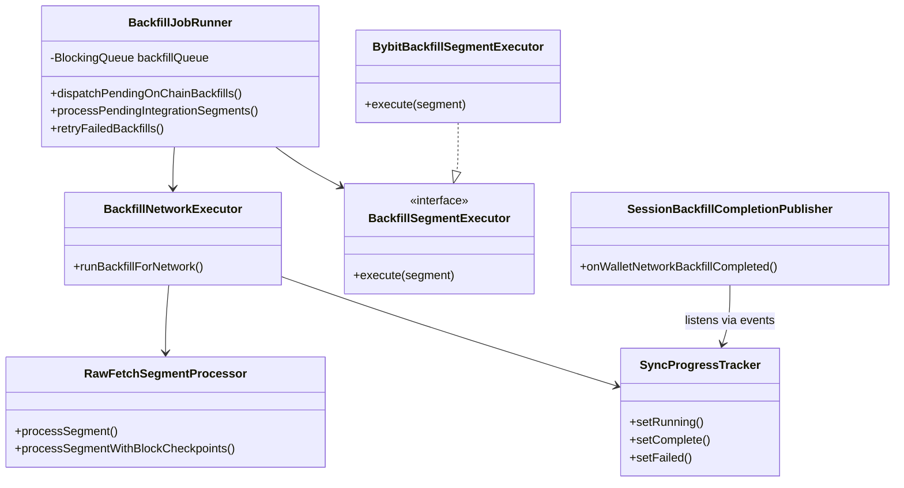

# Backfill — Execution

> **Last updated:** 2026-06-05

Execution drains planned work: on-chain wallet×network jobs through a worker queue, and integration segments through a separate poller. Progress is reflected in `sync_status` and `backfill_segments`; completion publishes Spring events for downstream normalization.

See also: [Overview](01-overview.md) · [Planning](02-planning.md) · [Data sources](04-data-sources.md) · [Pipeline index](../README.md)

## Scheduler and interval reference

All intervals are `@Scheduled(fixedDelayString = …)` — next run starts **after** the previous finishes.

| Component | Method | Property key | Default (ms) | Defined in |
|-----------|--------|--------------|--------------|------------|
| `BackfillJobRunner` | `dispatchPendingOnChainBackfills` | `walletradar.ingestion.backfill.dispatch-interval-ms` | **5000** | annotation default¹ |
| `BackfillJobRunner` | `processPendingIntegrationSegments` | `walletradar.integration.backfill.poll-interval-ms` | **15000** | `IntegrationBackfillProperties` |
| `BackfillJobRunner` | `retryFailedBackfills` | `walletradar.ingestion.backfill.retry-scheduler-interval-ms` | **120000** | `application.yml` |
| `BackfillRunningProgressJob` | `updateRunningSyncProgress` | `walletradar.ingestion.backfill.progress-update-interval-ms` | **2000** | `application.yml` |

¹ `dispatch-interval-ms` is not listed in `application.yml`; override by adding the property under `walletradar.ingestion.backfill`.

**Startup:** `@EventListener(ApplicationReadyEvent)` on `BackfillJobRunner` starts worker loops and runs one on-chain dispatch.

### Related backfill config (`application.yml`)

```yaml
walletradar.ingestion.backfill:
  window-blocks: 5500000
  worker-threads: 4
  max-retries: 5
  retry-base-delay-minutes: 2
  retry-max-delay-minutes: 60
  retry-scheduler-interval-ms: 120000
  progress-update-interval-ms: 2000
  segments:
    defaults:
      segment-stale-after-ms: 180000
      parallel-segments: 2
      parallel-segment-workers: 2
    by-rpc:
      segment-stale-after-ms: 120000
      parallel-segments: 6
      parallel-segment-workers: 6
```

## On-chain execution flow



### BackfillJobRunner

**Path:** `backend/src/main/java/com/walletradar/ingestion/job/backfill/BackfillJobRunner.java`

| Responsibility | Detail |
|----------------|--------|
| Worker pool | `workerThreads` loops on `backfillExecutor` |
| Dedup | `inFlightItems` set prevents duplicate enqueue per `wallet:network` |
| Adapter gate | Requires `NetworkAdapter` + `BlockHeightResolver` + `BlockTimestampResolver` |
| Segment repair | Calls `backfillJobPlanner.planOnChainSyncStatus` when PENDING sync lacks matching segments |
| Integration poll | Single-flight (`integrationSegmentsRunning`); stale RUNNING segments requeued |

### BackfillNetworkExecutor

**Path:** `backend/src/main/java/com/walletradar/ingestion/job/backfill/BackfillNetworkExecutor.java`

| Step | Behavior |
|------|----------|
| Validate segments | Must cover full `sync_status` block window |
| Recover stale | `RUNNING` segments older than `segmentStaleAfterMs` → `PENDING` |
| Parallelism | Up to `parallelSegmentWorkers` (RPC profile: `by-rpc` overrides) |
| Resume | `lastProcessedBlock + 1` as effective from-block |
| RPC checkpointing | When `syncMethod=RPC` and adapter supports it (not Solana): sub-chunks via `processSegmentWithBlockCheckpoints` |
| Finalize | All COMPLETE → `setRawFetchComplete` + `setComplete`; any FAILED → `setFailed` |

### RawFetchSegmentProcessor

**Path:** `backend/src/main/java/com/walletradar/ingestion/job/backfill/RawFetchSegmentProcessor.java`

| Method | Use |
|--------|-----|
| `processSegment` | Single adapter fetch for full segment range |
| `processSegmentWithBlockCheckpoints` | Chunked fetch for long RPC segments |

Persist semantics:

- Idempotent on document `_id` = `{txHash}:{networkId}:{walletAddress}`
- Existing rows skipped (insert-only via `setOnInsert`)
- `ScamFilter.shouldDrop` applied before write
- Bulk flush every **500** rows

### BackfillRunningProgressJob

**Path:** `backend/src/main/java/com/walletradar/ingestion/job/backfill/BackfillRunningProgressJob.java`

Recomputes `sync_status.progressPct` as the average of segment `progressPct` values for ONCHAIN `RUNNING` rows. Complements inline updates from `BackfillNetworkExecutor`.

## Integration execution flow (Bybit)



### BybitBackfillSegmentExecutor

**Path:** `backend/src/main/java/com/walletradar/integration/bybit/BybitBackfillSegmentExecutor.java`

Implements `BackfillSegmentExecutor` (`ingestion/job/backfill/BackfillSegmentExecutor.java`).

| Feature | Detail |
|---------|--------|
| `supports` | `sourceKind=INTEGRATION` and `provider=BYBIT` |
| Oversized windows | Streams with 7-day API limits repartition into smaller segments |
| History clamp | Segments outside supported history window completed with zero rows |
| Credentials | Decrypted via `SessionSecretCryptoService` |
| Failure | Segment → `FAILED`; integration sync state updated |

Other providers would register additional `BackfillSegmentExecutor` beans; the runner selects the first `supports(segment)` match.

## Progress and completion

### SyncProgressTracker

**Path:** `backend/src/main/java/com/walletradar/ingestion/sync/progress/SyncProgressTracker.java`

| Method | sync_status effect |
|--------|-------------------|
| `setRunning` | `RUNNING`, progress, banner |
| `setRawFetchComplete` | `rawFetchComplete=true`, `lastBlockSynced` |
| `setComplete` | `COMPLETE`, clears window fields, **authoritative terminal completion**: sets both `rawFetchComplete=true` and `backfillComplete=true` |
| `setFailed` | `FAILED`, increments `retryCount`, sets `nextRetryAfter` (exponential backoff + jitter) |

`setComplete` is authoritative because reaching `COMPLETE` is terminal for a wallet×network window (every executable segment finished, or there was nothing left to fetch). It always flips both completion booleans, so a window that completes through a "no executable segments" / empty-segment / adapter-skip path (e.g. a refresh that finds zero new transactions) can never persist as `COMPLETE` while the booleans stay `false` — which previously stranded the session-level backfill gate.

On complete, publishes `WalletNetworkBackfillCompletedEvent` (`domain/event/WalletNetworkBackfillCompletedEvent.java`).

### SessionBackfillCompletionPublisher

**Path:** `backend/src/main/java/com/walletradar/ingestion/job/backfill/SessionBackfillCompletionPublisher.java`

Listens for `WalletNetworkBackfillCompletedEvent` (and called directly after Bybit segment complete):

1. For each session containing the wallet, verify **every** wallet×network is backfill-complete. A source counts as complete when `sync_status.isBackfillComplete()` is set **or** the `sync_status` reached terminal `COMPLETE` status (robustness net — terminal status cannot coexist with RUNNING/PENDING/FAILED segments, so it never advances an in-flight source while still rescuing a stale completion boolean). The same gate is applied by `SessionPipelineResumeScheduler` (the 60s watchdog).
2. Verify **every** enabled integration backfill complete (via `sync_status` or segment counts).
3. Publish `SessionBackfillCompletedEvent` (`domain/event/SessionBackfillCompletedEvent.java`).
4. Mark session pipeline stage `BACKFILL` complete → downstream `ON_CHAIN_NORMALIZATION` schedulers react.

## Retry and abandonment

`BackfillJobRunner.retryFailedBackfills` (every 120s):

| sync_status | Action |
|-------------|--------|
| `FAILED` | Re-enqueue if `retryCount < maxRetries` and `nextRetryAfter` elapsed |
| `FAILED` (exhausted, no segments) | → `ABANDONED` |
| `RUNNING` (segment mode) | Re-enqueue (crash recovery) |

Segment-level failures increment `BackfillSegment.retryCount`; parent sync moves to `FAILED` when any segment fails.

## Execution class diagram



## Rules by transaction type

**N/A at execution — raw rows have no normalized type.**

Execution treats every fetched payload identically:

| Source | Execution rule |
|--------|----------------|
| On-chain | Persist if not scam-filtered and not already in `raw_transactions` |
| Bybit | Persist API row to `integration_raw_events`; run `BybitExtractionService` for structured `bybit_extracted_events` |
| All | No branching on swap/LP/lending/transfer semantics |

Transaction-type-specific behavior is documented from normalization onward in [reference/transaction-types.md](../../reference/transaction-types.md).
