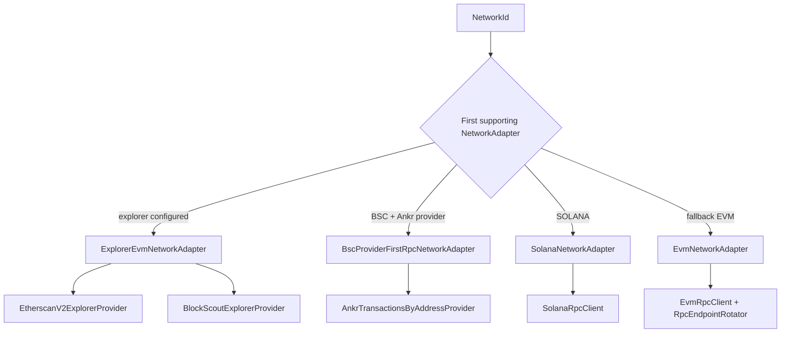
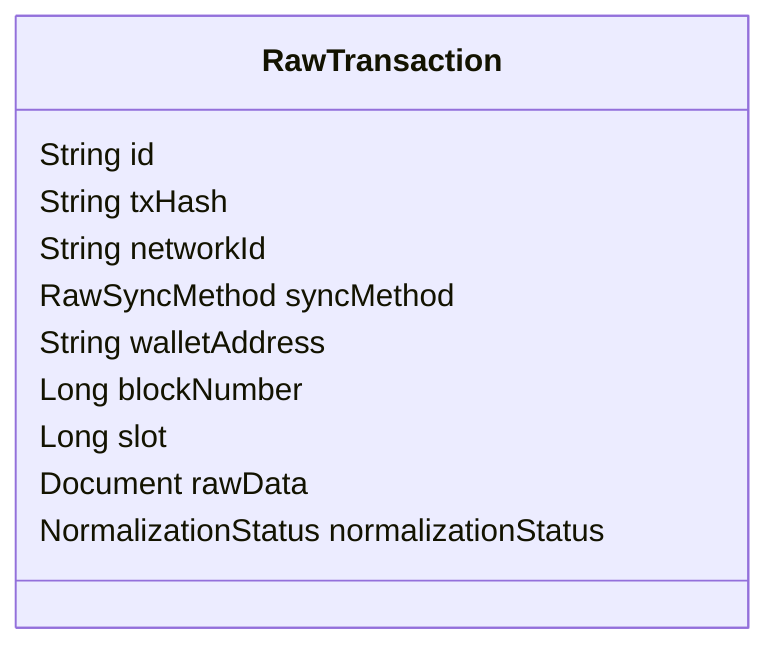
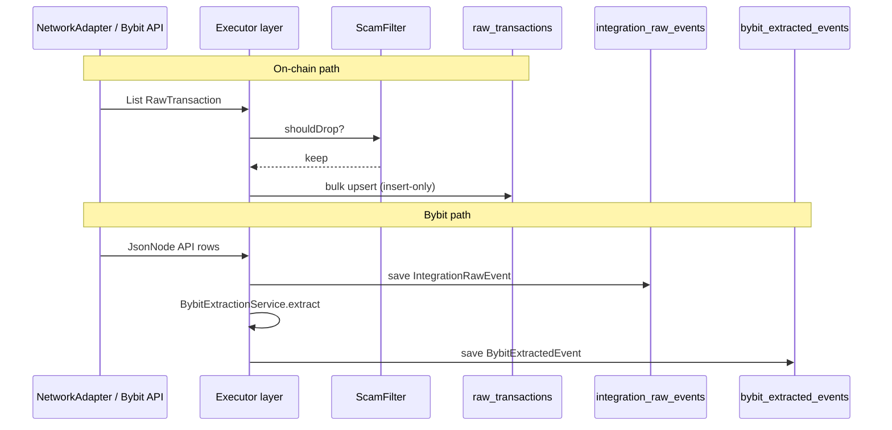

# Backfill — Data Sources

> **Last updated:** 2026-06-05

This document maps **external providers** to **runtime adapters**, describes **Mongo output schemas**, and explains how network configuration in `application.yml` drives fetch behavior during backfill.

See also: [Overview](01-overview.md) · [Execution](03-execution.md) · [Pipeline index](../README.md) · [Supported networks & protocols](../../reference/supported-networks-and-protocols.md)

Field-level `rawData.*` provenance: [Explorer vs RPC field mapping](../../reference/evm-rawtransaction-rpc-field-mapping.md) · [Etherscan vs Blockscout field mapping](../../reference/evm-etherscan-vs-blockscout-field-mapping.md)

## Provider matrix

Configuration lives in `backend/src/main/resources/application.yml` under `walletradar.ingestion.network.*`.

Legend:

- **Explorer** — paginated REST (Etherscan-compatible or Blockscout)
- **RPC** — JSON-RPC log/signature scan + receipt enrichment
- **Ankr provider** — `ankr_getTransactionsByAddress` multichain API (BSC primary path)
- **Ankr RPC** — optional multichain/fallback RPC URL in `urls` or `provider.base-url`
- **Bybit REST** — authenticated integration streams

| Network | `syncMethod` | Primary fetch adapter | Explorer API | RPC / provider URLs |
|---------|--------------|----------------------|--------------|---------------------|
| ETHEREUM | ETHERSCAN | `ExplorerEvmNetworkAdapter` | Etherscan (`api.etherscan.io`) | Ankr multichain + public RPCs |
| ARBITRUM | ETHERSCAN | `ExplorerEvmNetworkAdapter` | Arbiscan | Ankr + public RPCs |
| POLYGON | ETHERSCAN | `ExplorerEvmNetworkAdapter` | Polygonscan | Ankr + public RPCs |
| AVALANCHE | ETHERSCAN | `ExplorerEvmNetworkAdapter` | Routescan (Etherscan-compatible) | Ankr + public RPCs |
| MANTLE | ETHERSCAN | `ExplorerEvmNetworkAdapter` | Mantlescan | Public RPCs |
| LINEA | ETHERSCAN | `ExplorerEvmNetworkAdapter` | Etherscan v2 (chain 59144) | Linea RPCs |
| UNICHAIN | ETHERSCAN | `ExplorerEvmNetworkAdapter` | Etherscan v2 (chain 130) | Unichain RPCs |
| KATANA | ETHERSCAN | `ExplorerEvmNetworkAdapter` | Etherscan v2 (chain 747474) | Katana RPC |
| PLASMA | ETHERSCAN | `ExplorerEvmNetworkAdapter` | Etherscan v2 (chain 9745) | Plasma RPC |
| OPTIMISM | BLOCKSCOUT | `ExplorerEvmNetworkAdapter` | Optimism Blockscout | Ankr + public RPCs |
| BASE | BLOCKSCOUT | `ExplorerEvmNetworkAdapter` | Base Blockscout | Ankr + public RPCs |
| ZKSYNC | BLOCKSCOUT | `ExplorerEvmNetworkAdapter` | zkSync Blockscout | zkSync RPCs |
| BSC | RPC | `BscProviderFirstRpcNetworkAdapter`² | — | Ankr multichain provider + Ankr BSC RPC |
| SOLANA | RPC | `SolanaNetworkAdapter` | — | `api.mainnet-beta.solana.com` |
| TON | RPC | *(none — empty urls)* | — | Not configured |
| BYBIT (integration) | — | `BybitBackfillSegmentExecutor` | — | `api.bybit.com` |

² When `provider.enabled=true` and `provider.base-url` is set; otherwise falls through to `EvmNetworkAdapter` RPC scan.

### Adapter selection at runtime

`BackfillJobRunner` picks the **first** `NetworkAdapter` bean where `supports(networkId)` is true. Spring `@Order` breaks ties:

| Order | Adapter | Path |
|-------|---------|------|
| `HIGHEST_PRECEDENCE` | `ExplorerEvmNetworkAdapter` | `ingestion/adapter/evm/explorer/ExplorerEvmNetworkAdapter.java` |
| `LOWEST_PRECEDENCE - 100` | `BscProviderFirstRpcNetworkAdapter` | `ingestion/adapter/evm/rpc/provider/BscProviderFirstRpcNetworkAdapter.java` |
| `LOWEST_PRECEDENCE` | `EvmNetworkAdapter` | `ingestion/adapter/evm/rpc/EvmNetworkAdapter.java` |
| (default) | `SolanaNetworkAdapter` | `ingestion/adapter/solana/SolanaNetworkAdapter.java` |

Explorer providers:

| Class | Path | Used when |
|-------|------|-----------|
| `EtherscanV2ExplorerProvider` | `ingestion/adapter/evm/explorer/EtherscanV2ExplorerProvider.java` | `syncMethod: ETHERSCAN` + explorer config |
| `BlockScoutExplorerProvider` | `ingestion/adapter/evm/explorer/BlockScoutExplorerProvider.java` | `syncMethod: BLOCKSCOUT` + explorer config |
| `RoutingExplorerProvider` | `ingestion/adapter/evm/explorer/RoutingExplorerProvider.java` | Delegates to first supporting provider |

Head resolution for planning uses `BlockHeightResolver` beans (`EvmBlockHeightResolver` at `ingestion/adapter/evm/rpc/EvmBlockHeightResolver.java`; supports all EVM `NetworkId` values, not Solana). `BlockTimestampResolver` (`EvmBlockTimestampResolver`) is required at enqueue time alongside the adapter; Solana has `SolanaNetworkAdapter` configured but no matching resolver beans today, so Solana jobs are skipped at dispatch until resolvers exist.

## Fetch semantics by source type

### Explorer-backed EVM (`RawSyncMethod.ETHERSCAN` or `BLOCKSCOUT`)

- Merges transaction list, token transfer, and internal transfer pages.
- Stores merged payload in `rawData` BSON document.
- Rate limits: `walletradar.ingestion.explorer.*` (max pages per window, timeouts, retries).

### RPC-backed EVM (`RawSyncMethod.RPC`)

- `EvmNetworkAdapter`: `eth_getLogs` on Transfer topic, enriches with receipts and token metadata.
- Checkpointing during execution splits large block ranges (`batch-block-size` per network).
- Rate limits: `walletradar.ingestion.evm-rpc.*`.

### BSC Ankr provider-first

- `BscProviderFirstRpcNetworkAdapter` calls Ankr multichain transactions API, maps to `RawTransaction`, optional native RPC repair via `NativeRpcTransactionRepairGateway`.

### Solana RPC

- `getSignaturesForAddress` (limit: `walletradar.ingestion.solana.signatures-limit`, default 1000).
- Per-signature `getTransaction`; slot range passed from segment blocks (used as slot bounds).
- No block checkpointing in executor (`shouldUseRpcCheckpointing` excludes Solana).

### Bybit integration

Streams defined in `BybitIntegrationStream` enum; each persisted segment fetches one stream over `[fromTime, toTime]`. See `BybitBackfillSegmentPlanner` for stream list and window sizes (`BybitIntegrationProperties`).

## Mongo collections

### `sync_status`

| Attribute | Value |
|-----------|-------|
| Model | `domain/sync/SyncStatus.java` |
| Written by | Planning (`SourceSyncPlanner`), execution progress (`SyncProgressTracker`) |
| Key fields | `status`, window fields, `progressPct`, `lastBlockSynced`, `backfillComplete`, `rawFetchComplete`, retry fields |

### `backfill_segments`

| Attribute | Value |
|-----------|-------|
| Model | `domain/sync/BackfillSegment.java` |
| Written by | Planning (create/replace), execution (status/progress) |
| Key fields | `sourceKind`, `segmentKind`, block or time range, `stream`, `status`, `progressPct`, `lastProcessedBlock` |

### `raw_transactions`

| Attribute | Value |
|-----------|-------|
| Model | `domain/transaction/raw/RawTransaction.java` |
| Written by | `RawFetchSegmentProcessor` |
| Unique key | `(txHash, networkId, walletAddress)` compound index |
| Id | `{txHash}:{networkId}:{walletAddress}` |
| Payload | `rawData` — full native/explorer document |
| Downstream | `normalizationStatus` consumed by on-chain normalization jobs |

Insert-only upsert fields include `txHash`, `networkId`, `syncMethod`, `walletAddress`, `blockNumber`, `slot`, `rawData`, `normalizationStatus`, timestamps.

### `integration_raw_events`

| Attribute | Value |
|-----------|-------|
| Model | `domain/transaction/integration/IntegrationRawEvent.java` |
| Written by | `BybitBackfillSegmentExecutor` |
| Content | Provider API row JSON as BSON, keyed by integration + stream + deterministic id |
| Downstream | Bybit normalization reads these rows |

### `bybit_extracted_events`

| Attribute | Value |
|-----------|-------|
| Model | `domain/transaction/bybit/BybitExtractedEvent.java` |
| Written by | `BybitExtractionService` during backfill execution |
| Content | Structured events extracted from raw integration rows |
| Downstream | Bybit normalization / linking |

## Data flow diagram

## External dependency configuration

| Provider | Config prefix | Notes |
|----------|---------------|-------|
| Etherscan / Blockscout | `walletradar.ingestion.network.{NETWORK}.explorer.*` | Per-network API keys via env vars |
| EVM RPC | `walletradar.ingestion.network.{NETWORK}.urls` | Rotated by `RpcEndpointRotator` |
| Ankr | `ANKR_API_KEY` in URLs | Multichain and per-chain endpoints |
| DRPC | `DRPC_API_KEY` | Optional fallback RPC |
| Explorer throttling | `walletradar.ingestion.explorer.*` | Shared across explorer providers |
| EVM RPC throttling | `walletradar.ingestion.evm-rpc.*` | Rate limiter + cooldowns |
| Solana | `walletradar.ingestion.solana.signatures-limit` | Signature page size |
| Bybit | `walletradar.integration.bybit.*` | Stream window sizes, API base URL in pricing section for quotes |
| Integration history | `walletradar.integration.backfill.history-years` | Default 2 years |

## Rules by transaction type

**N/A — raw collections store provider-native shapes, not WalletRadar types.**

| Collection | What is stored | Type field |
|------------|----------------|------------|
| `raw_transactions` | Chain/explorer JSON (`rawData`) | None — only `syncMethod` (ETHERSCAN/BLOCKSCOUT/RPC) |
| `integration_raw_events` | Bybit API row | Stream name (e.g. `EXECUTION_SPOT`), not accounting type |
| `bybit_extracted_events` | Parsed Bybit fields | Extraction schema, not normalized `NormalizedTransaction.type` |

WalletRadar transaction types (swap, LP, lending, bridge, etc.) are assigned during normalization. Backfill responsibility ends at **faithful, idempotent capture** of source evidence.

For cross-stage type behavior see [reference/transaction-types.md](../../reference/transaction-types.md).
