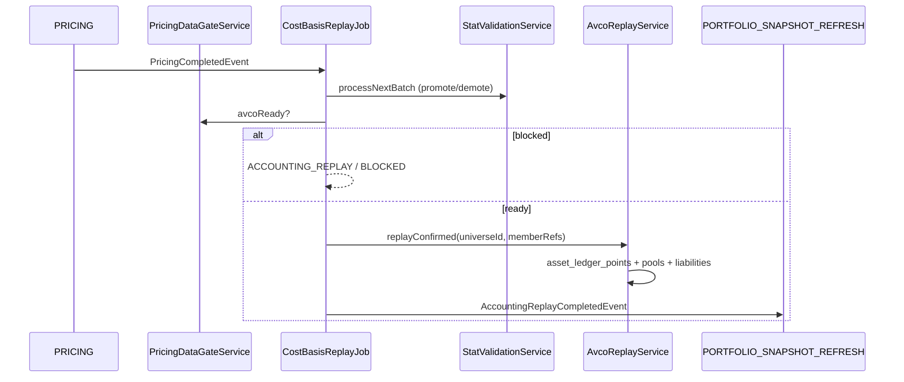

# Cost Basis — Overview

> **Last updated:** 2026-07-16  
> **Pipeline stage:** `ACCOUNTING_REPLAY` (`UserSession.PipelineStage.ACCOUNTING_REPLAY`)

Cost basis is WalletRadar's **average cost (AVCO)** accounting layer. It replays confirmed canonical transactions in deterministic order, materializes immutable ledger points, and persists auxiliary books (counterparty pools, LP receipt pools, borrow liabilities).

**Method:** AVCO (not FIFO/LIFO).  
**Authority:** Chronological replay over `normalized_transactions WHERE status = CONFIRMED AND excludedFromAccounting != true`.

## AVCO vs FIFO/LIFO — what we use and why

WalletRadar computes cost basis with **AVCO (weighted average cost)** and deliberately does **not** use FIFO or LIFO.

### The three methods

| Method | On a SELL, which cost leaves | Cost basis of the remaining position |
|--------|------------------------------|--------------------------------------|
| **AVCO** (used) | The current running average per unit | Every buy is blended into one average; sells never change the per-unit average, only the quantity |
| **FIFO** | The cost of the oldest lots first | Whatever specific lots are left after consuming oldest-first |
| **LIFO** | The cost of the newest lots first | Whatever specific lots are left after consuming newest-first |

### Why AVCO

- **Matches the product's purpose.** WalletRadar tracks the *average purchase price* of assets held across many wallets, chains, and venues — a single blended number, not tax-lot disposal accounting.
- **Path-independent and lot-free.** DeFi activity (swaps, bridges, LP entries/exits, rewards, wraps) rarely carries clean, orderable tax lots across venues. AVCO needs only a running `(quantity, costBasis)` pair, so it survives carries, corridor continuity, and cross-venue transfers where per-lot identity is lost.
- **Deterministic replay.** A single average numerator per quantity pool makes the chronological replay reproducible and cheap to materialize into `asset_ledger_points`.
- **Dual-lane friendly.** The Net/Market AVCO split (ADR-040; the "Market" lane was formerly "Tax") and reward zero-cost handling layer cleanly on top of one averaged numerator; per-lot FIFO/LIFO would multiply that bookkeeping.

### Why your numbers may differ from a broker / portfolio tracker

Brokerages and portfolio trackers (e.g. Yahoo Finance) commonly report **FIFO** average cost. On a position with interleaved buys and sells, FIFO and AVCO legitimately produce different "average cost" figures — the divergence grows with the number of trades. This is a methodology difference, not an error, and it is unrelated to fees (trading commissions are ~0.05–0.1%).

**Worked example — TSLA (0.2 held):**

- Buys (chronological): `1.0@456`, `0.2@236`, several `0.1@…`, `0.1@300`, `0.1@418.35`; a `1.0@400` sell lands mid-way, then further sells reduce the position to `0.2`.
- **FIFO:** the early `1.0@456` lot is fully consumed by the first big sell, so the held `0.2` are the *last two lots* → `(0.1×300 + 0.1×418.35) / 0.2 = ` **359.18** (what a FIFO tracker shows).
- **AVCO:** the `456` lot is blended across the whole history, so the held `0.2` carry the running average → **≈371.5** (what WalletRadar shows).

Both are correct for their method; WalletRadar is average-cost by design.

## Related docs

| Doc | Focus |
|-----|-------|
| [AVCO rules](02-avco-rules.md) | BUY/SELL/TRANSFER formulas |
| [Basis pools & carry](03-basis-pools-and-carry.md) | Pools, corridors, continuity |
| [Borrow liability](04-borrow-liability.md) | Crypto-loan tracker |
| [Replay overview](../replay/01-overview.md) | Job, handlers, ledger |
| [Ledger points & basis effects](../../reference/ledger-points-and-basis-effects.md) | `AssetLedgerPoint`, `BasisEffect` semantics |
| [ADR-054](../../adr/ADR-054-per-asset-avco-for-staked-derivatives.md) | Per-asset AVCO pools; staked/derivative ETH (C2) held out of `FAMILY:ETH`; Market/Net lane naming |

## Stage placement

## Preconditions

Before replay starts:

1. Raw backfill complete for session scope
2. On-chain normalization + clarification + reclassification complete
3. Bybit normalization complete
4. Linking complete (Bybit ↔ on-chain rematch, bridge pairs)
5. Pricing gate green (`avcoReady`)

Move-basis is **part of replay**, not a separate pipeline stage.

## Entry points (verified)

| Class | Package | Role |
|-------|---------|------|
| `CostBasisReplayJob` | `costbasis/application/` | Stage driver, stat validation, gate check |
| `AvcoReplayService` | `costbasis/application/` | Full universe replay |
| `ReplayDispatcher` | `costbasis/application/replay/dispatch/` | Per-transaction routing |
| `ConfirmedReplayQueryService` | `costbasis/application/replay/query/` | Ordered confirmed load |
| `GenericFlowReplayEngine` | `costbasis/application/replay/support/` | Core BUY/SELL/FEE math |
| `StatValidationService` | `costbasis/application/` | Pre-replay stat promotion |

## Replay ordering

Deterministic sort (`ConfirmedReplayQueryService`):

1. `blockTimestamp ASC`
2. `transactionIndex ASC`
3. `_id ASC`

Bybit rows use `transactionIndex = 0`.

## Outputs

| Artifact | Collection | Scope |
|----------|------------|-------|
| Ledger timeline | `asset_ledger_points` | `accountingUniverseId` |
| Counterparty pools | `counterparty_basis_pools` | Per counterparty + asset family |
| LP receipt pools | `lp_receipt_basis_pools` | Per position / receipt marker |
| Borrow book | `borrow_liabilities` | Per `orderId` |
| Shortfall audit | `accounting_shortfall_audits` | Derived from ledger |
| Updated flows | `normalized_transactions` | Replay stamps (`avcoAtTimeOfSale`, `realisedPnlUsd`) |

Replay replaces universe-scoped collections atomically per run.

## Three AVCO surfaces (do not mix)

| Surface | Source | Use |
|---------|--------|-----|
| Dashboard header | `on_chain_balances` + latest ledger basis | Current portfolio AVCO |
| Family timeline | `TimelineAvcoAuthority` | Historical spot chart |
| Per-point ledger | `AssetLedgerPoint.avcoAfterUsd` | Audit / debugging |

See [ADR-017](../../adr/ADR-017-timeline-avco-authority.md). Per [ADR-054](../../adr/ADR-054-per-asset-avco-for-staked-derivatives.md), staked/derivative ETH (C2 — wstETH, cmETH, …) is **not** rolled into the `FAMILY:ETH` spot chart; each holds its own per-asset AVCO pool.

## Current holding diagnostics (read-time)

Not replay events — derived on dashboard read:

| Issue | Meaning |
|-------|---------|
| `yield_accrual` | Live qty above covered; interest-bearing bucket |
| `coverage_gap` | Live qty above provable basis |
| `history_flags` | Covered qty OK but incomplete history |
| `missing_replay_point` | Balance exists, no ledger point |

## Supported scope

On-chain networks per [supported networks & protocols](../../reference/supported-networks-and-protocols.md); CEX: `BYBIT` only for this milestone.

Excluded rows (`excludedFromAccounting = true`) remain in Mongo for audit but never replay.

## Rules by transaction type

High-level **replay outcome** per type (detail in linked docs):

| Type | Basis effect |
|------|--------------|
| `BUY` | ACQUIRE — increases qty and cost basis |
| `SELL` | DISPOSE — realises PnL on covered qty |
| `FEE` | GAS_ONLY — reduces qty; may capitalise into acquisition |
| `INTERNAL_TRANSFER` | CARRY_OUT / CARRY_IN — no PnL |
| `BRIDGE_OUT` / `BRIDGE_IN` | Same-family carry or asset-changing settlement repair |
| `EXTERNAL_TRANSFER_*` (correlated) | CARRY with pending inbound ordering |
| `SPONSORED_GAS_IN` | Zero-cost ACQUIRE |
| `SWAP` | SELL then BUY (or handler-specific) |
| `LENDING_*` / `VAULT_*` | REALLOCATE / CARRY — principal not realised |
| `LP_ENTRY` / `LP_EXIT` | Receipt pool or position-scoped bucket |
| `BORROW` / `REPAY` | Reserve BUY/SELL + liability tracker |
| `STAKING_*` | Liquid-staking carry via `LiquidStakingReplayHandler` |
| `LENDING_LOOP_*` | `EulerLoopReplayHandler` |
| `GMX LP_ENTRY_*` | `GmxLpEntryReplayHandler` async escrow |
| `DEX_ORDER_*` | `AsyncSpotOrderReplayHandler` |
| `DERIVATIVE_*` | Collateral/fees only — no synthetic underlying spot |
| `REWARD_CLAIM` | ACQUIRE at priced FMV |
| `WRAP` / `UNWRAP` | AVCO preserved across wrapper (±0.1%) |
