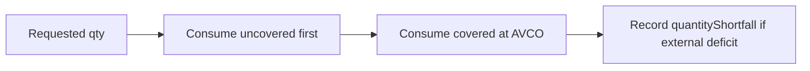

# Cost Basis — AVCO Rules

> **Last updated:** 2026-06-05  
> **Pipeline stage:** `ACCOUNTING_REPLAY`

Core AVCO mechanics live in `GenericFlowReplayEngine` and are invoked by `ReplayDispatcher` / `TransferReplayHandler` for generic flows. All math uses `MathContext.DECIMAL128`.

## AVCO formulas

### On BUY (ACQUIRE)

```text
newAvco = (currentAvco × currentQty + priceUsd × deltaQty) / (currentQty + deltaQty)
newQty  = currentQty + deltaQty
```

Implementation: `GenericFlowReplayEngine.applyBuy` / `applyBuyWithAcquisitionCost`.

- Priced flow: acquisition cost = `quantity × unitPriceUsd`
- Unpriced BUY: quantity added to `uncoveredQuantity`; `hasIncompleteHistory = true`
- USD stablecoin fallback: unpriced BUY on stable symbol may use $1 cost (Cycle/19)

### On SELL (DISPOSE)

```text
avcoAtSale   = currentAvco
realisedPnl  = (sellPriceUsd - avcoAtSale) × abs(deltaQty)   // covered portion only
newQty       = currentQty - abs(deltaQty)
newAvco      = currentAvco   // unchanged after sale
```

Implementation: `GenericFlowReplayEngine.applySell`.

- Consumes **uncovered tail first**, then covered AVCO-backed quantity
- Realised PnL stamped on flow only when fully priced and no shortfall
- `avcoAtTimeOfSale` persisted on flow for audit

### On FEE (GAS_ONLY)

- Reduces fee asset quantity
- Adds to `totalGasPaidUsd` when priced
- May reduce cost basis of covered quantity at AVCO
- Does not create a new lot or standalone PnL for acquired asset

### On TRANSFER (continuity)

- Quantity moves; basis carries forward
- No new acquisition lot; no realised PnL
- Handled by `TransferReplayHandler` + pending transfer stores

## Quantity consumption order

On outbound flows (SELL, FEE, carry-out):



`quantityShortfall` is lifetime audit counter; `uncoveredQuantity` tracks what is still held uncovered.

## Special acquisition rules

| Scenario | Rule | Handler / engine |
|----------|------|------------------|
| `SPONSORED_GAS_IN` | `costBasisDeltaUsd = 0`; zero-cost inventory | Generic BUY with zero price |
| `PRICE_UNKNOWN` | Qty updates; price fields null; incomplete history | `applyBuy` unpriced path |
| Bybit convert | Must be canonical `SWAP`; basis transfers sold → bought asset | Normal SWAP replay |
| `REWARD_CLAIM` | FMV acquisition at receive time | Priced BUY |
| Bybit corridor orphan IN | Spot-price ACQUIRE when no pending carry | `TransferReplayHandler` |
| Rebasing Aave WETH excess | Principal TRANSFER + excess BUY for yield portion | `FamilyEquivalentCustodyReplayHandler` |

## WRAP / UNWRAP AVCO carry

Replay preserves source bucket `avcoBeforeUsd` on destination (±0.1%):

- `WRAP` (ETH→WETH): WETH `avcoAfterUsd` = source ETH `avcoBeforeUsd`
- `UNWRAP` (WETH→ETH): ETH `avcoAfterUsd` = source WETH `avcoBeforeUsd`
- Source AVCO 0 → destination inherits 0 (correct; no synthetic pricing)

## Family-equivalent principal split

When destination quantity > moved principal (same-family custody):

1. Source principal `TRANSFER` out
2. Destination principal-sized `TRANSFER` in
3. Destination excess `BUY` (passive yield materialized at tx)

Applies to audited `LENDING_*`, `VAULT_*`, `WRAP/UNWRAP`, Aave rebasing rows.

## Bridge quantity drift

For linked same-family `BRIDGE_OUT → BRIDGE_IN`:

| Case | Carry rule |
|------|------------|
| Destination qty < source | Full source cost basis on smaller destination qty |
| Destination qty > source | Full source basis moves; excess destination uncovered |
| Fee embedded in delta | Settlement cost in carried basis, not synthetic sale |

Asset-changing bridge routes: may use settlement repair slice when `continuityCandidate = false` but pair is exactly matched (see [03-basis-pools-and-carry.md](03-basis-pools-and-carry.md)).

## Corridor carry rate (ADR-019)

For `BYBIT-CORRIDOR:*` `CARRY_OUT`/`CARRY_IN`:

```text
inboundAvco = carryBasis / movedQty
             = movedQty × outboundSliceAvco / movedQty
             = outboundSliceAvco
```

Residual source-bucket AVCO after CARRY_OUT must not define inbound rate.

## basisEffect enum

Written on each `AssetLedgerPoint`:

| Value | Meaning |
|-------|---------|
| `ACQUIRE` | Economic acquisition |
| `DISPOSE` | Economic disposal; may realise PnL |
| `CARRY_OUT` | Qty/basis leaves bucket into continuity |
| `CARRY_IN` | Qty/basis restores from continuity |
| `REALLOCATE_OUT` / `REALLOCATE_IN` | Async / LP / vault custody transition |
| `GAS_ONLY` | Fee-only step |
| `UNKNOWN` | State changed but economic meaning unproved |

## Rules by transaction type

AVCO math application per type:

| Type | AVCO behavior |
|------|---------------|
| `BUY` | Standard ACQUIRE formula |
| `SELL` | Standard DISPOSE; PnL if priced |
| `SWAP` | SELL leg(s) then BUY leg(s); multi-sell uses combined cost |
| `FEE` | GAS_ONLY consumption |
| `INTERNAL_TRANSFER` | CARRY only; no AVCO change on net family basis |
| `BRIDGE_OUT` / `BRIDGE_IN` | Bridge carry path; proportional covered share |
| `EXTERNAL_TRANSFER_OUT` / `IN` | CARRY when correlated; else DISPOSE/ACQUIRE at FMV |
| `SPONSORED_GAS_IN` | ACQUIRE at $0 |
| `REWARD_CLAIM` / `LP_FEE_CLAIM` | ACQUIRE at FMV |
| `LENDING_DEPOSIT` | REALLOCATE_OUT from spot |
| `LENDING_WITHDRAW` | REALLOCATE_IN to spot |
| `VAULT_DEPOSIT` / `VAULT_WITHDRAW` | Same as lending |
| `LP_ENTRY` | Principal to receipt pool; no synthetic LP token lot |
| `LP_EXIT` | Restore from per-asset receipt pool (ADR-022) |
| `LP_ENTRY_REQUEST` / `LP_EXIT_REQUEST` | Escrow REALLOCATE; no PnL |
| `BORROW` | Reserve BUY + liability record |
| `REPAY` | Reserve SELL + liability match (zero-PnL roundtrip when matched) |
| `STAKING_DEPOSIT` | Carry principal → derivative; no conversion PnL |
| `STAKING_WITHDRAW` | Carry derivative → principal |
| `LENDING_LOOP_OPEN` | ACQUIRE share at event-local price |
| `LENDING_LOOP_REBALANCE` | CARRY between share assets |
| `LENDING_LOOP_DECREASE` / `CLOSE` | DISPOSE share; ACQUIRE returned asset |
| `WRAP` / `UNWRAP` | Preserve source AVCO on destination |
| `DEX_ORDER_REQUEST` | SOLD asset held in order bucket |
| `DEX_ORDER_SETTLEMENT` | Finalizes swap economics |
| `DERIVATIVE_*` | Fees/collateral only |
| `GMX LP_ENTRY_*` | Split principal vs execution-fee reserve |
