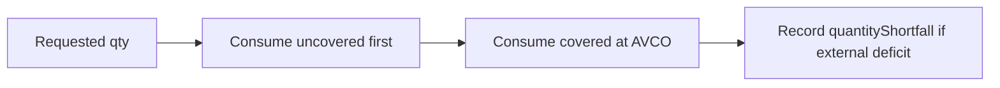

# Cost Basis — AVCO Rules

> **Last updated:** 2026-07-16  
> **Pipeline stage:** `ACCOUNTING_REPLAY`

Core AVCO mechanics live in `GenericFlowReplayEngine` and are invoked by `ReplayDispatcher` / `TransferReplayHandler` for generic flows. All math uses `MathContext.DECIMAL128`.

## Dual lanes: Net AVCO and Market AVCO

Since ADR-040 (amended 2026-07-13), replay maintains **two parallel cost numerators** on the same quantity pool:

| Lane | API field | Acquisition cost for rewards / LP fee claims |
|---|---|---|
| **Market AVCO** | `avcoUsd`, `totalCostBasisUsd` | FMV at receipt (existing behavior) |
| **Net AVCO** | `netAvcoUsd`, `netTotalCostBasisUsd` | $0 when `ZeroCostAcquisitionSupport.isZeroCostAcquisition(type)` |

- Disposals relieve covered basis from both numerators using each lane's AVCO at time of sale.
- Realised PnL is tracked separately: `realisedPnlDeltaUsd` (tax) vs `netRealisedPnlDeltaUsd` (net).
- Carry transfers store `netCostBasisUsd` / `netAvco` alongside tax fields in `CarryTransfer`.
- BORROW inflows: **Tax lane** = `qty × marketPrice`; **Net lane** = `$0` (borrowed asset is a liability, not purchased). See ADR-046 / Bug-D.
- REPAY follows the same rules in both lanes (matched liability principal: $0 PnL per ADR-012).

## AVCO formulas

### On BUY (ACQUIRE)

```text
newAvco = (currentAvco × currentQty + priceUsd × deltaQty) / (currentQty + deltaQty)
newQty  = currentQty + deltaQty
```

Implementation: `GenericFlowReplayEngine.applyBuy` / `applyBuyWithAcquisitionCost`.

- Priced flow: acquisition cost = `quantity × unitPriceUsd`
- Unpriced BUY: quantity added to `uncoveredQuantity`; `hasIncompleteHistory = true`
- USD stablecoin fallback: unpriced BUY on stable symbol may use $1 cost (Cycle/19)

#### R-3* — USD stablecoin carry peg floor

A USD-pegged stablecoin (per `CanonicalAssetCatalog.isUsdStablecoinBySymbol`, which excludes
homoglyph/confusable lookalikes) must never *carry or reallocate in* below `$1` per covered unit.
A depressed source AVCO (mis-priced upstream pool, borrow proceeds, or a corridor/bridge inbound)
must not propagate a sub-peg basis through continuity carries — otherwise the receiving sub-ledger
settles below `$1` (e.g. `BYBIT:…:FUND` USDT at `$0.846`, `BRIDGE_IN` USDC at `$0.8874`) and
disposals book fabricated gains.

Implementation: `GenericFlowReplayEngine.pegFlooredStablecoinCarryBasis(assetKey, coveredQty,
carryBasisUsd)`, applied uniformly across **all** carry-restore paths:
- direct restore — `GenericFlowReplayEngine.restoreToPosition`;
- bridge / pending-late-attach — `TransferReplayHandler.attachLateCarryToPendingInbound`,
  `attachLateBridgeCarryToPendingInbound`, `attachLateBridgeSettlementCarryToPendingInbound`.

Scope discipline (floor, not clamp): the floor activates only when the carried covered basis is
materially below peg (`< 0.90 × coveredUnits`), so near-peg conversion/bridge unit-rounding
artifacts and the residual sub-peg USDC shortfall stay conserved. Fresh `ACQUIRE` legs keep their
genuine acquisition price. The above-peg direction is handled by the U-3 cap below.

#### U-3 — USD stablecoin same-asset carry peg cap

A USD-pegged stablecoin (same `CanonicalAssetCatalog.isUsdStablecoinBySymbol` check, homoglyph guard
inherited) must never *carry per-unit basis above the `$1` peg* on a **same-asset** vault/lending
withdrawal continuity carry. Unresolved ERC4626 / EVK vault share→underlying rates concentrate the
deposited USD basis onto the (smaller) share count, so a withdraw restores the stablecoin at an
impossible per-unit basis (observed `$1.27`, `$1.52`, `$1.99`, up to `$2,666`–`$3,021` per USDC from
Fluid `FUSDC`, Gauntlet `GTUSDCC`, MetaMorpho `MCUSDC`, Euler `EUSDC-2`/`EUSDC-6`). Capping the
carried basis to `coveredUnits × $1` makes the withdrawn stablecoin dispose at ≈`$0` realised
(peg in ≈ peg out); genuine yield surfaces as quantity, never as above-peg per-unit basis. This
generalizes F-1 (acquisition peg) and U-2 (EVK valuation) to the withdraw-continuity path.

Implementation: `GenericFlowReplayEngine.pegCappedStablecoinCarryBasis(assetKey, coveredQty,
carryBasisUsd)` (symmetric peer of the R-3* floor). It is applied **only** by callers that have
confirmed the carry is a same-asset stablecoin continuity:
- `TransferReplayHandler` matched same-asset / cross-denomination continuity inbound restore
  (`VAULT_WITHDRAW` / `LENDING_WITHDRAW` / `CARRY_IN` / `REALLOCATE_IN`);
- `LpReceiptExitReplayHandler.restoreInboundFromPool` (per-asset receipt-pool restore);
- `PositionScopedLpExitReplayHandler` same-asset carry, and the combined-basis restore **only when
  no cross-asset basis was carried** (`!crossAssetBasisCarried`).

Conservation guard: a **cross-asset** LP exit (e.g. a WETH/USDC pool fully returned as USDC, which
legitimately carries the pool's combined basis above `$1`/unit) is **never** capped — clamping it
would destroy the cross-asset basis and fabricate a gain. The cap is therefore never applied in the
shared `restoreToPosition` floor path, only at the same-asset withdraw sites above.

#### F-5(a) — corridor inbound basis: paired carry, else market-at-timestamp, never $0

An inbound `TRANSFER`-role leg (`BRIDGE_IN` / `STAKING_DEPOSIT REALLOCATE_IN` /
`INTERNAL_TRANSFER CARRY_IN`, including Bybit collapsed-asset carry-ins for ETH/MNT/BTC/SOL/XRP/
LINK/ONDO) must never enter a family pool with `$0` or sub-market per-unit basis. A basisless inflow
dilutes the pooled AVCO and fabricates a later disposal gain (audit: ETH `+$882`, MNT `+$492`,
alts `+$240`, on a portfolio where every asset declined).

Resolution order for the uncovered (basisless) portion that survives the continuity carry:
1. The paired OUT-leg's authoritative AVCO (existing R-1*/F-2 carry-source / bridge-pairing machinery
   — unchanged; the carry remains authoritative whenever it supplies basis).
2. The flow's own resolved spot price (Cycle/15 pegged-native receipts).
3. **Market-at-timestamp** resolved by `ReplayMarketAuthority` at the leg's block time, for genuinely
   unpaired legs (e.g. an unpaired `STAKING_DEPOSIT`, a cross-chain zkSync ETH `BRIDGE_IN` whose
   source chain was not backfilled).

Implementation: `GenericFlowReplayEngine.applyInboundShortfallSpotFallback(transaction, …)` (the
single inbound chokepoint invoked by `ReplayDispatcher` for every TRANSFER path) promotes the
uncovered quantity at the resolved price; the basis added is recorded as **provisional** so a later
authoritative paired carry still replaces it (no double-count). Because a major fungible asset
(ETH/MNT/BTC/…) carries one global USD price, `ReplayMarketAuthority` now also resolves a
**cross-network** quote: when the network+contract+minute cache misses, it reuses a same-minute quote
for the same canonical asset priced on any other network
(`HistoricalPriceCacheService.findCanonicalQuote`, gated by
`CanonicalAssetCatalog.isCrossNetworkPriceResolvable` — CoinGecko-id / pegged-native / USD-stable
assets only, homoglyph lookalikes and unknown low-caps excluded).

Fail-safe: when neither a paired carry, a flow price, nor a market-at-timestamp quote resolves, the
uncovered quantity is **left untouched** (flagged incomplete-history, excluded from AVCO) rather than
fabricated at `$0` — i.e. routed to PENDING, never diluting the pool.

#### F-5(b) — borrowed asset inflow carries market-at-borrow basis

A borrowed asset entering the spot pool (`BorrowReplayHandler`) must carry **market-at-borrow** basis
(consistent with the U-1 leverage model) so `borrow → sell → rebuy → repay` nets only the price
change and the borrowed units never depress the AVCO of pre-owned units. Previously an unpriced
borrow leg defaulted to `$0`, blending the pool down (audit: a 3,532 MNT borrow dragged the MNT pool
to a sub-market `~$0.72` and let disposals book `+$491`). When the borrow flow has no embedded price,
`BorrowReplayHandler` now resolves the block-time market price via `ReplayMarketAuthority.resolve`
and applies it to **both** the asset acquisition cost and the liability `portfolioAvcoAtOpen`; the
parallel liability keeps the position conservation-neutral. Fail-safe to `$0` only when no market
price can be resolved.

#### R-1* — venue-internal carry source must cover the moved quantity

Bybit `bybit-collapsed-v1` self-transfers (FUND↔UTA / FUND↔EARN on the same UID) are emitted as
two single-leg rows sharing a correlation id; both resolve their position key to the UID umbrella
(`BYBIT:<uid>`), while the real inventory usually sits on the `:FUND` sub-account. After a prior
collapsed leg the umbrella can retain a **dust residue** (e.g. `0.00007969` cmETH @ `$0.142`). The
original carry-source fallback (`TransferReplayHandler.resolveCarrySourcePosition`) redirected the
drain to `:FUND` only when the umbrella was *entirely empty*, so a qty-only "non-empty" test treated
that dust as inventory: the outbound drained the dust (`~$0` basis) and the inbound restored the
full quantity almost entirely **uncovered**, collapsing FAMILY:ETH AVCO (cmETH entering at
`$0.21/u`) and fabricating realised gains on later disposal.

Fix: the redirect now triggers on **coverage of the moved quantity** rather than mere
non-emptiness. A candidate source covers the transfer only when it holds at least
`CARRY_SOURCE_COVERAGE_RATIO` (`0.999`) of the moved quantity — tolerating sub-unit fee rounding
while rejecting dust residues. When the umbrella cannot cover the outbound leg but `:FUND` can, the
drain resolves to `:FUND`, so the principal AVCO is **conserved** into the receipt (basis leaves
the source, the inbound restores it) instead of carrying `~$0`. Spot-funded inventory that genuinely
sits on the umbrella still covers the transfer and is drained as before.

#### F-6 — corridor carry basis follows quantity; the paired carry is authoritative (ADR-043)

For a Bybit intra-account custody round-trip (`FUND ↔ UTA ↔ EARN` subscribe ↔ redeem), the **paired
carry value** released by the OUT leg (`drainCarrySlice` → pending queue → IN restore) is the **sole
authoritative basis** restored to the matched IN leg. Basis follows quantity onto one key; the redeem
IN leg inherits exactly the subscribe OUT leg's basis in **both** the Tax and Net lanes.

The AVCO-re-derivation fallbacks (`ContinuityCarryService.syntheticBybitEarnProductCarry`,
`TransferReplayHandler.resolveEarnPrincipalFallbackAvco` / `applyEarnPrincipalLotCarryOverride`) are
**demoted**: they fire **only** when the pending queue proves no paired carry exists (an open /
unredeemed position, or a genuinely unpaired boundary leg). A redeem must never inject `$0`-cost
quantity on the IN leg — that dilutes AVCO 5–9× and leaks the net lane equally.

- **Net lane independence:** the matched-carry path routes through the 8-arg `CarryTransfer`
  constructor so `Σ(netCostBasisDelta) = 0` is enforced independently and is never inferred by
  collapsing `netCostBasisUsd` into `costBasisUsd`.
- **Interest (deferred):** earn-principal legs are not corridor transfers, so the matched IN leg is
  resolved by the quantity-strict matcher (`ReplayPendingTransferMatcher`, ±0.0001). A redeem exceeding
  the subscribed principal by more than that tolerance never reaches the matched carry branch, so the
  excess cannot be booked there. Widening that **shared** bridge/corridor matcher is out of scope
  (RC-9 blast radius); the principal/interest split belongs upstream in the pairer (RC-0/linking). In
  practice Bybit credits interest as a separate row (reward qty < 0.5%, NET ≈ TAX), so this is deferred
  rather than forced through the shared matcher.
- **FUND-drain symmetry:** the `:FUND` outbound drain is symmetric for **all** `FUND ↔ UTA` legs, not
  only earn-principal context, so the umbrella-phantom class cannot reappear on non-earn legs.
- **Scope guard:** restricted to the earn/internal carry constructors — the bridge / pass-through
  constructors (`bridgeInboundCarry`, `bridgeSettlementInboundCarry`, reserved pass-through carries)
  are untouched, preserving the RC-9 ETH corridor (AMANWETH 3.06 @ ~$2936).
- **Co-event sibling pairing (RC-0 amendment):** the pairer links the two legs of ONE subscribe/redeem
  event (same `blockTimestamp`, equal principal, opposite earn/non-earn) FIRST so both share one
  `correlationId`; the cross-event subscribe→redeem FIFO then uses **equal-principal** matching (never
  partial `min`). This keeps an OPEN subscribe's `:EARN` inbound and `:FUND` outbound in the same replay
  queue so the inbound is credited from its own paired carry.
- **Materialize-then-refine (RC-B amendment):** a paired earn inbound materialises its covered quantity
  at market first, then the authoritative paired carry only REFINES the basis (never re-adds quantity).
  Quantity is conserved for the OPEN-subscribe path while the covered basis stays authoritative.

Invariant (per ADR-043): (a) per-transfer `Σ costBasisDelta(OUT+IN) = 0` and `Σ netCostBasisDelta = 0`;
(b) per-family (umbrella + subs) `Σ` over all internal `INTERNAL_TRANSFER + EARN_*` legs `= 0` (±dust),
**for both basis and quantity**. The `CorridorBasisConservationGuard` end-of-replay sweep flags a
leftover OUT carry with no matched IN as `CORRIDOR_BASIS_IMBALANCE`; `BybitEarnSubPoolConservationGuard`
flags a non-zero `Σ internal quantityDelta` per `uid|symbol` as `CORRIDOR_QTY_IMBALANCE` (so a dropped
paired inbound surfaces instead of silently destroying inventory).

#### F-7 — pre-coverage inflow pricing is bounded, never out-of-range (ADR-043, RC-D)

An inflow dated **before** an asset's first `historical_prices` bucket must resolve to a bounded
nearest-valid-bucket market price (`PriceExternalSourceOrchestrator.resolveBoundedNearestBucket`,
`PRE_COVERAGE_NEAREST_WINDOW = 400 d`), never an out-of-range fallback value.

The DOGE `150.591 @ $0.5766/unit` "Bot" lot (2025-01-31) is **not** an out-of-range historical bucket —
it is derived by `BybitBotTransferCostBasisService` at normalization from net stablecoin consumed
(`BOT_LEDGER`) and marked CONFIRMED, so it never enters the pricing orchestrator, and on a clean rebuild
(`--clear-pricing-cache`) `historical_prices` is empty during normalization. The clamp therefore lands
at the **replay market authority** (`ReplayMarketAuthority.resolve`), where prices are fully populated:
a `BOT_LEDGER` flow whose event predates the asset's first cached bucket is clamped to the nearest valid
bucket via the pre-coverage-only projection (`resolvePreCoverageNearestBucket` →
`HistoricalPriceCacheService.findPreCoverageNearestQuote`, same 400-day window). The gate is narrow
(`BOT_LEDGER` **and** genuinely pre-coverage), so in-coverage bot lots keep their derived price and no
other flow is affected: DOGE `150.591 × 0.23246 ≈ $35.0` replaces `$86.833`.

**`applyBuy` must route `BOT_LEDGER` through the authority (ADR-043 Amendment A1).** The clamp above
was dead for a normally-priced acquire: `GenericFlowReplayEngine.applyBuy` short-circuits on
`hasKnownPrice(flow)` (TRUE for a `BOT_LEDGER` lot, whose unit price is stamped at normalization) and
booked `qty × flow.unitPriceUsd` directly, so the acquire never consulted `ReplayMarketAuthority`
(only pending-inbound materialization did). `applyBuy` now — **before** the `hasKnownPrice`
short-circuit — routes a `BOT_LEDGER` flow (with a non-null transaction and authority) through
`replayMarketAuthority.resolve(transaction, flow)` and books `qty × resolvedUnitPrice`. `resolve()`
clamps a genuinely pre-coverage bot lot and returns the FLOW price unchanged for an in-coverage bot
lot; blast radius is `BOT_LEDGER` only (ETH and normally-priced spot acquires keep the short-circuit).

**The A1 clamp was DEAD in production — DI defect (ADR-043 Amendment A6).** `GenericFlowReplayEngine`
had a no-arg constructor competing with `GenericFlowReplayEngine(ReplayMarketAuthority)` whose
`@Autowired` sat on the **parameter**, not the constructor. Spring only promotes a constructor for
autowiring at CONSTRUCTOR level, so it silently picked the no-arg one and left `replayMarketAuthority`
`null` — killing the `BOT_LEDGER` clamp **and** every `resolve()` path in `materializePendingInbound` /
`applyInboundShortfallSpotFallback`. The no-arg constructor is removed and the DI constructor now
carries constructor-level `@Autowired` (a structural test guards against reintroducing the footgun).
Wiring the authority also revives market-at-timestamp materialization for **unpaired** `:EARN` inbounds
(the netted-consolidation and UTA→EARN cases the shared quantity-strict matcher cannot pair — ADR-043
Amendment A7), so they enter the pool at market price instead of `$0` / being dropped.

**Interest is not synthesized by the earn pairer (ADR-043 Amendment A5).** Flexible-Savings interest
arrives only as Bybit's real daily `REWARD_CLAIM` (`FUNDING_HISTORY`) legs; the removed
`INTEREST_BAND_FRACTION` synthesis double-counted income and stole principal, so earn-principal pairing
is now equal-principal only.

#### Multi-asset bot compartment basis (ADR-058)

A single-asset `BOT_LEDGER` lot (`netConsumed / returnedQty`, above) generalises to multi-asset
Trading-Bot sessions under [ADR-058](../../adr/ADR-058-bybit-bot-compartment-cost-basis.md). Basis is
resolved **at normalization** by `BybitBotTransferCostBasisService` (before replay), so replay only
consumes the stamped `BOT_LEDGER` prices:

- **Total** session basis = net stablecoin consumed (`netConsumed`), never FMV.
- **Per-asset split:** each returned crypto asset is valued at `returnedQty × own avgExecPrice` from its
  own `EXECUTION_SPOT` fills inside the session window — **never** at a sibling's cost.
- **Per-asset cap (NEW-12-R):** `Σ assetBasis` is capped down to `netConsumed` (scaled down only if it
  exceeds it); a shortfall is left as an unallocated compartment residual and is **never** pushed onto a
  priced sibling. No returned asset's AVCO may exceed its own execution unit price.
- **Unpriced returns → bounded `EVIDENCE_MISSING`** (ADR-031), never FMV and never sibling-funded.
- The bot is materialised only as the `:BOT` compartment suffix (`BYBIT:<uid>:BOT`), which collapses to
  the `BYBIT:<uid>` umbrella and adds no replay position; `BOT_TRANSFER` legs stay off guarded continuity
  queues. `BybitBotExecutionAttributionService` does observability-only `:BOT` tagging of the executions.

### On SELL (DISPOSE)

```text
avcoAtSale   = currentAvco
realisedPnl  = (sellPriceUsd - avcoAtSale) × abs(deltaQty)   // covered portion only
newQty       = currentQty - abs(deltaQty)
newAvco      = currentAvco   // unchanged after sale
```

Implementation: `GenericFlowReplayEngine.applySell`.

- Consumes **uncovered tail first**, then covered AVCO-backed quantity
- Realised PnL stamped on flow only when fully priced and no shortfall
- `avcoAtTimeOfSale` persisted on flow for audit

### On FEE (GAS_ONLY)

- Reduces fee asset quantity
- Adds to `totalGasPaidUsd` when priced
- May reduce cost basis of covered quantity at AVCO
- Does not create a new lot or standalone PnL for acquired asset

### On TRANSFER (continuity)

- Quantity moves; basis carries forward
- No new acquisition lot; no realised PnL
- Handled by `TransferReplayHandler` + pending transfer stores

## Quantity consumption order

On outbound flows (SELL, FEE, carry-out):



`quantityShortfall` is lifetime audit counter; `uncoveredQuantity` tracks what is still held uncovered.

## Special acquisition rules

| Scenario | Rule | Handler / engine |
|----------|------|------------------|
| `SPONSORED_GAS_IN` | `costBasisDeltaUsd = 0`; zero-cost inventory | Generic BUY with zero price |
| `PRICE_UNKNOWN` | Qty updates; price fields null; incomplete history | `applyBuy` unpriced path |
| Bybit convert | Must be canonical `SWAP`; basis transfers sold → bought asset | Normal SWAP replay |
| `REWARD_CLAIM` | FMV acquisition at receive time | Priced BUY |
| Bybit corridor orphan IN | Spot-price ACQUIRE when no pending carry | `TransferReplayHandler` |
| Rebasing Aave WETH excess | Principal TRANSFER + excess BUY for yield portion | `FamilyEquivalentCustodyReplayHandler` |
| Inferred leveraged buy (ADR-028) | Collateral BUY at **market spot** (not swap-implied) + synthetic USD borrow of `marketValue − consideration`; conserves MtM so no fabricated gain | `LeverageAcquisitionDetector` + `SwapDerivedPriceResolver` skip + `LeverageBorrowReplayHook` |

## WRAP / UNWRAP AVCO carry

Replay preserves source bucket `avcoBeforeUsd` on destination (±0.1%):

- `WRAP` (ETH→WETH): WETH `avcoAfterUsd` = source ETH `avcoBeforeUsd`
- `UNWRAP` (WETH→ETH): ETH `avcoAfterUsd` = source WETH `avcoBeforeUsd`
- Source AVCO 0 → destination inherits 0 (correct; no synthetic pricing)

## Family-equivalent principal split

When destination quantity > moved principal (same-family custody):

1. Source principal `TRANSFER` out
2. Destination principal-sized `TRANSFER` in
3. Destination excess `BUY` (passive yield materialized at tx)

Applies to audited `LENDING_*`, `VAULT_*`, `WRAP/UNWRAP`, Aave rebasing rows.

## Bridge quantity drift

For linked same-family `BRIDGE_OUT → BRIDGE_IN`:

| Case | Carry rule |
|------|------------|
| Destination qty < source | Full source cost basis on smaller destination qty |
| Destination qty > source | Full source basis moves; excess destination uncovered |
| Fee embedded in delta | Settlement cost in carried basis, not synthetic sale |

Asset-changing bridge routes: may use settlement repair slice when `continuityCandidate = false` but pair is exactly matched (see [03-basis-pools-and-carry.md](03-basis-pools-and-carry.md)).

## Corridor carry rate (ADR-019)

For `BYBIT-CORRIDOR:*` `CARRY_OUT`/`CARRY_IN`:

```text
inboundAvco = carryBasis / movedQty
             = movedQty × outboundSliceAvco / movedQty
             = outboundSliceAvco
```

Residual source-bucket AVCO after CARRY_OUT must not define inbound rate.

## basisEffect enum

Written on each `AssetLedgerPoint`:

| Value | Meaning |
|-------|---------|
| `ACQUIRE` | Economic acquisition |
| `DISPOSE` | Economic disposal; may realise PnL |
| `CARRY_OUT` | Qty/basis leaves bucket into continuity |
| `CARRY_IN` | Qty/basis restores from continuity |
| `REALLOCATE_OUT` / `REALLOCATE_IN` | Async / LP / vault custody transition |
| `GAS_ONLY` | Fee-only step |
| `UNKNOWN` | State changed but economic meaning unproved |

## Rules by transaction type

AVCO math application per type:

| Type | AVCO behavior |
|------|---------------|
| `BUY` | Standard ACQUIRE formula |
| `SELL` | Standard DISPOSE; PnL if priced |
| `SWAP` | SELL leg(s) then BUY leg(s); multi-sell uses combined cost. **Intra-cluster cross-canonical (ADR-083):** `CLUSTER_CARRY` REALLOCATE, PnL=0 (e.g. cmETH↔ETH) |
| `FEE` | GAS_ONLY consumption |
| `INTERNAL_TRANSFER` | CARRY only; no AVCO change on net family basis |
| `BRIDGE_OUT` / `BRIDGE_IN` | Bridge carry path; proportional covered share |
| `EXTERNAL_TRANSFER_OUT` / `IN` | CARRY when correlated; else DISPOSE/ACQUIRE at FMV |
| `SPONSORED_GAS_IN` | ACQUIRE at $0 |
| `REWARD_CLAIM` / `LP_FEE_CLAIM` | ACQUIRE at FMV |
| `LENDING_DEPOSIT` | REALLOCATE_OUT from spot |
| `LENDING_WITHDRAW` | REALLOCATE_IN to spot |
| `VAULT_DEPOSIT` / `VAULT_WITHDRAW` | Same as lending; **intra-cluster identity change** → `CLUSTER_CARRY` REALLOCATE, PnL=0 (ADR-083, e.g. yvVBETH↔vBETH) |
| `LP_ENTRY` | Principal to receipt pool; no synthetic LP token lot |
| `LP_EXIT` | Restore from per-asset receipt pool (ADR-022); net lane restored from `netBasisHeldUsd` (BB-LP-CMETH-1) |
| `LP_ENTRY_REQUEST` / `LP_EXIT_REQUEST` | Escrow REALLOCATE; no PnL |
| `BORROW` | Reserve BUY + liability record |
| `REPAY` | Reserve SELL + liability match (zero-PnL roundtrip when matched) |
| `STAKING_DEPOSIT` | **Intra-cluster (same staking cluster, ADR-083):** `CLUSTER_CARRY` REALLOCATE, **PnL=0** both lanes (incl. cross-family same-cluster ETH↔mETH, AVAX↔sAVAX, SOL↔mSOL). **Cluster↔non-cluster / cross-cluster:** generic DISPOSE+ACQUIRE at market, realize P&amp;L (ADR-054) |
| `STAKING_WITHDRAW` | Symmetric to `STAKING_DEPOSIT` (ADR-054 / ADR-083) |
| `LENDING_LOOP_OPEN` | ACQUIRE share at event-local price |
| `LENDING_LOOP_REBALANCE` | CARRY between share assets |
| `LENDING_LOOP_DECREASE` / `CLOSE` | DISPOSE share; ACQUIRE returned asset |
| `WRAP` / `UNWRAP` | Preserve source AVCO on destination |
| `DEX_ORDER_REQUEST` | SOLD asset held in order bucket |
| `DEX_ORDER_SETTLEMENT` | Finalizes swap economics |
| `DERIVATIVE_*` | Fees/collateral only |
| `GMX LP_ENTRY_*` | Split principal vs execution-fee reserve |

## Move-basis timeline AVCO (read model)

**As of ADR-045 (2026-07-02)** the primary move-basis **chart line** is the **family covered-weighted
per-bucket AVCO**: at each grouped event, `avcoAfterUsd = Σ coveredᵢ·avcoᵢ / Σ coveredᵢ` (and the Net
analogue) over the live per-bucket states of spot-family-filtered members. This supersedes the
per-`accountingAssetIdentity` `TimelineAvcoAuthority` selection below as the chart source. It is
deterministic (no median/outlier/cap heuristics), reconciles to the summary/headline family AVCO, and
breaks (null) when family covered qty = 0 (ADR-031). It is **not** the non-conserving cumulative-delta
`Σ costBasisDelta / coveredQty` estimator, which overstates and manufactures artifacts. Replay write remains
authoritative for bucket economics. The `TimelineAvcoAuthority` `avcoKind` classification table below is
retained for historical context; the spot-family filter it references (ADR-017) is still authoritative and
reused by ADR-045.

Note: the covered-weighted line still shows large **economically-real** swings when the bulk of an asset
moves in/out of the excluded `FAMILY:LP_RECEIPT` view — this is the honest metric, not a defect.

| Scenario | Timeline AVCO (legacy `TimelineAvcoAuthority` classification) |
|----------|---------------|
| Normal ACQUIRE/DISPOSE | `PRIMARY_FLOW` from spot-family member point |
| LENDING_DEPOSIT (spot→receipt in family) | `PRIMARY_FLOW` or `CARRIED_FORWARD` from in-family receipt |
| LP_ENTRY (spot drained to receipt pool) | `CARRIED_FORWARD` — last spot AVCO preserved; basis not expensed |
| LP_EXIT | `PRIMARY_FLOW` when spot bucket restored |

LP open does **not** realise PnL; cost carries into `FAMILY:LP_RECEIPT` until exit (ADR-022).
