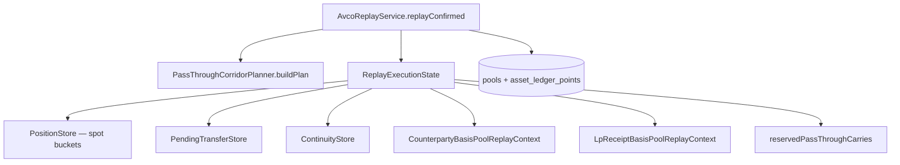

# Cost Basis — Basis Pools and Carry

> **Last updated:** 2026-06-05  
> **Pipeline stage:** `ACCOUNTING_REPLAY`

Beyond per-wallet spot buckets, replay maintains **auxiliary basis books** and **continuity carry** paths so pooled inventory does not corrupt proved corridors.

## Architecture



## Spot position buckets

Key: `AssetKey(walletAddress, networkId, accountingAssetIdentity)`  
State: `PositionState` — quantity, totalCostBasisUsd, perWalletAvco, uncoveredQuantity, realised PnL, gas.

Exact-asset identity at rest; **family continuity** applied at carry match time via `AccountingAssetFamilySupport`.

## Counterparty basis pools (ADR-015)

**Service:** `CounterpartyBasisPoolService`  
**Context:** `CounterpartyBasisPoolReplayContext`  
**Hook:** `CounterpartyBasisPoolReplayHook`  
**Collection:** `counterparty_basis_pools`

Tracks basis deposited to / withdrawn from named counterparties (LP pools, protocol vaults, routers):

```text
Key = CounterpartyBasisPoolKey(universeId, counterpartyAddress, assetFamily)
```

| Operation | When |
|-----------|------|
| Push | Outbound principal to tracked counterparty (`shouldTrackFlow`) |
| Pop | Inbound return from same counterparty pool |

Used for LP receipt routing and protocol custody where wallet-level AVCO alone loses per-venue composition.

## LP receipt basis pools

**Service:** `LpReceiptBasisPoolService`  
**Handler:** `LpReceiptEntryReplayHandler`, `LpReceiptExitReplayHandler`, `PositionScopedLpExitReplayHandler`  
**Collection:** `lp_receipt_basis_pools`

Per-position multi-asset buckets for:

- `lp-position:<network>:<protocol>:<tokenId>` (Uniswap V3/V4 CL)
- `pendle-lp:<network>:<market>` (Pendle)

**Entry routing:** `LpReceiptEntryReplayHandler.hasOnlyOutboundPrincipalFlows()` uses net-by-asset aggregation — refunds in same tx still route to receipt pool when net outbound.

**Exit attribution (ADR-022):** Each returned asset draws basis from its own pool; cross-pool carry only for one-sided (out-of-range) exits.

## Pending transfer and bridge carry

**Handler:** `TransferReplayHandler`  
**Stores:** `PendingTransferStore`, `ContinuityStore`  
**Classifier:** `ReplayTransferClassifier`  
**Keys:** `ReplayPendingTransferKeyFactory`

### Same-family correlated carry

Requirements:

- Matching `correlationId`
- `continuityCandidate = true`
- Unique candidate fit within tolerance
- Same accounting family

### Inbound-first ordering

When `BRIDGE_IN` / `CARRY_IN` arrives before source:

1. Inbound materializes quantity immediately (uncovered until carry attaches)
2. Later source attaches basis without reminting quantity
3. End-of-replay synthetic backfill is invalid

### Late bridge carry (ADR-020)

`attachLateBridgeCarryToPendingInbound` must also activate pre-built pass-through reservation via `reservePassThroughCarry`.

## Pass-through corridors (ADR-019)

**Planner:** `PassThroughCorridorPlanner`  
**Plan model:** `PassThroughCorridorPlan`, `PassThroughCorridor`  
**Consumer:** `takeReservedCarry` on downstream deposit legs

Isolates carried basis from pooled inventory between proved inbound and deterministic outbound:

| Approved slice | Pattern |
|----------------|---------|
| Custodial transit | on-chain → `BYBIT:<uid>` → on-chain |
| Immediate custody | `BRIDGE_IN` → `LENDING_DEPOSIT` / `VAULT_DEPOSIT` / `LP_ENTRY` / … |

Restrictions:

- Exact-bucket reservation only
- Discarded if intervening principal-affecting row mixes bucket
- Ambiguous uniqueness → no reservation
- Wallet-scoped inbound must match outbound `networkId` (P0-b guard)

## Asset-changing bridge settlement

When `BRIDGE_OUT(sourceAsset) → BRIDGE_IN(destAsset)` is linked but `continuityCandidate = false`:

- Source disposal as route-settlement REALLOCATE_OUT
- Destination restore with source carried basis
- Covered share ratio: `coveredSourceQty / totalSourceQty`
- No synthetic source PnL in conservative repair slice

## Bybit-specific carry

| Pattern | Handler | Notes |
|---------|---------|-------|
| Venue internal earn | `BybitVenueInternalReplayHandler` | `bybit-earn-principal-v1:*` |
| Corridor CARRY | `TransferReplayHandler` | ADR-019 rate rule |
| Corridor orphan IN | Generic ACQUIRE | No on-chain CARRY_OUT exists |
| Self-transfer collapse | `BybitStreamAuthorityCollapser` | Skipped in dispatcher |

## Family-equivalent custody

**Handler:** `FamilyEquivalentCustodyReplayHandler`  
**Router:** `ReplayTransactionRouter` → `FAMILY_EQUIVALENT_CUSTODY`

Atomic carry pair for one outbound + one inbound principal in same audited family (e.g. Aave ETH ↔ aToken), including inbound-first ordering.

## Continuity families (audit)

| Family | Includes (examples) |
|--------|----------------------|
| `ETH` | ETH, WETH, aEthWETH, vbETH, mETH, cmETH, … |
| `USDC` | USDC + audited stable wrappers |
| Staked ETH on timeline | ETH, WETH, STETH, WSTETH, CMETH, … (ADR-017) |

LP receipt symbols excluded from ETH family rollup denominators.

## Rules by transaction type

Carry / pool routing per type:

| Type | Pool / carry path |
|------|-------------------|
| `LP_ENTRY` | `LpReceiptEntryReplayHandler` → receipt pool if net outbound principal |
| `LP_EXIT` / `LP_EXIT_PARTIAL` / `LP_EXIT_FINAL` | Per-asset pool pop; position-scoped for CL |
| `LP_FEE_CLAIM` (harvest-only) | No pool drain; reward side only |
| `BRIDGE_IN` | Pending bridge carry + optional pass-through reservation |
| `BRIDGE_OUT` | Bridge-specific carry matcher |
| `INTERNAL_TRANSFER` | Same-tx CARRY; `transfer_links` semantics |
| `EXTERNAL_TRANSFER_*` + correlation | Pending transfer queue |
| `LENDING_DEPOSIT` | REALLOCATE; may `takeReservedCarry` from bridge |
| `LENDING_WITHDRAW` | REALLOCATE restore |
| `VAULT_DEPOSIT` / `VAULT_WITHDRAW` | Same |
| `PROTOCOL_CUSTODY_*` | Counterparty pool push/pop |
| `STAKING_DEPOSIT` / `WITHDRAW` | `LiquidStakingReplayHandler` carry |
| `LP_ENTRY_REQUEST` / `SETTLEMENT` | `GmxLpEntryReplayHandler` escrow |
| `LP_EXIT_REQUEST` / `SETTLEMENT` | `GenericAsyncLifecycleReplayHandler` |
| `DEX_ORDER_*` | `AsyncSpotOrderReplayHandler` open bucket |
| `WRAP` / `UNWRAP` | Family-equivalent atomic carry |
| `SWAP` | No carry — pooled AVCO consumption |
| `BORROW` / `REPAY` | Liability book, not counterparty pool |
| Bybit corridor | Pass-through or CARRY per ADR-019/020 |
