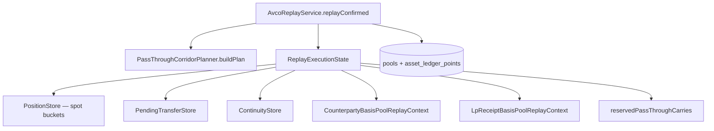

# Cost Basis — Basis Pools and Carry

> **Last updated:** 2026-07-16  
> **Pipeline stage:** `ACCOUNTING_REPLAY`

Beyond per-wallet spot buckets, replay maintains **auxiliary basis books** and **continuity carry** paths so pooled inventory does not corrupt proved corridors.

## Architecture



## Spot position buckets

Key: `AssetKey(walletAddress, networkId, accountingAssetIdentity)`  
State: `PositionState` — quantity, totalCostBasisUsd, perWalletAvco, uncoveredQuantity, realised PnL, gas.

Exact-asset identity at rest; **canonical-token identity** (ADR-054 C1/C2 registry via
`AccountingAssetClassificationSupport`) governs carry-vs-realize at match time. Family continuity
(`AccountingAssetFamilySupport`) keys read-model rollup; C2 staked derivatives no longer roll into
`FAMILY:ETH` (ADR-045 amendment).

### C1 / C2 carry boundary (ADR-054, amended by ADR-083)

| Class | Examples | Identity | Move between classes |
|---|---|---|---|
| **C1** — same underlying, 1:1 fixed rate | ETH, WETH, Aave `a*WETH`, VBETH; WBTC, `a*WBTC` | underlying family (`FAMILY:ETH`, `FAMILY:BTC`, …) | REALLOCATE, no P&amp;L |
| **C2** — distinct market asset | STETH, WSTETH, CMETH, WEETH, EWETH, YVVBETH; sAVAX, BBSOL | own per-token family (`FAMILY:CMETH`, …) | **Intra-cluster** (same staking cluster) → **cluster-carry** REALLOCATE, no P&amp;L (ADR-083). **Cluster↔non-cluster / cross-cluster** → DISPOSE + ACQUIRE at market, realize P&amp;L |
| **Same-token custody** (both classes) | cmETH CEX→wallet corridor, C2 bridge | unchanged | REALLOCATE, no P&amp;L |

### Staking-cluster carry (ADR-083)

Beyond the C1/C2 identity boundary, replay groups staking assets into **clusters**
(`CLUSTER:ETH_STAKING`, `CLUSTER:SOL_STAKING`, `CLUSTER:AVAX_STAKING`) via a single
`FAMILY→CLUSTER` table in `AccountingAssetClassificationSupport` (resolution is contract-first through
`stakingClusterForFlow`, with a supplemental symbol map for members whose family is a raw mint/contract
— mSOL/vSOL/bSOL/jitoSOL, PT-cmETH/PT-ETH, aAvaSAVAX). A conversion whose **every** principal leg
resolves to the **same non-null cluster** and touches **no** non-cluster principal
(`isIntraClusterConversion`) is a **cluster-carry**: it carries the disposed basis onto the acquired
leg on **both** lanes with **realized PnL = 0** (ETH↔mETH, AVAX↔sAVAX, SOL↔mSOL, cmETH↔PT-cmETH,
yvVBETH↔vBETH, and the degenerate same-family METH↔CMETH). It reuses the REALLOCATE engine via the
`CLUSTER_CARRY` route (formerly `LIQUID_STAKING`), extended to `STAKING_*`/`VAULT_*` and cross-canonical
intra-cluster `SWAP`. Realization is reserved for **exits to a non-cluster asset** (USDT/fiat/BTC/other)
and **cross-cluster** moves; unmapped instruments (e.g. GMX GM ETH/USD) resolve to a null cluster and
realize (fail-safe). See ADR-083.

## Counterparty basis pools (ADR-015)

**Service:** `CounterpartyBasisPoolService`  
**Context:** `CounterpartyBasisPoolReplayContext`  
**Hook:** `CounterpartyBasisPoolReplayHook`  
**Collection:** `counterparty_basis_pools`

Tracks basis deposited to / withdrawn from named counterparties (LP pools, protocol vaults, routers):

```text
Key = CounterpartyBasisPoolKey(universeId, counterpartyAddress, assetFamily)
```

| Operation | When |
|-----------|------|
| Push | Outbound principal to tracked counterparty (`shouldTrackFlow`) |
| Pop | Inbound return from same counterparty pool |

Used for LP receipt routing and protocol custody where wallet-level AVCO alone loses per-venue composition.

## LP receipt basis pools

**Service:** `LpReceiptBasisPoolService`  
**Handler:** `LpReceiptEntryReplayHandler`, `LpReceiptExitReplayHandler`, `PositionScopedLpExitReplayHandler`  
**Collection:** `lp_receipt_basis_pools`

Per-position multi-asset buckets for:

- `lp-position:<network>:<nfpmContractLowercased>:<tokenId>` (Uniswap V3/V4 CL and same-interface forks)
- `lp-position:solana:meteora-dlmm:<positionPda>` (Solana Meteora DLMM NFT positions, RC-S-LP / ADR-063)
- `lp-position:solana:meteora-damm:<poolAddress>:<walletLower>` (Solana Meteora DAMM / MLP fungible receipt, ADR-081)
- `pendle-lp:<network>:<marketOrSyAddress>:<walletLower>` (Pendle, per market + per wallet — ADR-081, supersedes the ADR-023 D3 symbol-only key)

**LP receipts are non-priced (ADR-081):** the LP receipt token itself (`PENDLE-LPT`,
`eqbPENDLE-LPT`/`pnpPENDLE-LPT` staked wrappers, Meteora `MLP`, CL `LP-RECEIPT:*`) resolves to the
`FAMILY:LP_RECEIPT` continuity identity and is **never priced or disposed as inventory**. Its economic
value lives in the underlying leg(s) and the `lp_receipt_basis_pools` bucket — carried on entry,
restored on exit — so a receipt movement (mint, farm stake/unstake, burn) is a **non-priced
`TRANSFER`** (never role `SELL`/`BUY`). A staked-wrapper exit closes the position **by link** when
`eqb<X>`/`pnp<X>` is mapped to the base `<X>` and both entry and wrapped exit resolve the **same**
market/pool key (ADR-081). Closure is anchored, secondarily, to an authoritative effective-family
on-chain zero (ADR-080), never to a bare wallet balance.

**Wrapped-exit drain vs. hidden+isolated (ADR-081, bounded limitation):** when a Pendle position is
staked into an Equilibria/Penpie wrapper and later closed by a `zapOutV3SingleToken`, the exit
transaction only exposes the **wrapper** leg (`eqb<X>`/`pnp<X>`) and never the base receipt contract.
Netting the base `PENDLE-LPT` quantity to exactly zero (a booked `−PENDLE-LPT` disposal) therefore
requires a deterministic **wrapper→base receipt-contract registry**, which is a separate follow-up.
Until then, any residual base `PENDLE-LPT` is **hidden and isolated**, not double-counted: it carries
`FAMILY:LP_RECEIPT`, so it is excluded from (1) the dashboard spot surface, (2) every priced
spot/family AVCO and covered-quantity aggregation, and therefore (3) the portfolio total value. Its
carried basis lives only in `lp_receipt_basis_pools` (there is no priced `FAMILY:LP_RECEIPT` page), so
there is no double count against the pool. `cmETH` is a **separate C1 family** (`FAMILY:METH`) and
keeps its ADR-047 LP-cost basis — it is never folded into `FAMILY:LP_RECEIPT` and never spikes.

**Solana Meteora DLMM position identity (RC-S-LP, ADR-063):** DLMM positions are NFT-based with no
fungible LP token minted to the wallet, so entry↔exit continuity cannot rely on a receipt-token
flow. `SolanaLpPositionResolver` keys the pool on the on-chain **position account (PDA)** — the
first account of the largest Meteora DLMM `addLiquidity*` / `removeLiquidity*` instruction in the
Helius payload. The same PDA appears on the entry and the exit, so the position never splits, and no
read-path RPC is required. Solana `LP_ENTRY` / `LP_EXIT` principal legs are normalized as
basis-carrying `TRANSFER`s (never market `BUY`/`SELL`) so this receipt-pool path can deposit and
restore the basis. Hawksight-wrapped shapes (LP principal custodied inside a Hawksight vault, not the
wallet) resolve to no position and instead ride the generic family-continuity bucket — a documented,
bounded limitation, never a fabricated per-position basis.

**TON native / jetton ledger points (RC-T1, ADR-064 / ADR-066):** TON native and jetton transfers
become ordinary basis-affecting ledger points once RC-T1 fixes canonical address equality. An
`EXTERNAL_TRANSFER_IN` from an unknown-external peer books an ACQUIRE at market; an
`EXTERNAL_TRANSFER_OUT` books a DISPOSE; an own↔own move is promoted to `INTERNAL_TRANSFER` and
carries basis (no phantom disposal/acquisition). A CEX (e.g. Bybit) inbound/outbound is **not** an
external-capital market event — its `counterpartyType=CEX` routes it through the cross-system pool,
not a basis reset. Jetton quantities use the resolved decimals (USDT-TON = 6, not the native 9), so
the ledger quantity reconciles with on-chain balances. **Counterparty as a stat prerequisite:** a
TON row cannot enter confirmed replay until `TonCounterpartyResolver` sets `counterpartyType` on the
transaction and every non-fee flow (`STAT_COUNTERPARTY_TYPE_MISSING` / `FLOW_COUNTERPARTY_MISSING`
otherwise keep it `NEEDS_REVIEW`). A row that dropped real on-chain value (fee-only flow +
`TON_ONCHAIN_UNRESOLVED_VALUE`) stays `NEEDS_REVIEW` per RC-T2 (ADR-014 §D11) rather than confirming
empty.

**Pool identity is contract-keyed (RC-1, ADR-018):** the CL-NFT pool key embeds the
NonfungiblePositionManager **contract address** (`rawData.to`), not the protocol slug. This is
identical for the LP_ENTRY and LP_EXIT of one position, so the basis cannot split across two
pools when entry and exit are claimed by different classifiers (e.g. a generic `multicall` entry
vs a registry-classified exit on a Uniswap-V3 fork like PancakeSwap V3). The protocol slug is
display-only; an unrecognized NFPM is never silently labeled `uniswap`. The `LP-RECEIPT:` receipt
symbol is derived from this key, so it inherits the same contract identity.

**Staking-wrapper canonicalization (RC-5, ADR-018):** when the LP NFT is staked into a farming/gauge
wrapper (PancakeSwap MasterChefV3, Slipstream gauges), the wrapper custodies the NFT so wrapper-keyed
flows would form a *duplicate* `lp-position:<net>:<wrapper>:<tokenId>` pool. The wrapper is
canonicalized to its underlying NFPM via the data-driven `underlyingPositionManager` registry mapping
(`LpStakingWrapperResolver`), so staked ENTRY/FEE_CLAIM/EXIT collapse into the single
`lp-position:<net>:<NFPM>:<tokenId>` pool and the trapped basis flows back. Distinct NFPM positions
that share a numeric tokenId stay separate.

**Uniswap V4 identity (RC-6, ADR-018):** V4 `modifyLiquidities` uses the same full-PositionManager +
tokenId key. A new-mint (tokenId assigned on-chain, only in the ERC-721 mint log) is routed to
receipt clarification rather than a truncated-contract aggregate, so entry and exit share one pool
and exits never fabricate `UNKNOWN` basis.

**Entry routing:** `LpReceiptEntryReplayHandler.hasOnlyOutboundPrincipalFlows()` nets principal flows
**by continuity family** (`AccountingAssetFamilySupport.continuityIdentity`) with a **USD dust
tolerance** — refunds in the same tx (including sibling-token dust) still route to the receipt pool
when the deposit family stays net outbound.

### Single-token CL zap-in entries

Concentrated-liquidity "zap-in" entries mint the position from **one** deposited token (e.g. native
ETH) while the router refunds **dust** of the two pool tokens in the same transaction (e.g. vbETH ≈
`6.57e-16`, vbUSDC ≈ `0.000002`). Raw-symbol netting wrongly saw those dust legs as net-positive
principal and rejected the receipt-pool path, leaking the deposit basis into the generic
continuity bucket (the paired exit then fell back to `UNKNOWN` / fresh market ACQUIRE).

The routing gate nets **per continuity family** and applies a **materiality gate**:

- Net **quantity** and net **USD** are aggregated per `continuityIdentity(assetSymbol, assetContract)`,
  so vbETH collapses into `FAMILY:ETH` with the native-ETH deposit and that family stays net-outbound.
- A net-**positive** family is **dust** (non-disqualifying) when either its net inbound USD is below
  `max($1.00, 1% × totalOutboundUsd)`, or — when unpriced — its net inbound quantity is below
  `1e-6 × maxOutboundQty` (largest net-outbound quantity across families).
- At least one **material** net-outbound family must exist (a real deposit). Any **material**
  net-positive family still returns `false`, preserving Curve/Balancer rejection where the pool
  returns a materially different asset.

Once the entry routes to the receipt pool (keyed `FAMILY:ETH`), the existing exit-side
`restoreInboundFromLpReceiptPool` carries the basis onto the returned vbETH with no exit-side change.

**Exit attribution (ADR-022):** Each returned asset draws basis from its own pool; cross-pool carry only for one-sided (out-of-range) exits. With contract-keyed identity unifying the pool, a one-sided ETH exit restores the combined ETH+USDC receipt-pool basis onto the returned ETH (no new exit code), and the USDC leg drains to 0 with no fabricated separate USDC ACQUIRE.

## Compounding LP/vault receipts: fee accrual carried in principal

> **Convention (ADR-040 dual-lane; verified 2026-07-22, snapshot 12,384 ledger points / 163 pools).**
> For **compounding** receipt families — Pendle PT/LP, GMX GM/GLV, Katana `vbETH` vaults, and
> Aura/Balancer boosted pools — swap-fee and vault yield accrual is **carried inside the principal
> receipt** and realized only through AVCO when the returned principal is later sold. It is **not**
> split into a separate fee-income leg at exit. Only **explicit reward-token emissions** are separable
> **zero-cost income**. This is intentional and correct — not a bundling bug.

### Why compounding differs from V3/Slipstream/V4

The exit-time fee split (see [Exit attribution](#exit-attribution-adr-022) and R1/R4 of
`docs/tasks/lp-exit-fee-and-rebalancing-implementation-plan.md`) applies to venues that expose an
**explicit fee amount** at exit:

| Venue class | Fee signal at exit | Treatment |
|---|---|---|
| Uniswap/Pancake **V3**, Slipstream (Velodrome/Aerodrome) | `Collect.amount − DecreaseLiquidity.amount` (V3 events) | Split principal vs fee; fee booked as **zero-cost income**, principal carried (Option B) |
| Uniswap **V4** / Pancake Infinity CL | principal derived from `liquidityDelta`+`sqrtPrice`; `fee = received − principal` | Same split (R4) |
| **Compounding** (Pendle PT/LP, GMX GM/GLV, Katana `vbETH`, Aura/Balancer boosted) | **none** — fees are auto-reinvested into the receipt's redemption value | **No split.** Accrual rides in the principal receipt; realized via AVCO on later disposal |

Compounding receipts have no `Collect`-equivalent because the protocol folds accrued swap fees (and,
for Balancer V3 boosted pools, underlying Aave lending yield on ERC-4626 stata stables) back into the
receipt token's value. There is no observable per-exit fee amount to peel off, and manufacturing one
would fabricate income and strand principal basis. The economically correct result — that accrued
value is taxed/realized when the position is finally sold — is delivered automatically by AVCO because
the entry basis carries forward on the returned principal (`REALLOCATE`, no P&L at exit).

### What *is* separable: explicit reward tokens

Distinct reward-token emissions (e.g. `PENDLE`, and per-claim vault fee legs) are genuine income and
**are already booked zero-cost** — `basisEffect = ACQUIRE`, `netCostBasisDeltaUsd = 0`, Market
(ADR-040 gross lane) basis = FMV — as `REWARD_CLAIM` / `LP_FEE_CLAIM`, never as a disposal and never as
market-net income. Because they add quantity at $0 in the Net lane, they push **Net AVCO below Market
AVCO** exactly as ADR-040 §"Why Net ≠ Tax for reward-bearing families" requires.

### Verified state (2026-07-22)

- **GMX GM/GLV** (`gmx-lp:arbitrum:weth-usdc`, `…:glv-weth-usdc`): **0** zero-net `ACQUIRE` income legs.
  All principal legs are `REALLOCATE_IN/OUT` through the async escrow lifecycle
  (`LP_ENTRY_REQUEST/SETTLEMENT`, `LP_EXIT_REQUEST/SETTLEMENT`); fee accrual is entirely inside the GM/GLV
  receipt value. Pure compounding, no separable reward token in this wallet.
- **Pendle** (`pendle-lp:mantle:pendle-lpt:…`): principal `cmETH` is carried out on entry and restored on
  exit with the Net discount conserved (entry `REALLOCATE_OUT` net −$3,016.32 = exit `REALLOCATE_IN` net
  +$3,016.32 for the `0x1a87…` wallet); `PENDLE` reward and residual `cmETH` accrual are `ACQUIRE` at
  `netCostBasisDeltaUsd = 0`. Receipt pools drain to `qtyHeld = basisHeldUsd = netBasisHeldUsd = 0`.
- **Katana `vbETH`** (`lp-position:katana:0x2659c6…:36201`): the ETH deposit basis is carried onto the
  returned `vbETH` principal — `LP_EXIT REALLOCATE_IN` **$2,036.930603 Market / $2,036.890814 Net** —
  with the vault accrual booked as separable zero-cost income (`LP_EXIT` `vbETH ACQUIRE` **+$83.4797
  Market / $0 Net**, plus $68.43 Market / $0 Net across the position's `LP_FEE_CLAIM` legs). Total exit
  `vbETH` Market basis **$2,120.92**. The Net lane is exactly conserved (entry ETH net −$2,036.890814 =
  exit `vbETH` net +$2,036.890814). The earlier acceptance figure **$1,705.995 is stale** (the underlying
  ETH deposit AVCO changed between DB states) — the reproducible current figures above supersede it.

No compounding position exhibits the D1 (rebalancing surplus mis-booked as zero-net market `ACQUIRE`)
or D2 (Net-lane basis destroyed instead of carried on a closed position) patterns tracked for
V3/Slipstream/V4 in `results/lp-exit-fee-verification-audit.md`: the only zero-net `ACQUIRE` legs on
these families are genuine reward/vault-accrual income, and the real-asset Net lane is conserved on the
returned principal.

## Pending transfer and bridge carry

**Handler:** `TransferReplayHandler`  
**Stores:** `PendingTransferStore`, `ContinuityStore`  
**Classifier:** `ReplayTransferClassifier`  
**Keys:** `ReplayPendingTransferKeyFactory`

### Same-family correlated carry

Requirements:

- Matching `correlationId`
- `continuityCandidate = true`
- Unique candidate fit within tolerance
- Same accounting family

### Inbound-first ordering

When `BRIDGE_IN` / `CARRY_IN` arrives before source:

1. Inbound materializes quantity immediately (uncovered until carry attaches)
2. Later source attaches basis without reminting quantity
3. End-of-replay synthetic backfill is invalid

### Late bridge carry (ADR-020)

`attachLateBridgeCarryToPendingInbound` must also activate pre-built pass-through reservation via `reservePassThroughCarry`.

### Bridge `CARRY_IN` with empty source must never settle at avco $0 (RC-7)

A bridge `CARRY_IN` whose source bucket is empty (the `BRIDGE_OUT` carry covered $0) lands the inbound
quantity **uncovered**. The inbound-shortfall fallback (`applyInboundShortfallSpotFallback`, F-5(a))
must then either (a) promote the uncovered quantity with a **cross-network market-at-timestamp quote**
(ETH is cross-network priceable on ETH-native chains incl. LINEA via
`ReplayMarketAuthority.resolveCanonicalCrossNetwork` / `findCanonicalQuote`), or (b) leave it
**uncovered + incomplete-history (PENDING)** with a `REPLAY_INBOUND_UNRESOLVED_CANONICAL … route=PENDING`
signal. It must **never** fabricate covered basis at $0. This extends RC-3's PENDING route (previously
only on the `materializePendingInbound` path) to the bridge `CARRY_IN` restore path; there is no double
application with F-5(a) because only the still-uncovered quantity is promoted.

## Pass-through corridors (ADR-019)

**Planner:** `PassThroughCorridorPlanner`  
**Plan model:** `PassThroughCorridorPlan`, `PassThroughCorridor`  
**Consumer:** `takeReservedCarry` on downstream deposit legs

Isolates carried basis from pooled inventory between proved inbound and deterministic outbound:

| Approved slice | Pattern |
|----------------|---------|
| Custodial transit | on-chain → `BYBIT:<uid>` → on-chain |
| Immediate custody | `BRIDGE_IN` → `LENDING_DEPOSIT` / `VAULT_DEPOSIT` / `LP_ENTRY` / … |

Restrictions:

- Exact-bucket reservation only
- Discarded if intervening principal-affecting row mixes bucket
- Ambiguous uniqueness → no reservation
- Wallet-scoped inbound must match outbound `networkId` (P0-b guard). This guard governs the
  **pass-through** path only (a `BRIDGE_IN` funding a same-network downstream deposit) and is left
  intact.

> **Cross-network LiFi corridor carry (RC-2, ADR-020 amendment).** The `BRIDGE_OUT → BRIDGE_IN`
> continuity carry is a *separate* path from pass-through. Its key
> (`ReplayPendingTransferKeyFactory.bridgeTransferKey` → `bridge:<correlationId>:<family>` /
> `bridge:lifi:<outHash>:<family>`) is already network-agnostic, so a cross-network LiFi corridor
> inherits the source carried AVCO once linking stamps the shared `bridge:lifi:<outHash>`
> correlation, `continuityCandidate=true`, and the `LINKED:<outHash>` / `counterpartyType=BRIDGE`
> inbound (RC-4). The P0-b guard does **not** need to be relaxed for this.

## Asset-changing bridge settlement

When `BRIDGE_OUT(sourceAsset) → BRIDGE_IN(destAsset)` is linked but `continuityCandidate = false`:

- Source disposal as route-settlement REALLOCATE_OUT
- Destination restore with source carried basis
- Covered share ratio: `coveredSourceQty / totalSourceQty`
- No synthetic source PnL in conservative repair slice

## Bybit-specific carry

| Pattern | Handler | Notes |
|---------|---------|-------|
| Venue internal earn | `BybitVenueInternalReplayHandler` | `bybit-earn-principal-v1:*` |
| Corridor CARRY | `TransferReplayHandler` | ADR-019 rate rule |
| Corridor orphan IN | Generic ACQUIRE | No on-chain CARRY_OUT exists |
| Self-transfer collapse | `BybitStreamAuthorityCollapser` | Skipped in dispatcher |

### C-1: stream-collapse must preserve carried basis

When `BybitStreamAuthorityCollapser` collapses the duplicated FUND→UTA internal-transfer
streams into a single canonical pair, **both** surviving legs must remain on the same
`corr-family` continuity queue so the existing inherit-once `PendingTransferStore` carries
basis across the collapse. The collapser's `enforceCollapsedUtFundPairSymmetry` is
**bidirectional**: whichever side (FUND-outbound debit *or* UTA-inbound credit) is left without
an active leg has its canonical excluded leg restored, guaranteeing exactly one active debit and
one active credit. This prevents a one-sided survivor (e.g. the seq816 `−0.148 ETH` CARRY_OUT
with no consuming CARRY_IN) from dropping carried basis.

Carry is pinned to the **replay layer** via the shared queue — never inject a synthetic basis
credit at collapse time (double-credit risk). Quantity is conserved: carried-in qty == carried-out
qty, with no inventory inflation.

## Family-equivalent custody

**Handler:** `FamilyEquivalentCustodyReplayHandler`  
**Router:** `ReplayTransactionRouter` → `FAMILY_EQUIVALENT_CUSTODY`

Atomic carry pair for one outbound + one inbound principal in same audited family (e.g. Aave ETH ↔ aToken), including inbound-first ordering.

## Read-model: CARRY corridors folded into the blended effective-cost series (RM-1, ADR-062)

> **Read-model / series only — no ledger, replay, AVCO, pricing, or linking change.**

The ETH-family **effective-cost** time series (ADR-062) divides the cumulative attributed offset by the
**blended** ETH-equivalent covered denominator that `BlendedExposureAvcoSeriesBuilder` reconstructs from
the family superset. Originally only `REALLOCATE_*` corridors (LP / receipt) were re-folded into that
denominator, so when ETH was parked out of the liquid pool via a **CARRY** corridor — a cross-wallet /
cross-chain internal transfer, a bridge-out, or `LENDING_LOOP_OPEN` collateral — the blended covered
quantity collapsed to a sliver between the two legs while the attributed offset stayed whole, flooring
`max(marketBasis − offset, 0)` to a false **$0** until the matching `CARRY_IN` snapped it back.

RM-1 folds **same-family `CARRY_OUT`/`CARRY_IN`** into the blended denominator exactly as `REALLOCATE`
is folded (this is a series read-model reconstruction; the ledger CARRY semantics above are unchanged):

- `CARRY_OUT` parks its covered qty + market/net basis; the matching `CARRY_IN` closes it. The park key
  is the `correlationId` when present (`lending-loop:{openTxHash}`, `bridge:*`, LP `lp:*`) or the
  `lifecycleChainId` for a bare internal transfer with no correlation, so both legs share one key.
- The **C2 guard** still excludes wstETH/weETH/cmETH (own families, ADR-054) from the blended
  `FAMILY:ETH` pool whether they arrive as REALLOCATE or CARRY.
- The **B-ETH-06 terminal clamp** is retained: a CARRY corridor with no matching return and no open
  family-origin `lp_receipt_basis_pools` row (genuine bridge leak / dropped transfer) closes to zero at
  terminal; a still-open lending-loop corridor keeps its basis-conserving residual (B-ETH-02).
- Aave aTokens (`AARBWETH/AMANWETH/ALINWETH/AZKSWETH/AWETH`) are already `FAMILY:ETH` C1 members, so
  they are already in the spot lane / series denominator (RM-2 consistency guard — no aToken fold path);
  RM-1 restores CARRY-parked collateral so the series terminal reconciles with the scalar header
  break-even.

A companion guard (RM-3, `AssetLedgerChartService.isOverSliverArtifact`) fails **closed** on any
sliver-denominated point in **both** directions — the offset spike and the floor-to-$0 side both render
"—" (UNAVAILABLE) — while a healthy (non-sliver) denominator keeps a genuine $0 banked-locked-surplus
floor. See ADR-062 (amendment 2026-07-24).

> **Held-reward-income amendment (2026-07-24, ADR-062).** The effective-cost **numerator** above is no
> longer the Market-lane basis. Under `offsetLane=NET` the numerator is the **Net-lane** held basis
> (`chooseLaneAvco(NET, marketAvco, netAvco) × coveredQty`), so `effectiveBasis = netBasis − netRealized`.
> This credits zero-cost income that is **received and still held** (staking rewards, airdrops, LP-fee /
> lending-interest claims never sold) — which lowers the Net basis but generates no realized P&L — not
> just realized income. Rewards therefore reduce effective cost even while held. Example: a staked
> derivative acquired almost entirely from reward claims (`FAMILY:SAVAX`) drops from a market-lane
> $11.96/unit to its true ≈$0.53/unit (Net AVCO). Borrowed/liability-backed inflows carry net≡market
> basis and are **not** credited as free. The header scalar and this series use the same net numerator
> (four consumers of `BreakEvenCalculator.compute` / the series), reconciled by the terminal tests.

## Continuity families (audit)

| Family | Includes (examples) |
|--------|----------------------|
| `ETH` (C1 spot) | ETH, WETH, aEthWETH, vbETH — 1:1 fixed-rate ETH |
| `USDC` | USDC + audited stable wrappers |

LP receipt symbols excluded from ETH family rollup denominators.

> **Staked/derivative ETH is no longer on the ETH family chart (ADR-054, supersedes ADR-017).** The old
> "Staked ETH on timeline" rollup (which folded STETH, WSTETH, CMETH, mETH … into the ETH timeline) is
> superseded: C2 staked/derivative ETH is a distinct market asset with its **own** per-token family
> (`FAMILY:CMETH`, `FAMILY:WSTETH`, …) and per-asset AVCO pool. C2 symbols are excluded from the
> `FAMILY:ETH` spot-family chart denominators (ADR-045 amendment). See the [C1 / C2 carry boundary](#c1--c2-carry-boundary-adr-054)
> table above.

## Corridor basis conservation guard (G-1)

`CorridorBasisConservationGuard` is an **observability** check (WARN-only) that flags a leftover
CARRY_OUT in a continuity corridor that never found a consuming CARRY_IN. Its scope is
**corridor-level**, not symbol-level: because every guarded queue key is already asset-specific,
naive "same-symbol" filtering is a no-op.

The guard **suppresses** a residual only when the corridor is a legitimate transformation rather
than a dropped carry:

- **Cross-asset corridor swap** — the corridor's matched destination leg is a *different*
  asset/family (e.g. `USDE→USDT`, a CAKE swap). The leftover source CARRY_OUT is expected because
  the asset changed; the destination is restored with carried basis under the asset-changing
  settlement path, so ledger basis is still conserved (no masked loss).
- **Out-of-scope family** — the residual's family is an explicitly unsupported family
  (`OutOfScopeFamilySupport`, e.g. SOL/TON). These never participate in same-asset carry.

A **same-asset** destination whose credit took spot/$0 is still flagged (genuine orphan).

**Decision — guard-filter vs source-disposal:** we keep the guard as a scope-tuned *filter* rather
than re-modelling every cross-asset corridor source leg as a hard DISPOSAL upstream. Rationale: the
asset-changing settlement path already realizes/reallocates the source correctly, so a source
disposal would duplicate that logic and risk double-realization; the guard only needs to stop
*over-counting* legitimate swaps as orphans while preserving the genuine-orphan signal. The filter
is observability-only and never alters basis computation on the ledger.

## Rules by transaction type

Carry / pool routing per type:

| Type | Pool / carry path |
|------|-------------------|
| `LP_ENTRY` | `LpReceiptEntryReplayHandler` → receipt pool if net outbound principal |
| `LP_EXIT` / `LP_EXIT_PARTIAL` / `LP_EXIT_FINAL` | Per-asset pool pop; position-scoped for CL |
| `LP_FEE_CLAIM` (harvest-only) | No pool drain; reward side only |
| `BRIDGE_IN` | Pending bridge carry + optional pass-through reservation |
| `BRIDGE_OUT` | Bridge-specific carry matcher |
| `INTERNAL_TRANSFER` | Same-tx CARRY; `transfer_links` semantics |
| `EXTERNAL_TRANSFER_*` + correlation | Pending transfer queue |
| `LENDING_DEPOSIT` | REALLOCATE; may `takeReservedCarry` from bridge |
| `LENDING_WITHDRAW` | REALLOCATE restore |
| `VAULT_DEPOSIT` / `VAULT_WITHDRAW` | Same; **intra-cluster** identity change → `CLUSTER_CARRY` REALLOCATE, PnL=0 (ADR-083, e.g. yvVBETH↔vBETH) |
| `PROTOCOL_CUSTODY_*` | Counterparty pool push/pop |
| `STAKING_DEPOSIT` / `WITHDRAW` | **Intra-cluster (ADR-083):** `LiquidStakingReplayHandler` via `CLUSTER_CARRY` — REALLOCATE both lanes, PnL=0 (incl. cross-family same-cluster ETH↔mETH, AVAX↔sAVAX). **Cluster↔non-cluster / cross-cluster:** generic swap path — realize P&amp;L at market (ADR-054) |
| `LP_ENTRY_REQUEST` / `SETTLEMENT` | `GmxLpEntryReplayHandler` escrow |
| `LP_EXIT_REQUEST` / `SETTLEMENT` | `GenericAsyncLifecycleReplayHandler` |
| `DEX_ORDER_*` | `AsyncSpotOrderReplayHandler` open bucket |
| `WRAP` / `UNWRAP` | Family-equivalent atomic carry |
| `SWAP` | No carry — pooled AVCO consumption. **Exception (ADR-083):** a genuinely cross-canonical **intra-cluster** SWAP (e.g. cmETH↔ETH, SOL↔mSOL) routes to `CLUSTER_CARRY` (REALLOCATE, PnL=0); same-canonical WETH↔ETH stays family-equivalent |
| `BORROW` / `REPAY` | Liability book, not counterparty pool |
| Bybit corridor | Pass-through or CARRY per ADR-019/020 |

## WS-4: Sponsored-gas AVCO — null representation (read-model only)

### Problem

`SPONSORED_GAS_IN` and `REWARD_CLAIM` events that arrive after a position is fully drained
(or before any real acquisition on a new sub-wallet) record `avcoAfterUsd = 0` in
`asset_ledger_points`. This is replay-correct (no basis-backed quantity exists), but when
plotted on the asset-ledger chart it creates visual V-dips at 0 that mislead the viewer.

### Fix (representation only — zero replay impact)

`AssetLedgerQueryService.gasOnlyAvcoAfter` applies a presentation filter in the read path:

**Gate condition (all must hold):**
1. `basisBackedQuantityAfter < 1e-8` (essentially zero basis backing)
2. `normalizedType ∈ {SPONSORED_GAS_IN, REWARD_CLAIM}` OR `basisEffect = GAS_ONLY`

When the gate fires, `avcoAfterUsd` is returned as `null` (undefined) in `LedgerPointView`
instead of 0. The frontend must treat `null` as "AVCO unavailable" and not plot a 0 data point.

**Gate must NOT fire for:**
- `WRAP` / `UNWRAP` — they have `basisBackedQuantityAfter > 0` by design (real basis allocation)
- Any event with meaningful basis (e.g. `SPONSORED_GAS_IN` when position has non-zero basis)

**Zero conservation impact:** `asset_ledger_points` are NOT modified. `AvcoReplayService` is NOT
touched. This is purely a read-path presentation filter.

**Joint acceptance with WS-B (corridor carry):** WS-4 must not suppress AVCO at points that have
genuine basis from WS-B carry-through. The gate uses `basisBackedQuantityAfter` not `quantityAfter`,
so carry-created basis positions correctly satisfy `basisBackedQty > 1e-8` and bypass the gate.

## Dual-lane net-carry conservation (ADR-040 amendment, 2026-07-02)

ADR-040 introduced parallel Market and Net cost-basis lanes. The **net-carry conservation invariant** requires
that net basis travels with quantity on every IN leg — never silently re-seeded from the Market lane.

### Invariant

> For any closed intra-family round-trip (WRAP↔UNWRAP, spot↔receipt, REALLOCATE_IN↔OUT) on a single
> position key: `|Σ netCostBasisDelta| ≤ dust` — exactly as `Σ marketCostBasisDelta = 0` holds for Market.
> Net AVCO ≤ Market AVCO for every position. Net AVCO ≥ 0.
>
> **ADR-083 exception:** on a **cluster-carried lot** the `Net ≤ Market` cap may equalize or be
> exceeded by design — the cluster-carry writes basis via `restoreToPosition` (no `min(market)` clamp)
> so a down-conversion preserves the disposed basis rather than writing it down. Basis conservation
> (`|Σ netCostBasisDelta| ≤ dust`) still holds; only the per-position `Net ≤ Market` cap is relaxed on
> carried lots.

### Mechanism

The canonical seam is the **apply site**: `GenericFlowReplayEngine.restoreToPosition(CarryTransfer, position)`
credits both lanes independently from the carry (`carry.costBasisUsd()` → Tax, `carry.netCostBasisUsd()` →
Net). All IN-leg handlers route through this method. The 5-arg tax-only overload is retired from IN-leg use.

`CarryTransfer` net-less general constructors are deleted; every "known" carry must supply explicit net args.
`pendingInbound*(...)` factories retain `net=null→tax` (unknown until refine — correct for provisional
materialization). Source-less orphan CARRY_INs keep `net=tax` (no reward-discount evidence).

### Why Net ≠ Tax for reward-bearing families

When a family accrues rewards / LP fees booked at **$0 net** (e.g. `REWARD_CLAIM`, `LP_FEE_CLAIM`), the
acquisition adds quantity without adding to net cost → net basis grows slower than tax basis → Net AVCO sits
below Tax/Market AVCO. This discount is preserved by the net-carry transport invariant. Assets with no $0-net
acquisitions will correctly show Net ≈ Tax (e.g. LINK, DOGE).
