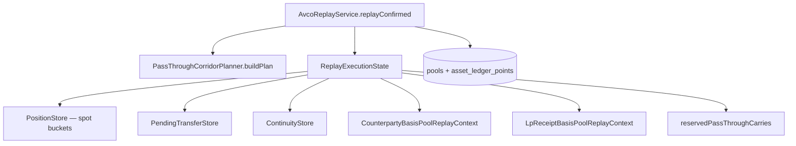

# Cost Basis — Basis Pools and Carry

> **Last updated:** 2026-06-05  
> **Pipeline stage:** `ACCOUNTING_REPLAY`

Beyond per-wallet spot buckets, replay maintains **auxiliary basis books** and **continuity carry** paths so pooled inventory does not corrupt proved corridors.

## Architecture



## Spot position buckets

Key: `AssetKey(walletAddress, networkId, accountingAssetIdentity)`  
State: `PositionState` — quantity, totalCostBasisUsd, perWalletAvco, uncoveredQuantity, realised PnL, gas.

Exact-asset identity at rest; **family continuity** applied at carry match time via `AccountingAssetFamilySupport`.

## Counterparty basis pools (ADR-015)

**Service:** `CounterpartyBasisPoolService`  
**Context:** `CounterpartyBasisPoolReplayContext`  
**Hook:** `CounterpartyBasisPoolReplayHook`  
**Collection:** `counterparty_basis_pools`

Tracks basis deposited to / withdrawn from named counterparties (LP pools, protocol vaults, routers):

```text
Key = CounterpartyBasisPoolKey(universeId, counterpartyAddress, assetFamily)
```

| Operation | When |
|-----------|------|
| Push | Outbound principal to tracked counterparty (`shouldTrackFlow`) |
| Pop | Inbound return from same counterparty pool |

Used for LP receipt routing and protocol custody where wallet-level AVCO alone loses per-venue composition.

## LP receipt basis pools

**Service:** `LpReceiptBasisPoolService`  
**Handler:** `LpReceiptEntryReplayHandler`, `LpReceiptExitReplayHandler`, `PositionScopedLpExitReplayHandler`  
**Collection:** `lp_receipt_basis_pools`

Per-position multi-asset buckets for:

- `lp-position:<network>:<nfpmContractLowercased>:<tokenId>` (Uniswap V3/V4 CL and same-interface forks)
- `pendle-lp:<network>:<market>` (Pendle)

**Pool identity is contract-keyed (RC-1, ADR-018):** the CL-NFT pool key embeds the
NonfungiblePositionManager **contract address** (`rawData.to`), not the protocol slug. This is
identical for the LP_ENTRY and LP_EXIT of one position, so the basis cannot split across two
pools when entry and exit are claimed by different classifiers (e.g. a generic `multicall` entry
vs a registry-classified exit on a Uniswap-V3 fork like PancakeSwap V3). The protocol slug is
display-only; an unrecognized NFPM is never silently labeled `uniswap`. The `LP-RECEIPT:` receipt
symbol is derived from this key, so it inherits the same contract identity.

**Staking-wrapper canonicalization (RC-5, ADR-018):** when the LP NFT is staked into a farming/gauge
wrapper (PancakeSwap MasterChefV3, Slipstream gauges), the wrapper custodies the NFT so wrapper-keyed
flows would form a *duplicate* `lp-position:<net>:<wrapper>:<tokenId>` pool. The wrapper is
canonicalized to its underlying NFPM via the data-driven `underlyingPositionManager` registry mapping
(`LpStakingWrapperResolver`), so staked ENTRY/FEE_CLAIM/EXIT collapse into the single
`lp-position:<net>:<NFPM>:<tokenId>` pool and the trapped basis flows back. Distinct NFPM positions
that share a numeric tokenId stay separate.

**Uniswap V4 identity (RC-6, ADR-018):** V4 `modifyLiquidities` uses the same full-PositionManager +
tokenId key. A new-mint (tokenId assigned on-chain, only in the ERC-721 mint log) is routed to
receipt clarification rather than a truncated-contract aggregate, so entry and exit share one pool
and exits never fabricate `UNKNOWN` basis.

**Entry routing:** `LpReceiptEntryReplayHandler.hasOnlyOutboundPrincipalFlows()` uses net-by-asset aggregation — refunds in same tx still route to receipt pool when net outbound.

**Exit attribution (ADR-022):** Each returned asset draws basis from its own pool; cross-pool carry only for one-sided (out-of-range) exits. With contract-keyed identity unifying the pool, a one-sided ETH exit restores the combined ETH+USDC receipt-pool basis onto the returned ETH (no new exit code), and the USDC leg drains to 0 with no fabricated separate USDC ACQUIRE.

## Pending transfer and bridge carry

**Handler:** `TransferReplayHandler`  
**Stores:** `PendingTransferStore`, `ContinuityStore`  
**Classifier:** `ReplayTransferClassifier`  
**Keys:** `ReplayPendingTransferKeyFactory`

### Same-family correlated carry

Requirements:

- Matching `correlationId`
- `continuityCandidate = true`
- Unique candidate fit within tolerance
- Same accounting family

### Inbound-first ordering

When `BRIDGE_IN` / `CARRY_IN` arrives before source:

1. Inbound materializes quantity immediately (uncovered until carry attaches)
2. Later source attaches basis without reminting quantity
3. End-of-replay synthetic backfill is invalid

### Late bridge carry (ADR-020)

`attachLateBridgeCarryToPendingInbound` must also activate pre-built pass-through reservation via `reservePassThroughCarry`.

### Bridge `CARRY_IN` with empty source must never settle at avco $0 (RC-7)

A bridge `CARRY_IN` whose source bucket is empty (the `BRIDGE_OUT` carry covered $0) lands the inbound
quantity **uncovered**. The inbound-shortfall fallback (`applyInboundShortfallSpotFallback`, F-5(a))
must then either (a) promote the uncovered quantity with a **cross-network market-at-timestamp quote**
(ETH is cross-network priceable on ETH-native chains incl. LINEA via
`ReplayMarketAuthority.resolveCanonicalCrossNetwork` / `findCanonicalQuote`), or (b) leave it
**uncovered + incomplete-history (PENDING)** with a `REPLAY_INBOUND_UNRESOLVED_CANONICAL … route=PENDING`
signal. It must **never** fabricate covered basis at $0. This extends RC-3's PENDING route (previously
only on the `materializePendingInbound` path) to the bridge `CARRY_IN` restore path; there is no double
application with F-5(a) because only the still-uncovered quantity is promoted.

## Pass-through corridors (ADR-019)

**Planner:** `PassThroughCorridorPlanner`  
**Plan model:** `PassThroughCorridorPlan`, `PassThroughCorridor`  
**Consumer:** `takeReservedCarry` on downstream deposit legs

Isolates carried basis from pooled inventory between proved inbound and deterministic outbound:

| Approved slice | Pattern |
|----------------|---------|
| Custodial transit | on-chain → `BYBIT:<uid>` → on-chain |
| Immediate custody | `BRIDGE_IN` → `LENDING_DEPOSIT` / `VAULT_DEPOSIT` / `LP_ENTRY` / … |

Restrictions:

- Exact-bucket reservation only
- Discarded if intervening principal-affecting row mixes bucket
- Ambiguous uniqueness → no reservation
- Wallet-scoped inbound must match outbound `networkId` (P0-b guard). This guard governs the
  **pass-through** path only (a `BRIDGE_IN` funding a same-network downstream deposit) and is left
  intact.

> **Cross-network LiFi corridor carry (RC-2, ADR-020 amendment).** The `BRIDGE_OUT → BRIDGE_IN`
> continuity carry is a *separate* path from pass-through. Its key
> (`ReplayPendingTransferKeyFactory.bridgeTransferKey` → `bridge:<correlationId>:<family>` /
> `bridge:lifi:<outHash>:<family>`) is already network-agnostic, so a cross-network LiFi corridor
> inherits the source carried AVCO once linking stamps the shared `bridge:lifi:<outHash>`
> correlation, `continuityCandidate=true`, and the `LINKED:<outHash>` / `counterpartyType=BRIDGE`
> inbound (RC-4). The P0-b guard does **not** need to be relaxed for this.

## Asset-changing bridge settlement

When `BRIDGE_OUT(sourceAsset) → BRIDGE_IN(destAsset)` is linked but `continuityCandidate = false`:

- Source disposal as route-settlement REALLOCATE_OUT
- Destination restore with source carried basis
- Covered share ratio: `coveredSourceQty / totalSourceQty`
- No synthetic source PnL in conservative repair slice

## Bybit-specific carry

| Pattern | Handler | Notes |
|---------|---------|-------|
| Venue internal earn | `BybitVenueInternalReplayHandler` | `bybit-earn-principal-v1:*` |
| Corridor CARRY | `TransferReplayHandler` | ADR-019 rate rule |
| Corridor orphan IN | Generic ACQUIRE | No on-chain CARRY_OUT exists |
| Self-transfer collapse | `BybitStreamAuthorityCollapser` | Skipped in dispatcher |

### C-1: stream-collapse must preserve carried basis

When `BybitStreamAuthorityCollapser` collapses the duplicated FUND→UTA internal-transfer
streams into a single canonical pair, **both** surviving legs must remain on the same
`corr-family` continuity queue so the existing inherit-once `PendingTransferStore` carries
basis across the collapse. The collapser's `enforceCollapsedUtFundPairSymmetry` is
**bidirectional**: whichever side (FUND-outbound debit *or* UTA-inbound credit) is left without
an active leg has its canonical excluded leg restored, guaranteeing exactly one active debit and
one active credit. This prevents a one-sided survivor (e.g. the seq816 `−0.148 ETH` CARRY_OUT
with no consuming CARRY_IN) from dropping carried basis.

Carry is pinned to the **replay layer** via the shared queue — never inject a synthetic basis
credit at collapse time (double-credit risk). Quantity is conserved: carried-in qty == carried-out
qty, with no inventory inflation.

## Family-equivalent custody

**Handler:** `FamilyEquivalentCustodyReplayHandler`  
**Router:** `ReplayTransactionRouter` → `FAMILY_EQUIVALENT_CUSTODY`

Atomic carry pair for one outbound + one inbound principal in same audited family (e.g. Aave ETH ↔ aToken), including inbound-first ordering.

## Continuity families (audit)

| Family | Includes (examples) |
|--------|----------------------|
| `ETH` | ETH, WETH, aEthWETH, vbETH, mETH, cmETH, … |
| `USDC` | USDC + audited stable wrappers |
| Staked ETH on timeline | ETH, WETH, STETH, WSTETH, CMETH, … (ADR-017) |

LP receipt symbols excluded from ETH family rollup denominators.

## Corridor basis conservation guard (G-1)

`CorridorBasisConservationGuard` is an **observability** check (WARN-only) that flags a leftover
CARRY_OUT in a continuity corridor that never found a consuming CARRY_IN. Its scope is
**corridor-level**, not symbol-level: because every guarded queue key is already asset-specific,
naive "same-symbol" filtering is a no-op.

The guard **suppresses** a residual only when the corridor is a legitimate transformation rather
than a dropped carry:

- **Cross-asset corridor swap** — the corridor's matched destination leg is a *different*
  asset/family (e.g. `USDE→USDT`, a CAKE swap). The leftover source CARRY_OUT is expected because
  the asset changed; the destination is restored with carried basis under the asset-changing
  settlement path, so ledger basis is still conserved (no masked loss).
- **Out-of-scope family** — the residual's family is an explicitly unsupported family
  (`OutOfScopeFamilySupport`, e.g. SOL/TON). These never participate in same-asset carry.

A **same-asset** destination whose credit took spot/$0 is still flagged (genuine orphan).

**Decision — guard-filter vs source-disposal:** we keep the guard as a scope-tuned *filter* rather
than re-modelling every cross-asset corridor source leg as a hard DISPOSAL upstream. Rationale: the
asset-changing settlement path already realizes/reallocates the source correctly, so a source
disposal would duplicate that logic and risk double-realization; the guard only needs to stop
*over-counting* legitimate swaps as orphans while preserving the genuine-orphan signal. The filter
is observability-only and never alters basis computation on the ledger.

## Rules by transaction type

Carry / pool routing per type:

| Type | Pool / carry path |
|------|-------------------|
| `LP_ENTRY` | `LpReceiptEntryReplayHandler` → receipt pool if net outbound principal |
| `LP_EXIT` / `LP_EXIT_PARTIAL` / `LP_EXIT_FINAL` | Per-asset pool pop; position-scoped for CL |
| `LP_FEE_CLAIM` (harvest-only) | No pool drain; reward side only |
| `BRIDGE_IN` | Pending bridge carry + optional pass-through reservation |
| `BRIDGE_OUT` | Bridge-specific carry matcher |
| `INTERNAL_TRANSFER` | Same-tx CARRY; `transfer_links` semantics |
| `EXTERNAL_TRANSFER_*` + correlation | Pending transfer queue |
| `LENDING_DEPOSIT` | REALLOCATE; may `takeReservedCarry` from bridge |
| `LENDING_WITHDRAW` | REALLOCATE restore |
| `VAULT_DEPOSIT` / `VAULT_WITHDRAW` | Same |
| `PROTOCOL_CUSTODY_*` | Counterparty pool push/pop |
| `STAKING_DEPOSIT` / `WITHDRAW` | `LiquidStakingReplayHandler` carry |
| `LP_ENTRY_REQUEST` / `SETTLEMENT` | `GmxLpEntryReplayHandler` escrow |
| `LP_EXIT_REQUEST` / `SETTLEMENT` | `GenericAsyncLifecycleReplayHandler` |
| `DEX_ORDER_*` | `AsyncSpotOrderReplayHandler` open bucket |
| `WRAP` / `UNWRAP` | Family-equivalent atomic carry |
| `SWAP` | No carry — pooled AVCO consumption |
| `BORROW` / `REPAY` | Liability book, not counterparty pool |
| Bybit corridor | Pass-through or CARRY per ADR-019/020 |

## WS-4: Sponsored-gas AVCO — null representation (read-model only)

### Problem

`SPONSORED_GAS_IN` and `REWARD_CLAIM` events that arrive after a position is fully drained
(or before any real acquisition on a new sub-wallet) record `avcoAfterUsd = 0` in
`asset_ledger_points`. This is replay-correct (no basis-backed quantity exists), but when
plotted on the asset-ledger chart it creates visual V-dips at 0 that mislead the viewer.

### Fix (representation only — zero replay impact)

`AssetLedgerQueryService.gasOnlyAvcoAfter` applies a presentation filter in the read path:

**Gate condition (all must hold):**
1. `basisBackedQuantityAfter < 1e-8` (essentially zero basis backing)
2. `normalizedType ∈ {SPONSORED_GAS_IN, REWARD_CLAIM}` OR `basisEffect = GAS_ONLY`

When the gate fires, `avcoAfterUsd` is returned as `null` (undefined) in `LedgerPointView`
instead of 0. The frontend must treat `null` as "AVCO unavailable" and not plot a 0 data point.

**Gate must NOT fire for:**
- `WRAP` / `UNWRAP` — they have `basisBackedQuantityAfter > 0` by design (real basis allocation)
- Any event with meaningful basis (e.g. `SPONSORED_GAS_IN` when position has non-zero basis)

**Zero conservation impact:** `asset_ledger_points` are NOT modified. `AvcoReplayService` is NOT
touched. This is purely a read-path presentation filter.

**Joint acceptance with WS-B (corridor carry):** WS-4 must not suppress AVCO at points that have
genuine basis from WS-B carry-through. The gate uses `basisBackedQuantityAfter` not `quantityAfter`,
so carry-created basis positions correctly satisfy `basisBackedQty > 1e-8` and bypass the gate.

## Dual-lane net-carry conservation (ADR-040 amendment, 2026-07-02)

ADR-040 introduced parallel Tax and Net cost-basis lanes. The **net-carry conservation invariant** requires
that net basis travels with quantity on every IN leg — never silently re-seeded from the tax lane.

### Invariant

> For any closed intra-family round-trip (WRAP↔UNWRAP, spot↔receipt, REALLOCATE_IN↔OUT) on a single
> position key: `|Σ netCostBasisDelta| ≤ dust` — exactly as `Σ taxCostBasisDelta = 0` holds for Tax.
> Net AVCO ≤ Tax AVCO for every position. Net AVCO ≥ 0.

### Mechanism

The canonical seam is the **apply site**: `GenericFlowReplayEngine.restoreToPosition(CarryTransfer, position)`
credits both lanes independently from the carry (`carry.costBasisUsd()` → Tax, `carry.netCostBasisUsd()` →
Net). All IN-leg handlers route through this method. The 5-arg tax-only overload is retired from IN-leg use.

`CarryTransfer` net-less general constructors are deleted; every "known" carry must supply explicit net args.
`pendingInbound*(...)` factories retain `net=null→tax` (unknown until refine — correct for provisional
materialization). Source-less orphan CARRY_INs keep `net=tax` (no reward-discount evidence).

### Why Net ≠ Tax for reward-bearing families

When a family accrues rewards / LP fees booked at **$0 net** (e.g. `REWARD_CLAIM`, `LP_FEE_CLAIM`), the
acquisition adds quantity without adding to net cost → net basis grows slower than tax basis → Net AVCO sits
below Tax/Market AVCO. This discount is preserved by the net-carry transport invariant. Assets with no $0-net
acquisitions will correctly show Net ≈ Tax (e.g. LINK, DOGE).
