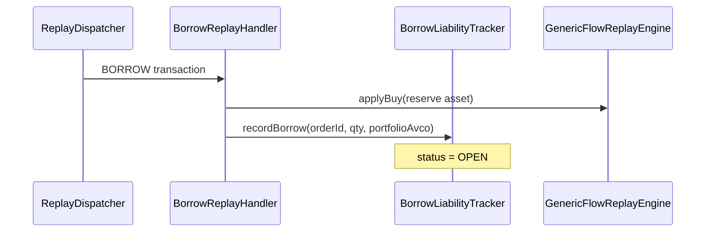

# Cost Basis — Borrow Liability

> **Last updated:** 2026-06-05  
> **Pipeline stage:** `ACCOUNTING_REPLAY`

Crypto-loan principal is tracked separately from spot AVCO so borrow/repay roundtrips do not fabricate realised PnL. Implementation: `BorrowLiabilityTracker` per [ADR-012](../../adr/ADR-012-borrow-liability-tracker.md).

## Data model

**Domain:** `BorrowLiability`  
**Repository:** `BorrowLiabilityRepository`  
**Collection:** `borrow_liabilities`  
**Replay context:** `BorrowLiabilityReplayContext`

Composite key:

```text
compositeId = universeId + ":" + orderId
```

The `orderId` namespace is shared across loan sources and kept disjoint by prefix:

| Source | `orderId` form |
|--------|----------------|
| Bybit crypto loan | provider numeric order id |
| On-chain Aave BORROW/REPAY (F-3/F-4) | `evm:<network>:<debtContract>:<wallet>` |
| Inferred on-chain leveraged buy (ADR-028) | `evm-lev:<network>:<collateralContract>:<wallet>` |

| Field | Purpose |
|-------|---------|
| `orderId` | Provider loan order identifier |
| `accountRef` | Bybit account ref |
| `asset` | Reserve asset symbol |
| `qtyBorrowed` / `qtyOpen` | Original and remaining principal |
| `portfolioAvcoAtOpen` | Portfolio AVCO snapshot at borrow |
| `portfolioAvcoSource` | `PriceSource` used for snapshot |
| `status` | `OPEN`, `PARTIAL`, `CLOSED`, `OPEN_FROM_REPAY` |

## Handlers

| Handler | Trigger types | Role |
|---------|---------------|------|
| `BorrowReplayHandler` | `BORROW` | Record liability; reserve asset BUY |
| `RepayReplayHandler` | `REPAY` | Match liability; reserve asset SELL |

Only **reserve asset** principal is economic. Debt-marker mint/burn legs and execution refund legs remain continuity `TRANSFER` — no spot lots.

## Borrow flow



`recordBorrow`:

1. Snapshot current portfolio AVCO for reserve asset
2. Create or extend `BorrowLiability` for `orderId`
3. Store `portfolioAvcoAtOpen` for later repay matching

## Repay flow

```mermaid
sequenceDiagram
  participant RP as ReplayDispatcher
  participant RH as RepayReplayHandler
  participant BL as BorrowLiabilityTracker
  participant GFE as GenericFlowReplayEngine

  RP->>RH: REPAY transaction
  RH->>BL: matchRepay(orderId, qty)
  BL-->>RH: RepayMatch(matchedQty, liabilityAvcoUsd)
  RH->>GFE: applySell(reserve) with liability-aware PnL suppression
  Note over BL: qtyOpen reduced; CLOSED when ~0
```

`RepayMatch` returns:

- `matchedQty` — quantity matched to open liability
- `residualQty` — excess repay not tied to liability
- `liabilityAvcoUsd` — AVCO at open for matched portion
- `liabilityFound` — whether book entry existed

Zero-PnL roundtrip: when repay matches open borrow, disposal uses liability AVCO — not current spot AVCO — preventing phantom gain/loss on loan closure.

## Inferred on-chain leverage (ADR-028)

A *leveraged buy* receives collateral worth materially more than the consideration paid, with the gap funded by an embedded borrow (Aave borrow, flash loan, or leverage/aggregator router) — and **no** debt-marker leg. It is modelled as `collateral BUY @ market spot` + a synthetic USD borrow of the value gap, reusing this same `BorrowLiability` model.

- **Classification** (`LeverageAcquisitionDetector`): an acquisition-shape SWAP with borrow evidence is annotated on `metadata.leverage`. The F-4 guard skips it when a `variableDebt*`/`stableDebt*` mint is present. Evidence present but no keyable collateral contract ⇒ `PENDING_CLARIFICATION` (`LEVERAGE_BORROW_INFERENCE_REQUIRED`).
- **Pricing** (`SwapDerivedPriceResolver`): the collateral leg of a leverage candidate skips swap-derived pricing so it resolves to market spot.
- **Replay** (`LeverageBorrowReplayHook`, GENERIC route): records one synthetic USD liability of `marketValue(collateral) − consideration` (`asset="USD", avco=$1`) and adds no asset lot. Non-divergent acquisitions record nothing.
- **End-of-ledger close** (`LeverageBorrowReplayHook.closeDrainedLeverageLiabilities`, called once by `AvcoReplayService` after the replay loop): the `evm-lev:` borrow has no on-chain REPAY of its own type, so it is settled by collateral drain. For each OPEN `evm-lev:` liability, the specific collateral-contract position at the leverage wallet is inspected — if drained (|qty| ≤ 1e-6 or absent) the full principal is `recordRepay`'d and the liability **CLOSES**; if still held it stays **OPEN** (genuine outstanding leverage). Explicit `evm:` Aave debts are never touched by this rule.

While open, the liability offsets the collateral MtM so `ΔadjustedMtm = 0` at open — no fabricated gain. On a full round-trip the collateral disposal realises true PnL `≈ (proceeds − own-capital-in)` and the drain-close removes the liability so no phantom open liability lingers in `expectedPnl`.

## Persistence

`AvcoReplayService` loads liabilities at replay start:

```java
borrowLiabilityTracker.loadAllForUniverse(universeId)
```

Replaces universe book at end:

```java
borrowLiabilityTracker.replaceUniverseLiabilities(universeId, borrowLiabilities)
```

## Dashboard integration

`PortfolioConservationGate` subtracts open liability USD from mark-to-market when evaluating conservation invariant (ADR-014).

## Rules by transaction type

Borrow-liability stage scope:

| Type | Liability behavior |
|------|-------------------|
| `BORROW` | `BorrowReplayHandler`: reserve `BUY` + `recordBorrow`; debt tokens `TRANSFER` only |
| `REPAY` | `RepayReplayHandler`: `matchRepay` + reserve `SELL`; debt burn `TRANSFER` only |
| `LENDING_BORROW` (Aave on-chain) | Same split: reserve economic, receipt/debt markers continuity |
| `LENDING_REPAY` | Same |
| `LENDING_LOOP_OPEN` | **Not** borrow liability — Euler loop uses share position (`EulerLoopReplayHandler`) |
| `LENDING_LOOP_*` | No `orderId` liability book |
| Bybit crypto loan rows | `orderId`-keyed when provider emits deterministic id |
| `SWAP` (inferred leverage) | `LeverageBorrowReplayHook`: collateral BUY at market spot + one synthetic USD borrow of the value gap; **no** asset lot (ADR-028) |
| `SWAP` / `TRANSFER` (no leverage) | No liability interaction |
| `FEE` on loan | Priced fee; does not open liability |
| Partial repay | `status = PARTIAL`; remaining `qtyOpen` |
| Repay without prior borrow | `RepayMatch.liabilityFound = false`; normal SELL path |
| Over-repay | `residualQty` disposes at spot AVCO |

## Invariants

- Liability book is universe-scoped (`accountingUniverseId`)
- Replay is authoritative — book rebuilt each full replay
- Debt-marker evidence never becomes standalone replay lots
- Marker-only batch openings without wallet-boundary lifecycle stay `NEEDS_REVIEW` — never enter borrow handlers
