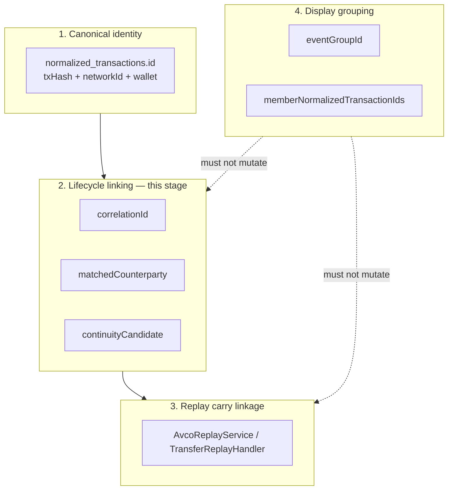
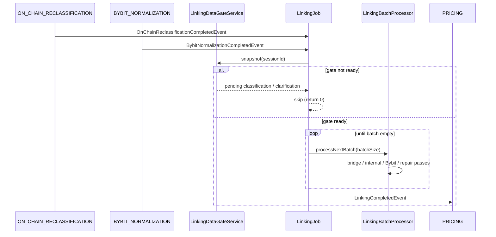

# Linking — Overview

> **Last updated:** 2026-07-16  
> **Pipeline stage:** `LINKING` (`UserSession.PipelineStage.LINKING`)

Linking is the first **cross-row** pipeline stage. It runs after on-chain reclassification and Bybit normalization are complete, and before pricing. Its job is to attach deterministic lifecycle metadata to canonical `normalized_transactions` rows — not to change economics unless a repair pass has explicit evidence.

Linking answers: *which canonical rows belong to the same economic lifecycle*, and *whether replay may carry basis between them*. It does **not** answer chart grouping (`eventGroupId`) or protocol branding alone (`protocolName`).

## Related docs

| Doc | Focus |
|-----|-------|
| [Pipeline index](../README.md) | End-to-end stage sequence |
| [Rules & repairs](02-rules-and-repairs.md) | Batch processor services and repair passes |
| [ADR-003](../../adr/ADR-003-transfer-links-fa001.md) | FA-001 transfer continuity contract |

## Inputs and outputs

| Direction | Artifact | Collection / field |
|-----------|----------|-------------------|
| In | Confirmed / pending-price canonical rows | `normalized_transactions` |
| In | Bybit withdraw/deposit raw | `bybit_extracted_events`, `external_ledger_raw` |
| Out | Lifecycle keys | `correlationId`, `matchedCounterparty` |
| Out | Replay carry hint | `continuityCandidate` |
| Out | Row-local protocol context | `counterpartyAddress`, `protocolName` |
| Out | Type corrections | `type`, `status`, `missingDataReasons[]` |
| Signal | Stage complete | `LinkingCompletedEvent` → triggers `PRICING` |

Linking **writes metadata** on existing canonical rows. It must not merge rows, invent flows, or create replay linkage from UI grouping alone.

## Four linking layers (do not mix)

WalletRadar has four distinct linking problems:

| Layer | Question answered | Primary fields |
|-------|-------------------|----------------|
| Canonical identity | What happened on this wallet? | `id`, `type`, `flows`, `status` |
| Lifecycle linking | What rows share one protocol lifecycle? | `correlationId`, `matchedCounterparty` |
| Replay carry | Where may basis move? | `continuityCandidate` + replay rules |
| Display grouping | What draws as one chart marker? | `eventGroupId`, `memberNormalizedTransactionIds` |

## Stage flow

## Entry points (verified)

All paths under `backend/core/src/main/java/com/walletradar/`.

| Class | Package | Role |
|-------|---------|------|
| `LinkingJob` | `application/linking/job/` | Stage driver; listens for reclassification / Bybit completion |
| `LinkingBatchProcessor` | `application/linking/job/` | Ordered repair and pairing passes |
| `LinkingDataGateService` | `application/linking/job/` | Session readiness gate |
| `BybitBridgeLinkService` | `application/linking/job/` | Bybit `withdraw_deposit` ↔ on-chain leg rematch |
| `LinkingProperties` | `application/linking/config/` | Enable flag, batch size |

Clarification-time link services (invoked from `LinkingBatchProcessor`) live under `application/linking/pipeline/clarification/` — see [02-rules-and-repairs.md](02-rules-and-repairs.md).

## Readiness gate

`LinkingDataGateService` blocks linking until:

1. No pending on-chain normalization (`raw_transactions.normalizationStatus = PENDING`)
2. No `PENDING_CLARIFICATION` or `PENDING_RECLASSIFICATION` rows in session scope
3. No pending Bybit classification (`bybit_extracted_events` / `external_ledger_raw` with `status = RAW`)
4. No active classification stage heartbeat (normalization, clarification, reclassification, Bybit)

`hasPendingLinking(sessionId)` additionally detects rows still missing `correlationId` or `matchedCounterparty` for bridge / external / internal transfer families.

## Lifecycle metadata semantics

### `correlationId`

Shared lifecycle key when multiple rows belong to one proved protocol corridor.

Examples:

- `lp-position:arbitrum:pancakeswap:196975`
- `BYBIT:ARBITRUM:0xabc…`
- `bridge:…` / `BYBIT-CORRIDOR:…`

Does **not** mean merge into one canonical row.

### `matchedCounterparty`

Explicit row-to-row pair (exact bridge destination, async settlement, Bybit leg).

### `continuityCandidate`

Accounting flag: replay **may** try to carry basis. Never use alone for chart grouping.

### `counterpartyAddress` (Cycle 79)

Row-local contract/router/pool — **not** the lifecycle peer. `matchedCounterparty` remains the remote lifecycle counterpart.

## Protocol name (linking context)

`protocolName` is best-effort metadata assigned at normalization, clarification (`ProtocolNameEnrichmentService`), or repair sweep. Linking may stamp protocol attribution (`ProtocolAttributionClassifier`, `GmxV2RefundClassifier`) but must not treat `protocolName` as a hidden accounting rule.

## Rules by transaction type

Scoped to **what linking may set or repair** on canonical rows. Economics stay unless a named repair pass has deterministic evidence.

| Type | Linking behavior |
|------|------------------|
| `BRIDGE_OUT` | Pair to `BRIDGE_IN` via `LiFiBridgePairLinkService`, `MayanCctpBridgePairLinkService`, `AcrossBridgePairLinkService`, `CrossNetworkBridgePairFallbackService`; set `correlationId`, `matchedCounterparty`; repair sealed pairs via `BridgePairContinuityRepairService`. **Cross-asset pairing (NEW-08):** `LiFiBridgePairLinkService` (LiFi `GAS_PAYER` relayer evidence) and `CrossNetworkBridgePairFallbackService` pair asset-changing routes (e.g. `USDC`→`ETH`) by USD proximity, keeping `continuityCandidate=false` |
| `BRIDGE_IN` | Promote from `EXTERNAL_TRANSFER_IN` when registry/status evidence proves settlement (`EtherFiOftBridgeInClassifier`, Mayan/CCTP/Across/LI.FI); orphan inbound demotion to priced acquire via `UnmatchedBridgeInboundPricingFallbackService`. **Relay inbounds (NEW-11):** registry-backed Relay `GAS_PAYER`/solver payouts (ARBITRUM `0x1619de6b…`, ZKSYNC solver) classify as `BRIDGE_IN` |
| `EXTERNAL_TRANSFER_IN` / `EXTERNAL_TRANSFER_OUT` | Bybit corridor repair (`BybitTransferContinuityRepairService`, `BybitBridgeLinkService`); cross-network orphan pricing fallback; address-poisoning exclusion (`AddressPoisoningDetector`) |
| `INTERNAL_TRANSFER` | Same-tx wallet pair via `InternalTransferPairLinkService`, `OnChainInternalTransferPairRepairService`; Bybit same-UID reclassify (`BybitInternalTransferExternalCpReclassifier`) |
| `LP_ENTRY_REQUEST` / `LP_ENTRY_SETTLEMENT` | Async lifecycle correlation via `OnChainLifecycleLinkService` |
| `LP_EXIT_REQUEST` / `LP_EXIT_SETTLEMENT` | Same |
| `DEX_ORDER_REQUEST` / `DEX_ORDER_SETTLEMENT` | CoW Eth Flow via `CowSwapEthFlowSettlementLinkService` |
| `DERIVATIVE_ORDER_*` | GMX V2 lifecycle linking in clarification; refund tagging in linking |
| GMX GLV/GM keeper settlement | Link internal-transfer-only ETH payout to open `LP_EXIT_REQUEST` → `LP_EXIT_SETTLEMENT` (basis carried) via `GmxWithdrawalSettlementLinkService` (NEW-09); residual fee-refund dust demoted to basis-neutral `SPONSORED_GAS_IN` via `GmxExecutionFeeRefundBasisNeutralService` (NEW-13, strictly after the settlement link) |
| `LENDING_*` / `VAULT_*` / `STAKING_*` | Protocol counterparty stamping; vault burn synthesis (`TurtleVaultBurnRepairService`) |
| `SWAP` | No lifecycle pairing at linking unless part of async order family |
| `BORROW` / `REPAY` | No linking pairing; debt markers stay audit-only |
| `SPONSORED_GAS_IN` | No `continuityCandidate`; chart grouping is display-only |
| `APPROVE` / `ADMIN_CONFIG` / spam | Exclusion/tagging passes only (`ScamDisperseClonePhishingTagger`, `NftMintRetagger`) |
| Bybit `EXTERNAL_TRANSFER_*` | `BybitBridgeLinkService` MATCHED / UNMATCHED / EXTERNAL_CUSTODY; earn orphan repair (`BybitOnChainEarnOrphanRepairService`) |

## Anti-patterns

- Do not create `correlationId` from timestamp proximity alone
- Do not merge canonical rows for UX
- Do not derive `continuityCandidate` from `protocolName`
- Do not let display `eventGroupId` mutate replay semantics
