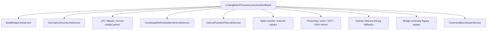
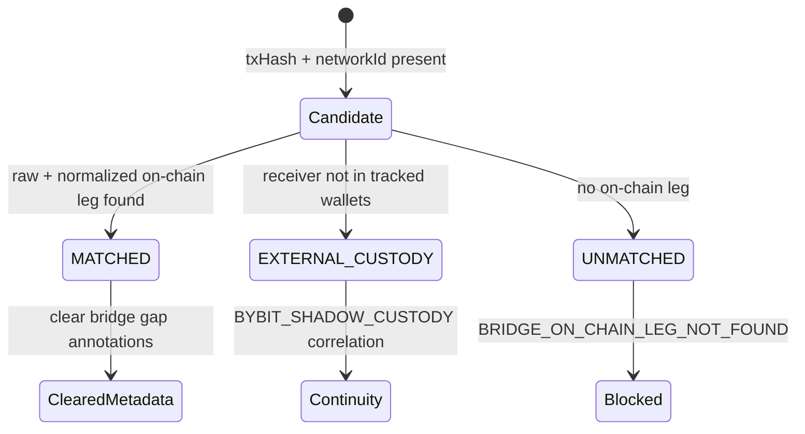

# Linking — Rules and Repairs

> **Last updated:** 2026-07-16  
> **Pipeline stage:** `LINKING`

This document describes the deterministic passes executed by `LinkingBatchProcessor` and the metadata contract they enforce. Pass order matters: later passes assume earlier pairing context exists.

## Processor architecture

## Pass order (verified)

| # | Service | Purpose |
|---|---------|---------|
| 1 | `BybitBridgeLinkService` | Match `withdraw_deposit` rows to on-chain legs; stamp `onChainCorrelation` on extracted events |
| 2 | `OnChainLifecycleLinkService` | Async request/settlement, LP, staking, order lifecycles |
| 3 | `LiFiBridgePairLinkService` | LI.FI / Jumper route-tagged bridge pairs |
| 4 | `MayanCctpBridgePairLinkService` | Mayan / CCTP terminal status pairs |
| 5 | `AcrossBridgePairLinkService` | Across `depositV3` → settlement |
| 6 | `CowSwapEthFlowSettlementLinkService` | CoW Eth Flow request → settlement |
| 7 | `InternalTransferPairLinkService` | Same-session wallet↔wallet same-tx pairs → `INTERNAL_TRANSFER` |
| 8 | `KnownBridgeRouterExternalTypeCorrectionService` | Promote misclassified inbound bridge receipts |
| 9 | `BybitTransferContinuityRepairService` | Restore `BYBIT:<NETWORK>:<txHash>` corridor metadata on wallet rows |
| 10 | `BybitInternalTransferExternalCpReclassifier` | Same-UID Bybit externals → internal where proved |
| 11 | `ProtocolAttributionClassifier` | Stamp protocol counterparties before cross-network pairing |
| 12 | `CrossNetworkBridgePairFallbackService` | Routed Relay settlement pairing |
| 13 | `AddressPoisoningDetector` | Exclude vanity-prefix dust IN |
| 14 | `ScamDisperseClonePhishingTagger` | Tag known phishing OUT |
| 15 | `GmxV2RefundClassifier` | GMX execution-fee refund attribution |
| 16 | `GmxWithdrawalSettlementLinkService` | **NEW-09** — pair GMX GLV/GM keeper ETH inflow to open `gmx-lp:*` `LP_EXIT_REQUEST` → reclassify `LP_EXIT_SETTLEMENT`, set `correlationId`, reshape `BUY`→`TRANSFER` for REALLOCATE carry; runs **immediately after** `gmxV2RefundClassifier` so fee-refund candidates are already stamped |
| 17 | `GmxExecutionFeeRefundBasisNeutralService` | **NEW-13** — residual GMX execution-fee refund with **no** matching open `LP_EXIT_REQUEST` → basis-neutral `SPONSORED_GAS_IN` (`GAS_ONLY`); runs **strictly after** `gmxWithdrawalSettlementLink` so genuine GLV/GM settlements are excluded |
| 18 | `EtherFiOftBridgeInClassifier` | weETH OFT mint → `BRIDGE_IN` |
| 19 | `NftMintRetagger` | NFT mint OUT reclassification |
| 20 | `UnmatchedBridgeInboundPricingFallbackService` | Reprice unsupported OUT; demote orphan IN to ACQUIRE |
| 21 | `BybitInternalTransferPairer.repairAll()` | Second Bybit internal pairing pass |
| 22 | `BybitTransferContinuityRepairService` | Re-run after internal pairer (corridor anchor preservation) |
| 23 | `BybitOnChainEarnOrphanRepairService` | Synthesize missing Earn subscription inflow |
| 24 | `BybitInternalTransferOrphanFallbackService` | Demote singleton internals |
| 25 | `BybitInternalTransferPairer.pairDemotedEconOrphans()` | Pair demoted econ orphans |
| 26 | `UnmatchedExternalTransferInPricingFallbackService` | Orphan IN when OUT outside session |
| 27 | `BridgePairContinuityRepairService` | Legacy sealed pairs; inbound counterparty; sealed inbounds |
| 28 | `OnChainInternalTransferPairRepairService` | Same-tx internal orphans across session wallets |
| 29 | `TurtleVaultBurnRepairService` | Synthesize missing ERC-4626 burn on vault withdraw |

> **GMX keeper withdrawal settlements (NEW-09 / NEW-13).** GMX GLV/GM withdrawals settle as an
> internal-transfer-only native ETH payout from a GMX handler/keeper — there is no wallet-signed
> settlement tx. `GmxWithdrawalSettlementLinkService` links that inflow to the open `gmx-lp:*`
> `LP_EXIT_REQUEST` and reshapes the `BUY` into a `TRANSFER` so replay reuses the REALLOCATE carry
> (basis carried, not a fabricated market ACQUIRE). Any refund left without an open exit request is
> return-of-capital gas dust and is demoted to basis-neutral `SPONSORED_GAS_IN` by
> `GmxExecutionFeeRefundBasisNeutralService`. Ordering is load-bearing: NEW-13 must run after NEW-09.

## Bybit ↔ on-chain corridor

`BybitBridgeLinkService` handles `withdraw_deposit` extracted events:

Rules:

- Canonical type stays `EXTERNAL_TRANSFER_IN` / `EXTERNAL_TRANSFER_OUT`
- Deterministic correlation: `BYBIT:<NETWORK>:<txHash>`
- Wallet row continuity restored in `BybitTransferContinuityRepairService` when Bybit leg already matched
- Dust/spam without real Bybit row must not self-promote into custody continuity

## Bridge pairing evidence

Routed bridge pairs require protocol-backed evidence — not loose time proximity:

| Bridge family | Pairing service | Evidence required |
|---------------|-----------------|-------------------|
| LI.FI / Jumper | `LiFiBridgePairLinkService` | Route-tagged source + registry settlement sender (incl. LiFi `GAS_PAYER` relayer) |
| Mayan / CCTP | `MayanCctpBridgePairLinkService` | Terminal Mayan status + receiving tx hash |
| Across | `AcrossBridgePairLinkService` | `depositV3` calldata + unique bounded destination |
| Relay fallback | `CrossNetworkBridgePairFallbackService` | LI.FI Diamond source + Relay infrastructure sender (registry `GAS_PAYER`/solver) |
| EtherFi OFT | `EtherFiOftBridgeInClassifier` | Cross-chain mint proof |

LI.FI status rows where `sendingTxHash == receivingTxHash` are status echoes — never self-linked bridge continuity.

> **Cross-asset bridge correlation (NEW-08).** `LiFiBridgePairLinkService` accepts a LiFi `GAS_PAYER`
> relayer as trusted destination evidence and pairs **cross-asset** routes (e.g. `USDC` → `ETH`) by
> USD-value proximity, not same-symbol match. `CrossNetworkBridgePairFallbackService` accepts a
> cross-asset orphan `BRIDGE_IN`/`BRIDGE_OUT` pair within a tight time window plus USD proximity. Such
> pairs keep `continuityCandidate = false` and settle via the asset-changing REALLOCATE path (no plain
> carry). The UNICHAIN LI.FI Permit2Proxy `0x1bcd304f…` is registered as `BRIDGE`/`BRIDGE_ENTRY`.
>
> **Relay bridge inbounds (NEW-11).** The ARBITRUM Relay `GAS_PAYER` `0x1619de6b…` is registered and
> ZKSYNC is added to the Relay solver `0x91604f59…` network set, so registry-backed Relay inbounds
> classify as `BRIDGE_IN` (including the same-asset ZKSYNC → ARBITRUM ETH bridge fix).

## Internal transfer pairing (FA-001)

`InternalTransferPairLinkService` promotes same-tx reciprocal legs when:

- Same `txHash + networkId`
- One principal outbound, one inbound
- Matching principal family and quantity (tiny tolerance)
- Both wallets in session universe

One-sided tracked-counterparty hints remain external until reciprocal canonical row exists.

Target reversible store: `transfer_links` per [ADR-003](../../adr/ADR-003-transfer-links-fa001.md).

## Protocol name enrichment

Linking may fill or repair labels but not economics:

| Stage | Service | Allowed |
|-------|---------|---------|
| Normalization | Registry / semantic classifiers | Direct `protocolName` hit |
| Clarification | `ProtocolNameEnrichmentService` | Receipt-safe enrichment |
| Linking | `ProtocolAttributionClassifier`, `GmxV2RefundClassifier` | Counterparty + attribution stamps |
| Repair sweep | Historical protocol-name job | Metadata only |

`protocolName` is **not** a lifecycle key, pairing key, or proof of basis continuity.

## Orphan and fallback repairs

When pairing fails but economics must not stay at $0:

| Scenario | Service | Effect |
|----------|---------|--------|
| `BRIDGE_OUT` with no priced upstream inflow | `UnmatchedBridgeInboundPricingFallbackService.reconcileUnsupportedOutbounds` | Reprice source so carry can propagate |
| `BRIDGE_IN` with no OUT partner in session | `…reconcileOrphanInbounds` | Demote to market-priced ACQUIRE |
| `EXTERNAL_TRANSFER_IN` with OUT outside universe | `UnmatchedExternalTransferInPricingFallbackService` | Orphan inbound ACQUIRE |
| Sealed bridge pair (`continuityCandidate=false`) | `BridgePairContinuityRepairService` | Promote continuity when pair proved |
| Linked IN missing flow counterparty | `…reconcilePairedInboundCounterparty` | Restore metadata for replay |

## Display vs lifecycle (reminder)

| Field | Layer | Linking may set? |
|-------|-------|------------------|
| `correlationId` | Lifecycle | Yes |
| `matchedCounterparty` | Lifecycle | Yes |
| `continuityCandidate` | Replay hint | Yes |
| `eventGroupId` | Display | No (read/overlay path) |
| `memberNormalizedTransactionIds` | Display | No |

## Rules by transaction type

Detailed linking actions per canonical type:

| Type | Metadata written | Typical services |
|------|------------------|------------------|
| `BRIDGE_OUT` | `correlationId`, `matchedCounterparty`, optional `continuityCandidate` | Bridge pairers, `BridgePairContinuityRepairService` |
| `BRIDGE_IN` | Pair to OUT; may promote from `EXTERNAL_TRANSFER_IN` | All bridge pairers, `EtherFiOftBridgeInClassifier` |
| `EXTERNAL_TRANSFER_OUT` → Bybit | `BYBIT:…` correlation, `continuityCandidate` | `BybitTransferContinuityRepairService` |
| `EXTERNAL_TRANSFER_IN` ← Bybit | Same | `BybitBridgeLinkService`, corridor repair |
| `INTERNAL_TRANSFER` | Same-tx `correlationId`, reciprocal `matchedCounterparty` | `InternalTransferPairLinkService`, `OnChainInternalTransferPairRepairService` |
| `LP_ENTRY_REQUEST` / `LP_EXIT_REQUEST` | Lifecycle `correlationId` to settlement | `OnChainLifecycleLinkService` |
| `DEX_ORDER_REQUEST` | Terminal settlement link | `CowSwapEthFlowSettlementLinkService` |
| `VAULT_WITHDRAW` (Turtle) | Synthetic burn flow | `TurtleVaultBurnRepairService` |
| `EXTERNAL_TRANSFER_IN` (poisoning) | `excludedFromAccounting` | `AddressPoisoningDetector` |
| `EXTERNAL_TRANSFER_OUT` (phishing) | Review / exclusion tags | `ScamDisperseClonePhishingTagger` |
| GMX refund rows | `protocolName` / attribution; GLV/GM settlement link or basis-neutral demotion | `GmxV2RefundClassifier`, `GmxWithdrawalSettlementLinkService` (NEW-09), `GmxExecutionFeeRefundBasisNeutralService` (NEW-13) |
| NFT mint OUT | Non-economic retag | `NftMintRetagger` |
| Bybit Earn subscription | Synthetic matching EARN inflow | `BybitOnChainEarnOrphanRepairService` |
| Bybit `INTERNAL_TRANSFER` orphan | Demote or re-pair | `BybitInternalTransferOrphanFallbackService`, `BybitInternalTransferPairer` |

Types with **no linking pairing** (normalization/clarification only): `SWAP`, `BORROW`, `REPAY`, `REWARD_CLAIM`, `FEE`, `APPROVE`, `ADMIN_CONFIG`, derivative collateral flows.
