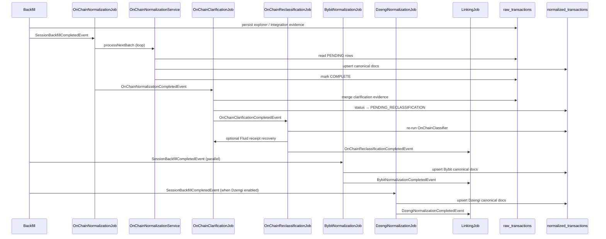
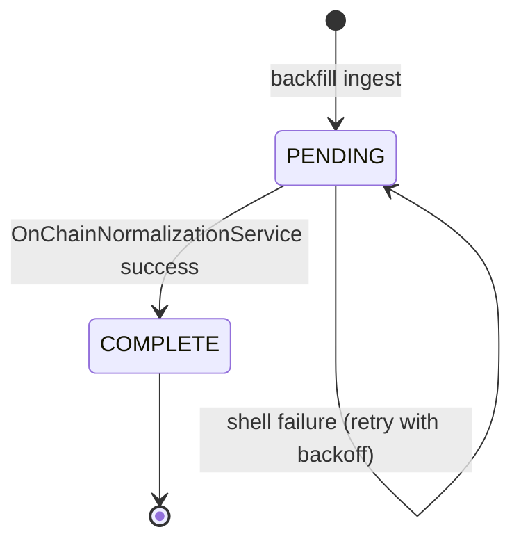
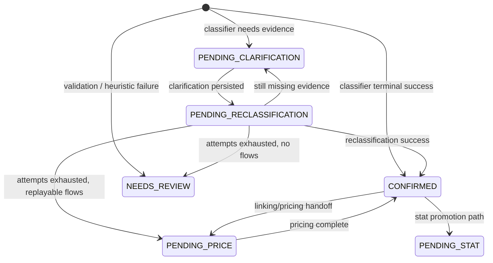

# Normalization Overview

> **Last updated:** 2026-07-08  
> Converts raw acquisition evidence into canonical `normalized_transactions` documents ready for linking, pricing, and AVCO replay.

Full classification-rule reference and leg-extraction detail: [classification-spec.md](classification-spec.md).

## Purpose

The normalization stage is the first accounting-facing transform in the WalletRadar pipeline. It:

1. Classifies on-chain `raw_transactions` into typed economic events.
2. Enriches ambiguous rows through clarification and reclassification.
3. Materializes Bybit and Dzengi CEX ledger rows into the same canonical schema.

All outputs land in MongoDB collection `normalized_transactions`. Downstream stages (linking, pricing, replay) read only from this collection plus session-scoped universe filters.

## Sub-stages

| Sub-stage | `PipelineStage` enum | Primary classes |
|-----------|---------------------|-----------------|
| On-chain normalization | `ON_CHAIN_NORMALIZATION` | `OnChainNormalizationJob`, `OnChainNormalizationService` |
| On-chain clarification | `ON_CHAIN_CLARIFICATION` | `OnChainClarificationJob`, `OnChainClarificationService` |
| On-chain reclassification | `ON_CHAIN_RECLASSIFICATION` | `OnChainReclassificationJob`, `OnChainReclassificationService` |
| Bybit normalization | `BYBIT_NORMALIZATION` | `BybitNormalizationJob`, `BybitNormalizationService` |
| Dzengi normalization | `DZENGI_NORMALIZATION` | `DzengiNormalizationJob`, `DzengiNormalizationService` |

Detailed docs:

- [On-chain classification](02-onchain-classification.md)
- [Bybit normalization](03-bybit-normalization.md)
- [Dzengi normalization](04-dzengi-normalization.md)
- [Clarification & reclassification](04-clarification-reclassification.md)

Rule documents (families, protocols, three-layer contract): [rules/README.md](rules/README.md).

## End-to-end flow



On-chain and CEX normalization both start after backfill. Linking waits for `OnChainReclassificationCompletedEvent` and completion events from **each enabled** CEX venue (`BybitNormalizationCompletedEvent`, `DzengiNormalizationCompletedEvent`, …).

## Event-driven triggers

| Event | Publisher | Listener | Notes |
|-------|-----------|----------|-------|
| `SessionBackfillCompletedEvent` | `SessionBackfillCompletionPublisher` | `OnChainNormalizationJob`, `BybitNormalizationJob`, `DzengiNormalizationJob` | Primary session handoff |
| `OnChainNormalizationCompletedEvent` | `OnChainNormalizationJob` | `OnChainClarificationJob` | Published even when `processed == 0` for session runs |
| `OnChainClarificationCompletedEvent` | `OnChainClarificationJob` | `OnChainReclassificationJob` | May be re-published by reclassification for Fluid recovery |
| `OnChainReclassificationCompletedEvent` | `OnChainReclassificationJob` | `LinkingJob` | Gates on-chain linking readiness |
| `OnChainReclassificationRequestedEvent` | ops / resume | `OnChainReclassificationJob` | Manual or watchdog re-run |
| `BybitNormalizationCompletedEvent` | `BybitNormalizationJob` | `LinkingJob` | Gates Bybit linking readiness |
| `BybitNormalizationRequestedEvent` | ops / resume | `BybitNormalizationJob` | Manual or watchdog re-run |
| `DzengiNormalizationCompletedEvent` | `DzengiNormalizationJob` | `LinkingJob` | Gates Dzengi linking readiness |
| `DzengiNormalizationRequestedEvent` | ops / resume | `DzengiNormalizationJob` | Manual or watchdog re-run |

Jobs are `@Async` on `PIPELINE_STAGE_EXECUTOR`, single-flight guarded by an `AtomicBoolean running` flag per job class.

Manual entry points: `runNormalization()` (on-chain, Bybit, Dzengi), `runClarification()`, `runReclassification()`.

## Inputs and outputs

### On-chain path

| Direction | Collection | Key fields / status |
|-----------|------------|---------------------|
| Read | `raw_transactions` | `normalizationStatus = PENDING` (or retry-eligible) |
| Write | `raw_transactions` | `normalizationStatus = COMPLETE` on success; retry counters on shell failure |
| Write | `normalized_transactions` | One doc per `(txHash, networkId, walletAddress)`; id = raw transaction id |

### Bybit path

| Direction | Collection | Key fields / status |
|-----------|------------|---------------------|
| Read | `bybit_extracted_events` | `status = RAW` (preferred path) |
| Read | `external_ledger_raw` | `status = RAW` (legacy CSV fallback) |
| Write | above sources | `status = CONFIRMED` after canonical upsert |
| Write | `normalized_transactions` | `source = BYBIT`; wallet ref dimensioned as `BYBIT:<uid>:UTA\|FUND\|EARN` |

### Dzengi path

| Direction | Collection | Key fields / status |
|-----------|------------|---------------------|
| Read | `dzengi_extracted_events` | `status = RAW`; `outOfScope = false` |
| Write | `dzengi_extracted_events` | `status = CONFIRMED` after canonical upsert |
| Write | `normalized_transactions` | `source = DZENGI`; wallet ref `DZENGI:<userId>` |

### Canonical document shape

`NormalizedTransaction` (`backend/.../domain/transaction/normalized/NormalizedTransaction.java`) carries:

- Identity: `id`, `txHash`, `networkId`, `walletAddress`, `source`, `blockTimestamp`, `transactionIndex`
- Classification: `type`, `eventSubtype`, `status`, `classifiedBy`, `confidence`, `missingDataReasons`
- Flows: `flows[]` with `role`, `assetContract`, `assetSymbol`, `quantityDelta`, pricing fields
- Linking metadata: `correlationId`, `continuityCandidate`, `matchedCounterparty`, counterparty resolution state
- Protocol metadata: `protocolName`, `protocolVersion`, resolution state
- Clarification state: `clarificationEvidence`, `clarificationAttempts`, `fullReceiptClarificationAttempts`, lease fields
- Downstream counters: `pricingAttempts`, `statAttempts`
- Accounting flags: `excludedFromAccounting`, `accountingExclusionReason`

Writes use `IdempotentNormalizedTransactionStore` for deterministic upserts.

## Status lifecycle

### Raw transaction (`NormalizationStatus`)



### Normalized transaction (`NormalizedTransactionStatus`)



Initial status is chosen by `OnChainClassifier` + `ClarificationPolicyService` at first normalization. Clarification never reclassifies inline — it marks `PENDING_RECLASSIFICATION` and defers to `OnChainReclassificationService`.

## Operational characteristics

- **Batching:** configurable via `OnChainNormalizationProperties.batchSize`, `OnChainClarificationProperties`, `BybitNormalizationProperties`.
- **Ordering:** on-chain batches sorted by `(blockTimestamp, transactionIndex, txHash)` after optional explorer ordering repair.
- **Session universe:** `AccountingUniverseService.bindUniverse(sessionId)` scopes queries during session-driven runs.
- **Concurrency:** one in-flight run per job class; clarification supports configurable worker threads inside a batch.
- **Idempotency:** normalized upserts keyed by canonical id; raw rows marked COMPLETE only after successful persist.

Config roots: `walletradar.ingestion.on-chain-normalization`, `walletradar.ingestion.on-chain-clarification`, `walletradar.ingestion.bybit-normalization` in `application.yml`.

## Rules by transaction type

This overview scopes **stage boundaries** only. Per-type behavior at each sub-stage:

| Type family | First shell output | Typical clarification | Post-reclass outcome | Bybit analogue |
|-------------|-------------------|----------------------|---------------------|----------------|
| `SWAP`, `WRAP`/`UNWRAP` | `CONFIRMED` or `PENDING_CLARIFICATION` | full receipt for multicall / aggregator | `CONFIRMED` with priced flows | `convert` cluster → paired SWAP |
| `LP_*` | often `PENDING_CLARIFICATION` (position correlation) | receipt + lifecycle discovery | `CONFIRMED` or `NEEDS_REVIEW` | — |
| `LENDING_*`, `BORROW`, `REPAY` | registry + semantic classifiers | receipt for batch decoders (Euler) | `CONFIRMED` | earn / loan rows (loan CSV excluded) |
| `BRIDGE_OUT` / `BRIDGE_IN` | early guard or registry | bridge status gateways (LI.FI, Mayan, Across) | linked counterparty metadata | — |
| `EXTERNAL_TRANSFER_*` | `PRE_ECONOMIC_REVIEW` transfer classifier | native settlement evidence | pricing fallback if unmatched | FH Deposit/Withdraw anchors |
| `INTERNAL_TRANSFER` | transfer classifier | peer raw repair + pair linking | continuity `correlationId` | internal transfer pairer |
| `SPAM` / `NON_ECONOMIC` | `excludedFromAccounting` | usually none | stays excluded | basis-irrelevant rows |
| `UNKNOWN` | `NEEDS_REVIEW` or `PENDING_CLARIFICATION` | receipt clarification tail | `NEEDS_REVIEW` if exhausted | orphan convert / staking |

Authoritative per-type rules: [rules/README.md](rules/README.md) and [reference/transaction-types.md](../../reference/transaction-types.md) (when present).

## Code map

```
backend/src/main/java/com/walletradar/ingestion/
├── job/normalization/
│   ├── OnChainNormalizationJob.java
│   ├── OnChainNormalizationService.java
│   ├── OnChainReclassificationJob.java
│   └── OnChainReclassificationService.java
├── job/clarification/
│   ├── OnChainClarificationJob.java
│   ├── OnChainClarificationService.java
│   └── MetadataClarificationWorkflowHandler.java
├── job/bybit/
│   ├── BybitNormalizationJob.java
│   └── BybitNormalizationService.java
├── pipeline/classification/
│   └── OnChainClassifier.java
├── pipeline/onchain/
│   └── OnChainNormalizedTransactionBuilder.java
└── store/
    └── IdempotentNormalizedTransactionStore.java
```
