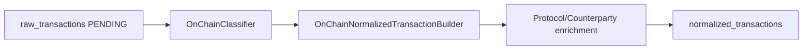
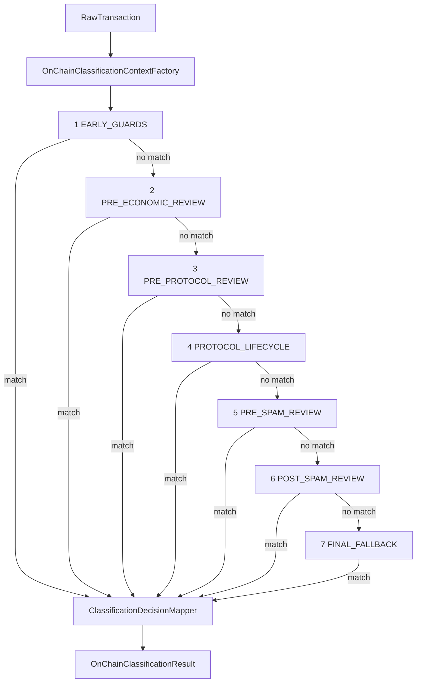
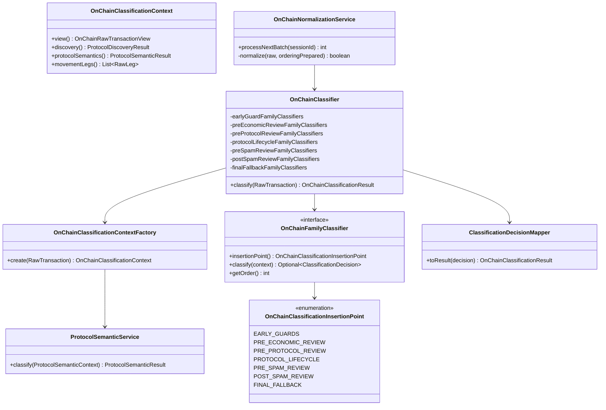

# On-Chain Classification

> **Last updated:** 2026-06-05  
> First-pass shell classification: `OnChainClassifier` staged family evaluation producing initial `normalized_transactions`.

## Role in the pipeline

`OnChainNormalizationService` loads pending `raw_transactions`, runs `OnChainClassifier`, builds a canonical document via `OnChainNormalizedTransactionBuilder`, optionally enriches protocol/counterparty metadata, and upserts into `normalized_transactions`.

Job driver: `OnChainNormalizationJob` — event listener on `SessionBackfillCompletedEvent`, batch loop calling `processNextBatch(sessionId)`.

## OnChainClassifier: seven-stage model

Family classifiers implement `OnChainFamilyClassifier` and declare an `OnChainClassificationInsertionPoint`. `OnChainClassifier` groups all Spring-registered classifiers by insertion point, sorts by `getOrder()`, and runs stages **sequentially** until the first `Optional<ClassificationDecision>` is present.

Enum definition: `OnChainClassificationInsertionPoint` (`backend/.../family/OnChainClassificationInsertionPoint.java`).

| Stage | Purpose | Stop condition |
|-------|---------|----------------|
| `EARLY_GUARDS` | Hard excludes before economic interpretation | Failed tx, admin config, bridge settlement, wrap/unwrap, reward routes |
| `PRE_ECONOMIC_REVIEW` | Broad economic families before protocol semantics | Transfers, bridge starts, lending shape |
| `PRE_PROTOCOL_REVIEW` | Protocol-specific and semantic classifiers | Swap/LP/lending/vault semantics, registry special handlers |
| `PROTOCOL_LIFECYCLE` | Multi-step protocol flows | Trading, staking, GMX LP, default terminal |
| `PRE_SPAM_REVIEW` | Spam funnel entry | Unknown admin-like, pre-spam unknown |
| `POST_SPAM_REVIEW` | Spam decision + registry fallbacks | Spam, non-economic, registry direct type |
| `FINAL_FALLBACK` | Last-resort typing | Method id, function name, heuristic |

Within each stage, **first matching classifier wins** (`findFirst` on ordered stream).

## Class diagram

## Context building

`OnChainClassificationContextFactory.create()` assembles:

1. **`OnChainRawTransactionView`** — typed read model over `raw_transactions.rawData` and clarification overlays.
2. **`ProtocolDiscoveryService`** — address hits against `protocol-registry.json`.
3. **`MovementLegExtractor`** — token/native movement legs for classifier evidence.
4. **`ProtocolSemanticService`** — protocol-owned semantic classifiers (Balancer, CoW, GMX, Euler, Morpho, Pendle, Resolv).

Protocol semantics run **before** family stages but do not terminate the pipeline alone; family classifiers consume `ProtocolSemanticResult` inside `OnChainClassificationContext`.

## Registered family classifiers by stage

### EARLY_GUARDS

| Classifier | Typical types |
|------------|---------------|
| `FailedExecutionClassifier` | non-economic / excluded |
| `AdminConfigClassifier` | `ADMIN_CONFIG` |
| `WrappedNativeClassifier` | `WRAP`, `UNWRAP` |
| `BridgeSettlementClassifier` | `BRIDGE_IN` settlement shape |
| `RewardRouteClassifier` | reward / claim routes |

### PRE_ECONOMIC_REVIEW

| Classifier | Typical types |
|------------|---------------|
| `BridgeStartClassifier` | `BRIDGE_OUT` |
| `TransferClassifier` | `EXTERNAL_TRANSFER_IN/OUT`, `INTERNAL_TRANSFER` |
| `LendingClassifier` | lending deposit/withdraw shapes |

### PRE_PROTOCOL_REVIEW

| Classifier | Typical types |
|------------|---------------|
| `LpClassifier`, `LpSemanticClassifier`, `LpFeeClaimClassifier` | `LP_*` |
| `SwapClassifier`, `SwapSemanticClassifier` | `SWAP` |
| `LendingSemanticClassifier` | `LENDING_*` |
| `VaultSemanticClassifier`, `FluidVaultClassifier` | `VAULT_*` |
| `CompoundCometClassifier` | Compound comet flows |
| `RoutedAggregatorSendClassifier` | aggregator send prelude |
| `AaveReceiptShapeClassifier`, `ZkSyncAaveGatewayClassifier` | Aave receipt tokens |
| `ZkSyncAcrossRoutedBridgeClassifier` | zkSync Across routed bridge |
| `MultiAssetReceiptLpClassifier` | multi-asset LP receipts |
| `ResolvedWarningAdminConfigClassifier` | fee-bearing admin claims |
| `SpecialHandlerRegistryReviewClassifier` | registry special handlers |

### PROTOCOL_LIFECYCLE

| Classifier | Typical types |
|------------|---------------|
| `TradingClassifier` | `DEX_ORDER_*`, derivatives |
| `GmxLpClassifier` | GMX LP lifecycle |
| `StakingClassifier` | `STAKING_*` |
| `DefaultClassifier` | terminal stop conditions |

### PRE_SPAM_REVIEW

| Classifier | Typical types |
|------------|---------------|
| `PreSpamUnknownClassifier` | airdrop-like unknown |
| `PreSpamAdminConfigClassifier` | admin-like pre-spam |

### POST_SPAM_REVIEW

| Classifier | Typical types |
|------------|---------------|
| `SpamClassifier` | spam exclusion |
| `NonEconomicClassifier` | non-economic exclusion |
| `SwapRegistryClassifier`, `LpRegistryClassifier`, `LendingRegistryClassifier` | registry-backed types |
| `VaultClassifier` | vault registry |
| `BridgeMethodAwareClassifier` | bridge registry methods |
| `MethodAwareRegistryReviewClassifier` | method-aware registry review |
| `RegistryDirectTypeClassifier` | direct registry type mapping |

### FINAL_FALLBACK

| Classifier | Typical types |
|------------|---------------|
| `MethodIdClassifier` | selector-based guess |
| `FunctionNameClassifier` | ABI function name guess |
| `HeuristicClassifier` | wallet/movement heuristics → `UNKNOWN` or transfer-like |

## OnChainNormalizationService details

Processing steps per batch:

1. Load pending rows (`PendingRawTransactionQueryService`).
2. `InternalTransferRawPeerRepairService` — ensure both legs of internal transfers exist in raw store.
3. Ordering repair — `ExplorerRawOrderingRepairGateway` fills missing `blockTimestamp` / `transactionIndex`.
4. Sort batch deterministically.
5. For each row:
   - Validate required ordering fields; on failure → `UNKNOWN` + `NEEDS_REVIEW`.
   - Classify → build → enrich (skipped when `PENDING_CLARIFICATION` or `UNKNOWN`).
   - Upsert normalized doc; mark raw `COMPLETE`.
   - On shell exception → keep raw `PENDING` with retry schedule.

Post-classification enrichment (in-place, same pass):

- `ProtocolNameEnrichmentService`
- `RegistryBridgeInboundTypeCorrectionService`
- `CounterpartyEnrichmentService`

## Classification outputs

`OnChainClassificationResult` maps to `NormalizedTransaction` fields:

| Result field | Document field |
|--------------|----------------|
| `type` | `type` |
| `status` | `status` (`CONFIRMED`, `PENDING_CLARIFICATION`, `NEEDS_REVIEW`) |
| `classificationSource` | `classifiedBy` |
| `confidence` | `confidence` |
| `flows` | `flows[]` |
| `missingDataReasons` | `missingDataReasons` |
| `correlationId` | `correlationId` |
| `excludedFromAccounting` | `excludedFromAccounting` |

`ClarificationPolicyService` merges classifier reason codes into `missingDataReasons` when status is `PENDING_CLARIFICATION`.

## Rules by transaction type

Shell classification scope — initial type and status before clarification. See [rules/README.md](rules/README.md) for authoritative family/protocol docs.

| Normalized type | Owning classifiers (typical) | Initial status pattern | Clarification reason examples |
|-----------------|------------------------------|------------------------|------------------------------|
| `SWAP` | `SwapClassifier`, `SwapSemanticClassifier`, `SwapRegistryClassifier` | `CONFIRMED` or `PENDING_CLARIFICATION` | multicall receipt required |
| `LP_ENTRY` / `LP_EXIT` / `LP_FEE_CLAIM` | `LpClassifier`, `LpSemanticClassifier`, `LpRegistryClassifier` | often `PENDING_CLARIFICATION` | position correlation, fee claim receipt |
| `LENDING_DEPOSIT` / `LENDING_WITHDRAW` | `LendingClassifier`, `LendingSemanticClassifier`, `LendingRegistryClassifier` | mixed | Euler batch decoder, receipt shape |
| `VAULT_DEPOSIT` / `VAULT_WITHDRAW` | `VaultSemanticClassifier`, `FluidVaultClassifier`, `VaultClassifier` | mixed | Fluid operate log evidence |
| `BRIDGE_OUT` | `BridgeStartClassifier`, `BridgeMethodAwareClassifier` | `CONFIRMED` or clarify | routed bridge correlation |
| `BRIDGE_IN` | `BridgeSettlementClassifier`, registry classifiers | often clarify | inbound registry correction |
| `EXTERNAL_TRANSFER_IN` / `OUT` | `TransferClassifier` | `CONFIRMED` or clarify | native settlement evidence |
| `INTERNAL_TRANSFER` | `TransferClassifier` | `CONFIRMED` | peer raw repair upstream |
| `STAKING_DEPOSIT` / `STAKING_WITHDRAW` | `StakingClassifier` | `CONFIRMED` or clarify | lifecycle correlation |
| `DEX_ORDER_*` / `DERIVATIVE_*` | `TradingClassifier`, protocol semantics (GMX, CoW) | lifecycle split request/settlement | GMX settlement correlation codes |
| `WRAP` / `UNWRAP` | `WrappedNativeClassifier` | `CONFIRMED` | rare receipt tail |
| `ADMIN_CONFIG` | `AdminConfigClassifier`, pre-spam variants | `CONFIRMED`, excluded | — |
| `SPAM` / non-economic | `SpamClassifier`, `NonEconomicClassifier` | excluded | — |
| `UNKNOWN` | `HeuristicClassifier`, `MethodIdClassifier`, `PreSpamUnknownClassifier` | `NEEDS_REVIEW` or clarify | receipt clarification tail |

## Related reading

- [Normalization overview](01-overview.md)
- [Clarification & reclassification](04-clarification-reclassification.md)
- [Normalization rules index](rules/README.md)
- ADR: [ADR-001](../../adr/ADR-001-onchain-classification-strangler-refactor.md)
