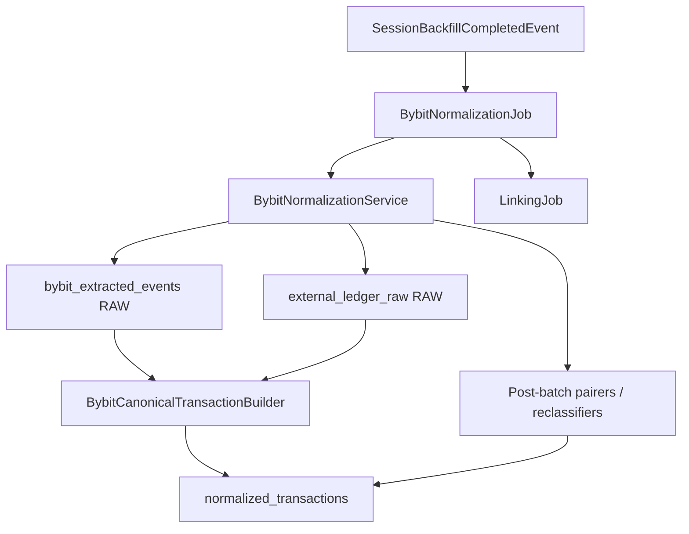
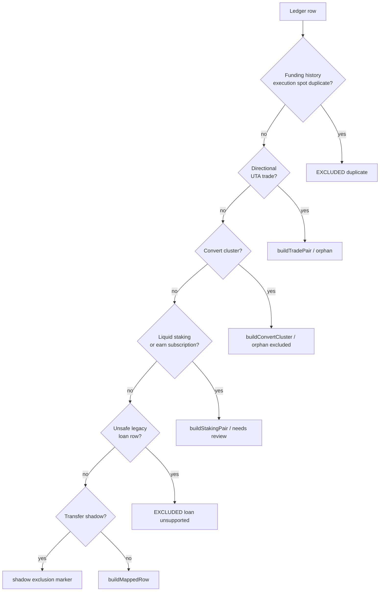

# Bybit Normalization

> **Last updated:** 2026-06-05  
> Materializes Bybit CEX ledger evidence into `normalized_transactions` using the same canonical schema as on-chain rows.

## Role in the pipeline

`BybitNormalizationService` reads immutable extracted ledger rows, applies type-specific pairing and mapping rules, upserts canonical documents, and marks source rows `CONFIRMED`. `BybitNormalizationJob` drives batch processing and publishes `BybitNormalizationCompletedEvent` for linking.



Bybit normalization runs **in parallel** with on-chain normalization after backfill. Linking consumes **both** `OnChainReclassificationCompletedEvent` and `BybitNormalizationCompletedEvent`.

## Event-driven triggers

| Trigger | Handler | `publishWhenEmpty` |
|---------|---------|-------------------|
| `SessionBackfillCompletedEvent` | `onSessionBackfillCompleted` | `true` (session runs always publish) |
| `BybitNormalizationRequestedEvent` | `onBybitNormalizationRequested` | `true` |
| Manual `runNormalization()` | direct call | `false` unless processed > 0 |

`SessionPipelineResumeScheduler` may re-emit `BybitNormalizationRequestedEvent` when Bybit rows remain `RAW` after backfill durable-complete.

Job characteristics match on-chain jobs: `@Async(PIPELINE_STAGE_EXECUTOR)`, single-flight `AtomicBoolean`, 30s heartbeat to `SessionPipelineActivityService` / `SessionPipelineStateService`.

## Input sources (priority order)

1. **`bybit_extracted_events`** (`status = RAW`) — primary API extraction path via `PendingBybitExtractedRowQueryService`.
2. **`external_ledger_raw`** (`status = RAW`) — legacy CSV import fallback via `PendingExternalLedgerRowQueryService`.

If the extracted-event batch is non-empty but nothing processes, the service still returns without falling through to legacy in that iteration. Legacy rows are consumed only when the extracted batch is empty and yields zero progress.

### Pre-normalize hydration (`BybitExtractedEvent` path)

Before mapping to legacy shape:

- `BybitExtractionService.refreshBasisRelevantFromRaw`
- Transfer field hydration from `integration_raw_events` payload (`fromAddress`, `toAddress`, `txID`)
- `BybitExtractionService.hydrateFundingHistoryFromOnChainSibling`
- Wallet ref dimensioning: `BYBIT:<uid>` → `BYBIT:<uid>:UTA|FUND|EARN` based on `sourceStream` / `bybitType`

## Row routing inside `normalize()`



### Trade pairing

- UTA derivatives `SWAP` with directional `utaDirection` (not convert types).
- `BybitExtractedTradePairer` / `BybitTradePairer` locate opposite leg.
- Pair → single `NormalizedTransaction` with two flows; orphan → `buildOrphanTrade` (`NEEDS_REVIEW`).

`TRANSACTION_LOG` trades are never paired (duplicate of `EXECUTION_SPOT`).

### Convert pairing

- Canonical type `swap` + Bybit type in `{convert, currency_buy, currency_sell}`.
- Requires 2-leg cluster with opposing quantity signs.
- Incomplete cluster → `BYBIT_CONVERT_CLUSTER_INCOMPLETE` excluded row.

### Liquid staking / earn subscription

- ETH 2.0 mint/stake, on-chain earn subscription shapes.
- Same sub-account → `buildStakingPair` (`STAKING_DEPOSIT`).
- Cross sub-account (FUND ↔ EARN) → two `INTERNAL_TRANSFER` rows with shared `correlationId` for replay pairing (`FamilyEquivalentCustodyReplayHandler`).

### Exclusions

| Reason code | When |
|-------------|------|
| `BYBIT_FUNDING_HISTORY_EXECUTION_SPOT_DUPLICATE` | FH row duplicates execution spot |
| `BYBIT_LOAN_SEMANTICS_UNSUPPORTED` | legacy CSV loan borrow/repay |
| `BYBIT_CONVERT_CLUSTER_INCOMPLETE` | convert cluster not 2-legged |
| `BYBIT_BASIS_IRRELEVANT` | `basisRelevant=false` at extraction (chain-aware deposit/withdraw shadows) |
| `BYBIT_TRANSFER_SHADOW_ROW` | legacy shadow path (currently disabled — `isTransferShadowRow` returns false) |

### Default mapped row

`BybitCanonicalTransactionBuilder.buildMappedRow` maps canonical Bybit types (deposits, withdrawals, internal transfers, earn, fees, etc.) to `NormalizedTransactionType` + flows. Basis exclusion applied when `basisRelevant=false`.

## Post-batch repairs

After a non-zero batch, `processNextBatch` runs deterministic repair passes (order matters):

| Service | Purpose |
|---------|---------|
| `BybitInternalTransferPairer` | link internal transfer legs |
| `BybitStreamAuthorityCollapser` | collapse mirror stream duplicates |
| `BybitEarnPrincipalTransferPairer` | pair earn principal redemption flows |
| `BybitPrincipalEventExclusivityService` | demote duplicate principal events |
| `BybitStakingConversionPairer` | pair staking conversion legs |
| `BybitBotTransferCostBasisService` | resolve bot transfer cost basis metadata |
| `BybitInternalTransferExternalCpReclassifier` | session-scoped external→internal CP fix |
| `BybitInternalTransferExternalCpReclassifier.reclassifySameUidExternalToInternal` | same-UID external CP repair |

These mutate existing `normalized_transactions` metadata; they do not re-read `RAW` source rows.

## Outputs

| Field | Bybit convention |
|-------|------------------|
| `source` | `BYBIT` |
| `networkId` | `BYBIT` pseudo-network |
| `walletAddress` / `walletRef` | `BYBIT:<uid>:UTA\|FUND\|EARN` |
| `txHash` | Bybit tx id or synthetic correlation key |
| `type` | mapped from `canonicalType` + pairing context |
| `status` | usually `CONFIRMED`; orphans / incomplete → `NEEDS_REVIEW` or excluded |
| `flows[]` | quantity deltas per leg; trade/convert pairs collapsed |
| `correlationId` | trade order id, convert cluster, cross-sub-account staking |
| `excludedFromAccounting` | duplicates, unsupported loans, basis-irrelevant shadows |

Source rows transition `RAW → CONFIRMED` on successful upsert.

## Telemetry

On batch drain complete, `BybitNormalizationJob` logs `PipelineTelemetrySnapshot` counts (on-chain normalized, Bybit normalized, pending stat, unmatched bridge, orphan UTA, unresolved price, needs review).

## Rules by transaction type

Bybit normalization scope — CEX ledger semantics only. On-chain bridge deposit/withdraw correlation is handled in [linking](../linking/01-overview.md).

| Bybit canonical / stream | Normalized type | Pairing rule | Status / exclusion |
|--------------------------|-----------------|--------------|-------------------|
| `EXECUTION_*` directional trade | `DERIVATIVE_ORDER_EXECUTION` or swap-like | opposite leg by order id | `CONFIRMED` or orphan review |
| `convert` / `currency_buy` / `currency_sell` | `SWAP` (convert cluster) | 2-leg opposing qty | excluded if incomplete |
| `INTERNAL_TRANSFER` (same UID) | `INTERNAL_TRANSFER` | `BybitInternalTransferPairer` | `CONFIRMED` |
| `INTERNAL_TRANSFER` ETH2.0 / earn | `STAKING_DEPOSIT` or cross-sub `INTERNAL_TRANSFER` | liquid staking pairer | review if pair missing |
| `FUNDING_HISTORY` Deposit/Withdraw | `EXTERNAL_TRANSFER_IN/OUT` | none (canonical anchor) | `CONFIRMED` |
| `DEPOSIT_ONCHAIN` / `WITHDRAWAL` (chain-aware) | mapped transfer | excluded at builder (`basisRelevant=false`) | `excludedFromAccounting` |
| `EARN_FLEXIBLE_SAVING` redemption | `EARN_FLEXIBLE_SAVING` | earn principal pairer | `CONFIRMED` |
| `borrow` / `repay` (legacy CSV) | — | none | `BYBIT_LOAN_SEMANTICS_UNSUPPORTED` |
| Fees / interest / bonus recollect | `FEE` | none | `CONFIRMED` or excluded |
| Bot transfers | `INTERNAL_TRANSFER` | bot cost basis service | `CONFIRMED` with basis metadata |

Protocol-specific Bybit rules: [rules/README.md](rules/README.md) → `protocols/bybit.md` (linked from rules index).

## Code map

```
backend/src/main/java/com/walletradar/ingestion/
├── job/bybit/
│   ├── BybitNormalizationJob.java
│   └── BybitNormalizationService.java
├── pipeline/bybit/
│   ├── BybitCanonicalTransactionBuilder.java
│   ├── BybitTradePairer.java
│   ├── BybitInternalTransferPairer.java
│   └── BybitInternalTransferExternalCpReclassifier.java
└── config/BybitNormalizationProperties.java

backend/src/main/java/com/walletradar/integration/bybit/
├── BybitExtractionService.java
├── BybitExtractedEventMapper.java
└── PendingBybitExtractedRowQueryService.java
```

## Related reading

- [Normalization overview](01-overview.md)
- [Clarification & reclassification](04-clarification-reclassification.md) — Bybit orphan repair services in clarification path
- [Normalization rules index](rules/README.md)
