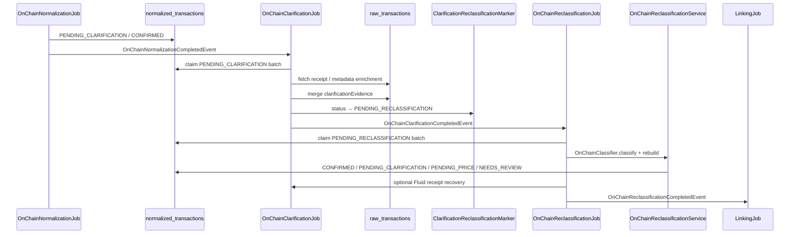
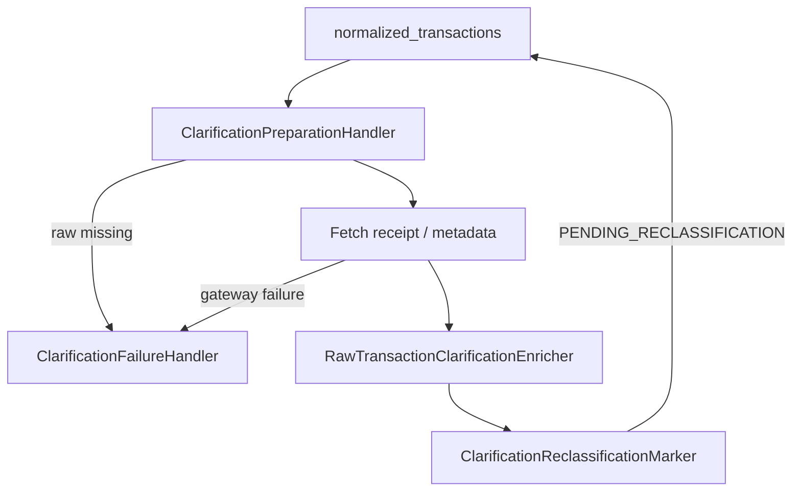
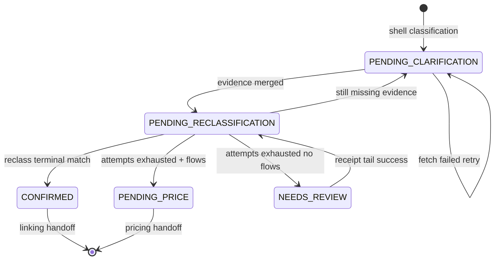

# Clarification & Reclassification

> **Last updated:** 2026-06-05  
> Second-pass enrichment: fetch missing evidence, persist into `raw_transactions`, re-run `OnChainClassifier`, terminalize exhausted rows.

## Why two passes?

Shell classification (`OnChainNormalizationService`) intentionally emits `PENDING_CLARIFICATION` when evidence is missing but recoverable (receipt logs, bridge status, lifecycle peers). Clarification **only** fetches and merges evidence — it does not change `type` or `flows` inline. Reclassification re-runs the full staged classifier on enriched raw evidence and rebuilds the canonical document.

Separation keeps classification deterministic and makes retry / audit boundaries explicit.

## Chain overview



## OnChainClarificationJob / Service

| Component | Responsibility |
|-----------|----------------|
| `OnChainClarificationJob` | Event listener on `OnChainNormalizationCompletedEvent`; drains batches via `ClarificationBatchDrainer` |
| `OnChainClarificationService` | Facade over `MetadataClarificationWorkflowHandler` |
| `MetadataClarificationWorkflowHandler` | Batch claim, parallel worker pool, per-row clarify |
| `ReceiptClarificationWorkflowHandler` | Dedicated full-receipt batch path (also invoked inside metadata handler tails) |
| `ClarificationPreparationHandler` | Load raw, eligibility, fetch receipt |
| `RawTransactionClarificationEnricher` | Merge `ClarificationReceiptEnrichment` into raw doc |
| `ClarificationFailureHandler` | Attempt counters, lease release, failure transitions |
| `ClarificationReclassificationMarker` | Persist `PENDING_RECLASSIFICATION` |

### Batch composition (`processNextBatch`)

1. `PendingClarificationQueryService.claimNextBatch` — rows with `status = PENDING_CLARIFICATION` (leased).
2. If full-receipt enabled:
   - `claimActiveNeedsReviewBatch` — `NEEDS_REVIEW` receipt tail
   - `claimConfirmedFluidReceiptBatch` — Fluid vault receipt recovery
   - `claimMulticallMissingTransferBatch` — multicall transfer gaps

Configurable: `OnChainClarificationProperties` (`batchSize`, `maxAttempts`, `retryDelaySeconds`, `leaseSeconds`, `threads`, `fullReceipt.*`).

### Per-row clarify flow



Clarification writes enrichment into `raw_transactions` (and `clarificationEvidence` on normalized doc via raw view). It **never** calls `OnChainClassifier` directly.

### Failure and retry policy

`ClarificationPolicyService` centralizes transitions:

| Path | Exhausted attempts | Next status |
|------|-------------------|-------------|
| Metadata clarification | `maxAttempts` reached | `PENDING_RECLASSIFICATION` (reclass will terminalize) |
| Metadata clarification | below max | `PENDING_CLARIFICATION` (retry) |
| Receipt clarification (`NEEDS_REVIEW` tail) | `fullReceipt.maxAttempts` | `PENDING_RECLASSIFICATION` |
| Receipt clarification | below max | unchanged status (retry) |
| Raw missing | — | `NEEDS_REVIEW` + `RAW_TRANSACTION_MISSING` |

Leased batches use `clarificationLeaseUntil` / `clarificationWorkerId` for worker safety.

## OnChainReclassificationJob / Service

| Component | Responsibility |
|-----------|----------------|
| `OnChainReclassificationJob` | Listens to `OnChainClarificationCompletedEvent`, `OnChainReclassificationRequestedEvent` |
| `OnChainReclassificationService` | Loads `PENDING_RECLASSIFICATION`, re-classifies, rebuilds doc |
| `PendingReclassificationQueryService` | Indexed batch query |
| `OnChainNormalizedTransactionBuilder.rebuildAfterReclassification` | Preserve counters / correlation where appropriate |
| `ClarificationReclassificationHandler` | Shared persist path for inline clarification-driven rebuilds (tests / alternate entry) |

### Reclassify steps

1. Load `NormalizedTransaction` + matching `RawTransaction` by shared `id`.
2. `onChainClassifier.classify(rawTransaction)`.
3. `builder.rebuildAfterReclassification(existing, raw, result, now)`.
4. `terminalizeExhaustedClarification` — if still `PENDING_CLARIFICATION` after max attempts:
   - replayable flows → `PENDING_PRICE`
   - otherwise → `NEEDS_REVIEW` + `CLARIFICATION_ATTEMPTS_EXHAUSTED`
5. Enrich protocol name, bridge inbound correction, counterparty, Fluid evidence.
6. Save to `normalized_transactions`.

### Post-reclassification Fluid recovery

When reclassification processes rows and trigger is not already `post-reclassification-fluid-recovery`, `OnChainReclassificationJob` runs `onChainClarificationService.processConfirmedFluidReceiptBatch()`. If rows clarify, it re-publishes `OnChainClarificationCompletedEvent` with that trigger (short-circuit — avoids duplicate `OnChainReclassificationCompletedEvent` in same run). This closes Fluid vault receipt gaps exposed only after type correction.

## Clarification evidence services (pipeline/clarification)

Representative enrichers and gateways merged during clarification:

| Service | Evidence type |
|---------|---------------|
| `LiFiStatusGateway` / `LiFiReceivingTransactionDiscoveryService` | LI.FI bridge status + inbound tx |
| `MayanStatusGateway` / `MayanReceivingTransactionDiscoveryService` | Mayan bridge |
| `AcrossBridgePairLinkService` | Across bridge pairing hints |
| `CowSwapEthFlowSettlementLinkService` | CoW ETH-flow settlement |
| `InternalTransferPairLinkService` | internal transfer peer |
| `BridgePairContinuityRepairService` | bridge continuity |
| `OnChainInternalTransferPairRepairService` | raw peer repair (normalization pass too) |
| `UnmatchedBridgeInboundPricingFallbackService` | bridge inbound pricing hints + BR-2 peg-neutral check |
| `KnownBridgeRouterExternalTypeCorrectionService` | promote known-router externals → `BRIDGE_IN/OUT` |
| `OwnWalletBridgeMistypeCorrectionService` | BR-1 own-wallet `BRIDGE_OUT/IN` → `INTERNAL_TRANSFER` |
| `CrossNetworkBridgePairFallbackService` | BR-1/BR-2 evidence-only cross-network destination discovery |
| `ProtocolAttributionClassifier` | protocol attribution after receipt |
| `GmxV2RefundClassifier`, `EtherFiOftBridgeInClassifier` | protocol-specific receipt classifiers |
| `AddressPoisoningDetector`, `ScamDisperseClonePhishingTagger` | safety tagging |
| `SpoofTokenDetector` | spoof/spam-token quarantine (SF-1) |
| `NftMintRetagger` | NFT mint re-tag |

### Spoof/spam-token quarantine (SF-1 / SF-2)

Confusable-symbol spoof tokens (Unicode homoglyph stablecoin/native impersonations — Cyrillic `UЅDС`, Lisu `ꓴꓢꓓС`, zero-width-injected or combining-diacritic variants) are quarantined so they never clutter the ledger or mislead the user into copying a poisoned counterparty. Detection is symbol-shape based via `CanonicalAssetCatalog.isConfusableSymbol` (the F-6 guard, which allow-lists the legitimate `₮` / U+20AE glyph of real `USD₮0`) plus a non-canonical-contract check (`CanonicalAssetCatalog.isKnownCanonicalContract`); both layers route through `SpoofTokenQuarantineSupport`. A quarantined row is stamped `excludedFromAccounting=true`, `accountingExclusionReason=SPOOF_TOKEN_CONFUSABLE_SYMBOL`, and the same `missingDataReasons` tag (a spam-like code, so the UI hides/groups it).

- **Classification-time guard** — `SpoofTokenClassifier` (an `EARLY_GUARDS` family classifier at highest precedence) flags newly ingested spoofs immediately, direction- and amount-agnostic (OUT, IN, and the spoof-leg SWAP).
- **Idempotent sweep** — `SpoofTokenDetector` (clarification/linking batch) re-stamps any confusable-symbol row not yet excluded, so reruns/backfills always converge. Logs `SPOOF_TOKEN_QUARANTINE excluded=N`.
- **SF-2 (defense in depth)** — `AddressPoisoningDetector` additionally quarantines the *outbound* poisoning variant: an `EXTERNAL_TRANSFER_OUT` on a non-canonical, unpriceable token whose counterparty is a vanity match (prefix **and** suffix via `fingerprint`) of a real recent counterparty the wallet actually transacted with — but is not that real address. The vanity-fingerprint match is mandatory (conservative), tagged `ADDRESS_POISONING_MIRRORED_OUT`.

Cost basis is independently protected: confusable symbols are never aliased onto a canonical asset (they are `PRICE_UNRESOLVABLE`), so a legitimate counter-leg cannot be corrupted by the quarantine.

These run inside clarification fetch/enrich paths; their output is persisted as raw evidence for reclassification.

### Bridge linking & destination discovery (BR-1 / BR-2)

Bridge pairing is **zero-RPC, evidence-only** — it uses only normalized rows already present in
the dataset (asset family, amount within ±5%, cross-network status, ≤24h window, shared wallet),
never live RPC or dataset-specific hardcoded transaction hashes. Real hashes/addresses appear only
as test fixtures or evidence anchors, never as runtime decision keys.

**BR-1 — real linking defects**

- **Destination discovery + corridor connect.** `CrossNetworkBridgePairFallbackService` pairs an
  orphan `BRIDGE_IN` with its same-wallet cross-network `BRIDGE_OUT`. On a match it stamps a shared
  `bridge:crossnet:<outHash>` correlation **and** `counterpartyType=BRIDGE` on **both** legs'
  principal flows (via `BridgePairLinkSupport.stampBridgePrincipalCounterpartyType` /
  `applyLinkedBridgeCounterparty`) so the dashboard renders a connected bridge edge, independent of
  basis-carry. Anchor fixture: `BASE ETH 0.0111 → ZKSYNC ETH`.
- **Own-wallet vs `BRIDGE_OUT`.** `OwnWalletBridgeMistypeCorrectionService` applies a **reusable**
  rule: a `BRIDGE_OUT`/`BRIDGE_IN` whose principal-flow counterparty is a *different* own/member
  wallet of the same accounting universe is an own-wallet move, not a third-party bridge, and is
  reclassified to `INTERNAL_TRANSFER` (continuity carry). Membership is decided via
  `AccountingUniverseService.shareUniverseMembers` + session adjacency — never a hardcoded address.
  It runs **before** cross-network bridge pairing so own-wallet legs are linked by internal pairing,
  not bridge pairing. A degenerate self-loop (wallet == counterparty) is left untouched.

**BR-2 — destination-discovery coverage & peg-neutral assumption**

- The cross-network fallback is **protocol-name-agnostic**, so legs with no `protocolName`
  (long-tail families: Hyperlane, rhino.fi, EtherFi, MetaMask Bridge, 1inch Fusion) are linked by
  the same evidence-only rule whenever the counterpart leg exists in the dataset. Known-router
  externals are first promoted to `BRIDGE_IN/OUT` by `KnownBridgeRouterExternalTypeCorrectionService`
  (registry-based; protocol infrastructure addresses, not per-tx keys).
- **Peg-neutral is a checked assumption.** When an orphan `BRIDGE_IN` has no in-session source and
  is market-priced as irreducible, `PegNeutralBridgeAssumptionSupport` verifies the asset is a
  USD/EUR-pegged stablecoin at/near peg. A **non-stable** asset bridged with no source is **not**
  silently accepted — it is flagged `BRIDGE_ORPHAN_NON_PEG_BASIS_UNVERIFIED` for audit so a real
  basis loss is never masked.

## Status lifecycle (clarification scope)



### Counters on normalized doc

| Field | Meaning |
|-------|---------|
| `clarificationAttempts` | metadata clarification tries (mirrored from raw view) |
| `fullReceiptClarificationAttempts` | full receipt / review tail tries |
| `missingDataReasons` | classifier + runtime reason codes (e.g. `NATIVE_SETTLEMENT_TRANSFER_EVIDENCE_REQUIRED`) |
| `clarificationEvidence` | BSON snapshot of merged receipt fragments |

## Event summary

| Event | From | To |
|-------|------|-----|
| `OnChainNormalizationCompletedEvent` | `OnChainNormalizationJob` | `OnChainClarificationJob` |
| `OnChainClarificationCompletedEvent` | `OnChainClarificationJob` | `OnChainReclassificationJob` |
| `OnChainClarificationCompletedEvent` (recovery) | `OnChainReclassificationJob` | `OnChainReclassificationJob` (Fluid loop) |
| `OnChainReclassificationCompletedEvent` | `OnChainReclassificationJob` | `LinkingJob` |
| `OnChainReclassificationRequestedEvent` | manual / watchdog | `OnChainReclassificationJob` |

## Interaction with Bybit normalization

Bybit rows generally skip on-chain clarification (no `raw_transactions` receipt). Orphan / continuity repairs that touch Bybit use dedicated services:

- `BybitInternalTransferOrphanFallbackService`
- `BybitTransferContinuityRepairService`
- `BybitOnChainEarnOrphanRepairService`

These run in linking or clarification-adjacent paths, not in `OnChainClarificationJob` batch composition.

## Rules by transaction type

Clarification / reclassification scope — which types enter the chain and typical outcomes. Authoritative reason codes live in `ClassificationReasonCode` and [rules/README.md](rules/README.md).

| Type | Clarification trigger (examples) | Evidence fetched | Reclass outcome |
|------|----------------------------------|------------------|-----------------|
| `SWAP` (multicall / aggregator) | `MULTICALL_RECEIPT_REQUIRED` | full transaction receipt, internal transfers | `CONFIRMED` with complete flows |
| `LP_ENTRY` / `LP_EXIT` | `LP_POSITION_CORRELATION_REQUIRED` | receipt logs, position NFT token id | `CONFIRMED` or remain clarify |
| `BRIDGE_OUT` | bridge router correlation | LI.FI / Mayan / Across status APIs | `CONFIRMED` + `matchedCounterparty` |
| `BRIDGE_IN` | inbound settlement | receiving tx discovery, registry correction | `BRIDGE_IN` type correction |
| `EXTERNAL_TRANSFER_IN` | `NATIVE_SETTLEMENT_TRANSFER_EVIDENCE_REQUIRED` | BlockScout/native settlement trace | pricing-ready `CONFIRMED` |
| `LENDING_*` (Euler) | `EULER_BATCH_DECODER_REQUIRED` | batch receipt decode | typed lending flows |
| GMX lifecycle | `GMX_*_CORRELATION_REQUIRED` | settlement / request correlation | split request vs settlement types |
| `VAULT_*` (Fluid) | Fluid operate log | receipt + Fluid NFT evidence | post-recovery second clarify pass |
| `UNKNOWN` / `NEEDS_REVIEW` | receipt tail | full receipt | upgraded type or stay review |
| `INTERNAL_TRANSFER` | peer missing (upstream) | raw peer repair (normalization) + pair link (clarification) | `CONFIRMED` with continuity |
| Excluded / spam | none | — | unchanged excluded |

### Terminalization shortcuts

`OnChainReclassificationService.shouldTerminalizeAfterReceiptOnlyClarification` allows exhaustion terminalization when only receipt-specific reason codes remain (native settlement, LP correlation, Euler decoder, GMX correlation codes) — even if metadata attempt count is below max.

## Code map

```
backend/src/main/java/com/walletradar/ingestion/
├── job/clarification/
│   ├── OnChainClarificationJob.java
│   ├── OnChainClarificationService.java
│   ├── MetadataClarificationWorkflowHandler.java
│   ├── ReceiptClarificationWorkflowHandler.java
│   ├── ClarificationReclassificationMarker.java
│   ├── ClarificationReclassificationHandler.java
│   └── ClarificationBatchDrainer.java
├── job/normalization/
│   ├── OnChainReclassificationJob.java
│   └── OnChainReclassificationService.java
└── pipeline/clarification/
    ├── RawTransactionClarificationEnricher.java
    ├── PendingClarificationQueryService.java
    └── PendingReclassificationQueryService.java
```

## Related reading

- [Normalization overview](01-overview.md)
- [On-chain classification](02-onchain-classification.md)
- [Normalization rules index](rules/README.md)
- [Pipeline orchestration](../../overview/05-pipeline-orchestration.md)

## MULTI Counterparty Semantics (ADR-032, WS-3a)

`FlowCounterpartySupport.applyTransactionCounterparty` sets `transaction.counterpartyAddress`.
The decision rule is:
- Collect distinct `counterpartyAddress` values from flows, **excluding**:
  - FEE legs (`NormalizedLegRole.FEE`) — these carry a synthetic `UNKNOWN:NETWORK_FEE` pseudoparty
  - Any counterparty address starting with `UNKNOWN:` (synthetic placeholder, no real on-chain counterparty)
- If the remaining set has exactly one address → stamp it on the transaction
- If two or more distinct concrete addresses → `counterpartyAddress = MULTI` (genuine multi-principal)

**Key invariant:** MULTI must only reflect genuine multi-principal transactions (e.g. swaps sending to two different recipients), **not** the presence of a gas-fee pseudoparty alongside a single real recipient.

### WS-3b: idempotent legacy repair (LinkingBatchProcessor)

For rows already normalized before WS-3a (FEE exclusion) was deployed, three idempotent repair
passes run in `LinkingBatchProcessor` in this order:

1. **Phase A — own-wallet MULTI** (`OwnWalletBridgeMistypeCorrectionService.reclassifyMultiCpOwnWalletTransfers`):
   Finds `EXTERNAL_TRANSFER_OUT/IN` with `counterpartyAddress=MULTI` whose principal-flow counterparty
   resolves to another own/member wallet. Reclassifies to `INTERNAL_TRANSFER` + stamps concrete
   counterparty. Must run **before** Phase B.

2. **Phase B — external de-MULTI** (`MultiCounterpartyCorrectionService.deMultiExternalTransfers`):
   Finds remaining `EXTERNAL_TRANSFER_OUT/IN` with `counterpartyAddress=MULTI`. Resolves single
   concrete counterparty from flows (excluding FEE and synthetic), stamps it. Conservation-neutral.

3. **Phase C — aggregator/swap retype** (`MultiCounterpartyCorrectionService.retypeAggregatorSwapMistypes`):
   Finds `EXTERNAL_TRANSFER_OUT` rows whose concrete `counterpartyAddress` matches a known DEX
   aggregator (Uniswap UniversalRouter) AND the transaction has both inbound and outbound flows
   (swap shape). Retypes to `SWAP`.

All phases are idempotent: each query matches on the "wrong" state that will not match after correction.

### Scope boundary (WS-3b)

- Gnosis Safes and EOAs not enrolled in the session universe are treated as external recipients
  (basis leaves tracked universe). This is a defined supported boundary.
- WRAP/UNWRAP are not affected (they do not carry MULTI counterparty; they have their own classifiers).

