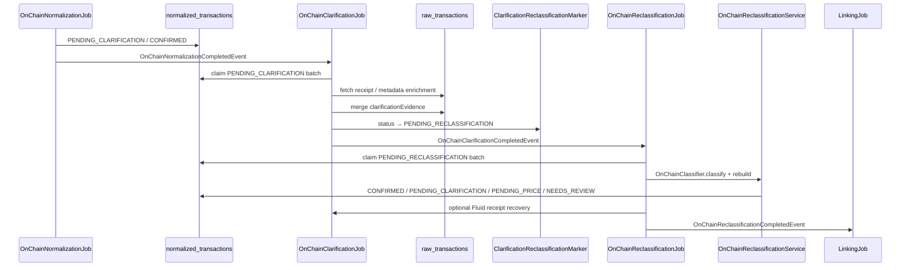
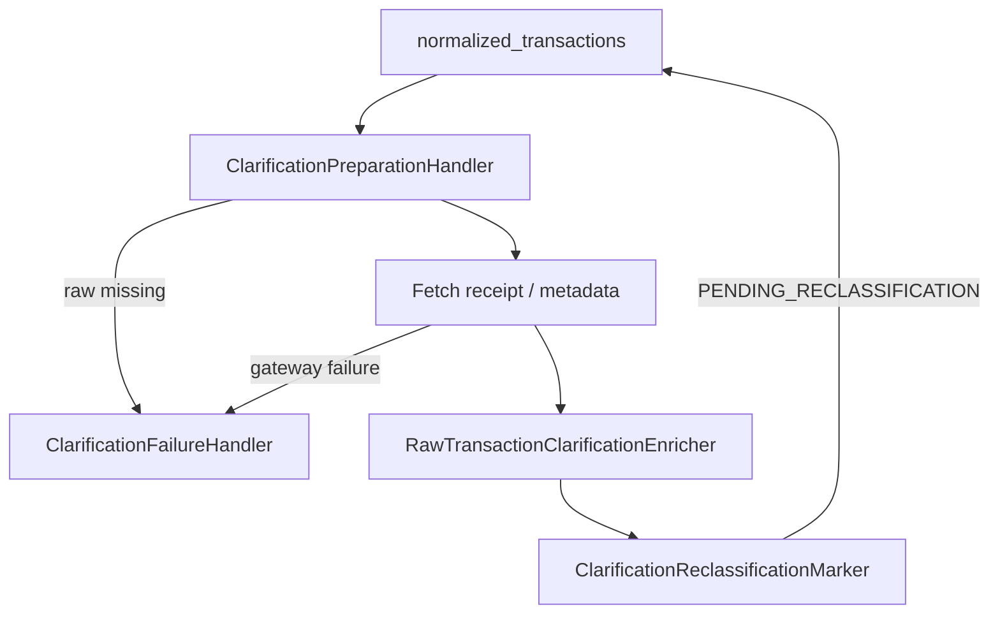
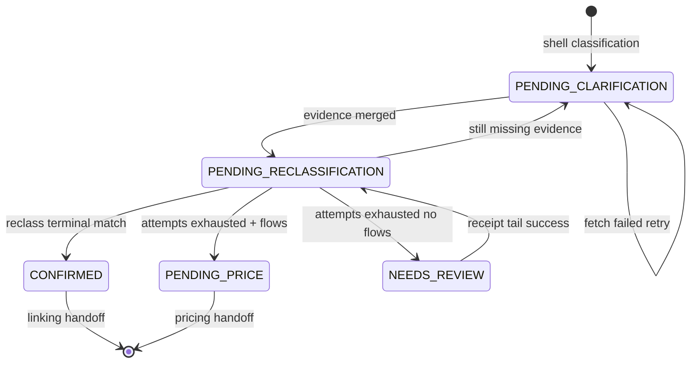

# Clarification & Reclassification

> **Last updated:** 2026-06-05  
> Second-pass enrichment: fetch missing evidence, persist into `raw_transactions`, re-run `OnChainClassifier`, terminalize exhausted rows.

## Why two passes?

Shell classification (`OnChainNormalizationService`) intentionally emits `PENDING_CLARIFICATION` when evidence is missing but recoverable (receipt logs, bridge status, lifecycle peers). Clarification **only** fetches and merges evidence — it does not change `type` or `flows` inline. Reclassification re-runs the full staged classifier on enriched raw evidence and rebuilds the canonical document.

Separation keeps classification deterministic and makes retry / audit boundaries explicit.

## Chain overview



## OnChainClarificationJob / Service

| Component | Responsibility |
|-----------|----------------|
| `OnChainClarificationJob` | Event listener on `OnChainNormalizationCompletedEvent`; drains batches via `ClarificationBatchDrainer` |
| `OnChainClarificationService` | Facade over `MetadataClarificationWorkflowHandler` |
| `MetadataClarificationWorkflowHandler` | Batch claim, parallel worker pool, per-row clarify |
| `ReceiptClarificationWorkflowHandler` | Dedicated full-receipt batch path (also invoked inside metadata handler tails) |
| `ClarificationPreparationHandler` | Load raw, eligibility, fetch receipt |
| `RawTransactionClarificationEnricher` | Merge `ClarificationReceiptEnrichment` into raw doc |
| `ClarificationFailureHandler` | Attempt counters, lease release, failure transitions |
| `ClarificationReclassificationMarker` | Persist `PENDING_RECLASSIFICATION` |

### Batch composition (`processNextBatch`)

1. `PendingClarificationQueryService.claimNextBatch` — rows with `status = PENDING_CLARIFICATION` (leased).
2. If full-receipt enabled:
   - `claimActiveNeedsReviewBatch` — `NEEDS_REVIEW` receipt tail
   - `claimConfirmedFluidReceiptBatch` — Fluid vault receipt recovery
   - `claimMulticallMissingTransferBatch` — multicall transfer gaps

Configurable: `OnChainClarificationProperties` (`batchSize`, `maxAttempts`, `retryDelaySeconds`, `leaseSeconds`, `threads`, `fullReceipt.*`).

### Per-row clarify flow



Clarification writes enrichment into `raw_transactions` (and `clarificationEvidence` on normalized doc via raw view). It **never** calls `OnChainClassifier` directly.

### Failure and retry policy

`ClarificationPolicyService` centralizes transitions:

| Path | Exhausted attempts | Next status |
|------|-------------------|-------------|
| Metadata clarification | `maxAttempts` reached | `PENDING_RECLASSIFICATION` (reclass will terminalize) |
| Metadata clarification | below max | `PENDING_CLARIFICATION` (retry) |
| Receipt clarification (`NEEDS_REVIEW` tail) | `fullReceipt.maxAttempts` | `PENDING_RECLASSIFICATION` |
| Receipt clarification | below max | unchanged status (retry) |
| Raw missing | — | `NEEDS_REVIEW` + `RAW_TRANSACTION_MISSING` |

Leased batches use `clarificationLeaseUntil` / `clarificationWorkerId` for worker safety.

## OnChainReclassificationJob / Service

| Component | Responsibility |
|-----------|----------------|
| `OnChainReclassificationJob` | Listens to `OnChainClarificationCompletedEvent`, `OnChainReclassificationRequestedEvent` |
| `OnChainReclassificationService` | Loads `PENDING_RECLASSIFICATION`, re-classifies, rebuilds doc |
| `PendingReclassificationQueryService` | Indexed batch query |
| `OnChainNormalizedTransactionBuilder.rebuildAfterReclassification` | Preserve counters / correlation where appropriate |
| `ClarificationReclassificationHandler` | Shared persist path for inline clarification-driven rebuilds (tests / alternate entry) |

### Reclassify steps

1. Load `NormalizedTransaction` + matching `RawTransaction` by shared `id`.
2. `onChainClassifier.classify(rawTransaction)`.
3. `builder.rebuildAfterReclassification(existing, raw, result, now)`.
4. `terminalizeExhaustedClarification` — if still `PENDING_CLARIFICATION` after max attempts:
   - replayable flows → `PENDING_PRICE`
   - otherwise → `NEEDS_REVIEW` + `CLARIFICATION_ATTEMPTS_EXHAUSTED`
5. Enrich protocol name, bridge inbound correction, counterparty, Fluid evidence.
6. Save to `normalized_transactions`.

### Post-reclassification Fluid recovery

When reclassification processes rows and trigger is not already `post-reclassification-fluid-recovery`, `OnChainReclassificationJob` runs `onChainClarificationService.processConfirmedFluidReceiptBatch()`. If rows clarify, it re-publishes `OnChainClarificationCompletedEvent` with that trigger (short-circuit — avoids duplicate `OnChainReclassificationCompletedEvent` in same run). This closes Fluid vault receipt gaps exposed only after type correction.

## Clarification evidence services (pipeline/clarification)

Representative enrichers and gateways merged during clarification:

| Service | Evidence type |
|---------|---------------|
| `LiFiStatusGateway` / `LiFiReceivingTransactionDiscoveryService` | LI.FI bridge status + inbound tx |
| `MayanStatusGateway` / `MayanReceivingTransactionDiscoveryService` | Mayan bridge |
| `AcrossBridgePairLinkService` | Across bridge pairing hints |
| `CowSwapEthFlowSettlementLinkService` | CoW ETH-flow settlement |
| `InternalTransferPairLinkService` | internal transfer peer |
| `BridgePairContinuityRepairService` | bridge continuity |
| `OnChainInternalTransferPairRepairService` | raw peer repair (normalization pass too) |
| `UnmatchedBridgeInboundPricingFallbackService` | bridge inbound pricing hints |
| `ProtocolAttributionClassifier` | protocol attribution after receipt |
| `GmxV2RefundClassifier`, `EtherFiOftBridgeInClassifier` | protocol-specific receipt classifiers |
| `AddressPoisoningDetector`, `ScamDisperseClonePhishingTagger` | safety tagging |
| `NftMintRetagger` | NFT mint re-tag |

These run inside clarification fetch/enrich paths; their output is persisted as raw evidence for reclassification.

## Status lifecycle (clarification scope)



### Counters on normalized doc

| Field | Meaning |
|-------|---------|
| `clarificationAttempts` | metadata clarification tries (mirrored from raw view) |
| `fullReceiptClarificationAttempts` | full receipt / review tail tries |
| `missingDataReasons` | classifier + runtime reason codes (e.g. `NATIVE_SETTLEMENT_TRANSFER_EVIDENCE_REQUIRED`) |
| `clarificationEvidence` | BSON snapshot of merged receipt fragments |

## Event summary

| Event | From | To |
|-------|------|-----|
| `OnChainNormalizationCompletedEvent` | `OnChainNormalizationJob` | `OnChainClarificationJob` |
| `OnChainClarificationCompletedEvent` | `OnChainClarificationJob` | `OnChainReclassificationJob` |
| `OnChainClarificationCompletedEvent` (recovery) | `OnChainReclassificationJob` | `OnChainReclassificationJob` (Fluid loop) |
| `OnChainReclassificationCompletedEvent` | `OnChainReclassificationJob` | `LinkingJob` |
| `OnChainReclassificationRequestedEvent` | manual / watchdog | `OnChainReclassificationJob` |

## Interaction with Bybit normalization

Bybit rows generally skip on-chain clarification (no `raw_transactions` receipt). Orphan / continuity repairs that touch Bybit use dedicated services:

- `BybitInternalTransferOrphanFallbackService`
- `BybitTransferContinuityRepairService`
- `BybitOnChainEarnOrphanRepairService`

These run in linking or clarification-adjacent paths, not in `OnChainClarificationJob` batch composition.

## Rules by transaction type

Clarification / reclassification scope — which types enter the chain and typical outcomes. Authoritative reason codes live in `ClassificationReasonCode` and [rules/README.md](rules/README.md).

| Type | Clarification trigger (examples) | Evidence fetched | Reclass outcome |
|------|----------------------------------|------------------|-----------------|
| `SWAP` (multicall / aggregator) | `MULTICALL_RECEIPT_REQUIRED` | full transaction receipt, internal transfers | `CONFIRMED` with complete flows |
| `LP_ENTRY` / `LP_EXIT` | `LP_POSITION_CORRELATION_REQUIRED` | receipt logs, position NFT token id | `CONFIRMED` or remain clarify |
| `BRIDGE_OUT` | bridge router correlation | LI.FI / Mayan / Across status APIs | `CONFIRMED` + `matchedCounterparty` |
| `BRIDGE_IN` | inbound settlement | receiving tx discovery, registry correction | `BRIDGE_IN` type correction |
| `EXTERNAL_TRANSFER_IN` | `NATIVE_SETTLEMENT_TRANSFER_EVIDENCE_REQUIRED` | BlockScout/native settlement trace | pricing-ready `CONFIRMED` |
| `LENDING_*` (Euler) | `EULER_BATCH_DECODER_REQUIRED` | batch receipt decode | typed lending flows |
| GMX lifecycle | `GMX_*_CORRELATION_REQUIRED` | settlement / request correlation | split request vs settlement types |
| `VAULT_*` (Fluid) | Fluid operate log | receipt + Fluid NFT evidence | post-recovery second clarify pass |
| `UNKNOWN` / `NEEDS_REVIEW` | receipt tail | full receipt | upgraded type or stay review |
| `INTERNAL_TRANSFER` | peer missing (upstream) | raw peer repair (normalization) + pair link (clarification) | `CONFIRMED` with continuity |
| Excluded / spam | none | — | unchanged excluded |

### Terminalization shortcuts

`OnChainReclassificationService.shouldTerminalizeAfterReceiptOnlyClarification` allows exhaustion terminalization when only receipt-specific reason codes remain (native settlement, LP correlation, Euler decoder, GMX correlation codes) — even if metadata attempt count is below max.

## Code map

```
backend/src/main/java/com/walletradar/ingestion/
├── job/clarification/
│   ├── OnChainClarificationJob.java
│   ├── OnChainClarificationService.java
│   ├── MetadataClarificationWorkflowHandler.java
│   ├── ReceiptClarificationWorkflowHandler.java
│   ├── ClarificationReclassificationMarker.java
│   ├── ClarificationReclassificationHandler.java
│   └── ClarificationBatchDrainer.java
├── job/normalization/
│   ├── OnChainReclassificationJob.java
│   └── OnChainReclassificationService.java
└── pipeline/clarification/
    ├── RawTransactionClarificationEnricher.java
    ├── PendingClarificationQueryService.java
    └── PendingReclassificationQueryService.java
```

## Related reading

- [Normalization overview](01-overview.md)
- [On-chain classification](02-onchain-classification.md)
- [Normalization rules index](rules/README.md)
- [Pipeline orchestration](../../overview/05-pipeline-orchestration.md)
