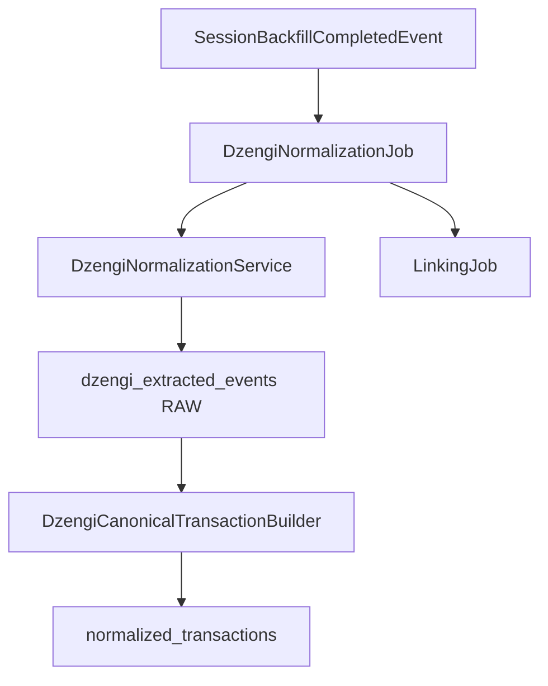

# Dzengi Normalization

> **Last updated:** 2026-07-08  
> Materializes Dzengi CEX ledger evidence into `normalized_transactions` using the same canonical schema as on-chain and Bybit rows.

## Role in the pipeline

`DzengiNormalizationService` reads immutable extracted ledger rows, maps them through `DzengiCanonicalTransactionBuilder`, upserts canonical documents, and marks source rows `CONFIRMED`. `DzengiNormalizationJob` drives batch processing and publishes `DzengiNormalizationCompletedEvent` for linking.

Dzengi normalization runs **after** on-chain reclassification and **in parallel with** Bybit normalization. Linking waits for both venue completion events when integrations are enabled.

## Event-driven triggers

| Trigger | Handler | Notes |
|---------|---------|-------|
| `SessionBackfillCompletedEvent` | `DzengiNormalizationJob.onSessionBackfillCompleted` | Session-scoped when Dzengi integration present |
| Manual `runNormalization()` | direct call | Ops / tests |

Job characteristics match other CEX jobs: `@Async(PIPELINE_STAGE_EXECUTOR)`, single-flight guard, heartbeat to `SessionPipelineActivityService` with stage `DZENGI_NORMALIZATION`.

## Input source

**`dzengi_extracted_events`** (`status = RAW`) — sole path via `PendingDzengiExtractedRowQueryService`.

Rows with `outOfScope = true` (e.g. leverage/CFD fills excluded at extraction) are skipped and never reach the canonical builder.

## Canonical type routing

`DzengiCanonicalTransactionBuilder` maps `canonicalType` on extracted rows:

| Extracted `canonicalType` | `NormalizedTransactionType` | Notes |
|---------------------------|----------------------------|-------|
| `BUY` / `SELL` | `SWAP` | Spot fills; execution price on quote leg |
| `EXTERNAL_TRANSFER_IN` | `EXTERNAL_TRANSFER_IN` | Deposits; `txHash` from `blockchainTransactionHash` |
| `EXTERNAL_TRANSFER_OUT` | `EXTERNAL_TRANSFER_OUT` | Withdrawals |
| `CEX_DERIVATIVE_SETTLEMENT` | `CEX_DERIVATIVE_SETTLEMENT` | Trading position history settlements |
| `FEE` | Fee row | Ledger fee lines |

Wallet address on canonical rows: `DZENGI:<userId>`.

## Product scope boundaries

See [ADR-048](../../adr/ADR-048-dzengi-product-scope.md):

- **In scope:** spot trades, fiat/crypto ledger, on-chain deposit/withdraw with hash, derivative settlement history.
- **Out of scope (excluded at extraction):** leverage and CFD symbol fills (`LEVERAGE_FILL_EXCLUDED`).

## Cross-system linking

Deposit/withdraw rows carrying `blockchainTransactionHash` participate in venue-agnostic FA-001 linking per [ADR-049](../../adr/ADR-049-venue-agnostic-cex-transfer-linking.md) (same `txHash` contract as Bybit ADR-013).

## Pricing

- Spot legs: `PriceSource.EXECUTION` where fill price is present.
- Fiat **BYN** legs: `PriceSource.DZENGI` via `DzengiFxPriceSourceAdapter` ([ADR-050](../../adr/ADR-050-dzengi-fiat-fx-pricing.md)).

## Related

- [Dzengi adaptation rules](rules/dzengi-adaptation.md)
- [Bybit normalization](03-bybit-normalization.md) — reference CEX pattern
- [application.cex module](../../overview/modules/application-cex.md)
