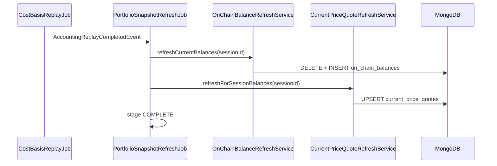

# Portfolio Snapshot — Overview

> **Pipeline stage:** `PORTFOLIO_SNAPSHOT_REFRESH`  
> **Last updated:** 2026-06-05

Portfolio snapshot is **not** a persisted portfolio document. It is the final pipeline stage that materializes **live evidence** (`on_chain_balances`, `current_price_quotes`) after accounting replay, consumed by dashboard GET on read.

## Entry points

| Class | Path |
|-------|------|
| `PortfolioSnapshotRefreshJob` | `backend/.../costbasis/application/PortfolioSnapshotRefreshJob.java` |
| `OnChainBalanceRefreshService` | `backend/.../costbasis/application/OnChainBalanceRefreshService.java` |
| `CurrentPriceQuoteRefreshService` | `backend/.../pricing/application/CurrentPriceQuoteRefreshService.java` |
| `SessionPipelineResumeScheduler` | `backend/.../session/application/SessionPipelineResumeScheduler.java` |

## Sequence

## Triggers

- `AccountingReplayCompletedEvent` (primary, async)
- `runSnapshotRefresh()` manual / all sessions
- Watchdog re-emits replay completion when ledger exists but balances missing

Global mutex: only one snapshot refresh run at a time.

## Writes

| Collection | Semantics |
|------------|-----------|
| `on_chain_balances` | **Replace** per session — one row per `(wallet, network, accountingIdentity)` at `capturedAt` |
| `current_price_quotes` | **Upsert** global quotes keyed by symbol/source; 15-minute TTL skip |

## Does not write

- `asset_ledger_points` (replay owns)
- No portfolio snapshot document

## Rules by transaction type

At this stage normalized types are not re-processed. Snapshot refresh:

- Discovers candidate assets from **confirmed** normalized transactions for session wallets
- Fetches live quantities via Ankr → Blockscout → Etherscan → RPC fallback
- Refreshes quotes for symbols present in session balances

Transaction-type-specific valuation overlays (Aave index, GMX market tokens) happen at **dashboard read** — see [Dashboard read model](02-dashboard-read-model.md).

## Related

- [Dashboard read model](02-dashboard-read-model.md)
- [Conservation gate](03-conservation-gate.md)
- [Replay](../replay/01-overview.md)
