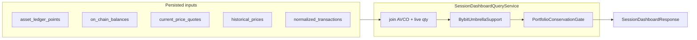

# Portfolio Snapshot — Dashboard Read Model

> **Last updated:** 2026-06-05  
> Dashboard assembly is **read-time**; GET endpoints are datastore-only.

## Entry point

`SessionDashboardQueryService` — `backend/.../ingestion/wallet/query/SessionDashboardQueryService.java`

API: `GET /api/v1/sessions/{sessionId}/dashboard`

## Data flow

## Assembly steps

1. Load latest `OnChainBalance` per `(wallet, network, accountingAssetIdentity)` for session
2. Load full `AssetLedgerPoint` history for accounting universe
3. Join ledger AVCO (`quantityAfter`, `basisBackedQuantityAfter`, `avcoAfterUsd`, realised PnL) with live quantities
4. Price via `current_price_quotes` → fallback `historical_prices` → stablecoin policy
5. Bybit umbrella: aggregate FUND/UTA/EARN sub-ledgers; clamp vs live API (`BybitLiveBalanceService`)
6. Protocol overlays: Aave index-accruing, GMX market token snapshot valuation
7. Compute portfolio summary + per-position unrealised PnL
8. Run [conservation gate](03-conservation-gate.md)

## Position issue codes

| Code | Meaning |
|------|---------|
| `missing_replay_point` | Live balance without matching ledger point |
| `coverage_gap` | Basis-backed qty < live qty |
| `yield_accrual` | Receipt token accrual vs ledger |
| `history_flags` | Unresolved normalized flags |

## Rules by transaction type

Dashboard does not re-classify types. Holdings aggregate by `accountingFamilyIdentity`:

| Type families | Dashboard section |
|---------------|-------------------|
| Spot tokens (SWAP legs, transfers, rewards) | Tokens |
| LP types | LP cards (when API populated) |
| Lending types | Inline lending summary on `/` (simplified); full UI on `/lending` |

Dust rule (frontend): hide when `quantity * priceUsd < 0.5` if `hideSmallAssets` enabled.

## Related

- [Frontend dashboard](../../frontend/dashboard.md)
- [Conservation gate](03-conservation-gate.md)
