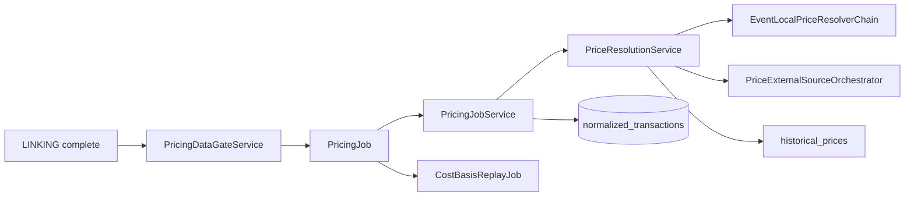

# Pricing — Overview

> **Last updated:** 2026-07-08  
> **Pipeline stage:** `PRICING` (`UserSession.PipelineStage.PRICING`)

Pricing resolves **USD unit prices** for priceable flows on canonical `normalized_transactions` and persists them on each flow (`unitPriceUsd`, `valueUsd`, `priceSource`). Pricing does not compute AVCO, move basis, or mutate quantity semantics — replay consumes priced flows downstream.

Rows enter pricing only after linking completes and classification debt is cleared.

## Related docs

| Doc | Focus |
|-----|-------|
| [Pipeline index](../README.md) | Stage sequence |
| [Resolver chain](02-resolver-chain.md) | Event-local and external fallback order |
| [Transaction types](../../reference/transaction-types.md) | Per-type pricing contracts |

## Inputs and outputs

| Direction | Artifact | Collection / field |
|-----------|----------|-------------------|
| In | Linked canonical rows | `normalized_transactions` with `status = PENDING_PRICE` |
| Out | Priced flows | `flows[].unitPriceUsd`, `valueUsd`, `priceSource` |
| Out | Row status | `CONFIRMED` or `PRICE_UNRESOLVABLE` in `missingDataReasons[]` |
| Out | Historical cache | `historical_prices` |
| Signal | Stage complete | `PricingCompletedEvent` → triggers `ACCOUNTING_REPLAY` |

## Entry points (verified)

| Class | Package | Role |
|-------|---------|------|
| `PricingJob` | `pricing/application/` | Stage driver; listens for `LinkingCompletedEvent` |
| `PricingJobService` | `pricing/application/` | Batch load, parallel resolve, persist |
| `PriceResolutionService` | `pricing/application/` | Per-row resolver orchestration |
| `PriceableFlowPolicy` | `pricing/application/` | Which flows require market price |
| `PricingDataGateService` | `pricing/application/` | `avcoReady` gate snapshot |
| `StalePriceUnresolvedRepairService` | `pricing/application/` | Clear stale `PRICE_UNRESOLVABLE` when all flows resolved |
| `PendingPricingQueryService` | `pricing/application/` | Ordered batch selection |

## Batch processing

`PricingJobService.processNextBatch`:

1. Load next `PENDING_PRICE` batch (`PendingPricingQueryService`)
2. Prepare shared external quote plan (`BatchPriceQuoteResolver`)
3. Resolve rows in parallel lanes (`PricingProperties.parallelLanes`)
4. Persist batch + fetched quotes to cache
5. Repeat until empty, then run stale-reason repair and log gate snapshot

## Priceable vs continuity flows

`PriceableFlowPolicy.requiresMarketPrice` decides per flow:

- **Priceable:** `BUY`, `SELL`, `FEE`, selected `TRANSFER` (pegged native, Bybit earn, lending-loop principal inflow)
- **Not priceable:** continuity principal on rows with `continuityCandidate = true` and correlated identity
- **Skipped:** `PRICING_SKIPPED` symbols (`CanonicalAssetCatalog.isPricingSkipped`)
- **Non-priceable types:** `APPROVE`, `ADMIN_CONFIG`, `UNKNOWN`

`TRANSFER` legs are never market-priced by themselves when they are continuity principal.

## Gate and readiness

At pricing completion, `PricingDataGateService.snapshot()` reports:

- `avcoReady` — no blocking review, no pending price/clarification/reclassification
- `pendingPriceCount`, `unresolvedPriceCount`
- `needsReviewCount` vs `excludedNeedsReviewCount` (distinct buckets)

Pricing failure does **not** remove quantity from replay; unresolved prices set `hasIncompleteHistory` during replay.

## Implications

- Euro-backed stables (`EURC`) prefer ECB FX over exchange candles
- Bybit market data may rank before Binance for listed assets
- **Dzengi BYN:** `DzengiFxPriceSourceAdapter` (`PriceSource.DZENGI`) inverts USD/BYN kline for Dzengi-origin rows ([ADR-050](../../adr/ADR-050-dzengi-fiat-fx-pricing.md))
- CoinGecko is fallback only — not primary for two-year DeFi backfill
- `SWAP_DERIVED` requires exactly one priced asset among non-fee swap legs (see ADR-021 multi-sell rule)
- Rows with `excludedFromAccounting = true` never enter pricing

## Rules by transaction type

Scoped to **whether and how pricing resolves USD** for each canonical type.

| Type | Pricing rule |
|------|--------------|
| `SWAP` | Execution ratio from wallet-boundary legs; multi-sell sums all SELL values (ADR-021); not priceable if only outbound leg |
| `BUY` / `SELL` | Execution price from Bybit fills when present; else event-local / external |
| `EXTERNAL_TRANSFER_IN` | Receive-time FMV via external sources when no tx-local price |
| `EXTERNAL_TRANSFER_OUT` | Event-time FMV unless continuity / pending-request family |
| `REWARD_CLAIM` / `LP_FEE_CLAIM` | Acquisition at receive-time FMV |
| `SPONSORED_GAS_IN` | Zero-cost; no market acquisition |
| `WRAP` / `UNWRAP` | Underlying native price for fee valuation only; principal is continuity |
| `BRIDGE_OUT` / `BRIDGE_IN` | Principal carry — no market price on principal; fees priced |
| `INTERNAL_TRANSFER` | No principal pricing; fees only |
| `LENDING_DEPOSIT` / `LENDING_WITHDRAW` | Principal carry; fees/reward side-flows priced |
| `VAULT_DEPOSIT` / `VAULT_WITHDRAW` | Same |
| `LP_ENTRY` / `LP_EXIT` | Principal `TRANSFER` not synthetically sold/bought; fees/rewards priced separately |
| `LP_ENTRY_REQUEST` / `LP_EXIT_REQUEST` | Non-priceable until correlation resolved |
| `DEX_ORDER_REQUEST` | Non-priceable until settlement |
| `DEX_ORDER_SETTLEMENT` | Priced as part of finalized swap economics |
| `BORROW` | Reserve asset `BUY` priced; debt markers not priced |
| `REPAY` | Reserve asset `SELL` priced |
| `LENDING_LOOP_OPEN` | Event-local unit price from stable supply evidence when present |
| `LENDING_LOOP_*` | Share legs continuity; returned asset priced on decrease/close |
| `STAKING_DEPOSIT` / `STAKING_WITHDRAW` | Liquid-staking principal continuity; harvested rewards `BUY` |
| `STAKING_WITHDRAW_REQUEST` | Non-priceable pending |
| `DERIVATIVE_ORDER_*` | Collateral/fee/settlement flows — not underlying spot BUY/SELL |
| `FEE` | Priced when policy requires; standalone venue fees may stay outside basis lane |
| `APPROVE` / `ADMIN_CONFIG` | Non-priceable |
| Bybit corridor `EXTERNAL_TRANSFER_*` | Priced once; do not double-price both legs when continuity active |
| Pending-request families | Non-priceable until settlement |
