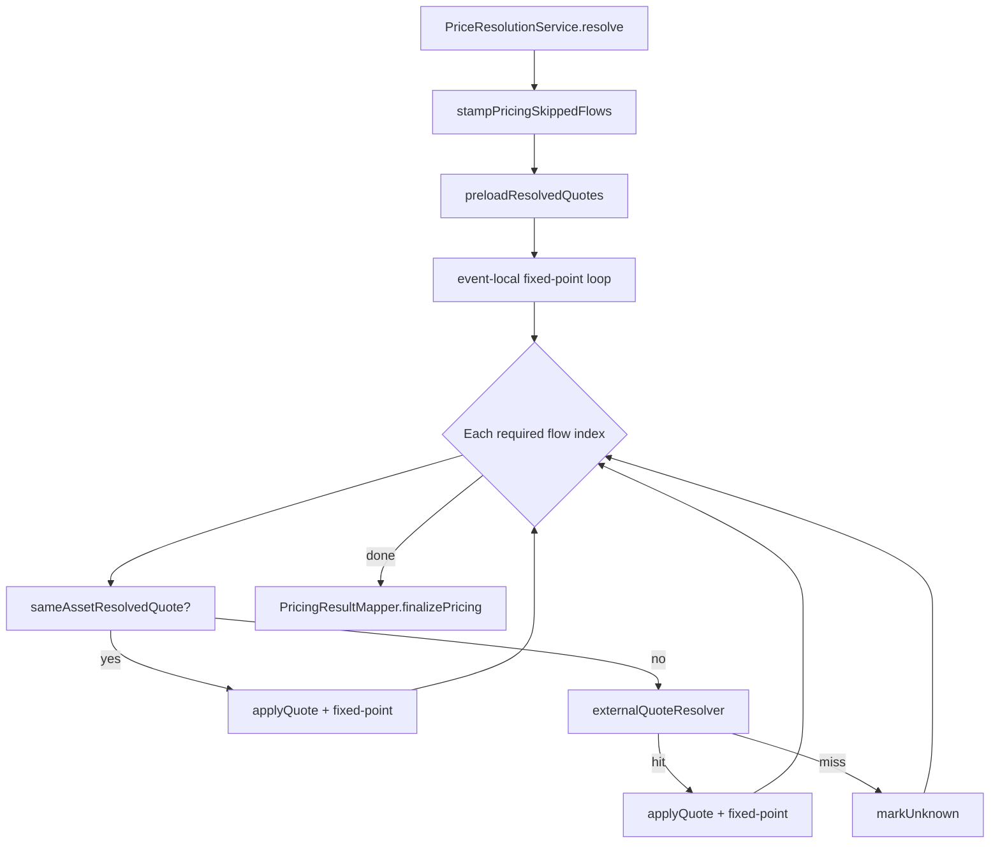
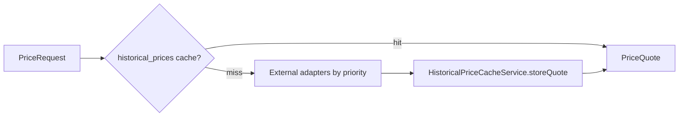

# Pricing — Resolver Chain

> **Last updated:** 2026-06-05  
> **Pipeline stage:** `PRICING`

USD resolution for each priceable flow follows a **two-tier chain**: event-local resolvers first, then external market-data sources with Mongo cache reuse. Implementation center: `PriceResolutionService`.

## Resolution flow

Fixed-point loop: after each quote application, event-local resolvers re-run until no new quotes appear (enables swap-derived pricing of counterpart legs).

## Event-local chain

Spring `@Order` on `EventLocalPriceResolver` implementations; injected list order into `EventLocalPriceResolverChain`:

| Order | Class | Source | Role |
|-------|-------|--------|------|
| 0 | `StablecoinPriceResolver` | `STABLECOIN_PARITY` | USD stablecoins at $1 |
| 10 | `ExecutionPriceResolver` | `EXECUTION` | Canonical execution price (Bybit fills, pre-stamped unit price) |
| 20 | `SwapDerivedPriceResolver` | `SWAP_DERIVED` | Ratio from counterpart BUY/SELL legs in same row |
| 30 | `WrapperPriceResolver` | `WRAPPER_NATIVE` | Wrapper → native mapping |
| 31 | `PeggedNativePriceResolver` | `PEGGED_NATIVE` | Pegged LST / native aliases |

First resolver returning `Optional<PriceQuote>` wins for that pass.

### Swap-derived rules

`SwapDerivedPriceResolver`:

- Valid only when priced asset appears once among non-fee swap flows
- Bails on circular same-symbol derivation (ETH BUY vs ETH SELL)
- **Multi-sell (ADR-021):** sums all SELL flow values as denominator when multiple same-direction legs share symbol
- Multi-BUY same symbol: quantities summed; same derived unit price for each leg

### Continuity exclusion

Event-local resolvers skip flows where `PriceableFlowPolicy.isContinuityPrincipal` is true — principal carry rows do not get market quotes.

## External orchestrator

When event-local chain and same-asset reuse fail, `PriceExternalSourceOrchestrator.resolve`:

### Adapter priority

`PriceExternalSourceOrchestrator.sourcePriority`:

| Priority | Adapter | `PriceSource` |
|----------|---------|---------------|
| 0 | `EcbEuroStablePriceSourceAdapter` | `ECB` |
| 1 | `BybitPriceSourceAdapter` | `BYBIT` |
| 2 | `BinancePriceSourceAdapter` | `BINANCE` |
| 3 | `CoinGeckoPriceSourceAdapter` | `COINGECKO` |

Adapters filtered by `supports(request)`; `@Order` on beans is secondary to runtime priority map.

Supporting clients: `EcbFxHistoricalClient`, `BybitSymbolMapper`, `BinanceKlineClient`, `CoinGeckoHistoricalClient`, `ExternalPriceMappingService`.

### Cache

`HistoricalPriceCacheService` + `HistoricalPriceRepository` (`historical_prices` collection):

- Cache lookup before network call
- Store on successful fetch
- `BatchPriceQuoteResolver` deduplicates external fetches within batch

## Current quotes (post-replay)

Historical chain above applies to **replay input**. Dashboard live marks use a separate path:

| Class | Role |
|-------|------|
| `CurrentPriceQuoteRefreshService` | Refresh `current_price_quotes` after replay |
| `GmxProtocolSnapshotValuationService` | Protocol snapshot valuation for GMX market tokens |

Triggered by `PortfolioSnapshotRefreshJob`, not `PricingJob`.

## Special policies

| Policy | Where |
|--------|-------|
| Pricing skipped symbols | `CanonicalAssetCatalog.isPricingSkipped` → `PriceSource.PRICING_SKIPPED` |
| Aave / Sonne aToken family aliases | `SYMBOL_ALIASES` in `CanonicalAssetCatalog` — see table below |
| EUR-backed stables | ECB preferred over exchange |
| Long-tail DeFi | Prefer tx-local swap-derived over generic candles |
| Stale `PRICE_UNRESOLVABLE` | Cleared by `StalePriceUnresolvedRepairService` when all flows resolved |

### Canonical symbol aliases — derivative / receipt tokens

`CanonicalAssetCatalog.SYMBOL_ALIASES` maps derivative receipt tokens to their priceable underlying. Used by `WrapperPriceResolver` (event-local) and the external adapter chain (`canonicalMarketSymbol`).

#### ETH family

| Symbol | Canonical | Network / Notes |
|--------|-----------|-----------------|
| `WETH` | `ETH` | All networks (wrapped native) |
| `AWETH` | `ETH` | Base (aWETH), Ethereum Aave V2 |
| `AETHWETH` | `ETH` | Ethereum Aave V3 |
| `AARBWETH` | `ETH` | Arbitrum |
| `AOPTWETH` | `ETH` | Optimism |
| `APOLWETH` | `ETH` | Polygon |
| `ABASWETH` | `ETH` | Base Aave V3 (prefixed variant) |
| `ALINWETH` | `ETH` | Linea |
| `AMANWETH` | `ETH` | Mantle |
| `AZKSWETH` | `ETH` | zkSync |
| `ASCRWETH` | `ETH` | Scroll |
| `CMETH`, `METH`, `WEETH` | `ETH` | Bybit CMETH, Mantle METH, EtherFi weETH |
| `VBETH`, `YVVBETH` | `ETH` | Venus / Yearn vault ETH |

#### BTC family

| Symbol | Canonical | Network / Notes |
|--------|-----------|-----------------|
| `WBTC` | `BTC` | All networks |
| `AWBTC` | `BTC` | Ethereum Aave V2 |
| `AETHWBTC` | `BTC` | Ethereum Aave V3 |
| `AARBWBTC` | `BTC` | Arbitrum |
| `AOPTWBTC` | `BTC` | Optimism |
| `APOLWBTC` | `BTC` | Polygon |
| `AAVAWBTC` | `BTC` | Avalanche |
| `ABASWBTC` | `BTC` | Base |

#### USD-stable family

| Symbol | Canonical | Notes |
|--------|-----------|-------|
| `AAVAUSDC`, `AMANUSDC`, `AARBUSDC`, `AETHUSDC` | `USDC` | Aave USDC per network |
| `AOPTUSDC`, `APOLUSDC`, `ABASUSDC`, `ALINUSDC` | `USDC` | Aave USDC per network |
| `AETHUSDT`, `AARBUSDT`, `AOPTUSDT`, `APOLUSDT`, `AAVAUSDT` | `USDT` | Aave USDT per network |
| `USDBC` | `USDC` | Base bridged USDC (pre-native USDC) |
| `VBUSDC` | `USDC` | Venus Binance USDC |
| `SOUSDC` | `USDC` | Sonne Finance (Compound fork) USDC |

#### Other derivatives

| Symbol | Canonical | Notes |
|--------|-----------|-------|
| `AAVAGHO` | `GHO` | Avalanche Aave GHO |
| `AETHGHO` | `GHO` | Ethereum Aave GHO |
| `AAAVEURC` | `EURC` | Avalanche Aave EURC |
| `AMANWMNT` | `MNT` | Mantle Aave WMNT |
| `AARBARB` | `ARB` | Arbitrum Aave ARB |
| `AZKSZK` | `ZK` | zkSync Aave ZK |
| `SOETH`, `SOWBTC` | `ETH`, `BTC` | Sonne Finance ETH/BTC receipt |
| `WBNB` | `BNB` | BSC wrapped BNB |
| `WAVAX`, `SAVAX`, `AAVAWAVAX`, `AAVASAVAX` | `AVAX` | Avalanche variants |

## Rules by transaction type

Resolver behavior per type (which tier applies):

| Type | Typical resolution path |
|------|-------------------------|
| `SWAP` | `ExecutionPriceResolver` or `SwapDerivedPriceResolver`; external for residual leg |
| `BUY` / `SELL` | `ExecutionPriceResolver` (Bybit) → external fallback |
| Stablecoin leg in swap | `StablecoinPriceResolver` first |
| `EXTERNAL_TRANSFER_IN` / `REWARD_CLAIM` | External orchestrator (Bybit → Binance → CoinGecko) |
| `EXTERNAL_TRANSFER_OUT` | External at event time unless continuity-skipped |
| `WRAP` / `UNWRAP` | `WrapperPriceResolver` / native external for fees |
| `BORROW` / `REPAY` reserve leg | External or execution |
| `LENDING_LOOP_OPEN` | Event-local from normalized stable supply ratio |
| Bybit `INTERNAL_TRANSFER` pegged native | `PeggedNativePriceResolver` + external |
| Bybit Earn / Flexible Savings | Market quote both legs (`PriceableFlowPolicy`) |
| `EURC` / euro stables | `EcbEuroStablePriceSourceAdapter` |
| Continuity types (`BRIDGE_*`, `LENDING_DEPOSIT`, …) | Principal: no resolver; `FEE`/`BUY` side-flows: normal chain |
| `LP_ENTRY` / `LP_EXIT` principal | Not swap-derived; no synthetic LP token sale |
| Unresolvable | `markUnknown` → `PRICE_UNRESOLVABLE`, replay continues |
