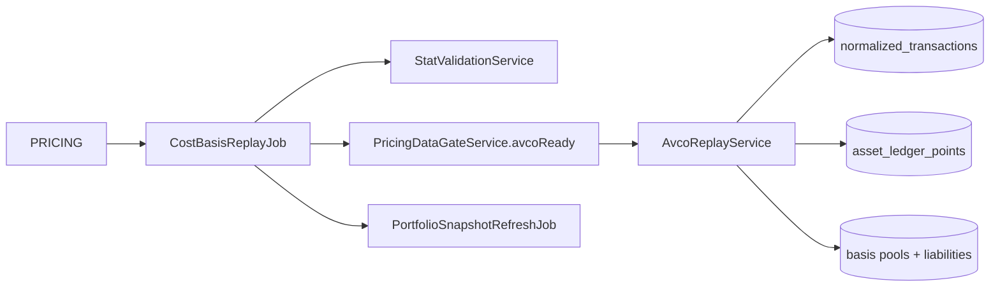
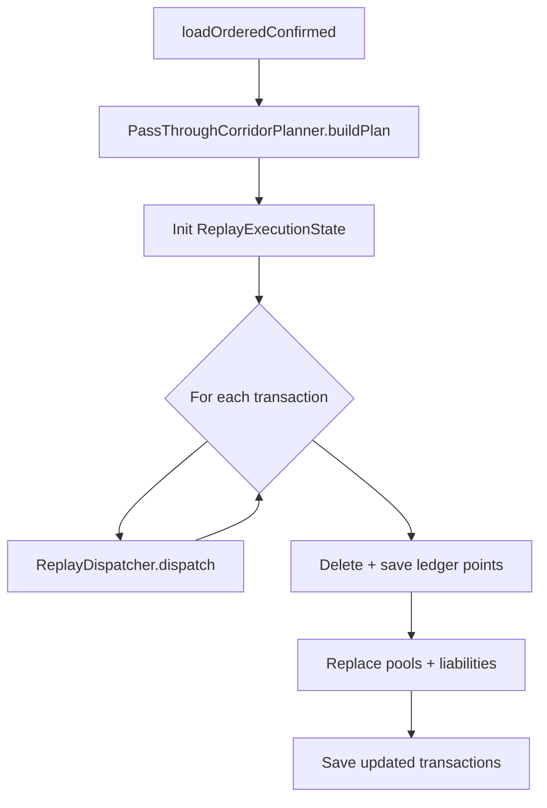

# Replay — Overview

> **Last updated:** 2026-06-05  
> **Pipeline stage:** `ACCOUNTING_REPLAY`

Replay is the execution engine for cost basis. It walks confirmed canonical transactions in time order, applies specialised handlers, and materialises `asset_ledger_points` plus auxiliary books.

**Driver:** `CostBasisReplayJob`  
**Core service:** `AvcoReplayService`

## Related docs

| Doc | Focus |
|-----|-------|
| [Handlers](02-handlers.md) | `ReplayDispatcher` routing table |
| [Ledger & state](03-ledger-and-state.md) | `ReplayExecutionState`, `AssetLedgerPoint` |
| [Cost basis overview](../cost-basis/01-overview.md) | AVCO policy summary |

## Pipeline position



## CostBasisReplayJob phases

For each session (`runReplayForSession`):

1. **Stat validation loop** — `StatValidationService.processNextBatch` promotes/demotes rows
2. **Replay-safe review promotion** — `promoteReplaySafeNeedsReview`
3. **Gate check** — `avcoReady` and `pendingStatCount == 0`
4. **Replay** — `AvcoReplayService.replayConfirmed` when forced or ledger empty or promotions occurred
5. **Event** — `AccountingReplayCompletedEvent`

Blocked gate → stage `ACCOUNTING_REPLAY / BLOCKED` (not COMPLETE).

## AvcoReplayService algorithm



Universe binding via `AccountingUniverseService.bindUniverse` during scoped replay.

## Input predicate

```text
status = CONFIRMED
AND excludedFromAccounting != true
```

Scope filter: session `memberRefs` (wallet addresses + Bybit account refs).

## Ordering

| Key | Direction |
|-----|-----------|
| `blockTimestamp` | ASC |
| `transactionIndex` | ASC |
| `_id` | ASC |

## Idempotency

Full replay **replaces** universe outputs:

- `assetLedgerPointRepository.deleteAllByAccountingUniverseId`
- `counterpartyBasisPoolService.replaceUniversePools`
- `lpReceiptBasisPoolService.replaceUniversePools`
- `borrowLiabilityTracker.replaceUniverseLiabilities`

Same inputs + order → identical outputs.

## Defensive skips

`ReplayDispatcher` returns early when:

- `excludedFromAccounting = true`
- Bybit self-transfer (`isBybitSelfTransfer`)
- Duplicate continuity fingerprint (`seenContinuityFlows`)

## Rules by transaction type

What replay **does** with each type at dispatch (handler detail in [02-handlers.md](02-handlers.md)):

| Type | Route |
|------|-------|
| `LENDING_LOOP_REBALANCE` | `EULER_LOOP` |
| GMX LP entry request/settlement | `GMX_LP_ENTRY_*` |
| Receipt-pool `LP_ENTRY` | `LP_RECEIPT_ENTRY` |
| `LP_EXIT_SETTLEMENT` | `ASYNC_LP_EXIT_SETTLEMENT` |
| CL `LP_EXIT` | `POSITION_SCOPED_LP_EXIT` |
| Liquid-staking pairs | `LIQUID_STAKING` + generic remainder |
| Family-equivalent custody | `FAMILY_EQUIVALENT_CUSTODY` + remainder |
| All others | `GENERIC` per-flow dispatch |
| `BORROW` / `REPAY` | Generic path invokes borrow handlers |
| `DEX_ORDER_*` | `AsyncSpotOrderReplayHandler` via generic |
| Excluded / self-transfer | Skipped |
