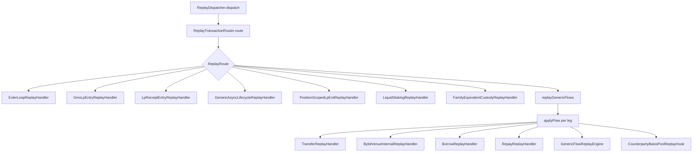

# Replay — Handlers

> **Last updated:** 2026-06-05  
> **Pipeline stage:** `ACCOUNTING_REPLAY`

Transaction-level replay routing is centralised in `ReplayDispatcher`, fed by `ReplayTransactionRouter`. Specialised handlers own non-generic lifecycle shapes; everything else flows through per-leg `applyFlow`.

## Dispatch architecture

## Router table

`ReplayTransactionRouter` → `ReplayRoute` enum:

| Route | Matcher | Handler |
|-------|---------|---------|
| `EULER_LOOP` | `type == LENDING_LOOP_REBALANCE` | `EulerLoopReplayHandler` |
| `GMX_LP_ENTRY_REQUEST` | `GmxLpEntryReplayHandler.isGmxLpEntryRequest` | `applyRequest` |
| `GMX_LP_ENTRY_SETTLEMENT` | `isGmxLpEntrySettlement` | `applySettlement` |
| `LP_RECEIPT_ENTRY` | `LpReceiptEntryReplayHandler.isLpReceiptEntry` | `apply` |
| `ASYNC_LP_EXIT_SETTLEMENT` | `type == LP_EXIT_SETTLEMENT` | `GenericAsyncLifecycleReplayHandler.applyAsyncLpExitSettlement` |
| `POSITION_SCOPED_LP_EXIT` | `PositionScopedLpExitReplayHandler.isPositionScopedLpExit` | `apply` |
| `LIQUID_STAKING` | `LiquidStakingReplayHandler.selectPrincipalFlows` both non-empty | `applySelected` + generic skip |
| `FAMILY_EQUIVALENT_CUSTODY` | `FamilyEquivalentCustodyReplayHandler.selectFlows` pairs non-empty | `applySelected` + generic skip |
| `GENERIC` | default | `replayGenericFlows` |

## Handler reference

| Class | Package | Responsibility |
|-------|---------|----------------|
| `TransferReplayHandler` | `replay/handler/` | CARRY_IN/OUT, bridge, external, internal, pending queue |
| `BybitVenueInternalReplayHandler` | `replay/handler/` | Bybit earn principal corridors |
| `LiquidStakingReplayHandler` | `replay/handler/` | AVAX→sAVAX, ETH→cmETH, etc. |
| `FamilyEquivalentCustodyReplayHandler` | `replay/handler/` | Aave-style atomic family carry |
| `GmxLpEntryReplayHandler` | `replay/handler/` | GMX V2 request/settlement escrow |
| `LpReceiptEntryReplayHandler` | `replay/handler/` | Curve/Balancer/Pendle receipt pool deposit |
| `LpReceiptExitReplayHandler` | `replay/handler/` | Receipt pool withdrawal (via generic hook) |
| `PositionScopedLpExitReplayHandler` | `replay/handler/` | Uniswap V3/V4 CL multi-asset bucket |
| `GenericAsyncLifecycleReplayHandler` | `replay/handler/` | Async LP exit settlement allocation |
| `AsyncSpotOrderReplayHandler` | `replay/handler/` | CoW / DEX order buckets |
| `EulerLoopReplayHandler` | `replay/handler/` | Compound/Euler loop share lifecycle |
| `BorrowReplayHandler` | `replay/handler/` | Borrow + liability open |
| `RepayReplayHandler` | `replay/handler/` | Repay + liability match |
| `GenericFlowReplayEngine` | `replay/support/` | BUY/SELL/FEE math |

## Generic flow dispatch

`applyFlow` (in `ReplayDispatcher`) classifies each leg:

- Continuity transfer → `TransferReplayHandler`
- Bybit venue internal → `BybitVenueInternalReplayHandler`
- `BORROW` / `REPAY` types → borrow handlers
- `BUY` / `SELL` / `FEE` → `GenericFlowReplayEngine`
- Counterparty-tracked flows → `CounterpartyBasisPoolReplayHook`

**Composite bucket ordering:** for `lp:` / `wrapper:` continuity buckets, outbound legs process before inbound in same tx (`compositeAwareFlowOrder`).

## Supporting components

| Class | Role |
|-------|------|
| `ReplayTransferClassifier` | Bucket inbound/outbound detection |
| `ReplayPendingTransferKeyFactory` | Pending carry key construction |
| `ReplaySettlementAllocator` | Async settlement principal split |
| `ContinuityCarryService` | Attach late carry to pending inbound |
| `ReplayMarketAuthority` | Trusted price hints during replay |
| `BybitStreamAuthorityCollapser` | Collapse duplicate Bybit stream mirrors |
| `BybitInternalTransferPairer` | Used upstream; replay skips self-transfers |

## Rules by transaction type

Handler selection per canonical type:

| Type | Primary handler(s) |
|------|-------------------|
| `BUY` / `SELL` / `FEE` | `GenericFlowReplayEngine` |
| `SWAP` | Generic multi-leg (SELL then BUY) |
| `INTERNAL_TRANSFER` | `TransferReplayHandler` |
| `BRIDGE_OUT` / `BRIDGE_IN` | `TransferReplayHandler` (bridge carry path) |
| `EXTERNAL_TRANSFER_*` | `TransferReplayHandler` |
| `SPONSORED_GAS_IN` | Generic BUY at zero cost |
| `LENDING_DEPOSIT` / `LENDING_WITHDRAW` | Transfer + counterparty pool |
| `VAULT_DEPOSIT` / `VAULT_WITHDRAW` | Same |
| `LP_ENTRY` | `LpReceiptEntryReplayHandler` or generic REALLOCATE |
| `LP_EXIT` / `LP_EXIT_PARTIAL` / `LP_EXIT_FINAL` | `PositionScopedLpExitReplayHandler` or receipt exit |
| `LP_EXIT_SETTLEMENT` | `GenericAsyncLifecycleReplayHandler` |
| `LP_ENTRY_REQUEST` / `LP_EXIT_REQUEST` | GMX or generic async escrow |
| `LP_FEE_CLAIM` | Generic BUY on reward legs only |
| `STAKING_DEPOSIT` / `STAKING_WITHDRAW` | `LiquidStakingReplayHandler` or generic |
| `STAKING_WITHDRAW_REQUEST` | Pending lifecycle bucket |
| `LENDING_LOOP_OPEN` / `DECREASE` / `CLOSE` | `EulerLoopReplayHandler` |
| `LENDING_LOOP_REBALANCE` | `EulerLoopReplayHandler` only |
| `BORROW` | `BorrowReplayHandler` |
| `REPAY` | `RepayReplayHandler` |
| `DEX_ORDER_REQUEST` / `SETTLEMENT` | `AsyncSpotOrderReplayHandler` |
| `DERIVATIVE_ORDER_*` / `DERIVATIVE_POSITION_*` | Generic fees/collateral; no underlying spot |
| `WRAP` / `UNWRAP` | `FamilyEquivalentCustodyReplayHandler` or generic |
| `REWARD_CLAIM` | Generic BUY |
| Bybit earn transfer | `BybitVenueInternalReplayHandler` |
| `APPROVE` / `ADMIN_CONFIG` | Skipped (non-economic) |
