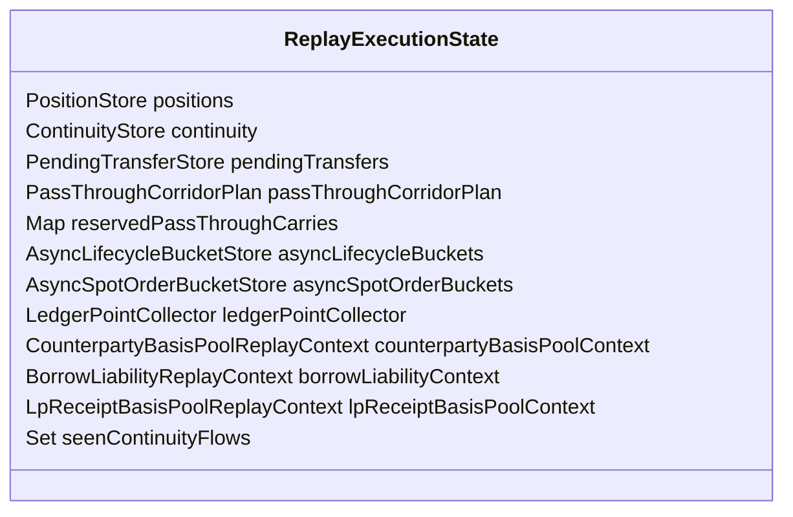
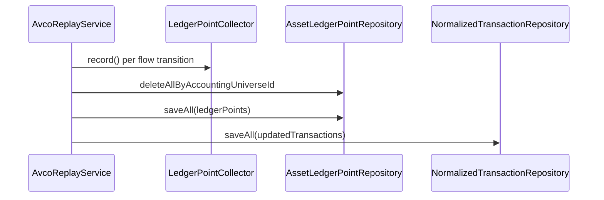

# Replay — Ledger and State

> **Last updated:** 2026-06-05  
> **Pipeline stage:** `ACCOUNTING_REPLAY`

Replay mutates in-memory state while streaming transactions, persisting one immutable `AssetLedgerPoint` per material state transition. State containers live in `ReplayExecutionState`.

## State containers



| Store | Purpose |
|-------|---------|
| `PositionStore` | Per `AssetKey` spot bucket (`PositionState`) |
| `ContinuityStore` | Active carry bridges |
| `PendingTransferStore` | Inbound-first unmatched carry queue |
| `AsyncLifecycleBucketStore` | Request-side escrow (LP, staking) |
| `AsyncSpotOrderBucketStore` | Open DEX order sold quantity |
| `reservedPassThroughCarries` | Isolated corridor basis (ADR-019/020) |

## LedgerPointCollector

**Path:** `costbasis/application/replay/persistence/LedgerPointCollector`

Records when `before` snapshot ≠ `after` state:

```text
id = accountingUniverseId : normalizedTransactionId : flowIndex : replaySequence
```

### Required fields (audit contract)

| Field group | Fields |
|-------------|--------|
| Bucket | `walletAddress`, `networkId`, `accountingAssetIdentity`, `accountingFamilyIdentity` |
| Lifecycle | `normalizedType`, `lifecycleKind`, `lifecycleStage`, `basisEffect` |
| Order | `blockTimestamp`, `transactionIndex`, `replaySequence` |
| Quantities | `quantityBefore/After`, `quantityDelta` |
| Basis | `totalCostBasisBeforeUsd/AfterUsd`, `avcoBeforeUsd/AfterUsd`, `costBasisDeltaUsd` |
| Coverage | `uncoveredQuantityDelta/After`, `basisBackedQuantityAfter`, `quantityShortfallDelta/After` |
| Flags | `hasIncompleteHistoryAfter`, `hasUnresolvedFlagsAfter`, `unresolvedFlagCountAfter` |
| PnL | `realisedPnlDeltaUsd`, `gasDeltaUsd` |
| Provenance | `normalizedTransactionId`, `txHash`, `correlationId`, `flowIndex` |

### Phantom point suppression

`isPhantomCarryPoint` drops zero-delta carry/acquire points that only cosmetic-change uncovered quantity (B-DOUBLE-LEDGER-POINT guard).

## PositionState

**Model:** `PositionSnapshot` (immutable before), `PositionState` (mutable after)

Tracks per exact bucket:

- `quantity`, `totalCostBasisUsd`, `perWalletAvco`
- `uncoveredQuantity`, `quantityShortfall`
- `totalRealisedPnlUsd`, `totalGasPaidUsd`
- `hasIncompleteHistory`, unresolved flag counts

## lifecycleKind / lifecycleStage

Set on ledger points from transaction context:

**lifecycleKind:** `SPOT`, `TRANSFER`, `BRIDGE`, `CUSTODY`, `LENDING`, `STAKING`, `VAULT`, `LP`, `ORDER`, `LOOP`, `WRAP`, `REWARD`, `DERIVATIVE`, `MANUAL`, `UNKNOWN`

**lifecycleStage:** `SINGLE`, `REQUEST`, `SETTLEMENT`, `SOURCE`, `DESTINATION`

## Persistence flow



Auxiliary: `AccountingShortfallAuditService.collectFromLedgerPoints` → `accounting_shortfall_audits`.

## Read paths

| Consumer | Filter |
|--------|--------|
| `SessionDashboardQueryService` | Latest point per bucket in universe |
| `TimelineAvcoAuthority` | Family-grouped spot series (ADR-017) |
| `AssetLedgerQueryService` | Session history API |
| API asset detail | Ordered points by `accountingAssetIdentity` |

Ledger is **universe-scoped** (`accountingUniverseId`). Live balances are **session-scoped** (`sessionId` on `on_chain_balances`).

## Lineage rules

- Carry continuity only within active accounting universe
- Installation-wide wallet hints help classification but must not force cross-owner basis inheritance
- Session history aggregates wallet-level points filtered by `accountingFamilyIdentity`

## Rules by transaction type

What gets **ledger materialization** per type:

| Type | Typical basisEffect | Notes |
|------|---------------------|-------|
| `BUY` | `ACQUIRE` | One point per priced/unpriced inbound leg |
| `SELL` | `DISPOSE` | Includes realised PnL delta when provable |
| `FEE` | `GAS_ONLY` | May include cost basis relief |
| `INTERNAL_TRANSFER` | `CARRY_OUT` + `CARRY_IN` | Two buckets minimum |
| `BRIDGE_OUT` / `BRIDGE_IN` | `CARRY_*` or `REALLOCATE_*` | Asset-changing routes may differ |
| `LENDING_DEPOSIT` | `REALLOCATE_OUT` | Spot → custody bucket |
| `LENDING_WITHDRAW` | `REALLOCATE_IN` | Custody → spot |
| `LP_ENTRY` | `REALLOCATE_OUT` (+ pool points) | Receipt pool may add synthetic points |
| `LP_EXIT` | `REALLOCATE_IN` | Per-asset attribution |
| `LP_*_REQUEST` | `REALLOCATE_OUT` | Escrow bucket |
| `LP_*_SETTLEMENT` | `REALLOCATE_IN` | Settlement restore |
| `STAKING_*` | `CARRY_*` or `REALLOCATE_*` | Liquid staking vs classic stake |
| `BORROW` | `ACQUIRE` + liability side-effect | Reserve leg only |
| `REPAY` | `DISPOSE` | Liability-matched |
| `SWAP` | `DISPOSE` + `ACQUIRE` | Per leg |
| `REWARD_CLAIM` | `ACQUIRE` | |
| `SPONSORED_GAS_IN` | `ACQUIRE` at zero basis | |
| `WRAP` / `UNWRAP` | `CARRY_*` | AVCO preserved |
| `DERIVATIVE_*` | `GAS_ONLY` / collateral effects | No underlying spot ACQUIRE |
| Skipped rows | none | excluded, self-transfer, dedup mirror |

Each flow index may produce at most one substantive point per dispatch step; phantom zero-delta points suppressed.
