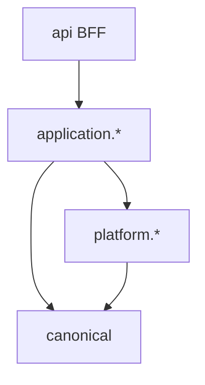

# Capability & behavior SPI

> **Core invariant (ADR-052): venue specificity ends at normalization.**
> Post-normalization packages (`costbasis`, `portfolio`, `pricing`, `linking`, `api`, frontend) must NOT depend on `VenueRegistry`, `VenueDescriptor`, or any concrete venue descriptor.
> Adding a new CEX venue requires zero post-normalization edits — enforced by `ModuleDependencyArchTest` and `VenuePrefixGuardTest`.

WalletRadar extension points group into **capabilities** (what a module can do) and **behaviors** (how pipeline stages react). This page catalogs SPIs and links to worked guides.

## Layer placement

| SPI | Package | Layer | Guide |
|-----|---------|-------|-------|
| CEX ledger | `application.cex.port` | application | [add-an-integration](extensibility/add-an-integration.md) |
| Network family | `platform.networks` | platform | [add-a-network](extensibility/add-a-network.md) |
| Protocol semantic | `application.normalization...protocol` | application | [add-a-protocol](extensibility/add-a-protocol.md) |
| Protocol capability test kit | `...protocol.contract` (test) | test | [add-a-protocol](extensibility/add-a-protocol.md#contract-tests-b3) |
| Replay handler | `costbasis.application.replay.handler` | application | [Replay overview](../pipeline/replay/01-overview.md) |
| Network adapter | `platform.networks` | platform | [add-a-network](extensibility/add-a-network.md) |

## CEX ledger SPI (B1 / ADR-052)

Interfaces in `com.walletradar.application.cex.port`.

### Segregated capabilities (VenueDescriptor composes all four)

| Interface | Responsibility |
|-----------|---------------|
| `VenueIdentity` (extends `CexVenueProfile`) | `venueId`, `providerCode`, `source()`, ownership predicates, `accountKindSuffixes()` |
| `VenueWalletModel` | `umbrellaKey`, `expandBackfillRefs`, `dashboardWalletRefs`; no-op default for flat venues |
| `VenueLiveBalanceCapability` | `Optional<CexLiveBalancePort> liveBalancePort()` |
| `VenueExternalCapitalPolicy` | Decides at normalization time: is this flow an external-capital boundary? What is its eligible USD basis? |

`VenueRegistry @Component` holds `List<VenueDescriptor>` and is **ingestion-plane only** — injected into normalization, backfill, and the live-balance routing port. Never injected into `costbasis`, `portfolio`, `pricing`, `linking`, or `api`.

### `CexVenueProfile`

Declares venue identity and stream topology.

- `venueId()` — stable upper-case slug (`BYBIT`, `DZENGI`)
- `supportedStreams()` — logical streams (e.g. `FUNDING_HISTORY`, `UNIVERSAL_TRANSFER`)
- `accountKindSuffixes()` — wallet ref suffixes (`:FUND`, `:UTA`, `:EARN`)

### `CexLedgerSource` / `CexLedgerEvent`

Pages immutable extracted evidence; normalized view of one extracted row before canonical builder mapping.

### Normalization boundary contract

The canonical builder stamps these venue-neutral fields on every `NormalizedTransaction`:

| Field | Source | Consumed by |
|-------|--------|-------------|
| `walletDomainKind` | `WalletRef.parse(walletAddress).domain()` | universe, reconciliation |
| `venueId` | `WalletRef.parse(walletAddress).venueId()` | dashboard, API DTO |
| `subAccount` | `WalletRef.parse(walletAddress).subAccount()` | replay, conservation |
| `umbrellaKey` | `WalletRef.parse(walletAddress).umbrellaKey()` | umbrella aggregation |
| `externalCapitalBoundary` | `VenueExternalCapitalPolicy` | conservation NEC |
| `externalCapitalEligibleUsd` | `VenueExternalCapitalPolicy` | conservation NEC |
| `custodialOffChain` | normalization (ADR-072) | informational custody ledger |
| `receiptBearingCollateral` | normalization builders (EVM=`true`, Solana/TON=`false`) | `LendingCycleBuilder` (synthesis / OPEN promotion) |
| `lpConcentrated` | Solana normalization builder / `SolanaLpPositionReader` | `SessionLpQueryService`, `LpPositionRefreshService`, `LpPositionSnapshot` |

**Global boundary rule (supersedes old "Boundary rule"): `costbasis`, `portfolio`, `pricing`, `linking`, `liquiditypools`, `lending`, and `api` read the neutral contract only — never `VenueRegistry`, `VenueDescriptor`, `CexLedgerSource`, any concrete venue descriptor, or (network axis, ADR-074) `NetworkAddressFormat.isEvm(...)` / `NetworkId`-member branches / network-named string prefixes (`lp-position:solana:`). DTOs may still *carry* `NetworkId` as data.**

## Network family SPI (B2)

`NetworkFamily` in `com.walletradar.platform.networks` groups `NetworkId` values by transport and address rules.

| Method | Contract |
|--------|----------|
| `familyId()` | `EVM`, `SOLANA`, `TON` |
| `supports(NetworkId)` | membership test |
| `normalizeAddress(NetworkId, String)` | case/base58/workchain rules |
| `defaultAdapter()` | optional `NetworkAdapter` bean name |

Implemented families today: **EVM** (13 chains), **Solana** (`SOLANA`). **TON** (`TON`) is declared on the enum; adapter is design-ready — see [add-a-network](extensibility/add-a-network.md).

## Protocol behavior SPI (B3)

### `ProtocolSemanticClassifier`

Existing interface — emits `ProtocolSemanticHint` list from `ProtocolSemanticContext` before family classification.

### `AbstractProtocolCapabilityContractTest`

Test-kit stub (not production SPI) — subclasses provide fixture txs and assert:

- semantic hints match approved rule doc
- terminal canonical type set is stable
- disallowed fallbacks never fire

See `backend/src/test/java/com/walletradar/application/normalization/pipeline/classification/onchain/protocol/contract/AbstractProtocolCapabilityContractTest.java`.

## Replay handler SPI (A5)

`ReplayHandler` implementations in `costbasis.application.replay.handler` consume one or more `NormalizedTransactionType` values. Registry planned to replace switch-style dispatch.

## Dependency rules

- SPI interfaces live at the **inner** boundary of their module.
- Cross-app: `*.port` packages only (`ModuleBoundaryTest`).
- `canonical` never depends on Spring/Mongo.

## Related

- [Protocol descriptor](protocol-descriptor.md)
- [Architecture — extensibility seams](../overview/03-architecture.md#extensibility-seams)
- [Extensibility implementation plan](../tasks/extensibility-refactor-implementation-plan.md)
