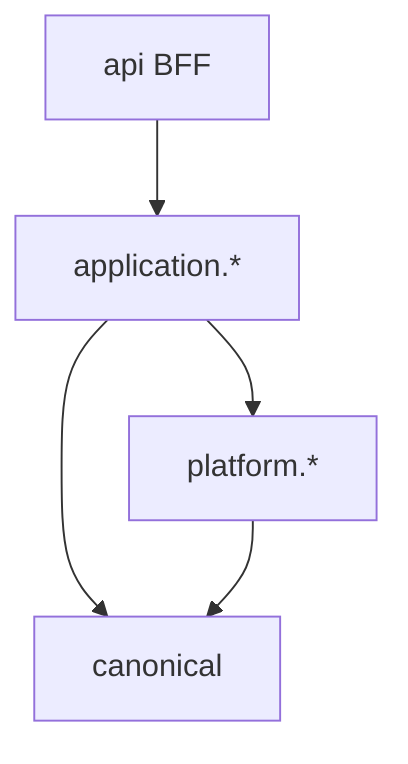

# Capability & behavior SPI

> **Status:** Design contracts for Track A5 and Track B. Interfaces marked **design-ready** exist as stubs; wiring is incremental.

WalletRadar extension points group into **capabilities** (what a module can do) and **behaviors** (how pipeline stages react). This page catalogs SPIs and links to worked guides.

## Layer placement

| SPI | Package | Layer | Guide |
|-----|---------|-------|-------|
| CEX ledger | `application.cex.port` | application | [add-an-integration](extensibility/add-an-integration.md) |
| Network family | `platform.networks` | platform | [add-a-network](extensibility/add-a-network.md) |
| Protocol semantic | `application.normalization...protocol` | application | [add-a-protocol](extensibility/add-a-protocol.md) |
| Protocol capability test kit | `...protocol.contract` (test) | test | [add-a-protocol](extensibility/add-a-protocol.md#contract-tests-b3) |
| Replay handler | `costbasis.application.replay.handler` | application | [Replay overview](../pipeline/replay/01-overview.md) |
| Network adapter | `platform.networks` | platform | [add-a-network](extensibility/add-a-network.md) |

## CEX ledger SPI (B1)

Design-ready interfaces in `com.walletradar.application.cex.port`:

### `CexVenueProfile`

Declares venue identity and stream topology before any API calls.

- `venueId()` — stable slug (`bybit`)
- `supportedStreams()` — logical streams (e.g. `FUNDING_HISTORY`, `UNIVERSAL_TRANSFER`)
- `accountKindSuffixes()` — wallet ref suffixes (`:FUND`, `:UTA`, `:EARN`)

### `CexLedgerSource`

Pages immutable extracted evidence for one stream × account scope.

- `venueProfile()` — profile reference
- `streamId()` — stream within venue
- `fetchPage(CexLedgerCursor cursor)` — returns `CexLedgerPage` of events

### `CexLedgerEvent`

Normalized view of one extracted row **before** canonical builder mapping.

- `sourceRowId()` — stable id in venue raw/extracted store
- `eventTime()` — venue timestamp
- `originalType()` — venue-native type string
- `payload()` — opaque structured map for mapper

**Boundary rule:** costbasis and portfolio import `CexLiveBalancePort` / read ports only — never `CexLedgerSource`.

## Network family SPI (B2)

`NetworkFamily` in `com.walletradar.platform.networks` groups `NetworkId` values by transport and address rules.

| Method | Contract |
|--------|----------|
| `familyId()` | `EVM`, `SOLANA`, `TON` |
| `supports(NetworkId)` | membership test |
| `normalizeAddress(NetworkId, String)` | case/base58/workchain rules |
| `defaultAdapter()` | optional `NetworkAdapter` bean name |

Implemented families today: **EVM** (13 chains), **Solana** (`SOLANA`). **TON** (`TON`) is declared on the enum; adapter is design-ready — see [add-a-network](extensibility/add-a-network.md).

## Protocol behavior SPI (B3)

### `ProtocolSemanticClassifier`

Existing interface — emits `ProtocolSemanticHint` list from `ProtocolSemanticContext` before family classification.

### `AbstractProtocolCapabilityContractTest`

Test-kit stub (not production SPI) — subclasses provide fixture txs and assert:

- semantic hints match approved rule doc
- terminal canonical type set is stable
- disallowed fallbacks never fire

See `backend/src/test/java/com/walletradar/application/normalization/pipeline/classification/onchain/protocol/contract/AbstractProtocolCapabilityContractTest.java`.

## Replay handler SPI (A5)

`ReplayHandler` implementations in `costbasis.application.replay.handler` consume one or more `NormalizedTransactionType` values. Registry planned to replace switch-style dispatch.

## Dependency rules

- SPI interfaces live at the **inner** boundary of their module.
- Cross-app: `*.port` packages only (`ModuleBoundaryTest`).
- `canonical` never depends on Spring/Mongo.

## Related

- [Protocol descriptor](protocol-descriptor.md)
- [Architecture — extensibility seams](../overview/03-architecture.md#extensibility-seams)
- [Extensibility implementation plan](../tasks/extensibility-refactor-implementation-plan.md)
