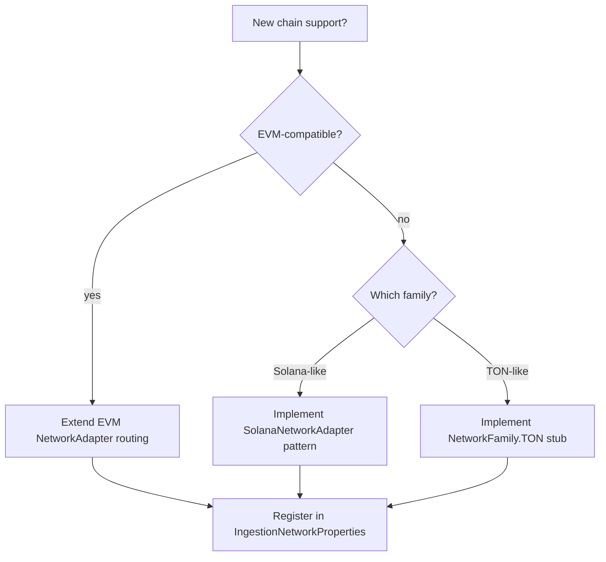

# Add a network

Worked example for extending WalletRadar with a new `NetworkId` or a new **network family** transport (Track B2).

## Prerequisites

- ADR if the network affects accounting (native gas, wrapped native aliases)
- Entry in `NetworkId` enum and [supported networks](../supported-networks-and-protocols.md)
- `walletradar.ingestion.*` property block for RPC/explorer endpoints

## Decision tree



## Step 1 — Register `NetworkId`

Add enum value in `domain.common.NetworkId` and document in `supported-networks-and-protocols.md`.

## Step 2 — Assign a `NetworkFamily`

Implement or extend `NetworkFamily`:

| Family | `familyId()` | Address rules | Adapter |
|--------|--------------|---------------|---------|
| EVM | `EVM` | Lower-case `0x` hex | `EvmNetworkAdapter` / explorer |
| Solana | `SOLANA` | Case-sensitive base58 | `SolanaNetworkAdapter` |
| TON | `TON` | Friendly `UQ…` / raw `workchain:hex` | *design-ready* |

```java
// platform.networks.NetworkFamily (design-ready)
NetworkFamily family = ...;
family.supports(NetworkId.SOLANA); // true for Solana family bean
family.normalizeAddress(NetworkId.SOLANA, address); // preserves base58 case
```

`NetworkAddressFormat` in `domain.common` already encodes Solana/TON case rules — family beans should delegate to it.

## Step 3 — Wire transport

### EVM example (Unichain)

1. Add RPC URLs under `walletradar.ingestion.evm-rpc.unichain`.
2. Register explorer provider in `IngestionAdapterConfig`.
3. Confirm `EvmNetworkAdapter.supports(UNICHAIN)` returns true.
4. Backfill uses 2000-block batches (`NetworkAdapter.getMaxBlockBatchSize()`).

### Solana example

1. Configure `walletradar.ingestion.solana.rpc-endpoints`.
2. `SolanaNetworkAdapter.fetchTransactions` pages signatures — block range params map to slot window in executor.
3. Normalization uses Solana-specific raw view builders (not EVM ABI).

### TON example (design-ready)

TON is on `NetworkId` for universe indexing (ADR-007) but full raw acquisition is not wired.

Planned steps:

1. Implement `TonNetworkFamily` bean implementing `NetworkFamily`.
2. Add `TonNetworkAdapter` with address canonicalization via `TonAddressCanonicalizer`.
3. Raw row shape: message-centric (not EVM tx + receipt).
4. Classification family: likely `TRANSFER` + native gas semantics — separate rule doc before enablement.

## Step 4 — Backfill segment

`BackfillSegmentExecutor` resolves adapter via `NetworkFamily` → `NetworkAdapter`. No changes in normalization for pure EVM clones.

## Step 5 — Verify

1. Add wallet on new network in settings UI.
2. `./scripts/prod-reset-rebuild-backend.sh --skip-frontend` if classification touched.
3. `./gradlew :backend:test` — include adapter unit tests.
4. Conservation guards on dashboard after replay.

## Checklist

- [ ] `NetworkId` + docs updated
- [ ] `NetworkFamily` bean registered
- [ ] `NetworkAdapter` fetches raw rows
- [ ] `IngestionNetworkProperties` endpoints configured
- [ ] Module page [platform-networks](../../overview/modules/platform-networks.md) unchanged unless new subpackage
- [ ] No RPC imports in `api.portfolio` GET paths

## Related

- [NetworkFamily SPI](../capability-behavior-spi.md#network-family-spi-b2)
- [platform.networks module](../../overview/modules/platform-networks.md)
- [Backfill overview](../../pipeline/backfill/01-overview.md)
