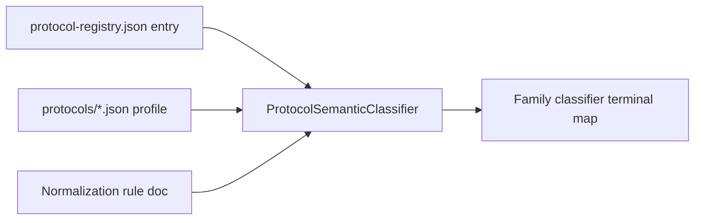

# Add a protocol

Worked example for registering an on-chain protocol using **Morpho** and **Pendle** as references (Track B3).

## Overview



## Step 1 — Choose `protocolKey`

Immutable slug used in code and docs:

| Protocol | protocolKey | Primary family |
|----------|-------------|----------------|
| Morpho | `morpho` | LENDING, YIELD (vault) |
| Pendle | `pendle` | LP |

See [protocol-descriptor](../protocol-descriptor.md).

## Step 2 — Registry entry

Add contract addresses to `backend/src/main/resources/protocol-registry.json`:

```json
{
  "protocolName": "Morpho",
  "protocolVersion": "v1",
  "family": "LENDING",
  "contracts": [{ "networkId": "ETHEREUM", "address": "0xEXAMPLE_MORPHO_BUNDLER" }]
}
```

Pendle routers follow the same pattern with `family: "LP"`.

## Step 3 — Classpath JSON profile

| Protocol | File | Contents |
|----------|------|----------|
| Morpho | `protocols/morpho.json` | Bundler selectors, MetaMorpho vault hints |
| Pendle | `protocols/pendle.json` | Router/zap selectors, market ids |

Loaded by `ProtocolResourceCatalog` and injected into semantic classifiers.

## Step 4 — Semantic classifier

Implement `ProtocolSemanticClassifier`:

```java
@Component
public class MorphoProtocolSemanticClassifier implements ProtocolSemanticClassifier {
    public static final String PROTOCOL_KEY = "morpho";
    // classify() → ProtocolSemanticHint list from calldata + registry match
}
```

Pendle: `PendleProtocolSemanticClassifier` — LP lifecycle hints before `LpClassifier`.

Register as Spring bean; `ProtocolSemanticService` orders by `getOrder()`.

## Step 5 — Family handoff

| Protocol | Semantic output | Terminal classifier | Canonical types |
|----------|-----------------|---------------------|-----------------|
| Morpho | `VAULT_DEPOSIT` hint | `VaultSemanticClassifier` / `LendingClassifier` | `VAULT_DEPOSIT`, `BORROW`, `SWAP`, … |
| Pendle | `LP_ENTRY` hint | `LpClassifier` | `LP_ENTRY`, `LP_EXIT`, `LP_FEE_CLAIM`, `REWARD_CLAIM` |

**Rule:** semantic classifiers emit **hints only** — families own terminal `NormalizedTransactionType`.

## Step 6 — Rule documentation

Add or extend:

- [Morpho rules](../../pipeline/normalization/rules/protocols/morpho.md) — receipt grammar `gt{Underlying}c`, market key ADR-036
- [Pendle rules](../../pipeline/normalization/rules/protocols/pendle.md) — bundle clarification policy

Link from [normalization rules README](../../pipeline/normalization/rules/README.md).

## Step 7 — Linking & replay (if needed)

- Morpho vault continuity: market/vault address correlation — [lending family](../../pipeline/normalization/rules/families/lending.md)
- Pendle PT/LPT: `pendle-lp:{network}:{market-id}` position identity — [LP family](../../pipeline/normalization/rules/families/lp.md)
- Add replay handler only when AVCO semantics differ from family default

## Contract tests (B3)

Subclass `AbstractProtocolCapabilityContractTest`:

```java
class MorphoProtocolCapabilityContractTest extends AbstractProtocolCapabilityContractTest {
    @Override protected String protocolKey() { return "morpho"; }
    @Override protected List<ProtocolCapabilityFixture> fixtures() { ... }
}
```

Kit location:

`backend/src/test/java/com/walletradar/application/normalization/pipeline/classification/onchain/protocol/contract/AbstractProtocolCapabilityContractTest.java`

Asserts per fixture:

1. Semantic hints match rule doc
2. Terminal type ∈ allowed set
3. No disallowed fallback classifier fired

## Step 8 — Verify

1. Unit tests for semantic classifier (see `ResolvProtocolSemanticClassifierTest` pattern)
2. Capability contract test for golden fixtures
3. `./scripts/prod-reset-rebuild-backend.sh --skip-frontend`
4. Financial snapshot compare if replay handlers changed

## Checklist

- [ ] `protocolKey` + registry + JSON profile
- [ ] `ProtocolSemanticClassifier` bean
- [ ] Family terminal mapping documented
- [ ] Rule doc under `docs/pipeline/normalization/rules/protocols/`
- [ ] `AbstractProtocolCapabilityContractTest` subclass with ≥1 fixture
- [ ] Linking/replay ADR if new continuity shape

## Related

- [Capability / behavior SPI](../capability-behavior-spi.md#protocol-behavior-spi-b3)
- [Protocol descriptor](../protocol-descriptor.md)
- [Morpho](../../pipeline/normalization/rules/protocols/morpho.md) · [Pendle](../../pipeline/normalization/rules/protocols/pendle.md)
