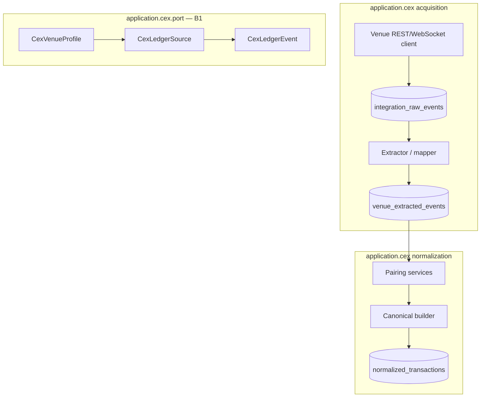

# Add a CEX integration

Worked example for adding a centralized exchange venue using **Bybit** as the reference implementation (Track B1).

## Architecture



## Step 1 — Define `CexVenueProfile`

```java
public interface CexVenueProfile {
    String venueId();
    Set<String> supportedStreams();
    Set<String> accountKindSuffixes();
}
```

**Bybit reference:**

| Field | Value |
|-------|-------|
| `venueId()` | `bybit` |
| `supportedStreams()` | `FUNDING_HISTORY`, `UNIVERSAL_TRANSFER`, `TRADE`, `EARN`, … |
| `accountKindSuffixes()` | `:FUND`, `:UTA`, `:EARN` (see `CorrelationContract`) |

## Step 2 — Implement `CexLedgerSource`

Pages extracted rows for one stream:

```java
public interface CexLedgerSource {
    CexVenueProfile venueProfile();
    String streamId();
    CexLedgerPage fetchPage(CexLedgerCursor cursor);
}
```

Bybit today: `BybitExtractionService` + `PendingBybitExtractedRowQueryService` — migrate behind this SPI in A2.

## Step 3 — Map to `CexLedgerEvent`

Each extracted row exposes:

- `sourceRowId()` — Mongo id or venue idempotency key
- `eventTime()` — venue timestamp (UTC)
- `originalType()` — e.g. `Deposit`, `UniversalTransfer`
- `payload()` — structured fields for canonical builder

Immutable after insert — normalization **rebuilds** canonical rows from extracted evidence on rerun.

## Step 4 — Raw acquisition

1. Store API payloads in `integration_raw_events` with `venueId`, `streamId`, `cursor`.
2. Schedule backfill segments via `application.backfill` (CEX segments parallel on-chain).
3. Never write canonical rows in acquisition — extraction only.

**Bybit packages (reference):**

- `application.cex.acquisition.venue.bybit.BybitApiClient`
- `BybitExtractedEventMapper` → `bybit_extracted_events`

## Step 5 — Normalization & pairing

1. Implement venue `*CanonicalTransactionBuilder` (maps `CexLedgerEvent` → `NormalizedTransaction`).
2. Add pairing services for venue-specific symmetry (internal transfers, earn principal, trades).
3. Use `canonical.correlation.CorrelationContract` prefixes — **do not** invent ad-hoc correlation strings in costbasis.
4. Publish `*NormalizationCompletedEvent` for linking stage.

**Bybit reference:** `BybitCanonicalTransactionBuilder`, `BybitInternalTransferPairer`, `BybitEarnPrincipalTransferPairer`.

## Step 6 — Live balances (optional)

Implement `CexLiveBalancePort` adapter in `application.cex` — portfolio reads via port only.

Bybit: `BybitCexLiveBalancePortAdapter` → `CexLiveBalancePort`.

## Step 7 — Cross-system linking

Deposit/withdraw rows that carry on-chain `txHash` participate in FA-001 linking (ADR-013). Canonical builder **must** persist `txHash` when venue API supplies it.

## Step 8 — Verify

1. Integration test with recorded API fixtures (no live keys in CI)
2. Normalization golden tests per stream
3. `./scripts/prod-reset-rebuild-backend.sh --skip-frontend`
4. Financial snapshot + conservation guards

## Dzengi (Track B2 — second venue)

Dzengi follows the same acquisition → extraction → normalization pattern as Bybit with a narrower product scope (ADR-048).

| Field | Value |
|-------|-------|
| `IntegrationProvider` | `DZENGI` |
| Account ref prefix | `DZENGI:<userId>` |
| REST base | `https://api-adapter.dzengi.com` (Binance-compatible signed REST) |
| Extracted collection | `dzengi_extracted_events` |
| Normalization stage | `DZENGI_NORMALIZATION` |
| Pipeline event | `DzengiNormalizationCompletedEvent` |

### Dzengi streams

| Stream | Role |
|--------|------|
| `LEDGER` | Fiat/crypto ledger movements (deposits, withdrawals, fees) |
| `DEPOSITS` | On-chain deposit records (`blockchainTransactionHash` for FA-001) |
| `WITHDRAWALS` | On-chain withdrawal records |
| `MY_TRADES:<symbol>` | Spot fills (leverage/CFD symbols excluded at extraction) |
| `TRADING_POSITIONS_HISTORY` | Derivative settlements → `CEX_DERIVATIVE_SETTLEMENT` |
| `EXCHANGE_INFO` | Symbol catalog for quote/base resolution |

### Dzengi packages (reference)

- `application.cex.acquisition.venue.dzengi.DzengiApiClient`
- `DzengiExtractionService` → `dzengi_extracted_events`
- `DzengiCanonicalTransactionBuilder`
- `application.cex.job.dzengi.DzengiNormalizationJob`

### Frontend settings

- Provider chip `DZENGI` enabled in `AVAILABLE_PROVIDERS` (`soon: false`).
- Connect/edit flows use the shared integration form; **Test connection** calls `POST /api/v1/sessions/{id}/integrations/test` before save.
- Session overwrite via `PUT /sessions/{id}/settings` with `{ provider: "DZENGI", ... }`.

### Pricing note

Fiat **BYN** legs on Dzengi rows resolve via `PriceSource.DZENGI` (`DzengiFxPriceSourceAdapter` inverts USD/BYN kline). See ADR-050 and [pricing resolver chain](../../pipeline/pricing/02-resolver-chain.md).

## Checklist

- [ ] `CexVenueProfile` + `CexLedgerSource` + `CexLedgerEvent` stubs or implementations
- [ ] Raw + extracted collections with venue discriminator
- [ ] Canonical builder + pairing
- [ ] `CorrelationContract` prefixes for new correlation families (ADR if new prefix)
- [ ] `CexLiveBalancePort` if dashboard shows venue balances
- [ ] Module doc [application-cex](../../overview/modules/application-cex.md) updated
- [ ] No `Bybit` string literals in `costbasis` core (ArchUnit A1)
- [ ] Settings UI provider chip + test-connection wired (Dzengi reference)

## Related

- [CEX ledger SPI](../capability-behavior-spi.md#cex-ledger-spi-b1)
- [Bybit normalization](../../pipeline/normalization/03-bybit-normalization.md)
- [Dzengi normalization](../../pipeline/normalization/04-dzengi-normalization.md)
- [Dzengi adaptation rules](../../pipeline/normalization/rules/dzengi-adaptation.md)
- [ADR-048 Dzengi product scope](../../adr/ADR-048-dzengi-product-scope.md)
- [ADR-049 Venue-agnostic CEX transfer linking](../../adr/ADR-049-venue-agnostic-cex-transfer-linking.md)
- [ADR-050 Dzengi fiat FX pricing](../../adr/ADR-050-dzengi-fiat-fx-pricing.md)
- [ADR-013 CEX cross-system linking](../../adr/ADR-013-cex-cross-system-linking.md)
- [application.cex module](../../overview/modules/application-cex.md)
