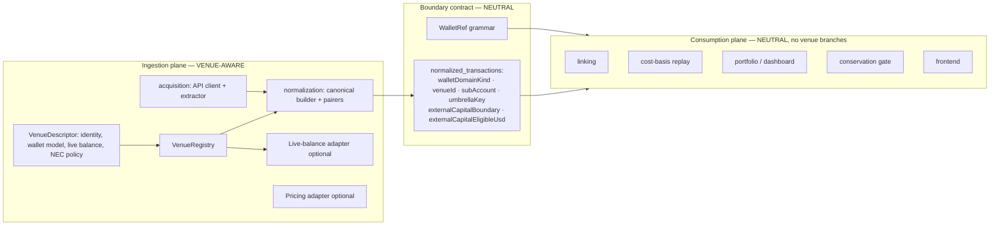

# Add a CEX integration

> **Invariant — venue specificity ends at normalization.**
>
> You do **NOT** edit any file under `costbasis/`, `portfolio/`, `pricing/`, `linking/`, `api/`, or the frontend read-model to add a new venue.
> If you think you must, the abstraction is missing — fix it in the venue SPI or normalization stage, not with a venue branch downstream.
>
> This is ArchUnit-enforced by `ModuleDependencyArchTest` and `VenuePrefixGuardTest`.

---

## Architecture overview



---

## Two-plane checklist

### Plane I — Ingestion files you CREATE

| File | Notes |
|------|-------|
| `DvenueApiClient` | HTTP client, venue authentication |
| `DvenueExtractionService` + extracted event + repository | Extract → `dvenue_extracted_events` collection |
| `DvenueCanonicalTransactionBuilder` | Maps extracted event → `NormalizedTransaction`; stamps boundary contract |
| Pairing services (transfers, earn, trades) | Venue-specific symmetry; use `CorrelationContract` prefixes |
| `DvenueNormalizationJob` + `DvenueNormalizationService` | Drives normalization pipeline |
| `DvenueVenueDescriptor implements VenueDescriptor` | Implements only real capabilities (flat venues: stub `VenueWalletModel`) |
| `DvenueCexLiveBalancePortAdapter` (optional) | Implement if live balance is available |
| `DvenueFxPriceSourceAdapter` / `DvenueKlineClient` (optional) | Implement if venue provides price quotes |
| One `NormalizedTransactionSource` enum value | The single unavoidable closed-enum edit outside venue packages |

### Plane II — Boundary contract you MUST populate

Every `NormalizedTransaction` produced by the canonical builder **must** have these fields set:

| Field | Type | Set by | Consumed by |
|-------|------|--------|-------------|
| `walletDomainKind` | `WalletDomainKind` | normalization | dashboard, reconciliation, universe |
| `venueId` | `String` (nullable) | normalization | dashboard, API DTOs, frontend |
| `subAccount` | `String` (nullable) | normalization | replay, conservation |
| `umbrellaKey` | `String` (nullable) | normalization | umbrella aggregation, reconciliation |
| `externalCapitalBoundary` | `ExternalCapitalBoundary` (nullable) | `VenueExternalCapitalPolicy` | conservation NEC computation |
| `externalCapitalEligibleUsd` | `BigDecimal` (nullable) | `VenueExternalCapitalPolicy` | conservation NEC computation |

Use `WalletRef.parse(walletAddress)` to derive the wallet identity fields.  
Use `VenueExternalCapitalPolicy.evaluate(transaction)` for the external-capital markers.

### Plane III — Post-normalization edits = 0

After populating the boundary contract correctly, the following happens **automatically** with no code changes:
- Dashboard classifies the wallet as CEX, places it in the correct "CEX" bucket
- Reconciliation uses the umbrella key to aggregate balances
- Conservation gate counts external-capital inflows via the neutral markers
- Frontend shows the correct `domain` / `venueId` chip and on-chain/CEX split

The ArchUnit guard will fail the build if you accidentally add a venue dependency in any consumption-plane package.

---

## Step-by-step

### Step 1 — Define `VenueDescriptor`

```java
@Component
public class DvenueVenueDescriptor implements VenueDescriptor {

    // VenueIdentity
    @Override public String venueId() { return "DVENUE"; }
    @Override public IntegrationProvider providerCode() { return IntegrationProvider.DVENUE; }
    @Override public NormalizedTransactionSource source() { return NormalizedTransactionSource.DVENUE; }

    // VenueWalletModel (flat venue — single wallet per uid, no sub-accounts)
    @Override public VenueWalletModel walletModel() { return VenueWalletModel.FLAT; }

    // VenueLiveBalanceCapability (optional)
    @Override public Optional<CexLiveBalancePort> liveBalancePort() { return Optional.empty(); }

    // VenueExternalCapitalPolicy
    @Override public VenueExternalCapitalPolicy externalCapitalPolicy() {
        return DvenueExternalCapitalPolicy.INSTANCE;
    }
}
```

For venues with sub-accounts (like Bybit), implement `VenueWalletModel.expandBackfillRefs` and `accountKindSuffixes`.

### Step 2 — Implement `CexLedgerSource`

```java
public interface CexLedgerSource {
    CexVenueProfile venueProfile();
    String streamId();
    CexLedgerPage fetchPage(CexLedgerCursor cursor);
}
```

### Step 3 — Canonical builder stamps the boundary contract

```java
NormalizedTransaction tx = ...;
WalletRef ref = WalletRef.parse(walletAddress);
tx.setWalletDomainKind(ref.domain());
tx.setVenueId(ref.venueId());
tx.setSubAccount(ref.subAccount());
tx.setUmbrellaKey(ref.umbrellaKey());
// External-capital markers via VenueExternalCapitalPolicy
```

### Step 4 — Register in pipeline

Add venue to `ApplicationPropertiesRegistrar`, session integration bootstrap, and the admin pipeline controller.

### Step 5 — Frontend (zero venue code)

The frontend reads `position.domain` and `position.venueId` from the DTO. No frontend changes are needed for a new venue — the chip and split calculations use the neutral fields automatically.

### Step 6 — Verify

1. Integration test with recorded API fixtures (no live keys in CI)
2. Normalization golden tests per stream
3. `./scripts/prod-reset-rebuild-backend.sh --skip-frontend`
4. `./gradlew :backend:core:test` — both ArchUnit guards must be green
5. Financial snapshot + conservation guards

---

## Bybit reference

| Field | Value |
|-------|-------|
| `venueId()` | `BYBIT` |
| `source()` | `NormalizedTransactionSource.BYBIT` |
| Sub-accounts | `:FUND`, `:UTA`, `:EARN` (see `CorrelationContract`) |
| Live balance | `BybitCexLiveBalancePortAdapter` |

## Dzengi reference

Dzengi is a flat-wallet venue (no sub-accounts). See [ADR-048](../../adr/ADR-048-dzengi-product-scope.md).

| Field | Value |
|-------|-------|
| `venueId()` | `DZENGI` |
| `source()` | `NormalizedTransactionSource.DZENGI` |
| Sub-accounts | none (flat model) |
| Live balance | `DzengiCexLiveBalancePortAdapter` |
| Pricing | `DzengiFxPriceSourceAdapter` (BYN via klines, ADR-050) |

---

## Related

- [ADR-052 Venue Capability SPI and Normalization Boundary Invariant](../../adr/ADR-052-venue-capability-spi-walletref-normalization-boundary-invariant.md)
- [capability-behavior-spi.md](../capability-behavior-spi.md)
- [Bybit normalization](../../pipeline/normalization/03-bybit-normalization.md)
- [Dzengi normalization](../../pipeline/normalization/04-dzengi-normalization.md)
- [ADR-049 Venue-agnostic CEX transfer linking](../../adr/ADR-049-venue-agnostic-cex-transfer-linking.md)
- [ADR-050 Dzengi fiat FX pricing](../../adr/ADR-050-dzengi-fiat-fx-pricing.md)
