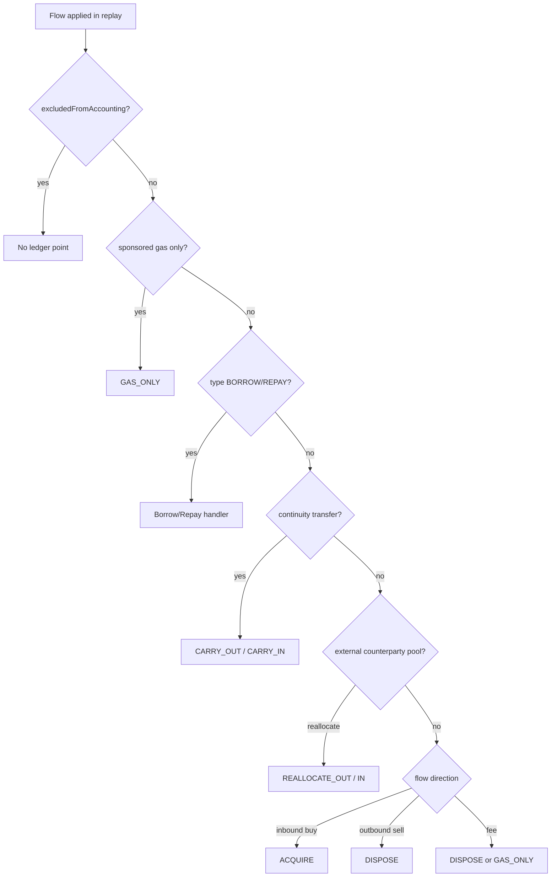

# Ledger Points and Basis Effects

> **Entity:** `AssetLedgerPoint` — `backend/.../costbasis/domain/AssetLedgerPoint.java`  
> **Collection:** `asset_ledger_points`  
> **Last updated:** 2026-06-30

Immutable replay trace row for one applied accounting state transition. Source of truth for move-basis timeline and AVCO history reads.

## Dual cost basis fields (ADR-040)

Each ledger point stores parallel **Tax** and **Net** lanes on the shared quantity pool:

| Tax lane | Net lane |
|---|---|
| `totalCostBasisBeforeUsd` / `After` | `netTotalCostBasisBeforeUsd` / `After` |
| `avcoBeforeUsd` / `After` | `netAvcoBeforeUsd` / `After` |
| `costBasisDeltaUsd` | `netCostBasisDeltaUsd` |
| `realisedPnlDeltaUsd` | `netRealisedPnlDeltaUsd` |

Net lane uses $0 acquisition for zero-cost types (`REWARD_CLAIM`, LP fee-claim sideflows). Tax lane keeps FMV-at-receipt semantics.

## BasisEffect decision flow

---

## BasisEffect

### ACQUIRE {#acquire}

**Definition:** Increase position quantity with new cost basis at transaction price (weighted into AVCO).

| Field | Effect |
|-------|--------|
| `quantityDelta` | Positive |
| `totalCostBasisDeltaUsd` | Positive (qty × price + gas policy) |
| `avcoAfterUsd` | Recalculated: totalCost / coveredQty |
| `realisedPnlDeltaUsd` | 0 |

**Emitted by:** inbound BUY flows, unmatched `EXTERNAL_TRANSFER_IN`, `REWARD_CLAIM`, borrow inflow (basis-neutral component separate).

**Mini-example:** 0 qty → buy 10 ETH @ $2000 → qtyAfter=10, totalCost=$20000, avco=$2000.

### DISPOSE {#dispose}

**Definition:** Decrease position; relieve cost basis at current AVCO; realise PnL if fully priced.

| Field | Effect |
|-------|--------|
| `quantityDelta` | Negative |
| `costBasisDeltaUsd` | Negative at AVCO |
| `realisedPnlDeltaUsd` | proceeds − basis relieved |

**Emitted by:** SELL flows, fees (quantity + basis relief), repay principal.

**Mini-example:** 10 ETH avco $2000, sell 4 @ $2500 → realisedPnL = 4×(2500−2000) = $2000.

### CARRY_OUT {#carry-out}

**Definition:** Remove quantity from source wallet position; basis moves to continuity bucket (not disposed).

| Field | Effect |
|-------|--------|
| `quantityDelta` | Negative at source |
| `totalCostBasisDeltaUsd` | Negative (basis leaves source) |
| `avcoAfterUsd` | Unchanged on remaining qty |
| `realisedPnlDeltaUsd` | 0 |

**Emitted by:** outbound continuity transfers, `BRIDGE_OUT`, lending/vault custody deposit, LP entry custody move.

### CARRY_IN {#carry-in}

**Definition:** Restore quantity at destination with carried basis (not new acquisition).

| Field | Effect |
|-------|--------|
| `quantityDelta` | Positive |
| `totalCostBasisDeltaUsd` | Positive (carried basis) |
| `avcoAfterUsd` | Merged with existing position AVCO |

**Emitted by:** inbound matched transfers, `BRIDGE_IN` (when linked), custody withdraw.

**Mini-example:** Wallet A CARRY_OUT 5 ETH basis $10000 → Wallet B CARRY_IN 5 ETH basis $10000 (same avco if alone).

### REALLOCATE_OUT {#reallocate-out}

**Definition:** Move basis between pools (e.g. counterparty external pool, wrap/unwrap) without economic disposal.

**Emitted by:** `CounterpartyBasisPoolReplayHook`, wrap/unwrap same-family reallocation.

### REALLOCATE_IN {#reallocate-in}

**Definition:** Receive reallocated basis at destination pool/position.

#### CARRY / REALLOCATE basis symmetry (ADR-043)

For a Bybit intra-account custody round-trip, the OUT leg (`CARRY_OUT` / `REALLOCATE_OUT`) and the
matched IN leg (`CARRY_IN` / `REALLOCATE_IN`) are **basis-symmetric** on both lanes:

- `Σ costBasisDelta(OUT + IN) = 0` and `Σ netCostBasisDelta(OUT + IN) = 0` for one transfer, across
  the source + destination keys. The IN leg's `costBasisDeltaUsd` equals the OUT leg's released carry
  value — the paired carry is authoritative, not a re-derived AVCO or a `$0` injection.
- Per-family (umbrella + all subs), `Σ` over all internal `INTERNAL_TRANSFER + EARN_*` legs `= 0` in
  both lanes (±dust). Both legs of an *open* subscribe offset within the family sum, provided every
  OUT has a materialized IN.
- A `REALLOCATE_IN` / `CARRY_IN` with `quantityDelta = 0` and `costBasisDeltaUsd > 0` is the ghost
  signature the `CorridorBasisConservationGuard` (leftover OUT carry) and
  `BybitEarnSubPoolConservationGuard` (sub-pool basis orphan) flag.

### GAS_ONLY {#gas-only}

**Definition:** Gas fee quantity/basis effect without principal movement.

**Emitted by:** Sponsored gas top-ups, fee-only legs marked `GAS_ONLY`.

### UNKNOWN {#unknown}

**Definition:** Quantity moved but basis not provable; flags incomplete history.

**Emitted by:** Unmatched inbounds, unresolved LP sideflows, missing price shortfalls.

---

## LifecycleKind (15 values)

| Value | Use |
|-------|-----|
| `SPOT` | Ordinary buy/sell/swap |
| `TRANSFER` | Wallet transfers |
| `BRIDGE` | Cross-chain bridge |
| `CUSTODY` | Protocol custody deposit/withdraw |
| `LENDING` | Lending deposit/borrow/repay |
| `STAKING` | Staking lifecycle |
| `VAULT` | Yield vault |
| `LP` | Liquidity pool position |
| `ORDER` | Async DEX order |
| `LOOP` | Lending loop |
| `WRAP` | Wrap/unwrap |
| `REWARD` | Reward claim |
| `DERIVATIVE` | GMX/perp |
| `MANUAL` | Manual compensating |
| `UNKNOWN` | Unclassified |

## LifecycleStage (5 values)

| Value | Use |
|-------|-----|
| `SINGLE` | One-shot event |
| `REQUEST` | Async request leg (GMX, CoW, staking) |
| `SETTLEMENT` | Async settlement leg |
| `SOURCE` | Bridge/lifecycle source |
| `DESTINATION` | Bridge/lifecycle destination |

---

## Quantity and basis fields

| Field | Meaning |
|-------|---------|
| `quantityDelta` | Change in position quantity this step |
| `quantityBefore` / `quantityAfter` | Position qty snapshot |
| `totalCostBasisBeforeUsd` / `AfterUsd` | Total cost basis USD |
| `avcoBeforeUsd` / `avcoAfterUsd` | Average cost per unit USD |
| `costBasisDeltaUsd` | Change in total cost basis |
| `realisedPnlDeltaUsd` | Realised PnL this step |
| `gasDeltaUsd` | Gas cost USD |
| `basisBackedQuantityAfter` | Qty with provable basis |
| `quantityShortfallAfter` | Lifetime deficit from overspend |
| `uncoveredQuantityAfter` | Live-positive but basis-missing qty |
| `hasIncompleteHistoryAfter` | Historical gap flag |
| `hasUnresolvedFlagsAfter` | Unresolved normalized flags |

## Identity and ordering fields

| Field | Meaning |
|-------|---------|
| `accountingUniverseId` | Multi-wallet scope |
| `accountingFamilyIdentity` | Cross-network family (e.g. ETH family) |
| `accountingAssetIdentity` | Position asset key |
| `correlationId` | Lifecycle/bridge/LP correlation |
| `lifecycleChainId` | Async chain id |
| `normalizedTransactionId` | Source normalized row |
| `flowIndex` | Flow index within tx |
| `replaySequence` | Order within tx replay |
| `blockTimestamp`, `transactionIndex` | Chain ordering |

## Related

- [Transaction types](transaction-types.md)
- [Replay ledger state](../pipeline/replay/03-ledger-and-state.md)
- [Move basis page](../frontend/move-basis.md)
- [ADR-017 Timeline AVCO](../adr/ADR-017-timeline-avco-authority.md)
